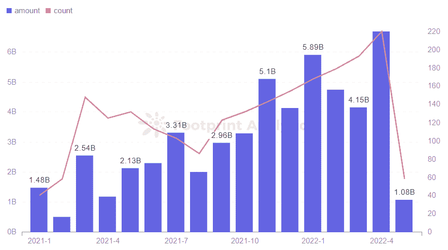
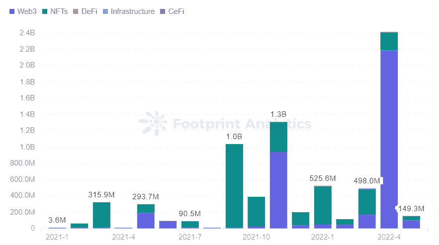
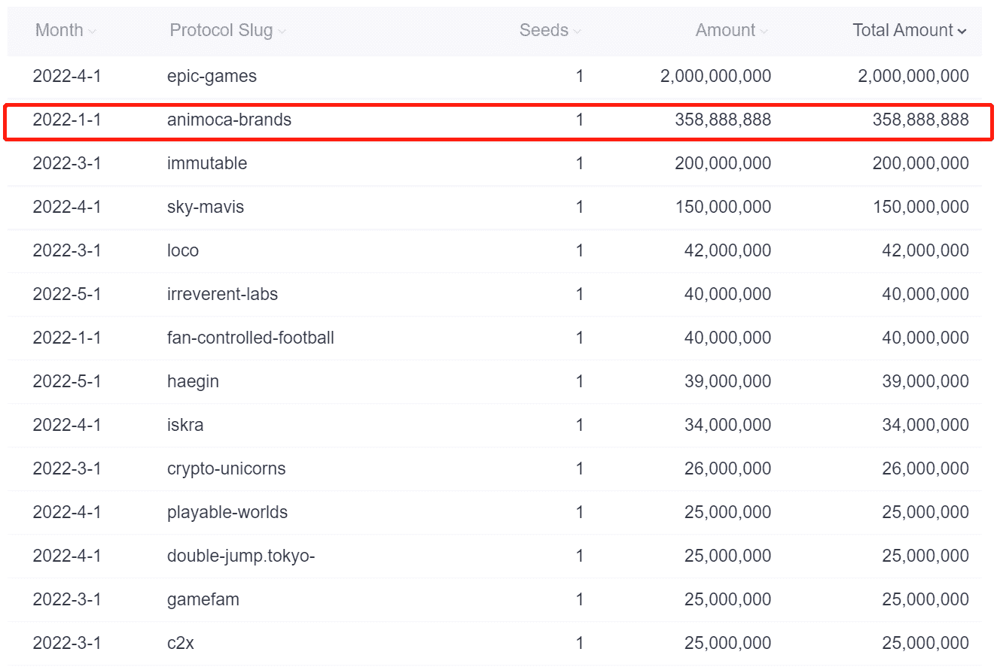
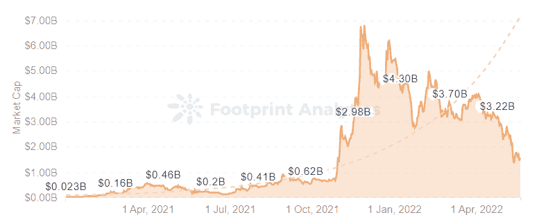
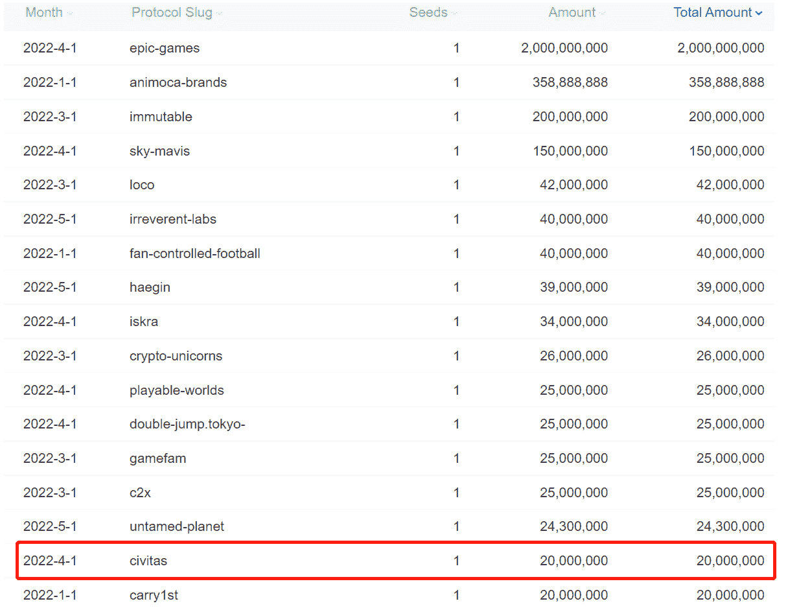
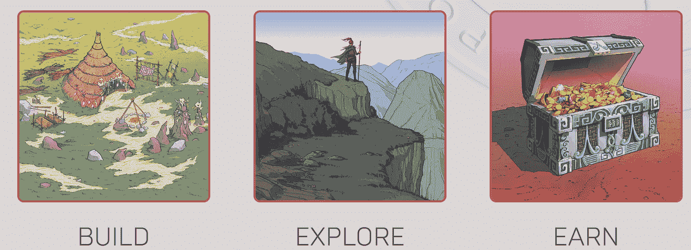
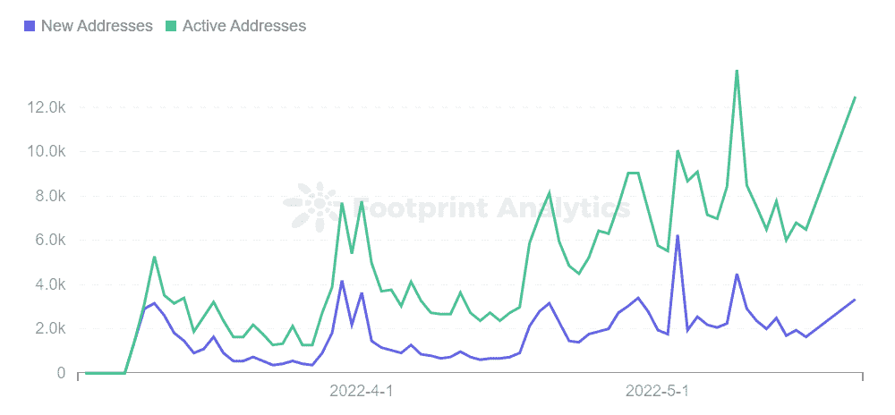

# 2022 融资 GameFi 项目分析

> 原文：<https://medium.com/coinmonks/2022-financing-gamefi-project-analysis-d5291a796623?source=collection_archive---------57----------------------->

五月。2022

数据来源:足迹分析— [2022 年资助潜在的 GameFi 项目](https://www.footprint.network/@KikiSmith/2022-Funding-Potential-Gamefi-Projects?channel=EN-257)

区块链产业的投资重点正逐渐向游戏倾斜，推动了[这一市场领域](https://cryptoslate.com/gamefi-slides-on-macro-trends-but-individual-projects-shine-april-monthly-report/)的项目、资金、交易和参与者数量的大幅增长。

根据[足迹分析](https://www.footprint.network/@Bond/GameFi-Overview?channel=EN-257)的数据，截至 5 月份，GameFi 项目总数达到 1498 个，同比增长 99%，上半年投资金额达到 37 亿美元，超过 2021 年全年的 7.8 亿美元。

本文将评估 2022 年上半年哪些游戏有潜力，哪些游戏正在失去关注。

# 上半年 GameFi 项目融资概况

GameFi 部门在整个区块链部门中的比例逐渐增加，投资总额为 225 亿美元。GameFi 部门占总投资的 16.4%，总投资为 37 亿美元。

*Footprint Analytics — Funding-Monthly Investment Trend*

*Footprint Analytics — Gaming Financing Distribution*

# 融资 GameFi 项目分析

## 沙盒和幽灵星系

在总投资排名方面，今年 1 月，元宇宙游戏开发商 Animoca Brands 宣布完成了一轮 3.59 亿美元的融资，由自由城风险投资公司(Liberty City Ventures)牵头。与元宇宙相关的游戏项目正处于积极阶段。

[*Footprint Analytics — Monthly Ranking of GameFi Project Funding in 2022*](https://www.footprint.network/@KikiSmith/2022-Funding-Potential-Gamefi-Projects?channel=EN-257)

[沙盒](https://www.footprint.network/@GraceAtreides/The-Sandbox-Dashboard?channel=EN-257)、幻影星系、REVV 赛车运动都是 Animoca 品牌的游戏项目。

*   沙盒是 Animoca Brands 的旗舰游戏，一款构建元宇宙的沙盒游戏。去年年底，alpha 游戏推出后，引爆了用户的快速增长。但由于公测版游戏迟迟不向公众开放，其用户群和市场价值目前正在下降。游戏生态需要不断的用户参与和维护才能稳定。

[*Footprint Analytics — The Sandbox Market Cap*](https://www.footprint.network/@GraceAtreides/The-Sandbox-Dashboard?channel=EN-257)

*   幻影星系是一款 AAA 游戏，将于第三季度推出测试版。游戏将围绕一个开放世界的在线太空模拟，有快节奏的机甲射手和引人入胜的故事。玩家可以自定义游戏中的机甲和舰船外出执行任务，解决谜题，收集资源进行工艺制作。

去年年底是元宇宙项目的高峰期，这个领域最有潜力。但随着元宇宙沙盒计划没有再次按计划进行，幽灵星系的缓慢发射也将逐渐失去关注。

## Civitas

虽然有些 GameFi 游戏已经从聚光灯下消失了，但其他一些已经流行起来。

[*Footprint Analytics — Monthly Ranking of GameFi Project Funding in 2022*](https://www.footprint.network/@KikiSmith/2022-Funding-Potential-Gamefi-Projects?channel=EN-257)

Civitas 在 4 月宣布，它已经完成了由 Delphi Digital 和 Three Arrows Capital 牵头的 2000 万美元的融资，参与方包括 Framework Ventures、BITKRAFT、DeFiance Capital、Sfermion、CCP Games、收益率行会游戏、功绩圈(功绩圈)和 YGG SEA。

Civitas 是一款面向社区的城市建设游戏，玩家可以单独或协同工作，通过战斗升级城市。它使用了一种 subDAO 模式，即城市由社区控制，允许行业协会随着用户的工作和投票而增长。

*Screenshot Source — Civitas*

这款游戏仍处于早期阶段，游戏性也相对较新。

*   通过手机进入增强现实的世界，玩家可以发现 token $CITI，还可以玩迷你游戏，找到制作所需的独特资源。有了真实世界的地理定位技术，玩家将能够使用地图视图来定位资产，并参与分散在真实世界的活动。
*   如果在电脑上玩，玩家与土地互动；定位、收集及制作物品；并张贴在城市论坛上。用户还可以访问所有城市塔的特点，城市市场和世界地图的看法。

这款游戏在测试版上线前就已经获得了德尔福数字和三箭资本的投资。当然，早期进入者需要研究其后续发展路径。

## STEPN

今年 1 月，STEPN 完成了由印度红杉和福来斯风投(Folius Ventures)牵头的 500 万美元的种子轮融资。它也被认为是现阶段最有前景的 GameFi 项目之一。它提供财务奖励，并引入社会奖励元素，通过其移动赚取方法激励数百万用户。

足迹分析公司(Footprint Analytics)的数据显示，美元 GMT 传输的新地址和活跃地址呈波浪状增长。

[*Footprint Analytics — GMT Transfer Address in BSC*](https://www.footprint.network/guest/chart/GMT-Transfer-Address-in-BSC-fp-0e1d0132-13bb-47a5-92f9-18d3fcc01279)

# 摘要

对于 GameFi 项目而言，从知名风投那里获得资本融资，对于在熊市中推动发展至关重要，这可以扩大团队规模，吸引游戏开发用户。

本文由[足迹分析](https://www.footprint.network/)社区提供。

Footprint Community 是一个让全世界的数据和加密发烧友互相帮助，了解和获得有关 Web3、元宇宙、DeFi、GameFi 或区块链这个初出茅庐的世界的任何其他地区的见解的地方。在这里，你会发现积极的，不同的声音互相支持，推动社区向前发展。

> 加入 Coinmonks [电报频道](https://t.me/coincodecap)和 [Youtube 频道](https://www.youtube.com/c/coinmonks/videos)了解加密交易和投资

# 此外，请阅读

*   [CoinFLEX 评论](https://coincodecap.com/coinflex-review) | [AEX 交易所评论](https://coincodecap.com/aex-exchange-review) | [UPbit 评论](https://coincodecap.com/upbit-review)
*   [AscendEx 保证金交易](https://coincodecap.com/ascendex-margin-trading) | [Bitfinex 赌注](https://coincodecap.com/bitfinex-staking) | [bitFlyer 评论](https://coincodecap.com/bitflyer-review)
*   [Bitget 回顾](https://coincodecap.com/bitget-review)|[Gemini vs block fi](https://coincodecap.com/gemini-vs-blockfi)cmd |[OKEx 期货交易](https://coincodecap.com/okex-futures-trading)
*   [AscendEx Staking](https://coincodecap.com/ascendex-staking)|[Bot Ocean Review](https://coincodecap.com/bot-ocean-review)|[最佳比特币钱包](https://coincodecap.com/bitcoin-wallets-india)
*   [霍比评论](https://coincodecap.com/huobi-review) | [OKEx 保证金交易](https://coincodecap.com/okex-margin-trading) | [期货交易](https://coincodecap.com/futures-trading)
*   [网格交易机器人](https://coincodecap.com/grid-trading) | [Cryptohopper 审查](/coinmonks/cryptohopper-review-a388ff5bae88) | [Bexplus 审查](https://coincodecap.com/bexplus-review)