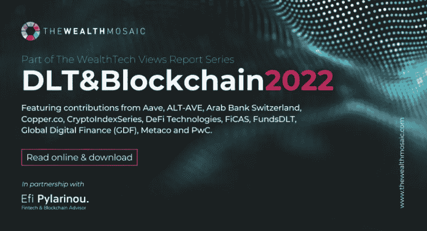

# 2022 年 DLT 报告&财富领域的区块链

> 原文：<https://medium.com/coinmonks/2022-report-on-dlt-blockchain-in-the-wealth-space-a335371c1aee?source=collection_archive---------32----------------------->

**关于*“DLT&区块链如何塑造资产&财富管理*的未来”的第二版 TWM 财富技术观点报告已经出炉！全在线报道** [**此处**](https://thewealthmosaic.docsend.com/view/5nrww2fifk26abds) **！**

数字资产类别的采用不再受到质疑，专业服务的基础设施正在加速建设。企业越来越关注作为资本市场基础设施的许可区块链。自 2020 年 11 月推出第一版以来，该领域的兴趣和活动显著增加。

世界经济论坛估计，到 2027 年，多达 10%的全球 GDP 将通过 DLT 存储和交易。这些估计相当于 24 万亿美元。

在 2021 年第四季度，我们在资本市场、投资和银行领域看到了一系列里程碑式的事件，这些事件都是由 DLT 推动的。国际清算银行(BIS)在由区块链技术驱动的各种资本市场项目的试点和研究中发挥着重要作用。

在我们发布关于区块链对资产和财富管理的影响的第二版报告时，我们还宣布了我们对财富领域数字资产和区块链子行业的承诺。

> **本着这种精神，我很高兴能与 Wealth Mosaic 合作开发 TWM 数字资产目录和该领域的内容服务。这种伙伴关系与我在传统金融世界和数字世界之间架起桥梁的热情是一致的；创造内容和丰富知识，并以协作第一的心态进行领导。**

财富拼图的使命是以目录为先的方式，在财富领域获取以研究为中心的知识。我们将为快速发展的数字资产垂直市场开发知识中心。

该报告的结构如下:

*   简介和主要趋势，第 3-6 页
*   来自 **Lawrence Wintermeyer** 、**全球数字金融(GDF)** 的执行联席主席的两份意见，这是一家非营利性行业会员机构，旨在推动采用数字资产和数字金融技术的最佳实践；来自**的 Guenther Dobrauz 博士**，他是 **PWC Legal Switzerland** 的合伙人和负责人，也是“未来是分散的”的长期支持者。第 7-11 页
*   **财富马赛克与 Efi Pylarinou Advisory 的合作关系**第 12 页
*   投稿公司的概况和思想领导力回答了以下问题:

👉市场:你对 DLT 和区块链在重塑资产和财富管理方面的影响有什么看法？这个领域的现状如何，你如何预测它的发展？

👉解决方案:你的公司提供了哪些资产和财富管理公司应该考虑的解决方案？

[**Aave**](https://www.thewealthmosaic.com/vendors/aave/) ， [**ALT/AVE**](https://www.thewealthmosaic.com/vendors/altave/) ，**阿拉伯银行瑞士**， [**铜**](https://www.thewealthmosaic.com/vendors/copper/) ，[**Cryptoindexseries**](https://www.thewealthmosaic.com/vendors/cryptoindexseries/)， **DeFi Technologies** ， **FiCAS** ，[**FundsDLT**](https://www.thewealthmosaic.com/vendors/fundsdlt/)**，**和

📌推特:[https://twitter.com/efipm](https://twitter.com/efipm)

📌订阅我的 **YouTube 频道**，了解我的见解和行业领袖访谈。**每周三新视频:**[https://www.youtube.com/EfiPylarinou](https://www.youtube.com/EfiPylarinou)

📌Spotify 播客。跟随这里:[https://open.spotify.com/show/5bRkZEYHSwPiGx7vTqylw6?si=Mg3hN5PDQ86K10GjeK52jw](https://open.spotify.com/show/5bRkZEYHSwPiGx7vTqylw6?si=Mg3hN5PDQ86K10GjeK52jw)

📌领英:【https://www.linkedin.com/in/efipylarinou/】T42

📌网页:[https://efipylarinou.com/](https://efipylarinou.com/)

> 加入 Coinmonks [电报频道](https://t.me/coincodecap)和 [Youtube 频道](https://www.youtube.com/c/coinmonks/videos)了解加密交易和投资

# 另外，阅读

*   [Cloudbet 赌场评论](https://coincodecap.com/cloudbet-casino-review) | [点火赌场评论](https://coincodecap.com/ignition-casino-review)
*   [加密套利](/coinmonks/crypto-arbitrage-guide-how-to-make-money-as-a-beginner-62bfe5c868f6)指南| [如何做空比特币](/coinmonks/how-to-short-bitcoin-568a2d0b4ae5)
*   [如何在加拿大购买加密货币？](https://coincodecap.com/how-to-buy-cryptocurrency-in-canada)
*   [无聊猿游艇俱乐部(BAYC)回顾](https://coincodecap.com/bored-ape-yacht-club-bayc-review) | [拜比特 vs 比特币基地](https://coincodecap.com/bybit-vs-coinbase)
*   [5 款最佳加密交易终端](https://coincodecap.com/crypto-trading-terminals) | [最佳 DeFi 应用](https://coincodecap.com/best-defi-apps)