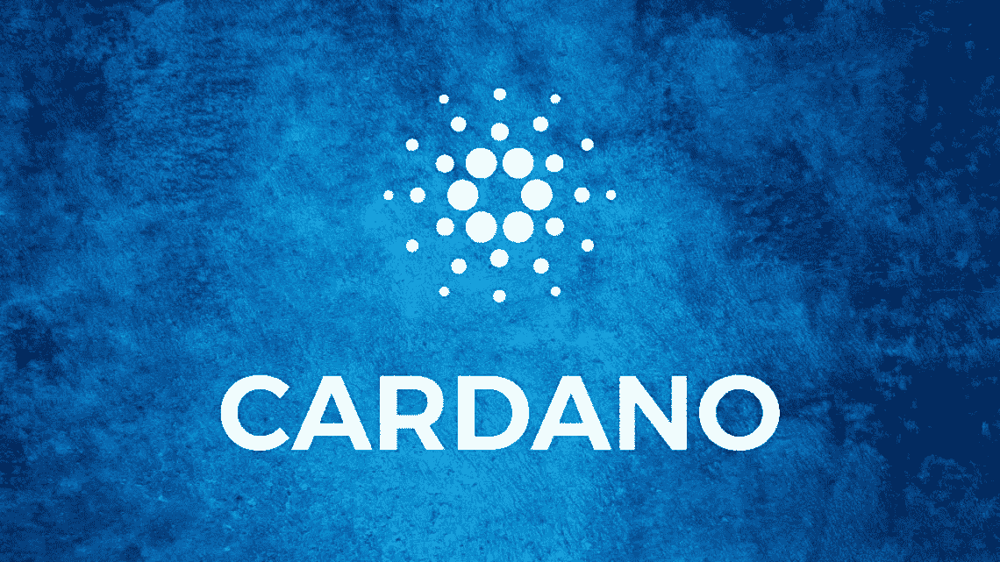
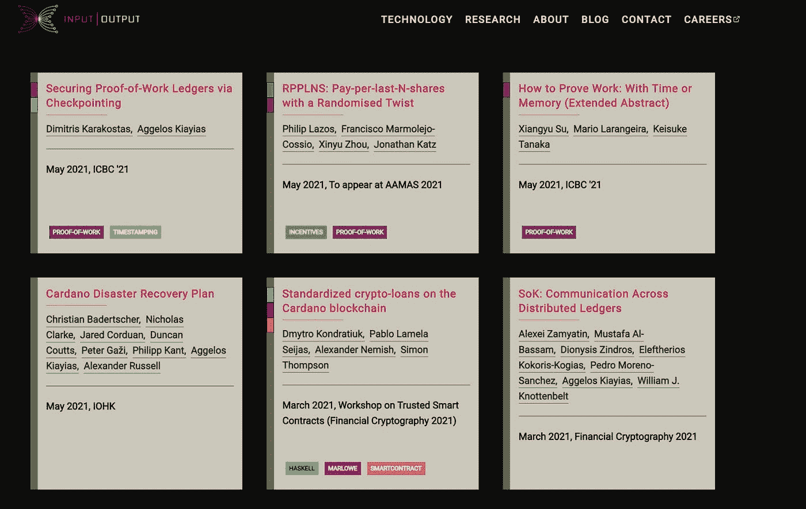
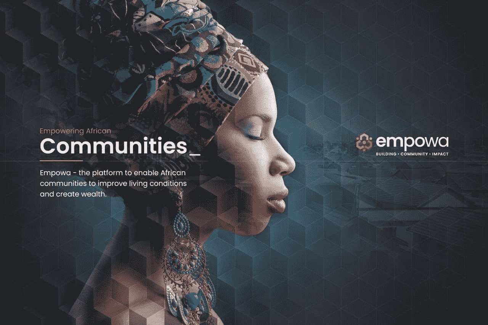
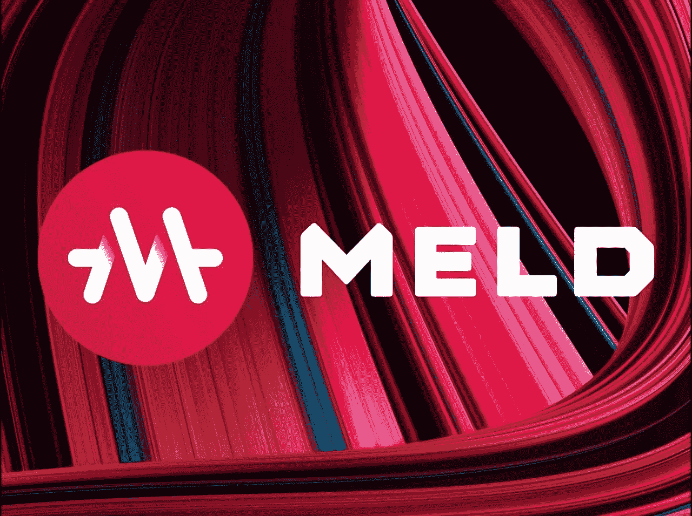
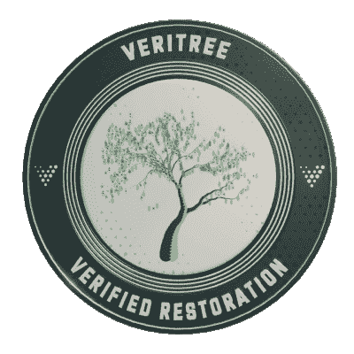
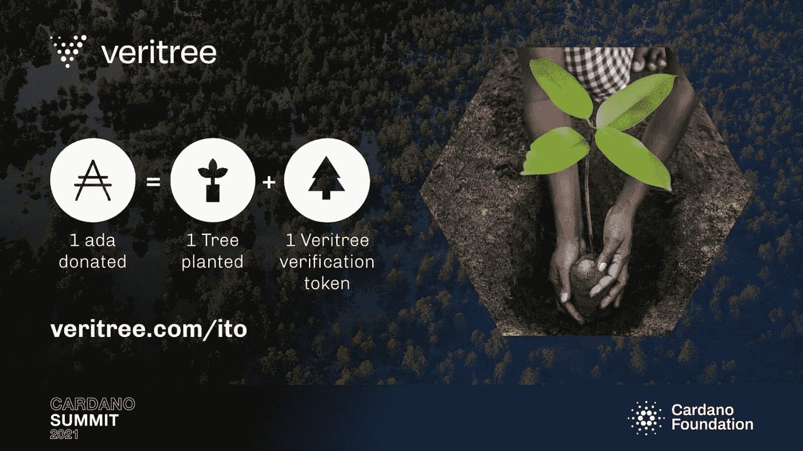
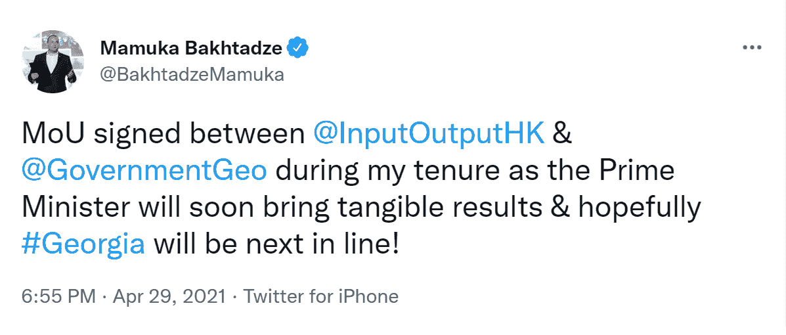
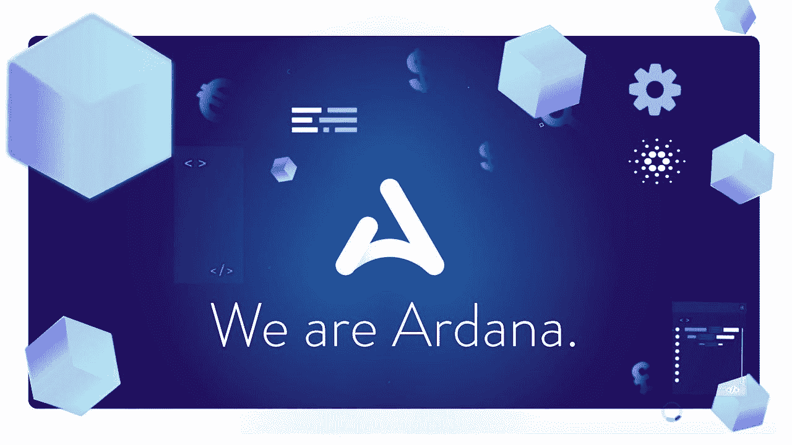

# 卡尔达诺区块链

> 原文：<https://medium.com/coinmonks/2022-the-year-of-cardano-29052ad79c8d?source=collection_archive---------2----------------------->

thecoinrepublic.com

## 介绍

随着 1 月 20 日(星期四)第一个全功能 beta 分散式交易所(DEX)在卡尔达诺区块链的预期发布，是时候近距离了解卡尔达诺、其技术以及目前正在开发和计划在其生态系统上发布的最具创新性和突破性的项目了。

## 卡尔达诺是什么？

Cardano 是第三代利益证明(PoS)区块链项目，旨在克服与工作证明(PoW)共识机制相关的问题。它是由以太坊的联合创始人查尔斯·霍斯金森创立的。

Cardano 是唯一一个尚未部署分散式应用程序(Dapps)的主要区块链。这是因为 Cardano 团队专注于提交研究论文，供密码学和区块链领域的教授和专家进行同行评估。其逻辑是，任何事情在实施之前都必须在真正的科学基础上进行适当的研究。

## 方法

source: iohk.io

Cardano 的白皮书是第一份由来自许多著名机构的区块链和密码学领域的学术专家和研究人员进行同行评审的区块链出版物。这意味着一个全面的战略已经到位，以防止未来的问题。因此，Cardano 以其独特的功能脱颖而出:

**大毒蛇**是一种基于利害关系证明(PoS)的无许可共识机制。它将网络控制权分布在不同的股份池中。赌注池被指定为槽头，并因向链中添加块而获得奖励。ADA 持有人可以选择将他们的股份委托给特定的股份池。当一个股份池的总股份超过特定水平时，回报就变得不变，这使得该股份池的吸引力降低，因为利益相关者没有最大化他们的回报。这鼓励了大量的权力下放，目前有 2，500 多个股份池。有人可能会说 Cardano 是世界上最分散的 PoS 网络。

**Hydra** 是 Cardano 的一个改变游戏规则的可扩展性解决方案，这意味着每秒交易量(TPS)可以高达 100 万。

**量子抵抗** Cardano 使用 SHA-256 密码哈希函数，被广泛认为是抵御量子计算机攻击最安全的方法之一。

然而，该网络的成功取决于它为更多的全球人口提供的好处。让我们来看看卡尔达诺项目提供了什么。在我们看来，我们已经列出了在卡尔达诺区块链启动的最具开创性的项目。

# 最有前途的卡尔达诺项目。

## EMPOWA——DeFi 使非洲的经济适用房成为可能

source: empowa.io

第一个融合尖端技术、环保建筑和分散金融包容性的卡尔达诺物业平台。

84%的非洲人过着没有固定住所的生活。这相当于近十亿人。在非洲，住房严重短缺。现在需要 5000 万套住房。Empowa 使当地合作伙伴能够处理大量积压的工作。

举个例子，在一个人口超过 3000 万的国家，莫桑比克有 600 笔抵押贷款。抵押贷款的利率可能高达 32%。

Empowa 计划通过使用 Empowa token 实现分散融资替代方案，增加房屋所有权的可获得性。简而言之，那些通过购买代币为 Empowa 分散式房地产开发做出贡献的人，将从所建房地产的未来收入中获得一部分。

多亏了 Empowa，EasyHousing 已经为 Cardano 社区在莫桑比克贝拉的试点项目获得了资金，第一批居民将于本月搬进试点房屋——见下文。

## MELD—DeFi 的银行堆栈

source: meld-labs.github.io

MELD 是一个开源、非托管的流动性协议，允许用户以加密抵押品借入法定货币(美元和欧元),同时获得存款利息。

用户在 iOS、Android 和浏览器中连接 MELDapp，快速访问他们的数字资产，以便出借、借用和管理 MELD 的服务。用户可以高枕无忧，因为他们始终可以访问自己的资产(因为他们保管着钥匙)。

用户可以通过将其加密货币作为抵押品放入 MELDapp 来借入法定货币。KYC 完成后，会向客户的首选银行进行电汇。当贷款还清时，智能合同到期，导致抵押的加密货币被释放。MELDapp 控制整个过程。

MELD 是第一个将菲亚特贷款功能集成到加密环境中的分散协议，这使它有别于许多其他 DeFi 应用程序。

## VERITREE —气候解决方案平台

source: climateneutralcardano.org

Veritree 是世界上第一个用于最高质量恢复项目的地面监控技术，直接从种植者那里获取实时信息。

Veritree 是一个位于区块链的平台，它可以验证种植地点的数据，标记树木以防止重复计算，并留下永久记录，为项目发起人提供所需的透明度，使他们对自己的贡献充满信心。

source: stakefornature.com

Veritree 是第一个完全集成的平台，允许用户在树木生长时查看和跟踪他们的树木，这要归功于每棵树种植时都会附带一个独特的可跟踪的树木代码。

Veritree 使公司和个人在应对气候变化方面发挥带头作用变得简单，同时也创造了就业机会，并在未来几年造福环境。

为了应对气候变化，三星最近与 Veritree 合作。

## ATALA 棱镜—数字身份证

Atala PRISM 是一款基于卡尔达诺区块链的分散式识别解决方案。它开创了身份管理的新时代，在这个时代，人们拥有自己的身份，并完全控制如何使用和访问他们的个人数据。

阿塔拉棱镜有能力彻底改变世界，吸引全球数十亿人。它有助于创建数字身份和凭证，用户可以快速、安全地私下拥有、管理和共享这些身份和凭证。可以从任何地方快速验证凭据，无需第三方验证服务。

Atala PRISM 旨在供企业、政府和个人使用。企业可以快速招募新消费者，降低合规风险和费用，并提供无缝的用户体验。政府可以创建数字身份证，允许立即访问公共和私人服务。个人拥有自己的身份和数据，他们可以控制如何使用和访问自己的个人信息。

集中式数字识别系统容易受到各种威胁，包括身份盗窃、数据泄露、数据收集和碎片化。Atala 不拥有或管理任何数据；相反，所有数据都安全地保存在用户的智能手机上并进行加密。每个人都是唯一可以通过生物识别技术或 PIN 码访问它的人。

此外，甚至在 Atala PRISM 在 Cardano 首次亮相之前，它就已经开始与政府组织合作，格鲁吉亚就是其中之一。

source: twitter

## ar Dana——具有积极社会影响的 DeFi 协议

source: ardana — youtube

Ardana 是一个分散的 stablecoin 中心，用户可以借用 Cardano 的 stablecoin (dUSD ),与美元 1:1 挂钩，以 Cardano 的速度、可伸缩性和安全性为动力锁定抵押品。这将通过两个关键特性来实现:stablecoin 和 Danaswap (DEX)。

任何人都可以通过使用 ADA 作为稳定的 coin 贷款的抵押品，在不出售其资产的情况下产生 dUSD。据 Statista 称，目前有超过 50 万个钱包地址包含 ADA，这表明 Ardana 上的 DeFi 活动可能会在启动时急剧增加。

使其与众不同的是 Ardana 股份池联盟(ASPA ),它精心挑选顶级股份池运营商。从像“Den Ada Pool”这样的家族经营企业到像“FasoPool”这样的非营利组织，Faso Pool 的使命是将他们每天的股份池运营收入捐给帮助布基那法索当地居民的巴尔卡基金会或“StakeForNature”，其中 50%的收入用于支持世界各地的环保组织。

没有其他 DeFi 运营商曾经做过这样规模的事情。

## 健康网络——赢得健康

健康基金会是根据瑞士法律成立的非营利基金会。医疗保健相关交易的分布式社区网络，为全球数据驱动的医疗保健生态系统提供动力。现有的医疗保健行业受到缺乏透明度和互操作性的困扰，导致许多孤立的中介机构，以及所有利益相关者的低效数据访问。

dHealth 的其他合作伙伴和超级节点运营商包括诺华、瑞士热带和公共卫生研究所、NEM 协议、巴塞尔大学、UZH 区块链中心等。

其创始人兼总裁埃伯哈德·朔伊尔博士在苏黎士大学医学院担任杰出讲师近 14 年，他说:

> “无论是 dHealth 还是我们的节点运营商，如罗氏和苏黎世大学，都坚信 Cardano 是迄今为止最有前途的区块链方案之一”

健康的主要元素之一是“健康赚钱”。简而言之，一个简单的触发导致支付，中间没有任何手动过程——所有这些都由区块链公共卫生部门提供动力，基于对健康行为的奖励，这是分散化自主医疗保险模式的潜在蓝图。

## 世界移动-连接未连接者的网络运营商。

目前，世界人口的一半，或者说每两个人中就有一个人没有连接到互联网。这是因为传统的移动网络不会连接偏远的地方，因为它太贵了，很难维护。

世界移动(World Mobile)正致力于通过区块链技术解决这一问题，利用自由空间光通信和其他无线电发射机等频谱建设最后一英里连接的基础设施，这种技术不需要许可，可以转化为更便宜的互联网接入。因为这些替代频谱不需要许可证，他们节省了大量的税收，这就意味着用户可以享受更便宜的互联网服务。

为了可持续发展，空中节点将由私人实体拥有，通过一次性收取约 7000 美元的费用，随着人们通过接入点连接到互联网，他们将通过赚取收入或以运营商的加密货币世界移动令牌(WMT)的形式获得回报。该网络运营商正与小额贷款机构合作，为企业家购买节点提供融资。

世界移动由一个 36 人的团队组成，他们在一起工作了十多年，筹集了数亿美元的风险投资，同时在电信领域建立和退出了多个 8 位数和 9 位数的业务。他们是认真的。

## 摘要

卡尔达诺区块链是为全球范围和渗透而建立的，在几秒钟内建立全球交易共识，并吸引各种经济背景的个人。肩负如此重任，卡尔达诺一直奉行“测量两次，削减一次”的方法。因此，区块链的起跑“设置”现在是保守的。

鉴于 Cardano 社区的规模和围绕 DEX 首次推出的兴奋，最初的需求激增预计会导致网络拥塞和更长的订单处理时间，但这将是暂时的，网络将逐渐稳定下来。卡尔达诺公司打算进行一系列计划中的改进和增强，以将网络容量扩大到 2022 年。包括块大小和普路托斯脚本内存单元的增加。其他优化和增强正在进行中，这将提高吞吐量，并允许长期参数增加。

考虑长远很重要，因为罗马不是一天建成的。

*免责声明:本文包含的信息仅用于教育目的，并不构成 Wheatstones 的任何形式的建议或推荐，用户在做出(或避免做出)任何投资决定时也不打算依赖这些信息。*

> 加入 Coinmonks [电报频道](https://t.me/coincodecap)和 [Youtube 频道](https://www.youtube.com/c/coinmonks/videos)了解加密交易和投资

## 也阅读

 [## Bitsgap 评论-交易机器人加密信号和套利 2022

### 编辑描述

blog.coincodecap.com](https://blog.coincodecap.com/bitsgap-review)  [## 40 个最佳电报频道，用于加密、电影、表演和演讲| CoinCodeCap

### 编辑描述

blog.coincodecap.com](https://blog.coincodecap.com/best-telegram-channels)  [## Keevo 钱包点评:是最安全的硬件钱包吗？2022 | CoinCodeCap

### 编辑描述

blog.coincodecap.com](https://blog.coincodecap.com/keevo-wallet-review)  [## 5 个最佳社交交易平台[2021] | CoinCodeCap

### 编辑描述

blog.coincodecap.com](https://blog.coincodecap.com/best-social-trading-platforms)  [## BlockFi 评论 2021:利弊和利率| CoinCodeCap

### 编辑描述

blog.coincodecap.com](https://blog.coincodecap.com/blockfi-review)  [## 如何在印度购买比特币？2021 年购买比特币的 7 款最佳应用[手机版]

### 如何使用移动应用程序购买比特币印度

medium.com](/coinmonks/buy-bitcoin-in-india-feb50ddfef94)  [## 加密税务软件——五大最佳比特币税务计算器[2021]

### 不管你是刚接触加密还是已经在这个领域呆了一段时间，你都需要交税。

medium.com](/coinmonks/best-crypto-tax-tool-for-my-money-72d4b430816b)  [## 9 个 2022 年最值得购买的密码| CoinCodeCap

### 编辑描述

blog.coincodecap.com](https://blog.coincodecap.com/crypto-to-buy-in-2022)  [## 存储比特币的最佳加密硬件钱包[2021] | CoinCodeCap

### 编辑描述

blog.coincodecap.com](https://blog.coincodecap.com/best-hardware-wallet-bitcoin)  [## Pionex 评论 2021 |免费加密交易机器人和交换

### Pionex 是为交易自动化提供工具的后起之秀。Pionex 上提供了 9 个加密交易机器人…

medium.com](/coinmonks/pionex-review-exchange-with-crypto-trading-bot-1e459d0191ea)