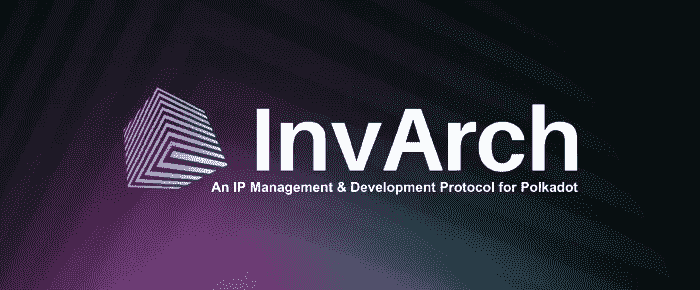
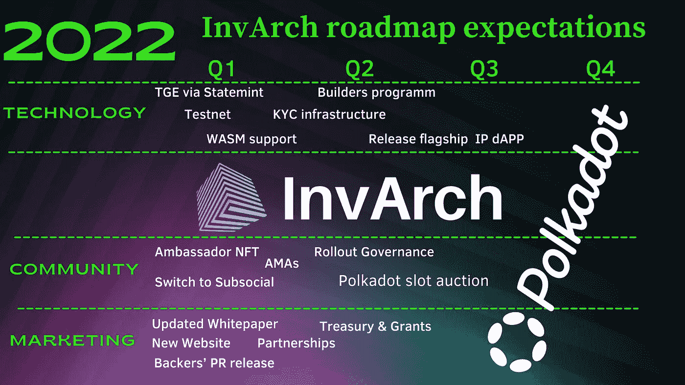
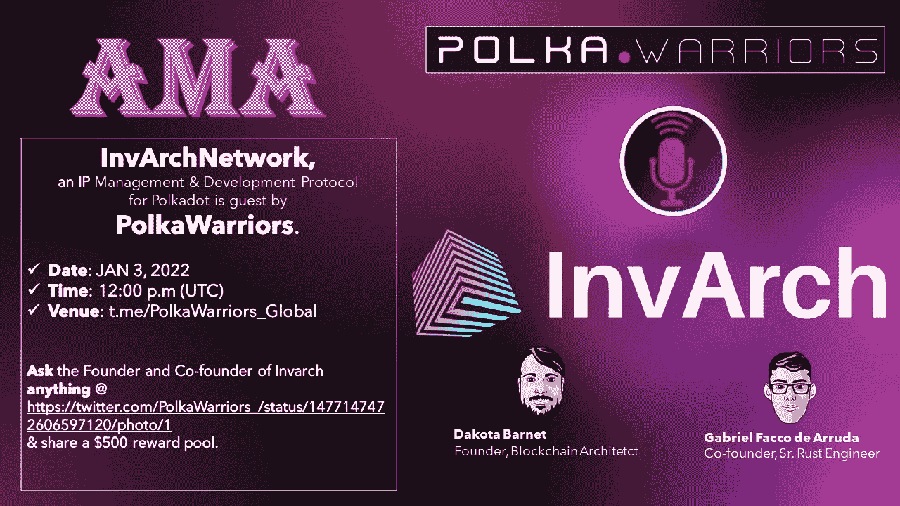

# 2022 年对因瓦奇来说意义重大

> 原文：<https://medium.com/coinmonks/2022-will-be-huge-for-invarch-a63a093cde9c?source=collection_archive---------10----------------------->

首先，祝大家 2022 年快乐幸福！

今年是关键的一年，不仅仅是因为 Polkadot 将最终实现完全的互操作性和完整的形式。2022 年对因瓦赫来说也是个大日子，有很多值得期待的事情。在这篇文章中，我们将看到在新的一年里对 Invarch 的许多期望，Invarch 是一个用于 Polkadot 和 Web 3.0 的 IP 管理和开发协议。

# 技术

可以肯定的是最令人期待的时刻是 TGE。理解 InvArch 将通过 Statemint 铸造它的令牌是非常重要的，state mint 是 Polkadot 中继上的一个普通的副链。这意味着 InvArch 背后的团队依赖于奇偶校验的团队和 Statemint 链的开发。Statemint 链从贝壳升级为副链，搭载在 Polkadot 中继上；然而，它还不是没有许可的。然而，这很有可能在未来几周内发生。

继 TGE 因瓦奇之后将开始它的试验网，WASM 的支持也将在 2022 年初，在主网之前提供。在 Q2，建设者计划将启动，随后将发布知识产权旗舰产品 Dapp。InvArch 为 devs 提供了所有必要的工具。EVM 支持已经集成，所以所有 Solidity 开发者都可以在 InvArch 上构建 dapps，而不需要学习任何新东西。其他特性包括可编程令牌、oracles 以及与基于 Polkadot 的分散式 KYC 平台的集成。

# 社区

在 2021 年的最后一个季度，社区无疑是 InvArch 最重要和最令人印象深刻的方面。这已经成为记录之一；聚集了超过 10，000 名新的 Discord 成员，超过 3，000 名 Twitter 新粉丝，超过 500 名 InvArch 大使。该团队抓住一切机会强调社区是项目的核心。因此，我们可以预计，2022 年不会有所不同。

已经宣布的大使 NFT 将被分发，并肯定它将在未来赋予其持有者特殊的能力。一旦在草间弥生启动，与社区的交流渠道将会是潜在的。

该团队不会失去与社区的联系，它将举行许多 ama，让他们随时了解情况。

今年的第一次将由 Polkawarriors 举办。

当时机成熟时，InvArch 将开始注册其分散治理。这有望在今年最大的事件——通过众筹拍卖获得一个波尔卡多特席位——之后实现。我相信这将是这个项目的一个很好的开端，它会找到成千上万的新支持者。

# 营销

由于金融方面在过去的几个月里不在最前沿，这是唯一合理的事情，在这个领域伟大的事情还没有发生。我们期待首先了解 Invarch 的早期支持者和风投。

有了一个新的网站和一份更新的白皮书，团队将会指出概念和哲学上的变化，这些变化在上次已经很清楚了。很快会有关于波尔卡多特生态系统及其他领域的合作伙伴关系的重大声明。目前，与领先的 oracle 解决方案的合作正在进行中。

随着这一年的进展，该团队将开始研究其金库，并为开发人员提供一些赠款，以建立该协议。

上半年的所有方面都有一个大的共同目标:成为一个波尔卡多副链。如果 Invarch 保持它一直在做的良好工作，我肯定这不会是一个问题，因为 Invarch 在其设计和使用案例中是独特的，并将为 Polkadot 生态系统带来无数的可能性。

我们祝愿因瓦奇在新的一年里一切顺利，在接下来的 12 个月里，我们将继续关注这个有希望的项目。

访问因瓦赫官方渠道:
[**网站**](https://invarch.network/)】[**推特**](https://twitter.com/InvArchNetwork)**不和**】[**亚社会**](https://app.subsocial.network/5857)】[**中社会**](https://invarch.medium.com/)[**电报**](https://t.me/InvArch)[**Github**](https://github.com/Invarch)】

> 加入 Coinmonks [电报频道](https://t.me/coincodecap)和 [Youtube 频道](https://www.youtube.com/c/coinmonks/videos)了解加密交易和投资

# 另外，阅读

*   [5 款最佳加密交易终端](https://coincodecap.com/crypto-trading-terminals) | [最佳 DeFi 应用](https://coincodecap.com/best-defi-apps)
*   [最佳网上赌场](https://coincodecap.com/best-online-casinos) | [币安评论](/coinmonks/binance-review-ee10d3bf3b6e) | [BitMEX 评论](https://coincodecap.com/bitmex-review)
*   [麻雀交换评论](https://coincodecap.com/sparrow-exchange-review) | [纳什交换评论](https://coincodecap.com/nash-exchange-review)
*   [美国最佳加密交易机器人](https://coincodecap.com/crypto-trading-bots-in-the-us) | [经常性回顾](https://coincodecap.com/changelly-review)
*   [在印度利用加密套利赚取被动收入](https://coincodecap.com/crypto-arbitrage-in-india)
*   [Godex.io 审核](/coinmonks/godex-io-review-7366086519fb) | [邀请审核](/coinmonks/invity-review-70f3030c0502) | [BitForex 审核](https://coincodecap.com/bitforex-review)