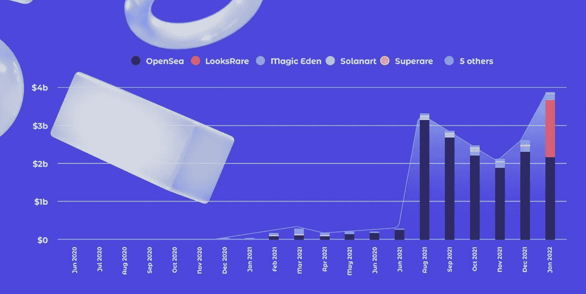
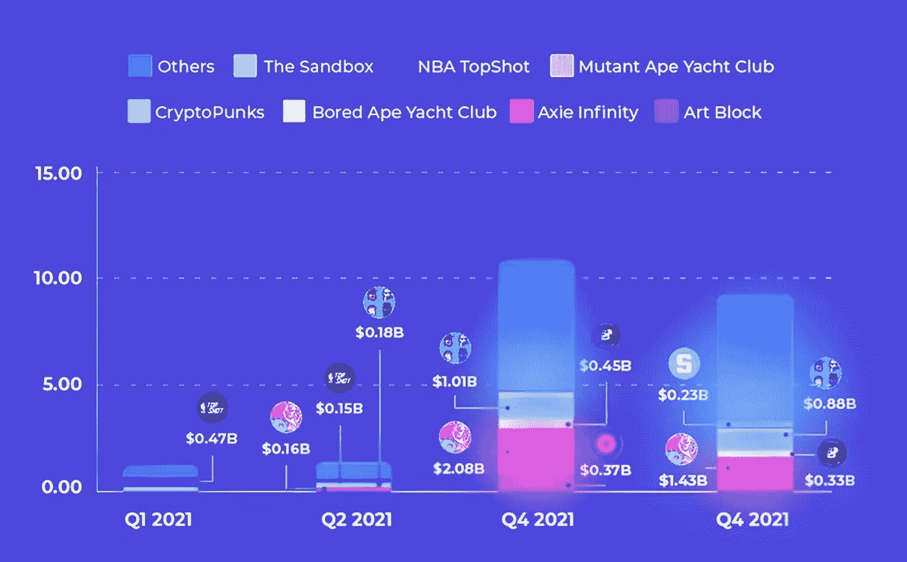
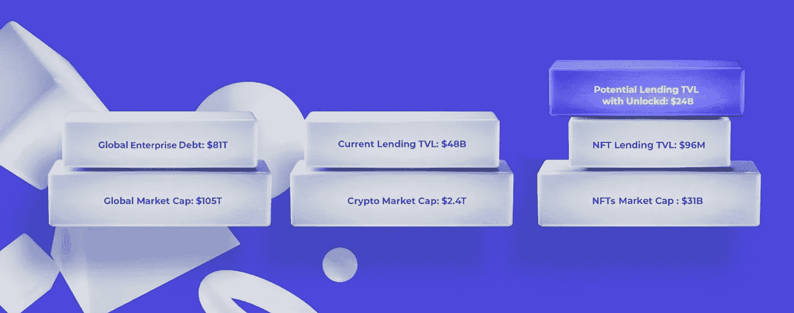
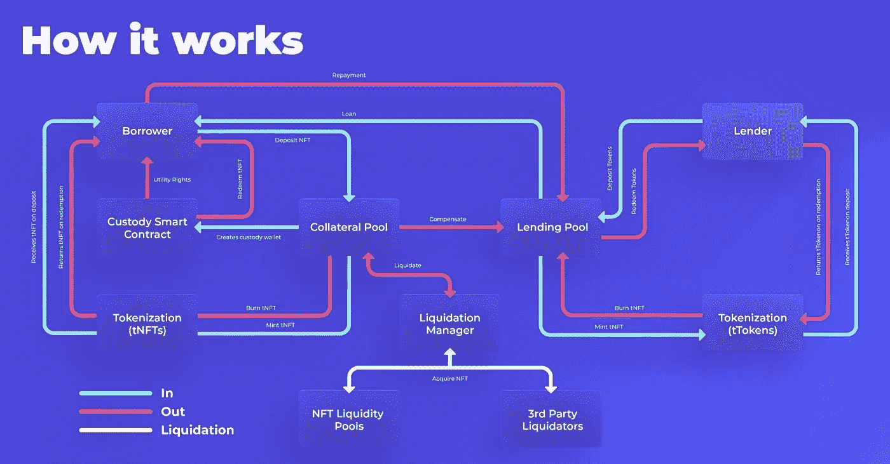
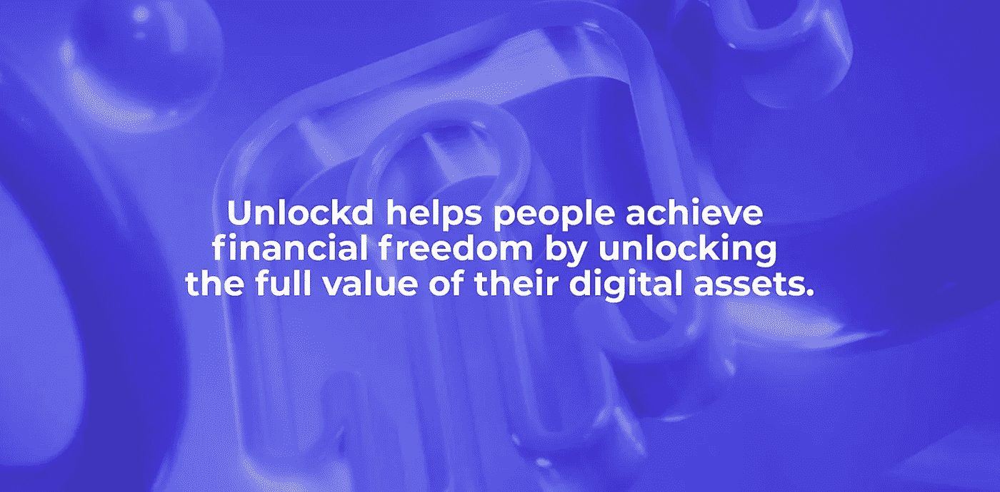
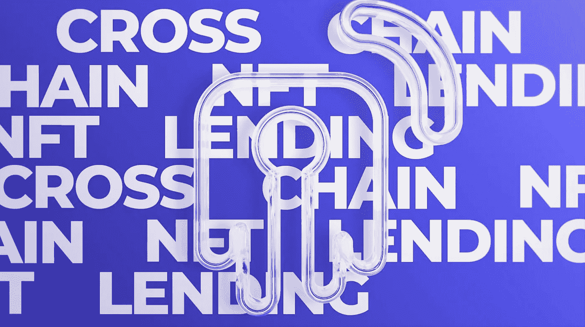

# 2022 年将开启你的 NFTs 全部价值的大门:原因和方法如下。

> 原文：<https://medium.com/coinmonks/2022-will-unlock-the-gates-to-the-full-value-of-your-nfts-bb8c9a2c0690?source=collection_archive---------1----------------------->

自 2009 年比特币诞生以来，加密界一直在寻找新的、颠覆性的方法，通过区块链技术来改善社会，携手追求共同进步。

在 2018 年初，我们发现了一种不可替代令牌的形式。NFT 最初用于收集数字猫，但后来被艺术家、设计师、游戏开发者、音乐家和作家采用，作为一种安全存储和出售数字资产的方式。

在 NFTs 的帮助下，艺术家和创作者现在可以直接向粉丝和收藏家出售他们的作品，让他们对如何使用和分发他们的作品有更多的控制权。这为一个去中心化和协作化的产业铺平了道路，这个产业给世界带来了**财富**、**创新**和**创造力**。此外，每天都有新的实用程序和应用程序被全球各行各业所采用:艺术、游戏、会员、真实世界虚拟化、物流、元宇宙、社交网络、流媒体……应有尽有。

# 关注社区。相信数据。

虽然 NFT 出现还不到三年，但它对数字世界的影响已经很明显了。**而你们法国人似乎没有心情减缓其令人眼花缭乱的增长**:有机采用率同比增长 800%，每日活跃钱包超过 250 万。

NFT 的销售额在 2021 年飙升至 230 亿美元，同比增长 23 倍，这是由供应的大幅增长和不同协议的新系列的增加推动的。艺术家与社区携手成长，这在历史上第一次引发了分散的数字艺术经济。游戏开始。

NFT Marketplace monthly volume (2021) — Cryptoart, DappRadar

市场正在迅速成熟，活跃的活动已经成为区块链历史上的主要趋势，元宇宙和游戏 NFT 加入了收藏品的行列。

过去一年的最后几个月见证了多年前在以太坊播下的种子是如何开花结果成为一个**跨链的未来。**

## 债务是打开效率之门的钥匙

NFTs 提供了以前数字资产无法提供的安全性和真实性。利基市场已经发展成为一个产业。每个行业都需要合适的工具来提高资本效率，释放其资产的全部价值。这就是 Unlockd 的用武之地。

NFT sales volume by quarter (2021) — DappRadar

在这种颠覆性创新的滋生地之后，是时候将非金融交易的金融化变成主流现实了。这是通过更接近真实世界来实现的，但要做得恰当。

NFTs 的效用呈指数增长。随着用例范围的扩大，越来越多的价值将被锁定。在 DeFi，在元宇宙，在娱乐行业，在音乐和几乎所有涉及人类数字互动的社会领域，创造机会，获得独家特权。还有一些非常酷的 JPEGs 图片，你知道的。

从 NFT 和它们的应用之间的协同作用中流入密码社区的所有价值将部分锁定在获得它们的机会成本中。

怎么才能解锁呢？

**Unlockd 提出一个解决方案:债务。**

# 债务会加剧非金融服务业的金融化

现代经济是债务驱动的，公共和私人机构都利用债务来加速增长。

Own elaboration

我们所有人——建筑商、用户、德根和 JPEG 收藏者——都采用了这种基于债务的模式，因为我们知道加密市场的独特波动性意味着，以负责任和可控的方式利用你的财富，可以给你创造财富的机会。

由非流动资产或未来现金流担保的债务是一种已经使用了几个世纪的融资方式。这种融资方式允许贷款人以借款人的资产作为抵押来获得贷款。如果借款人拖欠贷款，贷款人可以扣押抵押品并将其出售以偿还贷款。

这种融资是世界各地企业为其运营融资最常用的方式，也是个人在日常生活中最常用的方式——例如，为购买房屋或汽车融资。但这与债务在 DeFi 的运作方式有何不同？

在 DeFi 中，债务通常被加密货币等“现金等价物”过度抵押，这是非常低效的。过度担保的程度必须足以保证贷款人的安全，因为在担保品变现不足以偿还贷款的假设情况下，没有任何机制可以让借款人承担责任。

## 密码行业仍然缺乏更好的债务解决方案。

NFT 目前的问题是，它们**将你的财富锁定在一种资产上，这种资产通常不能像其他数字资产一样产生收益**。此外，目前市场上缺乏流动性对持有人来说可能是一个问题，因为这意味着他们可能难以出售其非金融资产。这导致 NFT 被打折出售或根本不出售，如果你需要在短期内获得资本，或者如果你需要支付意外费用，这是一个问题。

当然，如果我们希望 DeFi 用户通过提高资本效率从他们的投资组合中获得最大收益，这些条件就会变得非常成问题。

建筑商对这种模式的变化反应迅速，一些个人对个人的贷款市场已经出现:个人对个人的 NFT 支持贷款允许借款人在市场上展示他们的非金融资产作为贷款的抵押品。贷方可以根据 NFTs 的价值选择贷款给借方。一旦贷款得到偿还，非金融债券将返还给借款人。

尽管这种最初的模式试图满足 NFT 抵押债券的基本需求，但它受到许多限制——明显缺乏匹配供求的**效率**、不灵活的到期期限**以及不符合真实市场需求的更高的**利率**。**

此外，我们之前谈到的 NFT 的所有内在效用都到哪里去了？堵住了。是的，这种 P2P 模式确实释放了流动性，但代价是没有资格进行空投，不能获得独家津贴，不能从他们在游戏到收入生态系统中的使用中受益……这真的值得吗？

有什么选择？**解锁**。

# 迎接解锁:NFT 金融化的未来

解锁是释放数字资产经济的全部流动性和效用的协议。我们的货币市场允许 DeFi、Art、真实世界和游戏用户通过 NFT 支持的跨链即时贷款来增加他们的财富。

最酷的部分是:**不失去抵押品的所有权**。你仍然享受 100%的额外津贴和优势，把资产放在你的钱包里，但有了额外的资本，将完全重新构建你对 DeFi、P2E、收集或任何你决定追求的德根战略的方法。

看，我们正在开拓这里。这就是为什么我们的愿景充满挑战和鼓舞人心:通过释放数字资产的全部价值，帮助人们实现财务自由。

将你的财富锁定在非金融资产上的机会成本，可能会让你错过这十年中几项最伟大的投资。现在，你比以往任何时候都更需要提高资本效率，以跟上行业的快速发展。

Unlockd 使您能够获得前所未有的额外资本，同时保持对 NFTs 的所有权，因此您可以从一生一次的收益机会中受益，使您的加密组合多样化，购买更多 JPEGs，扩大您的 P2E 资源，利用您的交易，甚至在现实世界中购买一栋房子。选项是无限的。

## 解锁如何优于点对点贷款市场？

两个词:流动性池。

贷款人将其资产存入资金池，以获得收益，换取流动性贡献。借款人接受超额抵押贷款，没有固定的到期日，即时，利率公平，并针对他们的非金融资产——如果他们是合格集合的一部分。这种利息用于支付贷款人的收益，向代币持有人发放奖励，并增加道金库。

## 解锁如何优于其他基于池的贷款解决方案？

如果你失去了持有 NFT 的独有好处，降低购买它的机会成本又有什么意义呢？如果你阻止了潜在的空投，你用贷款解锁的流动性有什么用？

在 Unlockd，我们致力于释放 ***所有*** 资产的效用和流动性。

因此，当你通过存放你的 NFT 作为抵押品而获得贷款时，你继续享受 NFT 在其他协议、社区或组织中可能拥有的所有效用。当然，你不能移动或出售它——但你可能已经明白了这一点。

然后还有互操作性的问题。

NFT 的价值目前被其所在的协议或生态系统的价值所限制。有多少次，你放弃收购你不合理地喜欢的 NFT，因为它不在你经常去的生态系统中？

**Unlockd 是一个跨链的 NFT 支持的借贷协议，这意味着作为抵押品存放的 NFT 和借入的代币不需要在同一链上。**有了解锁的跨链流动性，你不寻常的投资就成了你所用协议中需要的燃料。

*举个例子*:你发现了一个有前途的滴滴……现在怎么办？这一过程的摩擦开始了:你不仅必须重新分配你的资本，还必须获得你需要但没有的代币:互换、过桥以及令人愤怒的费用和等待时间。

随着解锁，这条蜿蜒的道路变得轻而易举。抵押你的 NFT，释放即时的跨链流动性:你的新收购现在只需点击几下鼠标。

那么**评估**和**清算**呢？我们的数据科学团队目前正在开发一个定制的统计模型，以动态、准确地量化作为抵押品提供的 NFTs 的价值。很快我们将与你分享所有的数学知识和解释内容；在 DeFi 接受贷款时，我们认为用户应该充分意识到其解锁策略的风险和收益。

# 未来是可互操作和合作的

解锁成为互联高速公路，允许流动性在区块链、协议和社区之间流动——在 NFT 工业和 DeFi 之间建立一个坚实的交叉点。

像乐高积木一样，我们正在开发的技术也将允许与市场、租赁协议、公会、P2E 游戏、收益聚合器和无数其他分散应用程序的独特共生。

这打开了 NFTs 真正金融化的大门，这是经济史上前所未有的金融产品，包括以债务形式为新购买融资的即时抵押和专注于跨链效率的新战略，你们，我们的社区，将帮助我们发现。

*【技术货色】听起来很棒但是……文令牌呢？*

我们希望以公平和分散的方式，让尽可能多的人能够获得我们的产品和服务。我们相信民主化的力量，我们将共同的长期愿景置于我们可能拥有的任何经济激励之上。我们认同区块链不可信赖的哲学，并不懈努力创造透明可靠的系统。这就是为什么一旦治理可以部署，我们将转换到**解锁的 DAO** 中。

我们的记号组学将很快出现在我们的文档中。敬请期待！我们的治理令牌的总供应的很大一部分将被指定给社区，并对那些支持和使用 Unlockd 的人进行大量空投。

*另外，我们正在做一件非常非常有趣的事情……这可能与解锁生态系统中具有实际用途的开创性 NFT 集合有关……*

艺术、JPEGs 或游戏、元宇宙资产或现实世界的虚拟化、公用事业 NFT 或金融工具:**我们相信，在这个世界中，所有数字资产都与不可替代的实物资产一样有价值和有用**。

我们正在建立一些很棒的东西，但是我们需要一个社区来服务，我们需要反馈。很快你就可以测试我们的测试版并帮助我们改进。

你对 Unlockd 的支持，对整个团队都是一种鼓舞(对了，公队！)，谢谢。如果您**关注我们**并在 [Twitter](https://twitter.com/Unlockd_Finance) 和 [Telegram](http://t.me/unlockd_finance) 上分享我们的消息，并邀请您的朋友积极参与我们可爱的 [Discord 社区](http://discord.gg/unlockd)，这对我们的成长会有很大帮助。此外，你现在可以访问我们新推出的[网站](https://unlockd.finance)——我们的文件很快就能拿到！

成为革命的一部分。与我们一起开启数字经济的未来。

