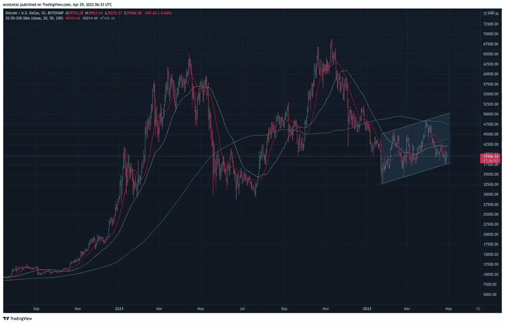

# 2022 年比特币 20k 价格预测

> 原文：<https://medium.com/coinmonks/20k-price-prediction-for-bitcoin-in-2022-fa7093832c4c?source=collection_archive---------24----------------------->

Bitcoin daily chart

2021 年对比特币来说是极好的一年。比特币屡破历史新高的消息让大多数怀疑者变成了比特币的热情支持者。在经历了整整一年的价格攀升后，在撰写本文时，比特币似乎正在喘息，横盘交易达到 39，000 美元。这种横向交易会将比特币推升至新高，还是会打破其横向形成和趋势走低？

关于比特币的未来，有很多看涨和看跌的言论。

**多头**认为:

1)支撑比特币的基础验证技术更胜一筹。

2)比特币作为数字黄金，具有与实物黄金相似的通胀对冲特性。

3)萨尔瓦多和[中非共和国](https://www.cnbc.com/2022/04/28/central-african-republic-adopts-bitcoin-as-legal-tender.html)等国家已经将比特币作为官方货币；因此，比特币有有效的用例。

**熊**认为:

1)比特币价格行为与纳斯达克正相关；因此，它的价格行为类似于科技股，而不是实物黄金。

2)比特币从未在高通胀环境下经受过考验，更不用说在货币政策收紧的情况下。

3)只有政府可以发行货币，无论是实物货币还是数字货币。

Let 说，比特币存在的原因是因为它与现有金融机构相比具有技术优势，那么它确实具有科技股的特征。传统上，科技股在高通胀环境中表现不佳，原因是宏观因素**比如商业成本上升和消费者支出放缓，以维持其持续的业务增长。此外，任何货币政策的收紧都相当于从经济中吸走资金，从而使你的美元比高风险、高波动、未经检验的比特币更具吸引力。鉴于这些，我不认为比特币在不久的将来会站稳脚跟。**

在第三点上，多头和空头的观点都是正确的。在我们的现代货币体系中，法定货币不是由实物或商品支持的，而是由人们对政府的信任支持的。因此，理论上，如果人们的信仰保持不变，政府可以用 T4 加密货币取代 T2 法定货币。另一方面，就像一把双刃剑，同一个政府有能力抑制比特币的增长。就我个人而言，我相信政府法规即将出台，不管我们喜欢与否，它们可能不像其他人认为的那样是不祥之兆。我们今天所知道的互联网，Web 2.0，是政府监管给一度混乱的 Web 1.0 时代带来稳定的一个好例子。

在权衡了看涨和看跌观点的利弊后，我倾向于对比特币的长期前景持积极态度，同时对其短期前景持消极态度，2022 年可能不仅是比特币动荡的一年，也是所有资产类别动荡的一年。

**免责声明:本文包含的信息不是法律或投资建议，它代表我的个人观点，一如既往，“做你自己的研究。”**

订阅 g [*et 无论何时发布都通过邮件通知*](/subscribe/@eunicetzc) *。*

*还不是中等会员？* [*注册*](/@eunicetzc/membership) *每月只需 5 美元。你的会员资格直接支持像我这样的作家，而且你可以在媒体上看到所有的故事。*

如果你有任何问题，或者你想让我写些什么，请告诉我；下面留个 ***评论*** *。感谢阅读，我希望你喜欢这篇文章。*

> 加入 Coinmonks [电报频道](https://t.me/coincodecap)和 [Youtube 频道](https://www.youtube.com/c/coinmonks/videos)了解加密交易和投资

# 另外，阅读

*   [Cloudbet 赌场评论](https://coincodecap.com/cloudbet-casino-review) | [点火赌场评论](https://coincodecap.com/ignition-casino-review)
*   [加密套利](/coinmonks/crypto-arbitrage-guide-how-to-make-money-as-a-beginner-62bfe5c868f6)指南| [如何做空比特币](/coinmonks/how-to-short-bitcoin-568a2d0b4ae5)
*   [如何在加拿大购买加密货币？](https://coincodecap.com/how-to-buy-cryptocurrency-in-canada)
*   [无聊猿游艇俱乐部(BAYC)回顾](https://coincodecap.com/bored-ape-yacht-club-bayc-review) | [拜比特 vs 比特币基地](https://coincodecap.com/bybit-vs-coinbase)
*   [5 款最佳加密交易终端](https://coincodecap.com/crypto-trading-terminals) | [最佳 DeFi 应用](https://coincodecap.com/best-defi-apps)