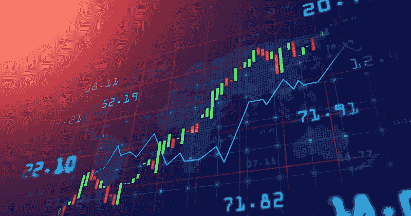

# 20 倍于您的产品组合—技术分析

> 原文：<https://medium.com/coinmonks/20x-your-portfolio-technical-analysis-7027196665a1?source=collection_archive---------30----------------------->

你好，朋友们。先说技术分析。在我们开始之前，你可以阅读我的其他故事:

> [开始投资加密货币的 5 个窍门](/coinmonks/5-tricks-to-start-investing-in-cryptocurrencies-aa38ea1e6d4a)
> 
> [如何让你的投资组合在 6 个月内翻 20 倍？](/coinmonks/how-to-make-your-portfolio-20x-in-6-months-f41eb67bbe5d)
> 
> [先调研后投资](/coinmonks/first-investigate-then-invest-4eecf5f0bed6)

这不是开玩笑，这是加密货币中最重要的因素。

技术分析是一条没有尽头的**隧道**。有很多关于它的课程和文章。你应该找到对你最好的东西。

之后，你可以学习如何以及何时交易一项资产，并预测其可能的价格走势。在基本面分析中，你试图确定一项资产的**【真实价格】**。技术分析依赖于**资产价格变动的历史。**

0.0

如果你想开始学习技术分析，关注这个话题。

1.  ***图表的图案***
2.  ***指标***
3.  ***阻力和支撑位***
4.  ***烛台***
5.  ***贸易统计***

在技术进步之前，技术分析是手工完成的。现在这么容易就学会了，赢了:)

> 我认为最好的平台是技术人员的交易视图…
> 
> *加入 Coinmonks* [*电报频道*](https://t.me/coincodecap) *和* [*Youtube 频道*](https://www.youtube.com/c/coinmonks/videos) *了解加密交易和投资*

# 另外，阅读

*   [Bookmap 评论](https://coincodecap.com/bookmap-review-2021-best-trading-software) | [美国 5 大最佳加密交易所](https://coincodecap.com/crypto-exchange-usa)
*   最佳加密[硬件钱包](/coinmonks/hardware-wallets-dfa1211730c6) | [Bitbns 评论](/coinmonks/bitbns-review-38256a07e161)
*   [新加坡十大最佳加密交易所](https://coincodecap.com/crypto-exchange-in-singapore) | [购买 AXS](https://coincodecap.com/buy-axs-token)
*   [红狗赌场评论](https://coincodecap.com/red-dog-casino-review) | [Swyftx 评论](https://coincodecap.com/swyftx-review) | [造币厂评论](https://coincodecap.com/coingate-review)
*   [投资印度的最佳密码](https://coincodecap.com/best-crypto-to-invest-in-india-in-2021)|[WazirX P2P](https://coincodecap.com/wazirx-p2p)|[Hi Dollar Review](https://coincodecap.com/hi-dollar-review)