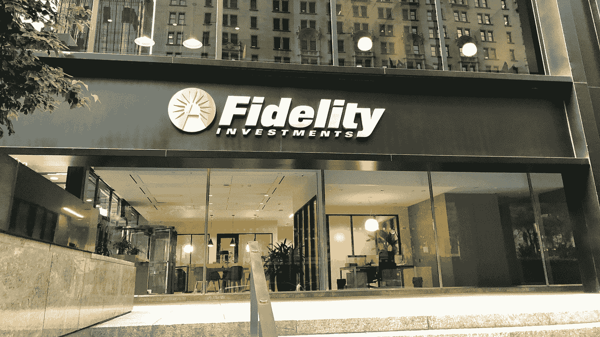
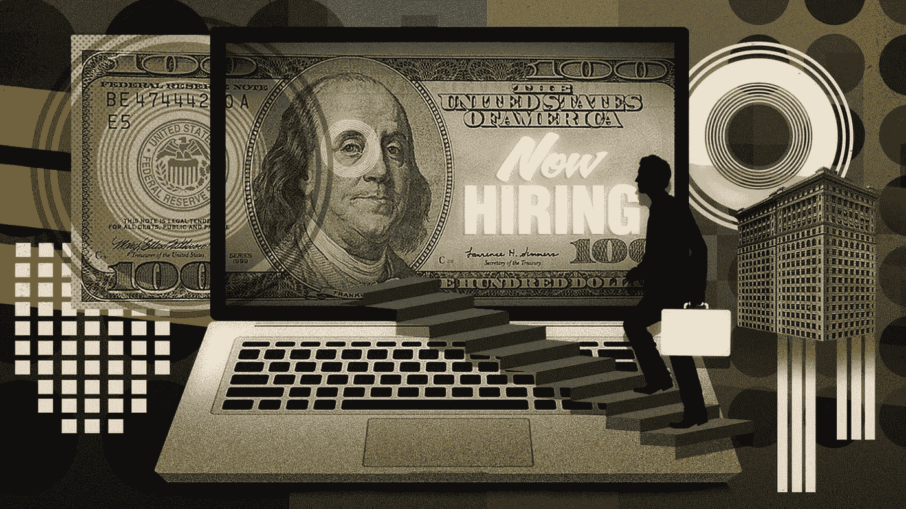

# 21Shares 利用前优步高管引领产品路线图

> 原文：<https://medium.com/coinmonks/21shares-taps-ex-uber-exec-to-lead-product-roadmap-374613bd994d?source=collection_archive---------51----------------------->

21Shares 聘请前优步高管 Karan Chawla 担任产品副总裁。

Chawla 之前是优步在美国、加拿大和亚太地区的支付主管。他将专注于公司的产品路线图，为投资者提供 DeFi 协议，并将寻求进一步推动机构采用数字资产。

作为世界上最大的加密货币交易所交易产品(ETPs)发行商，该公司管理着大约 25 亿美元的资产。该公司最近在瑞士推出了一款结合黄金和比特币敞口的产品，并将在澳大利亚推出首批比特币和以太 ETPs。

Crypto exchange OKX 任命前 Okcoin 高管海德尔·拉菲克(Haider Rafique)为其首席营销官。

拉菲克是今年早些时候 OKX 执行团队的特别顾问，并帮助推动了与曼城数百万美元的合作协议。在他的新职位上，他将建立一个全球营销团队，使 crypto 成为主流，并领导公司的国际扩张工作。

这位高管最近是加密交易所 Okcoin 的首席营销官。在此之前，他是 Blockchain.com 的增长主管，也是微软的产品营销主管。

菲尔·戴维斯是 Web3 基础设施公司 ConsenSys 的新任首席财务官，此前他在人工智能公司 Afiniti 担任了七年的首席财务官。

此前，ConsenSys 上个月进行了 4.5 亿美元的 D 轮融资，对该公司的估值为 70 亿美元。

戴维斯将监督公司的财务和会计职能，包括扩大其财政战略。ConsenSys 保留了大量的 ETH、stablecoins 和其他加密令牌，并将这些资产用于 DeFi 协议和标桩。

Babel Finance 任命宋洋担任新设立的财务主管一职，因为该公司寻求为更加多样化的客户提供服务。

这家加密金融服务提供商在年底有 30 亿美元的未偿贷款余额，该公司成立了一个资金部门，以加强风险管理，确保其贷款业务有足够的流动性。

在德国商业银行工作了 12 年后，宋加入了通宝金融公司，他在德国商业银行担任财政部副总裁。

随着越来越多的 Web2 游戏公司进入 Web3 世界，加密风险投资公司 Fundamental Labs 将邀请前脸书资深人士 Vinayak Rao 担任 GameFi 负责人。

他将专注于通过 Web3 和区块链游戏生态系统的投资和资源来支持创始人。

在 Rao 的最新任命之前，他领导脸书的游戏产品合作伙伴团队。他还推出了对手巅峰(Rival Peak)，这是一个完全在游戏引擎中模拟的电视真人秀节目，这是一个可以在视频内容上玩游戏的平台。

CoinList 聘请了迈克尔·科茨(Michael Coates)和阿米尔·卡沃西安(Amir Kavousian)领导公司的数字资产服务部门。

科茨是前 Twitter 首席信息安全官和 Mozilla 的安全负责人，而 Kavousian 此前在 Capital One 担任数据科学主管。

这些任命是 CoinList 收购云安全公司 Altitude Networks 的一部分，科茨是该公司的首席执行官，Kavousian 是首席技术官。

跨交易所数字资产交易网络 Apifiny 任命戴安娜·皮雷斯(Diana Pires)为首席收入官，在计划与阿布里·特殊目的收购公司公司(Berkshire Hathaway Inc .)合并之前继续招募人才。

Pires 在转到 OKX 之前曾在 S&P 国际公司工作。之后，她成为了 Crypto.com 的高级副总裁，在那里她建立了机构渠道并推动了业务发展。

皮雷斯在一份声明中说:“我的经验让我深入了解了快速发展的数字资产交易生态系统中的差距。我对 Apifiny 如何准确指出交易所、交易商和新区块链代币项目今天面临的分散流动性问题印象深刻。"

为 DeFi 提供金融服务的 Web3 身份护照网络 Quadrata 聘请了一些行业领袖作为公司顾问。

新的 Quadrata 顾问包括区块链协会执行董事克里斯汀·史密斯(Kristin Smith)；斯普林实验室的高级研究主管大卫·克拉维茨；Quantstamp Technologies 的执行董事 Don HoCozy Finance 创始人 Tony Sheng 以及沙盒的联合创始人兼首席运营官 Sebastien Borget。

> 加入 Coinmonks [电报频道](https://t.me/coincodecap)和 [Youtube 频道](https://www.youtube.com/c/coinmonks/videos)了解加密交易和投资

# 另外，阅读

*   [如何在 Bitbns 上购买柴犬(SHIB)币？](https://coincodecap.com/buy-shiba-bitbns) | [买弗洛基](https://coincodecap.com/buy-floki-inu-token)
*   [CoinFLEX 评论](https://coincodecap.com/coinflex-review) | [AEX 交易所评论](https://coincodecap.com/aex-exchange-review) | [UPbit 评论](https://coincodecap.com/upbit-review)
*   [十大最佳加密货币博客](https://coincodecap.com/best-cryptocurrency-blogs) | [YouHodler 评论](https://coincodecap.com/youhodler-review)
*   [AscendEx 保证金交易](https://coincodecap.com/ascendex-margin-trading) | [Bitfinex 赌注](https://coincodecap.com/bitfinex-staking)
*   [最好的卡达诺钱包](https://coincodecap.com/best-cardano-wallets) | [Bingbon 副本交易](https://coincodecap.com/bingbon-copy-trading)