# 25 看涨反转烛台模式每个交易者都必须知道，如何识别它们

> 原文：<https://medium.com/coinmonks/25-bullish-reversal-pattern-every-trader-must-know-how-to-recognize-them-6fb62b5631d5?source=collection_archive---------1----------------------->

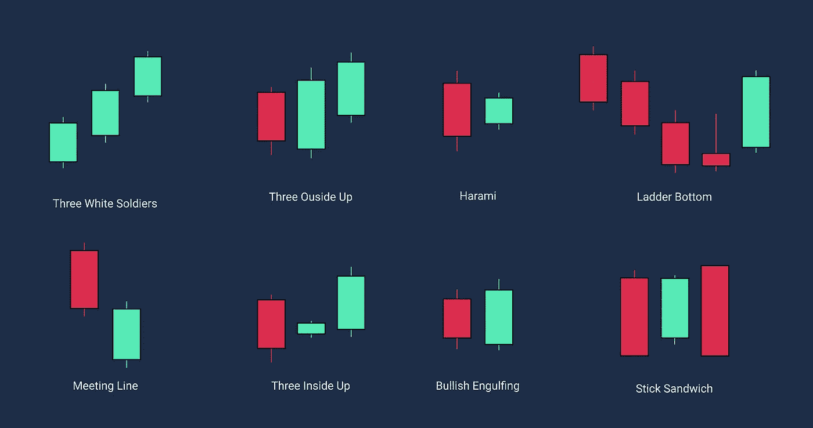

烛台图表模式被认为是在 18 世纪由一位名叫 Munehisa Homma 的日本富商开发出来的，用来分析大米合约的价格变动。由于大米合约，Menehisa 受到启发，制作了这种技术方法，现在在技术交易者中广泛使用。而价格和供求之间存在着潜在的联系。烛台也通过可视化蜡烛体的大小、颜色和阴影的长度来显示市场情绪。基于这些模式，我们可以获得有用的见解，如市场是否见底，或当前趋势是否减弱并将反转。技术交易者使用许多烛台模式来识别看涨反转、看跌反转或延续模式。

在这篇文章中，我将分享 25 种看涨反转模式以及如何识别它们。学会识别这些模式会让你解锁更多的交易机会，所以绝对值得学习。需要注意的是，仅用烛台模式交易是不可取的，结合像 RSI 和 MACD 等技术指标会使这些模式更有意义。如果你想要更完整的烛台模式列表，请在 Google play 商店下载[烛台模式应用。](https://play.google.com/store/apps/details?id=com.candlestickpatterns)

# #1 漫长的白色白天

*   这支蜡烛很容易辨认，因为它只由 1 支蜡烛组成。
*   由长长的身体组成，比图表上以前的蜡烛还要长。
*   这根蜡烛的主体应该完全包含图表上前面的蜡烛。
*   白色长日表明交易时段有强大的买入压力，向交易者发出信号，表明多头开始从下跌趋势中获得控制权，潜在的趋势反转可能发生。
*   结合高音量使这种模式更有意义。

# 2 号锤子

*   看起来像字母 T
*   开盘价和收盘价非常接近，形成一个非常小的蜡烛体
*   下阴影至少是它身体大小的两倍
*   它有一个很长的下影线，这告诉我们，卖方试图把价格压低，但多头设法控制了局面，能够把价格收高。这表明，随着买家在下跌趋势中重新获得控制权，市场情绪可能会发生变化。

# #3 倒锤

*   很少或没有下阴影
*   打开和关闭价格非常接近对方，形成一个非常小的烛台机构
*   上部阴影大约是它身体大小的两倍或更多
*   看起来像一个吊人模式，但相反，这个模式出现在下跌趋势的末端。
*   它有一个长长的上影线，意味着有人愿意以更高的价格购买，下跌趋势正在减弱。

# #4 看涨吞没

*   这种图案的第一支蜡烛有一个较小的蜡烛体
*   第二个烛台完全吞没了第一个烛台
*   第二个烛台价格比第一天低，比第一天高。

# #5 哈拉米

*   这个模式的第一根蜡烛线是一根熊市蜡烛线，显示出熊市的含义
*   这种模式的第二根蜡烛线价格从前一根蜡烛线的低点跳升，价格小幅高开
*   第二根蜡烛的大小不超过第一根蜡烛的 25%。

# 6 号哈拉米十字勋章

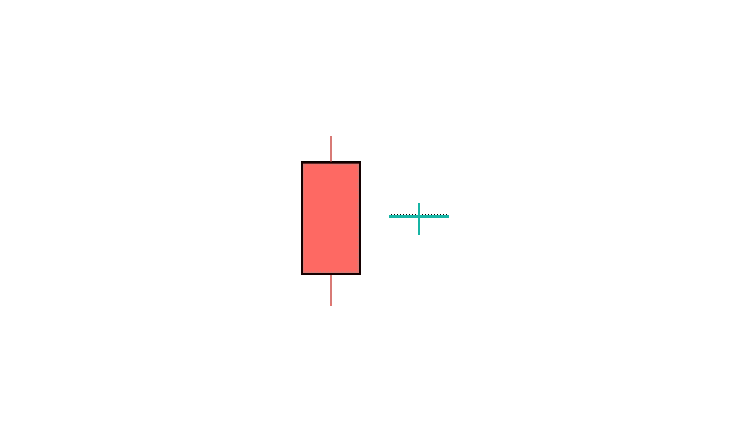

*   这是一个两个价格的蜡烛模式
*   这种模式的第一个烛台完全吞没了第二天的蜡烛
*   第二根蜡烛是多奇蜡烛，有上下两个阴影，两个阴影的大小差不多。
*   当前趋势一定是下降趋势

# #7 穿孔线

*   在下降趋势时发生
*   这种模式的第一根蜡烛是一根熊市蜡烛，代表当前的市场趋势
*   第二根蜡烛线的开盘价低于前一根蜡烛线的收盘价。买家获得动力，并设法在前一根蜡烛线的中间位置将价格收高。

# 第八名多奇之星

*   由两个烛台图案组成
*   第一根蜡烛是正常的熊市蜡烛
*   第二支蜡烛价格下跌，接近开盘价，形成多奇烛台。

# 9 号会议线

*   趋势必须是下降趋势
*   第一个烛台是一只熊蜡烛
*   第二个烛台价格在开盘时下跌，收盘时等于前一个烛台收盘价

# #10 三个白人士兵

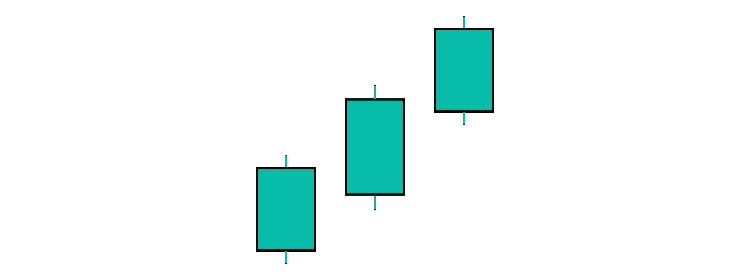

*   出现在下降趋势
*   连续三根正常的像楼梯一样的牛气蜡烛
*   每根蜡烛的价格必须高于前一根蜡烛。

# #11 晨星

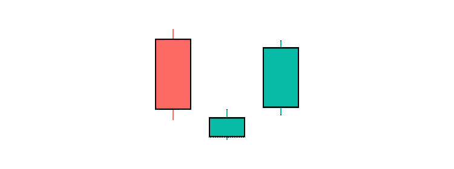

*   由 3 个蜡烛图案组成，第一个蜡烛是一个长的熊烛台
*   第二天可以是红色或绿色的小烛台
*   第三天是一个大牛市烛台

# #12 晨星多奇

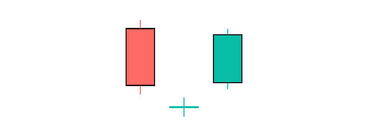

*   这种模式的第一天是一个长期看跌的烛台
*   第二天是多奇烛台，象征着市场的犹豫不决
*   第三天是一根大的看涨蜡烛线，在第二天蜡烛线之上，在第一根蜡烛线的中点收盘

# #13 弃婴

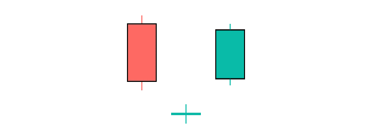

*   三棒反转形态，第一根蜡烛是一根长长的看跌烛台
*   第二根蜡烛线在主要趋势的方向向下缺口，第一根棒线和第三根棒线的主体和阴影不能和第二根蜡烛线重叠。
*   第三根蜡烛缺口向上，形成一个大的看涨烛台。

# #14 三星

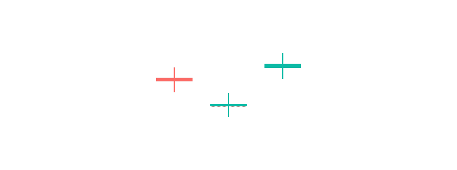

*   三支蜡烛图案
*   主要趋势是下降趋势
*   第一根、第二根和第三根蜡烛是多奇烛台

# #15 分离

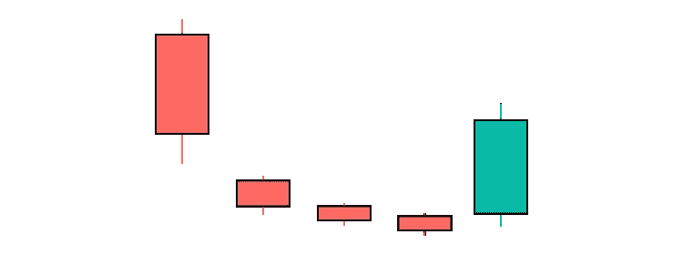

*   这个图案由五个烛台组成
*   第一根蜡烛是一个大的看跌烛台，接着是三个小烛台，第二个烛台在主趋势的方向上制造了一个缺口。
*   第五个烛台是一个大的牛市烛台，完全包含了前三个烛台，并关闭了第一个和第二个烛台之间的差距。

# #16 三个里面朝上

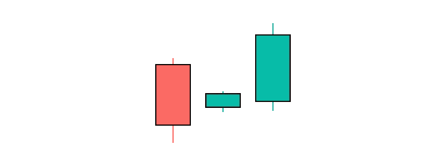

*   这种模式的第一根蜡烛是红色蜡烛，表示当前趋势
*   第二根蜡烛线是一根小的看涨蜡烛线，在第一根蜡烛线中间开始和结束
*   第三根蜡烛是看涨的，在第一根蜡烛上方收盘

# #17 三个在外面

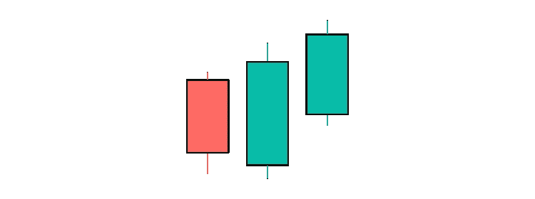

*   这种模式的第一根蜡烛是看跌蜡烛
*   第二根蜡烛向下缺口，但在交易结束时设法完全吞没了第一根蜡烛
*   第三根蜡烛线是一根看涨的蜡烛线，必须在第二根蜡烛线之上收盘

# #18 踢腿

*   当前趋势一定是下降趋势
*   由两个被价格差距分开的长的相对的烛台组成
*   第一个烛台是一个长的牛市烛台其次是一个牛市烛台缺口，并关闭以上的第一根蜡烛。

# #19 独一无二的三河底

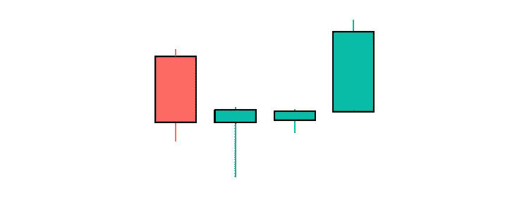

*   第一个是显示当前趋势的红色长蜡烛
*   第二根蜡烛是一根长影子的锤子蜡烛，价格创下新低
*   第三根蜡烛是短的绿色蜡烛，不超过第二根蜡烛的高或低

# #20 南方的三颗星

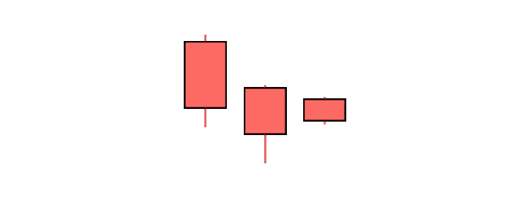

*   市场肯定处于下跌趋势
*   第一个烛台是黑色的，有一个长长的真实身体，长长的下阴影，它缺少上阴影
*   第二个烛台是黑色的，比第一个低蜡烛的烛台主体短，低烛台高
*   第三个烛台是黑色的，有一个短的真实主体，没有阴影，并且在第二个蜡烛的高-低范围内关闭

# #21 隐藏小燕子

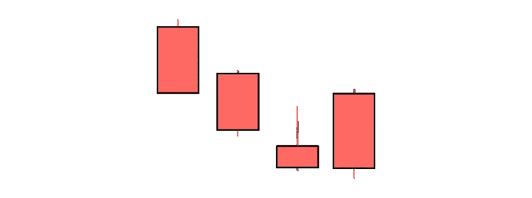

*   第一根蜡烛必须是在下跌趋势中出现的黑色小蜡烛。
*   第二支蜡烛也必须是黑色的。它在前一根蜡烛线的主体内打开，并在低于前一收盘价时关闭。
*   前两根蜡烛没有任何上下阴影。
*   第三根蜡烛必须是高波，没有下影。当它的上影线进入前一根蜡烛线的主体时，它的开盘价低于前一根收盘价。
*   第四根蜡烛必须有一个黑色的身体吞没前一根蜡烛的身体和上部阴影。

# #22 棍子三明治

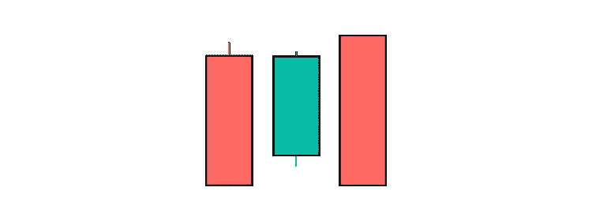

*   它由 3 个烛台组成
*   出现在下跌趋势的市场
*   这种图案的第二个烛台的颜色与第一个和第三个蜡烛相反

# 23 号信鸽

*   当前趋势必须是下降趋势，由两根蜡烛线组成
*   第一支蜡烛是一个长长的熊形烛台
*   第二根蜡烛线向上缺口，收盘价和开盘价在第一根蜡烛线的中间范围内

# #24 梯子底部

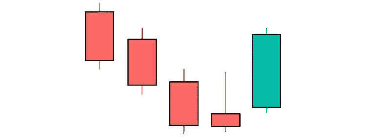

*   阶梯底部是一个 5 蜡烛的看涨反转形态
*   前三根蜡烛线是熊市蜡烛线，开盘价和收盘价连续走低
*   第四支蜡烛像一把倒置的锤子，有一个小身体和长长的上影
*   第五根蜡烛是一根多头蜡烛，向上跳空，价格高于第四根蜡烛

# #25 匹配低

*   当前趋势一定是下降趋势
*   这个图案由两个烛台组成
*   顾名思义，两支蜡烛的收盘价相等
*   只要两支蜡烛的收盘价相等，两支蜡烛的主体大小并不重要
*   你见过两个长得一模一样的人吗？这就是图表上出现匹配低点的罕见程度。这种模式意味着卖方不能突破某个价格点，机构或鲸鱼可能会在该价格点连续两根蜡烛线中抓住下跌的刀(价格),形成匹配的低模式。这种形态的低点标志着交易者潜在的价格支撑和潜在的趋势反转。

谢谢你的到来😊。日本烛台模式被证明与交易者的情绪相关，了解它们将有助于你做出交易决定。要了解更多关于日本烛台图案的信息，请在 google play 商店下载[烛台图案应用程序](https://play.google.com/store/apps/details?id=com.candlestickpatterns)。

> 加入 Coinmonks [电报频道](https://t.me/coincodecap)和 [Youtube 频道](https://www.youtube.com/c/coinmonks/videos)了解加密交易和投资

## 也阅读

 [## 杠杆代币[多头代币]终极指南

### 杠杆化令牌是具有杠杆化风险敞口的 ERC20 令牌，不考虑保证金、要求、管理…

medium.com](/coinmonks/leveraged-token-3f5257808b22)  [## 最佳加密交易所| 2022 年十大加密货币交易所| CoinCodeCap

### 哪一个是最好的加密交换？在本文中，我们将根据多种加密货币列出 10 大加密货币交易所

coincodecap.com](https://coincodecap.com/crypto-exchange)  [## Keevo 钱包点评:是最安全的硬件钱包吗？2022 | CoinCodeCap

### 在这篇 Keevo Wallet 评论中，我们将讨论他们如何改变我们看待硬件钱包的方式。基沃是…

coincodecap.com](https://coincodecap.com/keevo-wallet-review)  [## 2022 年 5 大最佳社交交易平台

### 5 个最佳社交交易平台阅读加密产品评论和比较，了解比特币交易和…

coincodecap.com](https://coincodecap.com/best-social-trading-platforms)  [## BlockFi 评论:2022 年的利弊和利率

### 今天，我们提出了一个全面的 BlockFi 评论，这是一个成立于 2017 年的加密贷款平台，拥有其…

coincodecap.com](https://coincodecap.com/blockfi-review)  [## 如何在印度购买比特币？2021 年购买比特币的 7 款最佳应用[手机版]

### 如何使用移动应用程序购买比特币印度

medium.com](/coinmonks/buy-bitcoin-in-india-feb50ddfef94)  [## 加密税务软件——五大最佳比特币税务计算器[2021]

### 不管你是刚接触加密还是已经在这个领域呆了一段时间，你都需要交税。

medium.com](/coinmonks/best-crypto-tax-tool-for-my-money-72d4b430816b)  [## 9 个 2022 年最值得购买的密码| CoinCodeCap

### 9 个 2022 年最值得购买的加密产品阅读加密产品评论和比较，了解比特币交易和…

coincodecap.com](https://coincodecap.com/crypto-to-buy-in-2022)  [## 存储比特币的最佳加密硬件钱包 2022 | CoinCodeCap

### 硬件钱包是我们存储加密资产的唯一可靠选择。在本文中，我们将讨论 8 个…

coincodecap.com](https://coincodecap.com/best-hardware-wallet-bitcoin)  [## Pionex 评论 2021 |免费加密交易机器人和交换

### Pionex 是为交易自动化提供工具的后起之秀。Pionex 上提供了 9 个加密交易机器人…

medium.com](/coinmonks/pionex-review-exchange-with-crypto-trading-bot-1e459d0191ea)  [## 2022 年密码交易员的三大电报渠道

### 加密信号是来自专业交易者的交易想法，以特定的价格或价格买卖特定的加密货币

medium.com](/coinmonks/top-3-telegram-channels-for-crypto-traders-in-2021-8385f4411ff4)