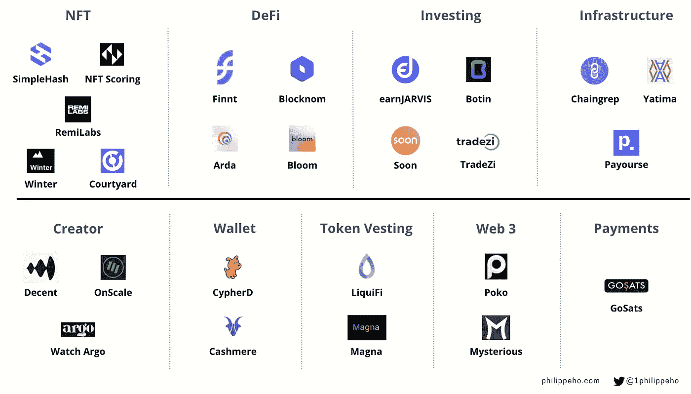

# YC W22 值得关注的 26 家加密初创公司

> 原文：<https://medium.com/coinmonks/26-crypto-startups-to-watch-from-yc-w22-e5c2024d4479?source=collection_archive---------34----------------------->

Y Combinator 在过去的两天里举办了第 34 次演示日，展示了 414 批创业公司中一半以上的创始人。

以下是 26 家专注于加密领域的初创公司:

Source: Y Combinator

# **NFT:**

**简单散列**:【https://simplehash.com/】T4

**https://nftscoring.com/trending**

**雷米拉布**:[https://www.remilabs.xyz/](https://www.remilabs.xyz/)

**庭院**:[https://courtyard.io/](https://courtyard.io/)

**冬天**:[https://www.usewinter.com/](https://www.usewinter.com/)

# **DeFi:**

芬特:[https://www.finnt.com/](https://www.finnt.com/)

阿尔达:[https://www.arda.finance/](https://www.arda.finance/)

**block nom:**https://www.blocknom.com/

**绽放:**https://withbloom.com/

# **投资:**

【https://tradezi.vn/】TradeZi:T44

**波坦:**[https://botin.app/](https://botin.app/)

恩贾维斯:[https://earnjarvis.com/](https://earnjarvis.com/)

**很快:**https://www.soon.app/

# **基础设施:**

**chain grep:**https://chaingrep.com/

**亚提玛:**https://github.com/yatima-inc

**军饷:**[https://www.payourse.com/](https://www.payourse.com/)

# **制单人:**

**体面:**【https://beta.decent.xyz/】T2

**观看蓉城:**[https://watchargo.com/](https://watchargo.com/)

**按比例:**[https://www.onscale.app/](https://www.onscale.app/)

# **钱包:**

**羊绒:**[https://www.cashmere.finance/](https://www.cashmere.finance/)

**赛佛:**[https://cypherd.io/](https://cypherd.io/)

# **代币归属:**

**利基萨:**[https://www.liquifi.finance/](https://www.liquifi.finance/)

**麦格纳:**https://www.magna.so/

# **网络 3:**

**https://www.poko.fund/**[波科](https://www.poko.fund/)

**神秘:**[https://www.mysterious.io/](https://www.mysterious.io/)

# **支付:**

**戈萨:**[https://gosats.io/](https://gosats.io/)

# 反馈

让我知道你的想法[在这里](https://www.philippeho.com/contact)并且在[推特](https://twitter.com/1philippeho)上关注我！

> 加入 Coinmonks [电报频道](https://t.me/coincodecap)和 [Youtube 频道](https://www.youtube.com/c/coinmonks/videos)了解加密交易和投资

# 另外，阅读

*   [3 商业评论](/coinmonks/3commas-review-an-excellent-crypto-trading-bot-2020-1313a58bec92) | [Pionex 评论](https://coincodecap.com/pionex-review-exchange-with-crypto-trading-bot) | [Coinrule 评论](/coinmonks/coinrule-review-2021-a-beginner-friendly-crypto-trading-bot-daf0504848ba)
*   [莱杰 vs Ngrave](/coinmonks/ledger-vs-ngrave-zero-7e40f0c1d694) | [莱杰 nano s vs x](/coinmonks/ledger-nano-s-vs-x-battery-hardware-price-storage-59a6663fe3b0) | [币安评论](/coinmonks/binance-review-ee10d3bf3b6e)
*   [Bybit Exchange 评论](/coinmonks/bybit-exchange-review-dbd570019b71) | [Bityard 评论](https://coincodecap.com/bityard-reivew) | [Jet-Bot 评论](https://coincodecap.com/jet-bot-review)
*   [3 commas vs crypto hopper](/coinmonks/3commas-vs-pionex-vs-cryptohopper-best-crypto-bot-6a98d2baa203)|[赚取加密利息](/coinmonks/earn-crypto-interest-b10b810fdda3)
*   最好的比特币[硬件钱包](/coinmonks/hardware-wallets-dfa1211730c6) | [BitBox02 回顾](/coinmonks/bitbox02-review-your-swiss-bitcoin-hardware-wallet-c36c88fff29)