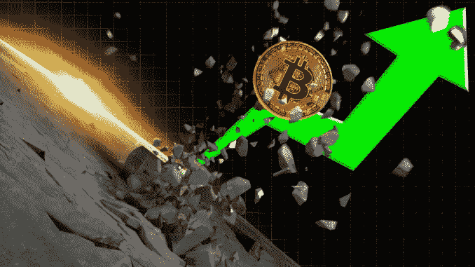

# 28/03 市场展望

> 原文：<https://medium.com/coinmonks/28-03-market-outlook-99c0f95b60db?source=collection_archive---------79----------------------->

3 月 26 日，我们终于突破了 46K 水平，这是自 1 月份跌破以来的一大阻力点

看起来这个迷你熊市或一些人喜欢称之为中期循环积累区现在终于结束了，比特币回到了 12 月底的水平。

我在以前的一篇文章中说过，当我们越过 46K 水平并把它作为支撑时…