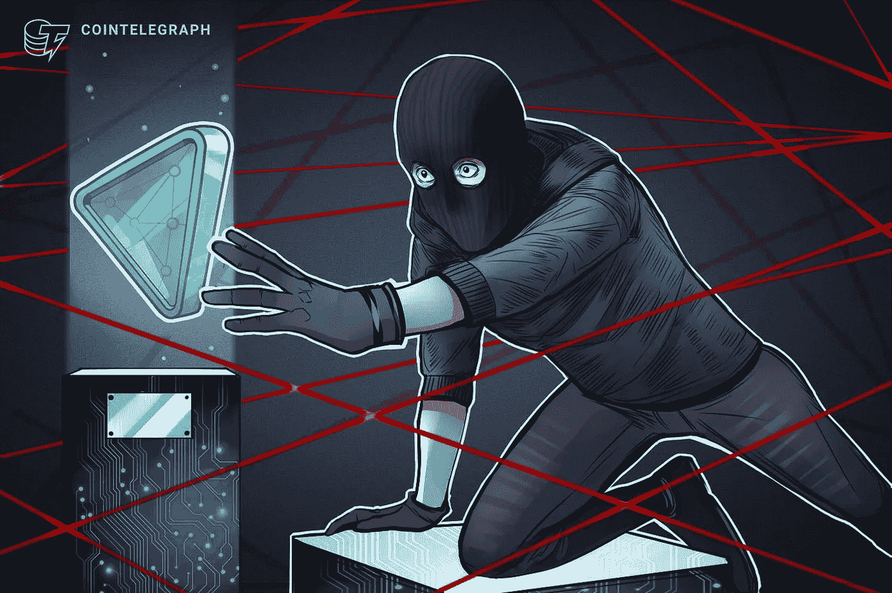

# 29 月鸟(NFT)被盗点击一个坏的链接

> 原文：<https://medium.com/coinmonks/29-moonbirds-nfts-were-stolen-by-clicking-a-bad-link-c062a3e18b70?source=collection_archive---------53----------------------->

一名证据集体成员成为一场骗局的受害者，这场骗局导致他们丢失了 29 只极其珍贵的以太坊月鸟。Cirrus 周三早上在 Twitter 上表示，受害者在点击了骗子分享的恶意链接后，损失了 29 个月鸟不可伪造令牌(NFT)，价值 150 万美元。

一位推特名人和 NFT·霍尔德·多尔声称，所谓的罪犯已经被 crypto exchange 破解了一半，Proof Collective 和成员目前正在编写一份完整的报告提交给联邦调查局。

然而，另一名用户声称，当他试图在一笔交易上进行交易时，一名交易员坚持使用一个不名誉的“P2P”平台来完成交易。Sulphaxyz 证实，他也遇到了这种情况，并确认骗子是同一名罪犯。

作案者总共欺骗了多少受害者尚不清楚，但这是一个严酷的提醒，即使是最精明的 NFT 投资者也需要警惕骗子。

最近的加密骗局敲响了警钟，不可替代的令牌所有者在与第三方平台打交道时要小心，并正确检查其他人共享的任何东西，即使它们看起来值得信任。

> 加入 Coinmonks [电报频道](https://t.me/coincodecap)和 [Youtube 频道](https://www.youtube.com/c/coinmonks/videos)了解加密交易和投资

# 另外，阅读

*   [CoinDCX 点评](/coinmonks/coindcx-review-8444db3621a2) | [加密保证金交易交易所](https://coincodecap.com/crypto-margin-trading-exchanges)
*   [红狗赌场评论](https://coincodecap.com/red-dog-casino-review) | [Swyftx 评论](https://coincodecap.com/swyftx-review) | [CoinGate 评论](https://coincodecap.com/coingate-review)
*   [Bookmap 评论](https://coincodecap.com/bookmap-review-2021-best-trading-software) | [美国 5 大最佳加密交易所](https://coincodecap.com/crypto-exchange-usa)
*   [如何在 FTX 交易所交易期货](https://coincodecap.com/ftx-futures-trading) | [OKEx vs 币安](https://coincodecap.com/okex-vs-binance)
*   [CoinLoan 评论](https://coincodecap.com/coinloan-review) | [YouHodler 评论](/coinmonks/youhodler-4-easy-ways-to-make-money-98969b9689f2) | [BlockFi 评论](https://coincodecap.com/blockfi-review)
*   [XT.COM 评论](https://coincodecap.com/profittradingapp-for-binance) | [币安评论](https://coincodecap.com/xt-com-review)