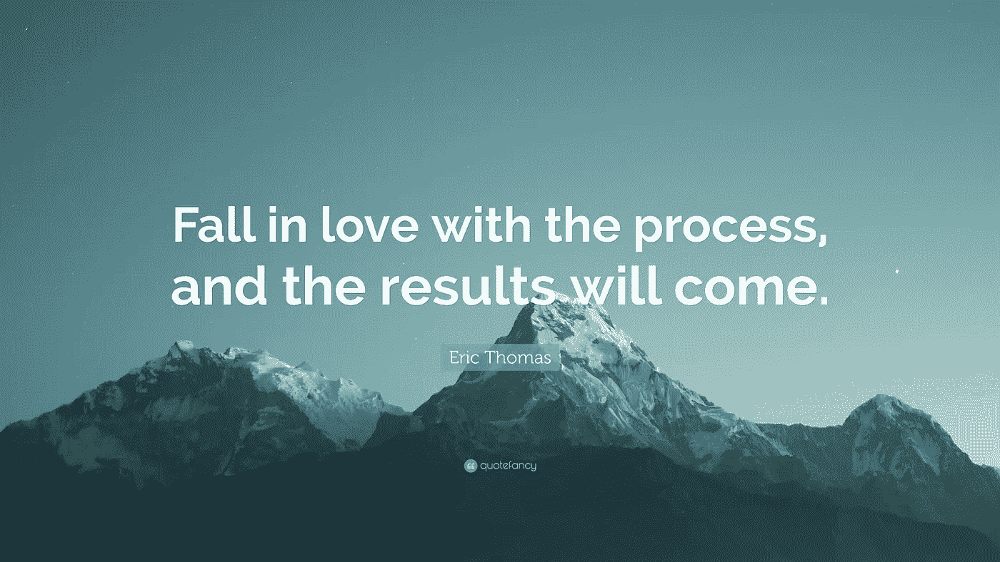
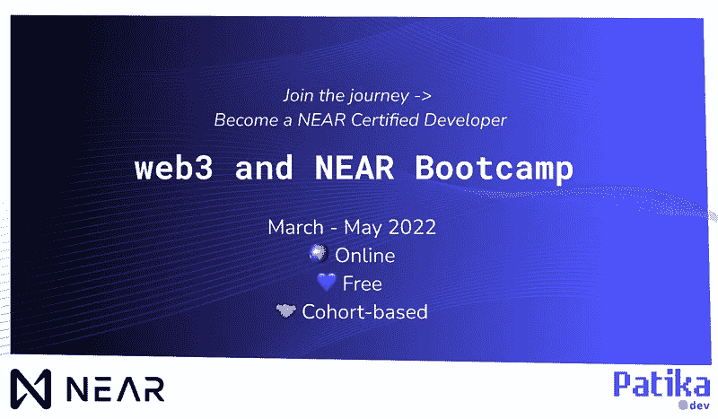
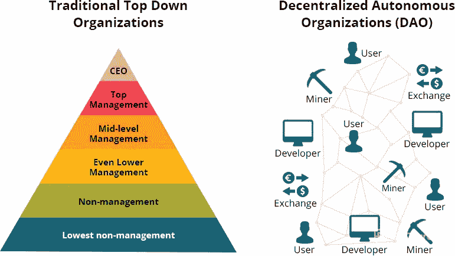
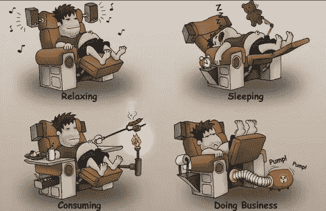
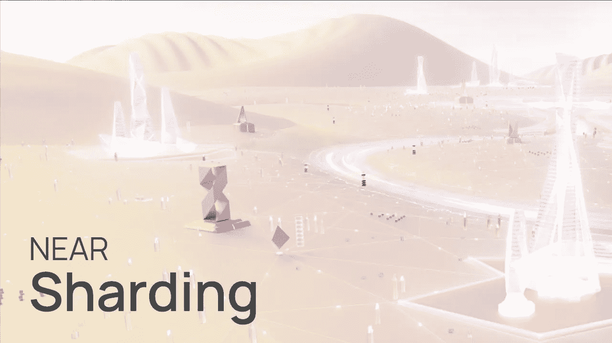

# Web 3.0 技术一瞥&近协议

> 原文：<https://medium.com/coinmonks/2nd-life-from-teaching-to-becoming-a-near-certified-software-developer-via-patika-dev-e5e19662f1ee?source=collection_archive---------27----------------------->


Illustration by pixabay

乍一看，我的故事听起来可能有点不寻常。事实上，我是一名讲师，在一所大学教授学术写作和阅读理解技巧的课程。然而，自 2019 年以来，我同时担任前端开发人员。没错。我有两份完全不同的工作，自然，我很忙，但我并不觉得不堪重负。这是为什么呢？嗯，我想原因是我不喜欢工作，因为当我从零开始创造任何东西并在这个过程中学习新东西时，我处于一种完全的流动状态。[米哈里·契克森米哈](https://www.ted.com/talks/mihaly_csikszentmihalyi_flow_the_secret_to_happiness)博士，这个时代最杰出的心理学家之一，将心流的状态描述为“在一项活动中迷失自我，因为它在大脑中创造了极度的快乐”。这正是我的遭遇。不要误解我。我也喜欢教书。然而，甚至没有意识到，这个我最初认为只是爱好的新活动已经变成了我真正的爱好。问题是，我一直对电脑着迷，[人工智能产品](https://www.information-age.com/potential-artificial-intelligence-healthcare-123473784/)的潜力从未停止过让我兴奋，但我从未想过这种迷恋会帮助我在科技世界开始我的第二职业生涯。

让我倒回去一点。这一切都始于罗宾·麦克弗森的一段鼓舞人心的 YouTube 视频[,他是一位勤奋的多语者。在那段视频中，他试图清晰地讲述自己的旅程，讲述自己最初是如何因几起不幸事件而无家可归，然后最终成为一名自学成才的软件开发人员，拥有自己的应用程序。我记得我被这个壮观的故事迷住了，我对自己说:“为什么不呢？我一直对科技情有独钟。也许，我应该尝试一下“编码”。试试也无妨。”](https://www.youtube.com/watch?v=afW83ClVkIU)

几年前，几乎不可能即时获得高质量的资源和真正的知识。自学成才的人在复杂的领域工作，从事复杂的项目，需要更高层次的思维技能，这种情况如何？免费培训/教育计划？不会吧！那些在当时也是毫无疑问的。由于获取相关资料既困难又昂贵，我们过去从未遇到过如此多才多艺的人处理他们自己的教育需求。然而，在当今世界，情况不再如此。这就是我通过上述视频再次意识到的。记得曾经著名的商业口号；“不可能什么都不是！”？嗯，对于我们今天周围的所有这些令人兴奋的技术设备、方便的软件程序、它们的可访问性和全新的认知学习方法来说，尤其如此。我感觉我们——智人/现代人——正处在进化成升级版的边缘。根据这些发展，也许传统意义上的学校在不久的将来会被淘汰。IBM 的报告显示，尽管结果糟糕，甚至疫情也加快了数字化转型。简而言之，一切都在飞速变化。


Homo sapiens / Modern Human Beings & Technology (Illustration by pexels)

目前，如果你真的渴望某样东西，并渴望在这条道路上采取必要的步骤，那么成功迟早会属于你。牢记这句格言，我开始自学编程，因为如果选择了正确的资源，互联网可以成为一片绿洲。我跟随像我一样的人的路线图，专注于掌握关于 HTML5、CSS3、SASS 以及最重要的 JavaScript 的基础知识，以便能够设计出有意义且实用的产品。我通过 Udemy ( [Jonas Schmedtmann](https://www.udemy.com/user/jonasschmedtmann/) 、[柯尔特·斯蒂尔](https://www.udemy.com/user/coltsteele/)、[马克西米利安·施瓦茨缪勒](https://www.udemy.com/user/maximilian-schwarzmuller/)、[约翰·斯米尔加](https://www.udemy.com/user/janis-smilga-3/))、哈佛大学 CS50 计算机科学导论课程([大卫·J·马兰教授](https://pll.harvard.edu/course/cs50-introduction-computer-science?delta=0))和其他一些推荐平台([韦斯·博斯](https://wesbos.com/)、[阿妮娅·库博](https://www.youtube.com/channel/UC5DNytAJ6_FISueUfzZCVsw))认识的那些了不起的老师们，让这段艰难而又愉快的旅程变得更加容易和可行。如你所知，开始总是最困难的，不用说，我作为一个新手也非常努力。


The path to self-improvement (Illustration by FreeCodeCamp)

像许多其他新手一样，我发现了 FreeCodeCamp 及其超级谦逊而又聪明的创始人昆西·拉森(Quincy Larson)[,他已经成为我的秘密导师，通过他的每周时事通讯，充满了非常有用的技巧、策略和无价的免费资源列表，使学习者能够不断发现编程的来龙去脉。我认真地认为他是技术导向教育领域的摇滚明星般的人物。不言而喻，这个了不起的人本可以通过他的公司赚很多钱。相反，他只是选择完全免费提供这种极其有价值的服务，这样每个人都可以获取知识，并产生有意义的项目和想法，以改善社会。由于捐赠和那些欣赏学习和帮助他人的快乐的人，FreeCodeCamp 正在成长。在我看来，像昆西这样的人才是我们世界更光明未来的真正建筑师。](https://www.freecodecamp.org/news/author/quincylarson/)

我不得不承认，尽管编程充满挑战，我还是立刻爱上了它。我认为自己是一个终身学习者，对于电脑来说，这是一个永无止境的循环。在这一行，学习永无止境，我认为这对那些热衷于塑造更好的自己的人来说是个好消息。



Illustration by QuoteFancy

我毕业于一所大学的计算机编程文凭课程，但要成为一名优秀的软件开发人员，你真的不需要像上面提到的程序员 Robin 那样，他目前在旧金山的谷歌担任软件工程师。世界各地都有像他这样独一无二的自学成才的开发人员。重要的是找到合适的资源和适合你并让你充满活力的特定学习技巧。只要记住‘一刀切’就行了，成为一名合格的开发人员/计算机程序员是一场马拉松，而不是短跑。


Illustration by pikwizard

耐心点，不断尝试不同的方法，直到找到自己的圣杯。显而易见，当前的数字革命已经带来了一个范式的转变。不管你的教育背景，你的年龄，社会规定的规则，或其他所谓的重要细节，你都可以尝试一些新的东西，并凭借毅力和意志力在这方面表现出色。你所需要做的就是意识到这个概念，“T0”神经可塑性，这是你的大脑自我重组的能力——简单来说就是改变。基本上，这个神奇的器官的功能就像一台有神经通路的电脑。[研究](https://positivepsychology.com/neuroplasticity/)表明学习新的事物会让身体更强壮、更健康。因此，古老的方法，“使用它或失去它”非常有道理。大多数时候，我们从来没有开始学习过程，因为我们只是认为我们做不到或者已经太晚了。[Joe Dispenza 博士](/the-write-purpose/how-to-transform-your-life-breaking-the-habit-of-being-yourself-by-joe-dispenza-bfbfa380e449)精辟地描述了这一情况:“事实上，我们已经习惯于相信各种不一定是真的事情——其中许多事情对我们的健康和幸福有负面影响。”


Illustration by Envato

自从这个过程开始以来，我已经尝试了无数的技术并使用了一系列的资源来征服编程，但是我想即使是一个有几十年经验的高级程序员也不能轻易说他/她已经完成了学习，因为在这个过程中有太多的东西需要探索，而且每一天都在快速变化。

在这篇文章中，我想特别提到土耳其的一个顶级训练营，它提供虚拟和面对面的课程和辅导。偶然间偶然知道他们的存在，决定看看现有的节目。


Illustration by pexels

令人难以置信的是，所有这些服务，尤其是国际服务，都是免费的。与其他极其昂贵的训练营不同，Patika.dev 实现的训练营确实都是免费的。很难相信，我知道。坦率地说，一开始我也认为这是一个骗局，但后来我发现他们通过赞助工作，他们说的一切都是合法的。在某种程度上，这个教育机构就像 FreeCodeCamp 的姐妹形式，因为两者都有类似的使命:教人们编程，而不收取他们巨额费用，并帮助他们发现自己的内在潜力。长话短说，我通过 Patika 申请了两个自定进度的国际项目。前者是“[近开发者课程](https://www.patika.dev/web3/near)，后者是“ [ZKU](https://zku.one/) / [零知识大学课程](https://www.patika.dev/web3/pre-training-for-zku-one-in-solidity)，两者都聚焦于区块链的 web 3.0 技术。幸运的是，我被这些训练营接受了。在这篇文章中，我打算给你提供第一个问题的信息，也就是成为一个[认证开发者](https://www.near.university/courses/near-certified-developer)的机会。



Collaboration between NEAR protocol & Patika.dev

在深入研究具体细节之前，让我澄清一下协议附近的[的任务是什么。它基本上是一家软件公司，旨在激励计算机网络运营一个平台，供开发者创建和推出去中心化的应用程序(](https://near.org/) [dApps](https://ethereum.org/en/dapps/) )。同样值得注意的是，NEAR Protocol 也是 T4 以太坊 2.0 的竞争对手，这是因为它的灵活性、用户友好性、免费培训计划，不仅面向开发者，也面向其他许多人。最后但并非最不重要的是，当谈到使用共享算法'[茄影](https://near.org/papers/nightshade/)'来确保 100% [去中心化](https://www.blockchain-council.org/blockchain/what-is-decentralization-in-blockchain/)的 NEAR 协议时，还有区块链上操作的[低成本](https://www.coindesk.com/learn/what-are-ethereum-gas-fees/)。简而言之，该公司的最终目标是推出一个更好、更值得信赖的互联网版本，高度重视用户的隐私。如果你不熟悉 [web 3.0 技术](https://www.techtarget.com/whatis/feature/Web-20-vs-Web-30-Whats-the-difference)，并且想知道互联网的“集中式”(web 2.0)和“分散式”(web 3.0)版本之间的区别，下面的视频可能会让你大致了解它们在本质上是如何运作的。



Differences between ‘Centralised’ & ‘Decentralised’ systems (Illustration by StreamlineHq)

NEAR protocol 的创始人真正相信，这种新的互联网模式可能会阻止大型企业操纵用户的私人数据，在不久的将来，第三方的参与以及佣金的支付将是不必要的。根据这条信息，可以说我们不会一直被无所不能的老大哥般的人物监视，因此我们最终将能够以安全的方式上网，而不必分享我们的个人数据，因为相关系统是通过先进的加密技术精心设计的，以实现这一梦想。这个场景听起来像是向“乌托邦之地”迈进了一步，我想这是我们目前生活的反乌托邦世界的对立面。



Human Beings’ never-ending Battle with Technology (Illustration by Envato)

显而易见，技术有利弊。在某些方面，人类正在经历一种中世纪时期([黑暗时代](https://www.historyhit.com/why-were-the-early-middle-ages-called-the-dark-ages/#:~:text=The%20'Dark%20Ages'%20were%20between,little%20scientific%20and%20cultural%20advancement.))，在这个时期，我们正在遭受极权主义政权、对机构失去信任以及令人上瘾的平台导致的严重集中问题。随着尖端技术工具的出现，我们大多数人不仅在身体上变得不活跃，而且在精神上也变得不活跃，因为我们在过去十年左右的时间里盲目地依赖技术工具。一些人认为，这种不受欢迎的情况部分归咎于中央集权制度。也就是说，我们不应该对未来失去希望。也许，上述问题仅仅是一种过渡时期的使者，这种过渡时期可能最终导致一个类似[文艺复兴](https://www.britannica.com/topic/history-of-Europe/The-idea-of-the-Middle-Ages)的时期的诞生，在这个时期，人类将不断进化并发现自己的真正潜力。如果去中心化的系统变得普遍，并且它们的价值被各行各业的人所欣赏，这是可能发生的。另一方面，也很难彻底预测这种新模式是否会成为每个人的新现实。话虽如此，但有一点是肯定的。在我看来，他们(他们的对手)为把世界变成一个更美好、更安全的地方所做的努力是值得称赞的。

这就是我对通过 Patika.dev 申请的“近开发者课程”感兴趣的原因。在训练营期间，参与者/开发者非常努力地计划和部署特定的预演产品(dApps 软件项目，从长远来看，这些项目可能是 web 3.0 技术的一部分。我们有机会学习智能合约的重要性，并很快了解了 AssemblyScript 编程语言的基础，这是 typescript 的一种变体。

在 NEAR 协议中，部署[智能触点](https://www.simplilearn.com/tutorials/blockchain-tutorial/what-is-smart-contract)，这是区块链上安全的基石/额外层，可以通过[汇编脚本](https://www.assemblyscript.org/)或 [Rust](https://stackoverflow.blog/2020/01/20/what-is-rust-and-why-is-it-so-popular/) 编程语言来实现。我们被告知，尽管第二种方法有很多优点，但与第一种相比，它的学习曲线更长；因此，程序中的大多数开发人员都使用 AssemblyScript。顺便说一下，虽然 NEAR 选择了上述编程语言，但也可以通过另一种称为 solidity 的编程语言在区块链上创建智能合约，这种编程语言被认为是一些其他语言(Java、JavaScript、Rust 和 C+)的混合。我有机会通过一个名为 [Crypto Zombies](https://cryptozombies.io/) 的有趣网站来研究和审视‘solidity ’,这个网站让学习变得非常有趣。



NEAR Protocol’s Advanced Technological Systems

所以大问题来了。作为一名开发人员，你能从中赚钱吗？NEAR protocol 上有没有非技术类的工作？对我来说，钱并不是一个决定性的因素，因为仅仅通过挣钱是不可能达到“心流”状态的。诚然，这很重要，但只是在某种程度上。因此，我想它应该更像是一个副产品。请记住，如果你鄙视你所做的事情，你的生活将无法忍受，富裕最终将完全没有意义，所以仅仅因为经济收益而参与编程不是一个好主意。然而，在他们的 dApp 原型的批准过程之后，当然有各种各样的职业机会呈现给新的认证开发者。公司为[批准的项目](https://www.near.university/earn/grants)提供[资助&奖学金/资助项目](https://near.org/grants/)(访问[论坛](https://gov.near.org/t/about-the-fellowships-category/12857)了解一些项目创意)。只要你让 NEAR protocol 相信你未来的项目很可能会成功，那么对于这个已经确认的项目，可能就没有真正的财政支持限制。有趣的是。如果你有非技术背景和工作的朋友，只需传播消息，因为该公司明确欢迎企业家、设计师、作家、研究人员、艺术家、营销人员甚至教师提供的其他[项目。](https://www.near.university/earn/fellowship)

这是对我整个旅程的总结。学习新技术和掌握关于高要求编程语言的本质细节有时会令人不知所措，并且失去动力，因为作为一名程序员也相当于一直在处理 bug。我第一次直接面对这个事实时，感到非常沮丧。我正在处理一个项目，需要一些 JavaScript 技巧。一开始一切都很顺利，但后来突然之间，代码不能正常工作了。我记得我一整天都在看着黑屏，试图找出哪里出了问题，感到沮丧，仅仅几个小时后，我终于能够意识到看似微小的语法问题——在某种程度上——变成了一只准备生吞我的巨大霸王龙。


Appearances can sometimes be deceiving especially in the tech world. (Illustration by depositphotos)

一路上，我相信我已经想出了一些应对机制来解决这种令人衰弱的焦虑和失望，这种焦虑和失望甚至可能导致新人完全退出冒险。


221B Baker Street (Picture by imdb)

如果你和我一样迷上了谜题，如果史上最伟大的侦探夏洛克·福尔摩斯是你童年的英雄之一，那么你最好找到一种方法，让你头脑中那个不断对你大喊大叫的声音安静下来；“你不能这么做！”不要忘记忽略你周围的反对者/能量吸血鬼。相信我，当你找到问题/ bug 的根源时，你真的会感觉自己像“夏洛克”,因为肾上腺素的激增会让你感到神清气爽，充满活力，完全沉浸在当下。这就是编程的美妙之处，尽管它天生就是一条崎岖不平的路。

我知道无论我学什么，我都将永远是一名学生，我会享受旅程的每一分钟。

祝☘️一切顺利

```
var newLife= {
  field: "Technology",
  firstCondition: "Work Hard",
  secondCondition: "Embrace Failure & Try again"
}; “I have not failed. I’ve just found 10,000 ways that won’t work.” – **Thomas A. Edison**
```

> 加入 Coinmonks [电报频道](https://t.me/coincodecap)和 [Youtube 频道](https://www.youtube.com/c/coinmonks/videos)了解加密交易和投资

# 另外，阅读

*   [德国最佳加密交易所](https://coincodecap.com/crypto-exchanges-in-germany) | [Arbitrum:第二层解决方案](https://coincodecap.com/arbitrum)
*   [币安交易机器人](/coinmonks/binance-trading-bots-d0d57bb62c4c) | [OKEx 评论](/coinmonks/okex-review-6b369304110f) | [Atani 评论](https://coincodecap.com/atani-review)
*   [最佳加密交易信号电报](/coinmonks/best-crypto-signals-telegram-5785cdbc4b2b) | [MoonXBT 评论](/coinmonks/moonxbt-review-6e4ab26d037)
*   [如何在 Bitbns 上购买柴犬(SHIB)币？](https://coincodecap.com/buy-shiba-bitbns) | [购买弗洛基](https://coincodecap.com/buy-floki-inu-token)
*   [CoinFLEX 评论](https://coincodecap.com/coinflex-review) | [AEX 交易所评论](https://coincodecap.com/aex-exchange-review) | [UPbit 评论](https://coincodecap.com/upbit-review)
*   [十大最佳加密货币博客](https://coincodecap.com/best-cryptocurrency-blogs) | [YouHodler 评论](https://coincodecap.com/youhodler-review)