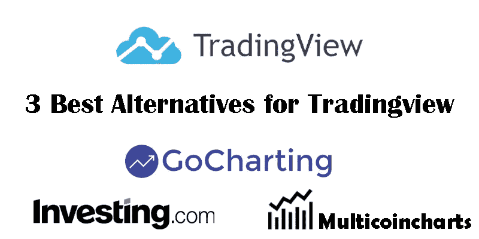
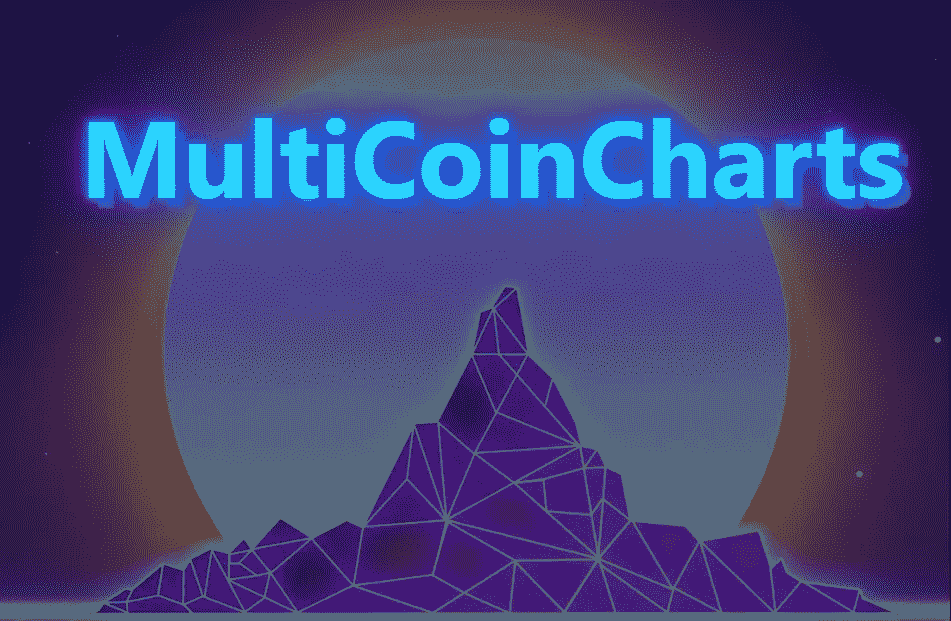

# 交易视图的 3 个最佳替代方案

> 原文：<https://medium.com/coinmonks/3-best-alternatives-for-tradingview-af44219fdde1?source=collection_archive---------41----------------------->

交易视图具有许多独特的功能，是所有交易者的最佳网站。该网站的功能包括图表部分、成员分析部分、过滤部分等。在这个网站上，你可以查看和使用其他人的分析。此外，在新闻部分，所有的基本和新的新闻将被更新。在这篇文章中，我将从大量的网站中向你介绍 3 个有用的网站，它们具有与交易视图相似的功能，但却是免费的。

1-GoCharting.com

14K +对和 90+交易所中的加密货币+ 2000 的高级和实时技术和技术图表及分析平台。在云上跟踪和存储你的技术图表，建立投资组合和壮观的列表，在社交媒体上分享你的工作。

GoCharting 是一个最先进的金融分析平台，提供世界级的交易和图表，专注于加密货币市场。它支持 14K +对和 90+交易所中的 2000 多种加密货币。绘图、警报、自动模式识别、实时新闻更新和博客收藏—全部在一个包中。使用壮观的列表在云中跟踪和存储您的技术图表，您的加密货币投资组合构建和跟踪，并在社交媒体上分享您的工作。

2-Investing.com

投资网站可以作为任何交易者的参考。这个网站涵盖了一个交易者的所有信息需求，并帮助你获得最新的内容和文章。在这个网站上，有货币对和股票的即时新闻。这个网站的用户部分也为交易者创造了一个讨论和交流的空间，是交易者的一种社交网络。

Investing.com 平台成立于 2007 年。与传统经纪人不同，投资是一个金融门户，在全球七个地方拥有 250 多名员工。Investing.com 是当今世界三大最成功的金融门户之一。该网站每月可为超过 2100 万用户提供服务，并在全球范围内提供超过 1.8 亿次会话。由于该平台的全球性活动和应用，其服务以 44 种不同的语言提供。例如，服务提供德语、英语、意大利语、法语、波兰语和…

除了广泛的产品之外，所提供的工具通常在选择合适的提供商时也起着重要的作用。然而，客户希望利用有用的专业工具和网站的其他功能。在 Investing.com，交易者有很多不同的工具可以使用。其中有技术工具，投资工具等等。

3-Multicoincharts.com

Multicoincharts 是 tradingview 的另一个好选择。在这个网站上，你可以通过实时图表和价格数据轻松监控所有你喜欢的加密货币。比特币(BTC)、以太坊(ETH)、DogeCoin (DOGE)等等。率先看到市场动向，在与 MCC 的竞争中领先一步。

Multicoincharts 支持你需要的所有好的交易所，如币安、比特币基地、库科恩、FTX 等等。不再有多个标签来跟踪多个交易所的加密货币价格的麻烦。

> 加入 Coinmonks [电报频道](https://t.me/coincodecap)和 [Youtube 频道](https://www.youtube.com/c/coinmonks/videos)了解加密交易和投资

# 另外，阅读

*   [最佳以太坊钱包](https://coincodecap.com/best-ethereum-wallets) | [电报上的加密货币机器人](https://coincodecap.com/telegram-crypto-bots)
*   [交易杠杆代币的最佳交易所](https://coincodecap.com/leveraged-token-exchanges)
*   [最佳加密分析或链上数据](https://coincodecap.com/blockchain-analytics) | [Bexplus 评论](https://coincodecap.com/bexplus-review)
*   [NFT 十大市场造币集锦](https://coincodecap.com/nft-marketplaces)
*   [AscendEx Staking](https://coincodecap.com/ascendex-staking)|[Bot Ocean Review](https://coincodecap.com/bot-ocean-review)|[最佳比特币钱包](https://coincodecap.com/bitcoin-wallets-india)
*   [Bitget 回顾](https://coincodecap.com/bitget-review)|[Gemini vs block fi](https://coincodecap.com/gemini-vs-blockfi)|[OKEx 期货交易](https://coincodecap.com/okex-futures-trading)
*   [美国最佳加密交易机器人](https://coincodecap.com/crypto-trading-bots-in-the-us) | [不断回顾](https://coincodecap.com/changelly-review)