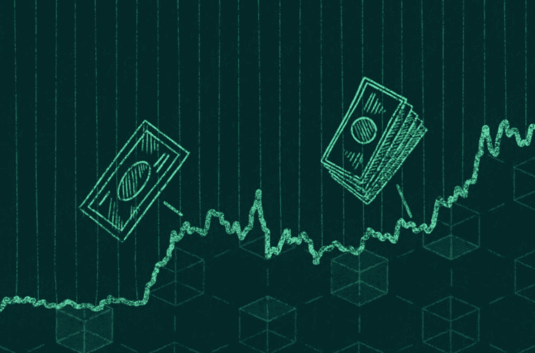
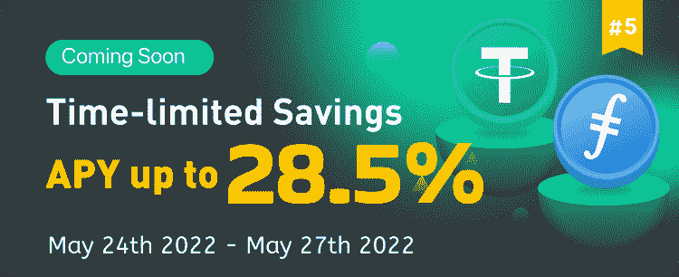
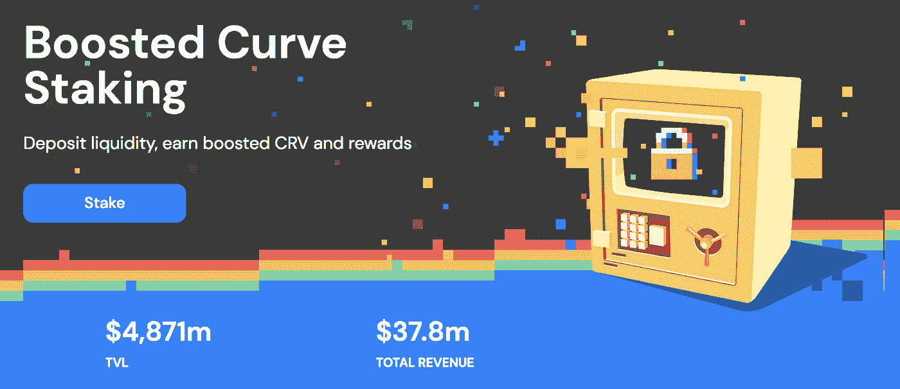
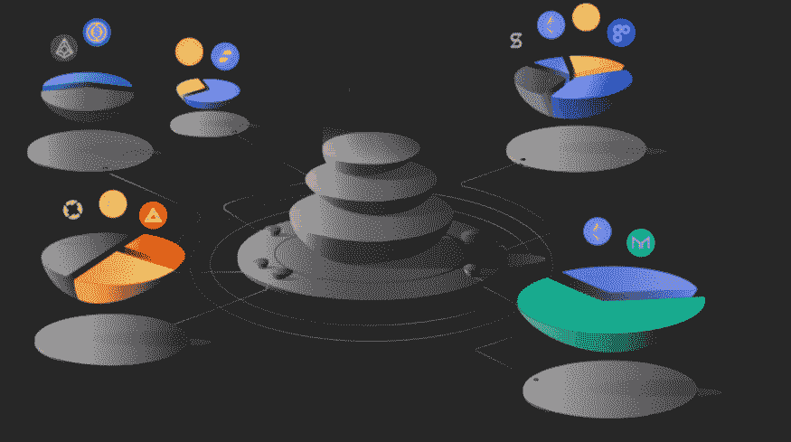

# 2022 年熊市的 3 个最佳加密投资

> 原文：<https://medium.com/coinmonks/3-best-crypto-investments-in-this-2022-bear-market-875b5417eb0?source=collection_archive---------51----------------------->

UST 崩盘后一周内，整个区块链 TVL 的资产从 1370 亿美元降至 850 亿美元。许多挂钩的加密货币，如 stETH-ETH，随着恐慌在整个系统中蔓延，逐渐脱离挂钩。尽管存在波动，但对于那些愿意承担风险的人来说，仍然有回报的机会。

在本文中，让我们深入探讨 3 个最具吸引力和风险调整后的加密货币投资机会，它们仍然适用于 ETH、BTC、FIL 和 stablecoins。

# **1。LuckyHash**

资产:USDT Filecoin

预期收益率:3.5%-90% APY

风险等级:中等风险

## 平台概述:

LuckyHash 是一家专门的加密货币增值服务提供商。它不仅提供云开采产品，还提供 USDT、Filecoin 和各种其他代币的固定/灵活存款。他们提供 30 天、90 天和 180 天的定期存款，这就是为什么他们的年利率在 3.5%到 90%之间。

LuckyHash 也在举办一个活动，在这个活动中，你可以获得免费的密码，[如果你有兴趣，可以随时加入](https://m.luckyhash.com/luckyticketspecial?utm_source=english&utm_medium=official)。

## **盈利策略:**

只需在 LuckyHash 上抵押代币即可赢取。

目前，LuckyHash 平台主要推广 FIL 和 USDT 两种主流加密货币的理财。LuckyHash 推出的限时理财产品中，有 30 天、90 天、180 天等不同的锁定期。锁定时间越长，回报率越高。

例如， **180 天 FIL 储蓄的 APY 为 28.5%，180 天 USDT 储蓄的 APY 为 19.5%。**此外，还提供高达 90% APY 的新用户专属产品。

LuckyHash 为定期存款提供丰厚的回报。它的 USDT 定期存款特别适合保守的投资者，因为 USDT 与美元挂钩，在熊市中不会有价格波动。

## **风险:**

在将资产存入 LuckyHash 之前，您应该了解几个主要风险。首先是流动性风险，因为储户将受到不同锁定期的限制。此外，LuckyHash 成立于 2021 年，与币安、比特币基地和 Bithumb 等顶级平台相比，它仍然是一个相对年轻的平台。

# **2。凸金融**

资产:美元

预期回报率:每年 8%-11%

风险等级:中等风险

## 平台概述:

Convex 是基于交易所流动性池曲线的盈利协议。我们很多人都知道，Curve 使用 veToken(投票托管令牌)模型。Curve 协议的本地治理令牌 CRV 的持有者可以锁定他们的 CRV 令牌，以换取非流动性、不可转让的 veCRV。当提供流动性时，veCRV 持有人可以获得“提升的”CRV 奖励(高达 2.5 倍)，这种提升与流动性提供者持有的 CRV 代币数量成正比。

许多曲线用户需要大量的 CRV 代币，以获得更大的“提升”CRV 奖励，这相当昂贵。考虑到这一点，Convex 正在向任何通过 Convex 持有 Curve LP 代币(无论是否为 veCRV)的 Curve 流动性提供商提供“提升的”CRV 奖励，以增加他们的收入。

## **盈利策略:**

在 Convex 上有许多农场，用户可以用他们的曲线 LP 代币来奖励曲线交易费、CRV 奖励和 CVX 奖励。目前最赚钱的三个农场是 D3 池(由费、阿路司得和马棚圈猪组成)、阿路司得-3CRV 池(由阿路司得、戴、马棚圈猪组成)和 3CRV 池(由、戴、马棚圈猪组成)。这三个资金池目前的收益率在 8%至 11%之间。

## **风险:**

尽管在 Curve 上提供稳定的 coin 流动性和在 Convex 上下注 Curve LP 代币降低了非永久性损失的风险(因为这些资产中有许多是相互挂钩的)，但用户仍应注意一些关键风险。首先，加入流动性池的先决条件之一是以相同的美元价值抵押多种代币。如果市场对池中的一个令牌失去信心，曲线池中的资产可能会变得不成比例。在这种情况下，流动性提供者可能无法收回他们的比例。此外，用户还面临两层智能合约的风险，凸型和曲线型。

# **3。平衡器**

资产:瑞士法郎，美元

预期回报率:每年 5-11%

风险等级:低风险

## 协议概述:

平衡器是一个分散的交换机。它是高度可定制的，因为它支持创建具有不同权重的多资产流动性池(即流动性池中的资产可以具有不同的权重)，而不像 Uniswap 和 Curve 等其他自动化做市商那样采用传统的等权重流动性池。

平衡器池有一个称为“金库”的额外机制，它使流动性池中的闲置资金能够被路由到其他协议(如借贷市场)，从而增加流动性提供商的收入。与曲线类似，平衡器使用 veToken 模型。BAL 持有者可以锁定他们的 BAL 以换取 veBAL 令牌，允许他们在提供流动性时获得“提升的”奖励。

## 盈利策略:

与 Curve 一样，总的来说，有许多流动性池，流动性提供者可以从中赚取收入，同时防止非永久性损失。这包括 bb-aUSDT-DAI-USDC 组合，目前收益率在 8-18%之间(取决于 LP“助推”的规模)。投资者可以从 Aave 获得交易费、BAL Token 和利息收入(来自于用 Aave 货币市场保存未使用的流动性，以进一步增加流动性提供者的回报)

其他理想的平衡流动性池包括 USDC-戴-USDT 池(回报率 5%-11%，取决于 veBAL 控股公司)和 wstETH-ETH 池(回报率 7%-11%)。然而，值得一提的是，wstETH-ETH 池目前不成比例——由 65%的 wstETH 和 35%的 ETH 组成。

## **风险:**

在平衡器上提供流动性的风险类似于在曲线上提供流动性的风险。除了智能合约风险，Balancer 的有限合伙人还面临流动性池中每项基础资产失衡的风险。此外，他们可能面临非永久性损失的风险。

# **结论:**

尽管目前密码行业的回报率有限，但仍有大量机会让投资者获得比传统市场更高的回报。资本在恐慌情绪中逃离加密市场，但无论谁留下来，都将继续获得回报。

> 加入 Coinmonks [电报频道](https://t.me/coincodecap)和 [Youtube 频道](https://www.youtube.com/c/coinmonks/videos)了解加密交易和投资

# 另外，阅读

*   [3 商业评论](/coinmonks/3commas-review-an-excellent-crypto-trading-bot-2020-1313a58bec92) | [Pionex 评论](https://coincodecap.com/pionex-review-exchange-with-crypto-trading-bot) | [Coinrule 评论](/coinmonks/coinrule-review-2021-a-beginner-friendly-crypto-trading-bot-daf0504848ba)
*   [莱杰 vs n rave](/coinmonks/ledger-vs-ngrave-zero-7e40f0c1d694)|[莱杰 nano s vs x](/coinmonks/ledger-nano-s-vs-x-battery-hardware-price-storage-59a6663fe3b0) | [币安评论](/coinmonks/binance-review-ee10d3bf3b6e)
*   [Bybit Exchange 评论](/coinmonks/bybit-exchange-review-dbd570019b71) | [Bityard 评论](https://coincodecap.com/bityard-reivew) | [Jet-Bot 评论](https://coincodecap.com/jet-bot-review)
*   [3 commas vs Cryptohopper](/coinmonks/3commas-vs-pionex-vs-cryptohopper-best-crypto-bot-6a98d2baa203)|[赚取加密利息](/coinmonks/earn-crypto-interest-b10b810fdda3)
*   最好的比特币[硬件钱包](/coinmonks/hardware-wallets-dfa1211730c6) | [BitBox02 回顾](/coinmonks/bitbox02-review-your-swiss-bitcoin-hardware-wallet-c36c88fff29)
*   [block fi vs Celsius](/coinmonks/blockfi-vs-celsius-vs-hodlnaut-8a1cc8c26630)|[Hodlnaut 审核](/coinmonks/hodlnaut-review-best-way-to-hodl-is-to-earn-interest-on-your-bitcoin-6658a8c19edf) | [KuCoin 审核](https://coincodecap.com/kucoin-review)