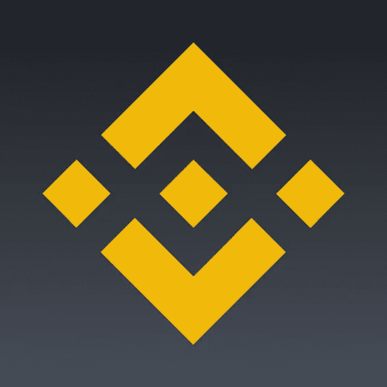
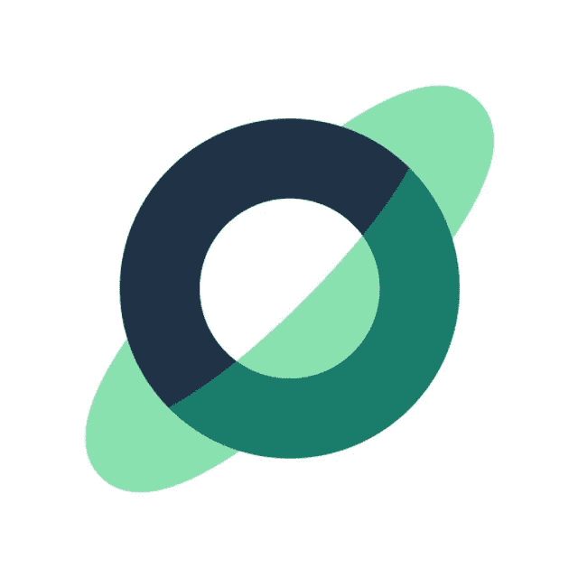

# 3 家最佳加密货币经纪商

> 原文：<https://medium.com/coinmonks/3-best-cryptocurrency-brokers-1a2c5f93bebe?source=collection_archive---------100----------------------->

在本文中，我将向你展示三个最好的经纪人，让你快速高效地投资加密货币。

实际上，经纪人或交易所扮演着与传统经纪公司非常相似的角色。它们作为一个数字平台，充当比特币(BTC)、以太坊(ETH)、莱特币(LTC)等加密货币的购买、出售和交换中介。

自 2008 年比特币诞生以来，它们如雨后春笋般涌现，形成了一系列新的公司、产品和工作岗位。比特币是第一个在区块链系统上运行的加密活动，简言之，该系统的功能是一个分散记录或数据的大型网络。

交易所不提供股票，而是在其平台上提供各种加密货币。有些还提供其他服务，如加密支付解决方案。他们每天 24 小时营业，并根据所提供的服务收取费用。

**1 —币安**

币安是世界上最大的加密货币经纪公司，也是历史最悠久的公司之一，于 2017 年在中国成立。该平台提供 100 多种不同的加密货币投资选项。被认为是产品目录和性能方面的全球领导者。

该平台的客户遍布 190 多个国家，当它推出区块链生态系统时，它的名声更加响亮。此外，它开发了自己的本土令牌，币安硬币，缩写为 BNB。它在币安生态系统中有多种用途。值得去了解！

可用加密货币
376
最低投资
$5
提现费
$ 2.60
主动费
0.10%
被动费率
0.10%
应用评级(截至 2022 年 3 月)
3.2/5 (Google Play)和 4.8/5 (App Store)
总体 AR 评级(截至 2022 年 3 月)
7，

**2 — NovaDAX**

作为一家出现在亚洲市场的公司，NovaDAX 已经在全球多个国家开展业务，为加密货币交易创造了必要的条件。根据 Cointrader Monitor 的数据，该公司在 2021 年 4 月被搜索次数排名第二。

作为一个在市场上声名狼藉的新来者，有 114 种加密货币可供交易。此外，它的费用因订阅而异，也是推出预付费信用卡的最佳经纪商之一，拥有免费的数字账户。
可用加密货币
114
最低投资额
5 美元
提现费
8.90 美元+金额的 0.5%
主动费
0.50%
被动费
0.30%
应用评级(截至 2022 年 3 月)
4.4/5 (Google Play)和 4.5/5 (App Store)
总体 AR 评级(at

**3 —门。IO**

大门。是林涵在 2013 年创立的。该平台由 Gate 技术公司运营。

Gate.io 的位置在哪里？Gate.io exchange 的总部位于大芝加哥地区(美国马萨诸塞州)。该组织目前的公共地位是私人的。Gate.io 交易所由总部位于韩国首尔的私人投资公司 5 BLOCKS CAPITAL 资助。

Gate.io 上有 180 种不同的货币和约 400 个加密货币市场。

Gate.io 提供了以三种方式对硬币进行排序的能力:标准、符号和市值。投资者或交易者可以找到最常见的硬币，如比特币、Ripple、以太坊、Stellar、Tether、BinanceCoin，以及其他不太常见的硬币，如 Atonomi、Traxia、Endor、Lino。可以肯定的是，Gate.io 提供了多种货币可供选择和交易。

记住，知识没有实践等于什么都没有，找券商，多了解他们的信息！

这篇文章在某种程度上帮助了你？我需要你的评价我是一个喜欢帮助像你这样的人的作家，你的激励帮助我继续下去我仍然很小但由于你的阅读我已经认为自己是你忠实的朋友哈哈，评价我来帮助我！

> 加入 Coinmonks [电报频道](https://t.me/coincodecap)和 [Youtube 频道](https://www.youtube.com/c/coinmonks/videos)了解加密交易和投资

# 另外，阅读

*   [WazirX vs coin dcx vs bit bns](/coinmonks/wazirx-vs-coindcx-vs-bitbns-149f4f19a2f1)|[block fi vs coin loan vs Nexo](/coinmonks/blockfi-vs-coinloan-vs-nexo-cb624635230d)
*   [本地比特币评论](/coinmonks/localbitcoins-review-6cc001c6ed56) | [加密货币储蓄账户](https://coincodecap.com/cryptocurrency-savings-accounts)
*   什么是融资融券交易
*   [支持卡审核](https://coincodecap.com/uphold-card-review) | [信任钱包 vs MetaMask](https://coincodecap.com/trust-wallet-vs-metamask)
*   [Exness 回顾](https://coincodecap.com/exness-review)|[moon xbt Vs bit get Vs Bingbon](https://coincodecap.com/bingbon-vs-bitget-vs-moonxbt)