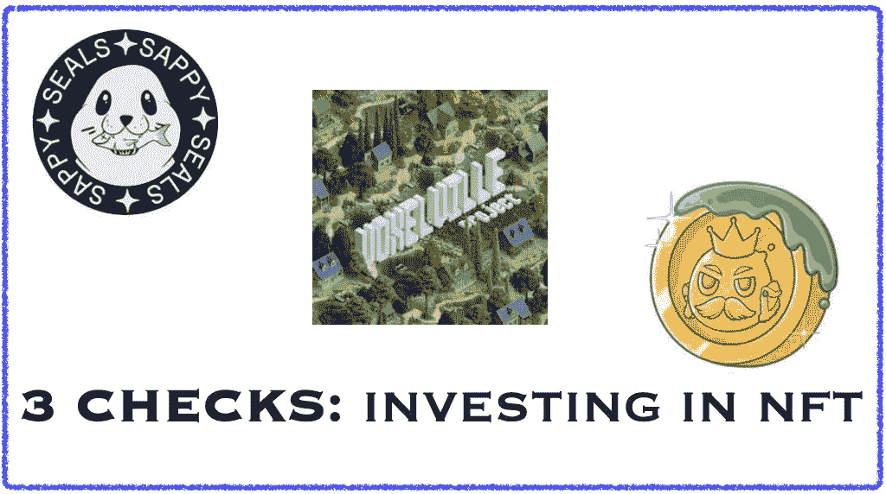

# 3 检查:在投资 NFTS 之前

> 原文：<https://medium.com/coinmonks/3-checks-before-investing-in-nfts-82866b04c2e5?source=collection_archive---------39----------------------->

由于加密朋克和无聊猿游艇俱乐部(BAYC)收藏的不可思议的受欢迎程度，自从它们进入主流媒体以来，NFT 越来越受欢迎。

加密朋克是一个免费的铸币厂，BAYC 的铸币价格为 0.08 ETH。那些明智地持有这些 NFT 的人在几个月内就获得了改变生活的收益。这也导致了新 NFT 收集和爆炸…