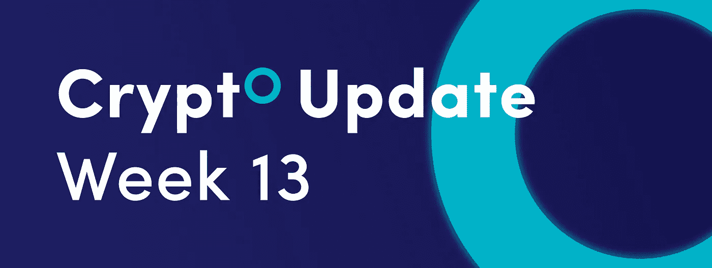
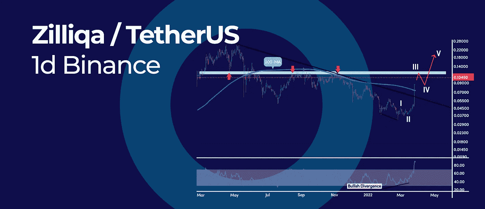
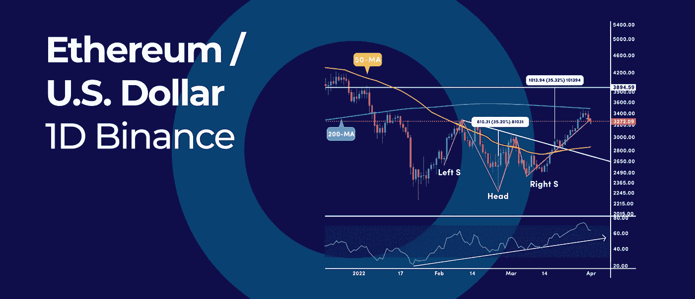
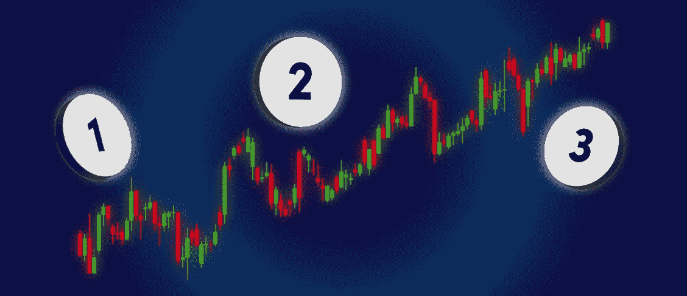
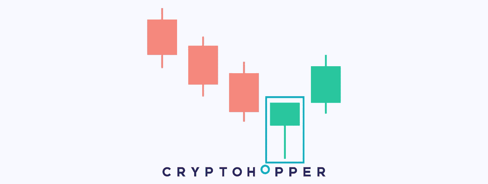

# 3 加密图表模式规则围绕|和本周加密更新中的更多内容构建。

> 原文：<https://medium.com/coinmonks/3-crypto-chart-pattern-rules-to-build-around-and-more-in-this-weeks-crypto-update-faa8663bb542?source=collection_archive---------60----------------------->

Weeks Crypto Update.

*   Zilliqa 现在是历史上最超买的，这意味着什么？
*   你需要看看这个以太坊的倒头肩底图案
*   围绕 3 个加密图表模式规则构建

## Zilliqa 现在是历史上最超买的，这意味着什么？

Zilliqa is Now Most Overbought in History, What it means?

Zilliqa (ZIL)是最好的加密，在过去的 7 天里有超过 131%的收益。继上涨 99%之后，ZIL 还在 3 月 26 日创造了历史上最大的单日涨幅。然而，这种价格发展已经将 RSI 振荡指标送至历史最高水平。

下面，我们将看看几个技术因素，以便更好地理解幕后发生的事情。

## RSI 振荡器

目前历史最高的 RSI 读数为 89.68，超过了 2020 年 2 月达到的历史最高水平。当价格达到极端超买读数时，我们不能仅仅依赖 RSI 作为一个独立的工具。

在这方面，以下是一些值得考虑的乐观技术发展:

*   我们打破了连接历史高点和后续峰值的向下倾斜趋势线
*   我们突破了 200 天简单移动平均线
*   当前的底部是看涨背离信号的结果
*   当前的反弹可能会以五个艾略特波浪序列展开

## 200 天简单移动平均线

这是 200 日均线自 2021 年 5 月跌破以来的首次重大突破。虽然我们在 2021 年有两次试图突破 200 天均线失败，但这一次，突破是非常强大的。

## 艾略特波浪分析

从 2 月 24 日的低点反弹，我以 0.045 美元的高点结束，第二波的修正以 0.036 美元的低点结束。短期来看，第三波仍在进行中，并有可能在 0.12 美元阻力区附近见顶。

一旦我们在第三波见顶，我们可以期待第四波的回调，这应该给 RSI 振荡器一些时间来稳定。

## 你需要看看这个以太坊的倒头肩底图案

You Need to See This Ethereum Crocked Inverted Head & Shoulder Patten

以太坊(ETH)在日线图上做了一个倒头肩底形态，是本轮反弹的催化剂。然而，不同于传统的反转 H&S 模式，当前印在 ETH 日线图上的版本是“坏掉了”

## 头肩倒置模式

在技术分析中，这种“失败”的形态也被称为卡西莫多模式。不幸的是，这有点难以识别，因为头部不是模式的最低点。然而，这仍然是一个强大的熊市到牛市的反转信号。

ETH 的价格一旦走出颈线就加速上攻，但好消息是倒头肩顶目标并未达到。

价格目标是形态的高度，也就是头部最低点和颈线之间的差异，然后从颈线突破点向上投射。在我们的案例中，测量价格目标在 3900 美元左右。

## 200 天移动平均线

短期来看，ETH 的价格在关键的 200 天简单移动平均线处停滞不前。不过，200-SMA 和 50-SMA 之间的价格交易是潜在黄金交叉信号的早期迹象，也就是 50-SMA 在 200-SMA 上方的交叉，这是一个看涨的反转信号。

## 围绕 3 个加密图表模式规则构建

3 Crypto Chart Pattern Rules to Build Around

并非所有的图表模式都是一样的。要辨别低概率图表模式和高概率图表模式，你需要建立一个基础。

有三条规则可以用来分析任何价格行为模式。如果价格行为能够成功通过 3 条规则的测试，我们就有可能处理一个高概率的设置。

这里有三条规则:

1.  带大灯芯的烛台
2.  与附近的蜡烛相比，相对较大的蜡烛
3.  市场条件(趋势、范围或突破模式)

## 烛台灯芯

烛台的一个重要特征是灯芯。灯芯的尺寸只对蜡烛体和附近的蜡烛芯有意义。

例如，长烛台灯芯显示不仅仅是价格拒绝。当长灯芯是图表模式的一部分，在趋势的背景下，我们要注意，因为它标志着趋势的结束。

我们增加了一些烛台芯的例子来说明它们的重要性。

## 墓碑多奇

墓碑多奇是一根蜡烛代表的熊市反转模式。这种蜡烛有低，开放和关闭大约相同的价格，而较高的特点是一个长的上灯芯。正如在其他多奇模式中所解释的，Doji 是优柔寡断的模式。它们的形状决定了它们是否有更大的机会导致价格上涨或下跌。在这种情况下，多奇有一个长的上灯芯，这表明空头在市场上更多，价格更有可能下跌。因此，如果在自动策略中选择，这种模式在图表中出现时将发出卖出信号。

## 锤子

锤子是一根蜡烛形成的看涨反转形态。它的顶部有一个短的主体，下部有一个长的灯芯。也就是说，它的开启、关闭和最大值彼此非常接近。但是，最低也离他们比较远。通常在下跌趋势中发现，它的长下灯芯表明当它试图继续下跌时，需求强烈拒绝了价格。然后，表明在这个价格上需求是存在的，并且它可以扭转它的趋势。通常，锤子预示着向上趋势的反转或回调。因此，每当它出现在图表中，就暗示价格有可能上涨，可以解读为买入信号。此外，它可以很容易地与其他指标相结合，以加强切入点。

## 烛台价格范围

烛台价格区间是我们分析每个图表模式的第二个标准。各种各样的烛台是相对良好的价格行动的另一个迹象。

## 市场情况

当我们分析图表价格行为时，市场背景就是一切。只有当市场条件对我们的贸易模式有利时，我们才想进行贸易。例如，如果头肩底形态在盘整中形成，那就不是一个可靠的交易模式。头肩形态只有在上升趋势中形成时才有效。

**底线:**我们希望我们交易的价格行为在拿我们的钱冒险之前通过三原则测试。这些只是一般的指导方针，掌握价格行为交易需要一定的判断力。

订阅我们的媒体每周博客和更新。
在推特[上关注我们](https://twitter.com/cryptohopper) | [脸书](https://www.facebook.com/cryptohopper)|[Reddit](https://www.reddit.com/r/CryptoHopper/)|[insta gram](https://www.instagram.com/cryptohopper/?hl=nl)

在 [Cryptohopper](https://www.cryptohopper.com/) 开始交易！

> 加入 Coinmonks [电报频道](https://t.me/coincodecap)和 [Youtube 频道](https://www.youtube.com/c/coinmonks/videos)了解加密交易和投资

# 另外，阅读

*   [Bookmap 评论](https://coincodecap.com/bookmap-review-2021-best-trading-software) | [美国 5 大最佳加密交易所](https://coincodecap.com/crypto-exchange-usa)
*   最佳加密[硬件钱包](/coinmonks/hardware-wallets-dfa1211730c6) | [Bitbns 评论](/coinmonks/bitbns-review-38256a07e161)
*   [新加坡十大最佳加密交易所](https://coincodecap.com/crypto-exchange-in-singapore) | [购买 AXS](https://coincodecap.com/buy-axs-token)
*   [红狗赌场评论](https://coincodecap.com/red-dog-casino-review) | [Swyftx 评论](https://coincodecap.com/swyftx-review) | [CoinGate 评论](https://coincodecap.com/coingate-review)
*   [投资印度的最佳密码](https://coincodecap.com/best-crypto-to-invest-in-india-in-2021)|[WazirX P2P](https://coincodecap.com/wazirx-p2p)|[Hi Dollar Review](https://coincodecap.com/hi-dollar-review)