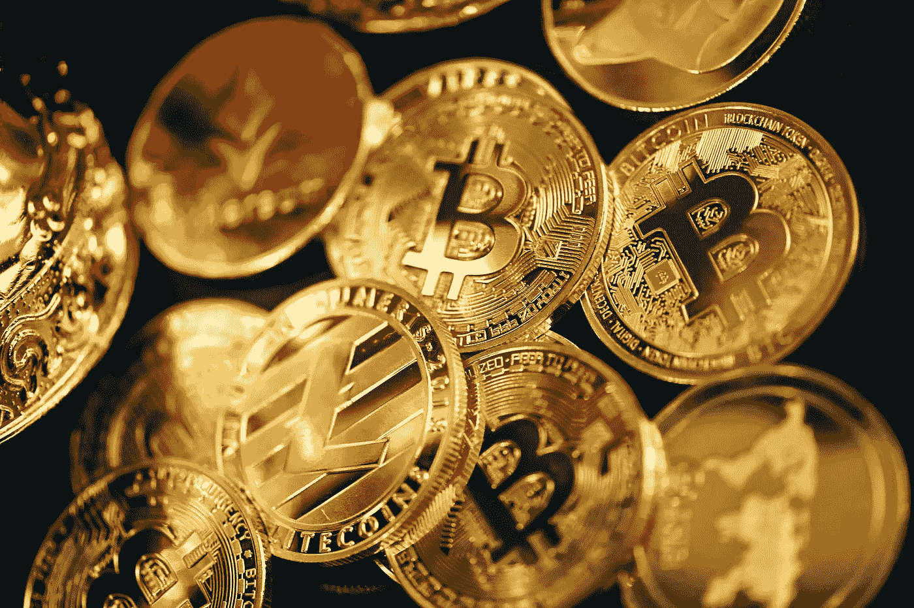

# 2022 年购买 3 个加密投资整合代币

> 原文：<https://medium.com/coinmonks/3-crypto-investment-consolidation-tokens-to-buy-in-2022-17b253e7140?source=collection_archive---------2----------------------->

Cryptocurrency is one of the most enticing investment options in today’s technology-driven culture. Photo by [Quantitatives](https://unsplash.com/@quantitatives?utm_source=unsplash&utm_medium=referral&utm_content=creditCopyText) on [Unsplash](https://unsplash.com/photos/vuvKdHmQYE8?utm_source=unsplash&utm_medium=referral&utm_content=creditCopyText)

一个人应该投资以确保自己现在和将来的财务安全。

它不仅能让你积累财富，而且它提供的回报率大于通货膨胀率。

在当今技术驱动的文化中，加密货币是最具吸引力的投资选择之一。

自诞生以来，加密货币行业一直以极快的速度发展。

为了从市场的波动中获利，数百万投资者正在关注总部位于区块链的加密货币，这些货币有可能在不久后获得实质性发展。

如果你正在寻找具有很大潜力的低成本加密货币，这篇文章适合你。

> 另请参见:[2022 年增长最快的 3 种加密货币](https://www.sammaiyaki.com/3-fastest-growing-cryptocurrency-in-2022-798db0f4b15b?source=user_profile---------4----------------------------)

以下是 2022 年投资的三个加密投资整合令牌:

# 加密投资合并令牌№1:索拉纳溶胶

T2 市值:11904003949 美元

**在 CMC 上的位置:** 9

**当前价格:** $34.76

顾名思义， [***索拉纳索尔***](https://coinmarketcap.com/currencies/solana/) 区块链是为迅捷的交易和确认而建造的。

虽然使用智能合约收取交易费用，但该公司声称其交易成本是市场上最低的。

音乐流媒体和金融服务只是这项技术众多应用中的两个。

今年的开始很艰难，遇到了很多挫折。仅一天时间，价格就从 34.77 美元降到了 34.33 美元。

比去年年底的 178.52 美元下降了 82.7%。

从 2021 年 11 月 7 日创下的 258.93 美元的历史高点，价格下跌了 88.1%。

这是一个非常困难的项目。在平均成本的基础上投资比特币可能是一个明智的选择。

即使价格下跌，如果市场情绪波动，买家也无法利用当前的市场条件。

从长远来看，允许一些不确定性会在接下来的几个月里带来财务回报。

> 此外，请参见:[睡觉时赚取 40%的加密费](https://www.sammaiyaki.com/earn-40-on-your-crypto-while-you-sleep-8e59f0431466?source=user_profile---------0----------------------------)

# 加密投资合并令牌№1: Cardano ADA

15，836，735，872 美元

**CMC 上的位置:** 7

当前价格: $0.4714

据一些人说， [***卡达诺阿达***](https://coinmarketcap.com/currencies/cardano/) 的平台比它的竞争对手更具扩展性、安全性和高效性。

自前一年以来，其平台已经能够管理智能合约和不可替代令牌(NFT)，这些令牌不能用于购买其他令牌。

此外，现在判断它是否会比以太坊更受欢迎还为时过早。

简而言之，比特币和以太坊有望从*“挖矿”*切换到*“股权证明”*来验证交易。

目前，比特币和以太坊使用*【挖掘】*来验证交易。如果发生这种情况，它可能会失去它的一个优势。

卡尔达诺有潜力产生可观的收入。

Cardano 已经准备好在智能合约和不可替代的代币(NFT)市场产生可观的利润。

今年，卡尔达诺已经损失了 67%的价值；接下来的几个月可以在经济上有所回报。

> 此外，请参见: [3 个不到 2 美元的最佳元宇宙密码，立即购买](https://www.sammaiyaki.com/3-best-metaverse-cryptos-under-2-to-buy-now-7b92b9fb9ed4?source=user_profile---------2----------------------------)

# 加密投资合并令牌№1:宇宙原子

2，105，159，705 美元

**CMC 上的位置:** 28

**现价:** $7.35

[***宇宙原子***](https://coinmarketcap.com/currencies/cosmos/) 是目前最有前景的数字资产之一。

如果你想抓住机会，你可以选择将 Cosmos 加入你的投资组合。

它逆当前市场趋势而行，表现出色。

通过建立独特的加密网络，Cosmos 平台促进了互操作性和定制化。

根据情况，使用开源软件连接这些网络可以显著降低速度和价格。

有一个中央宇宙中心，一个利益攸关的区块链，作为宇宙生态系统中所有区块链的储存库。

该平台的原生货币 ATOM 最近变得流行起来，是该系统的驱动力。

> 另外，请参见:[2022 年要考虑的 3 个月球发射硬币](https://www.sammaiyaki.com/3-moonshot-coins-to-consider-in-2022-5735d5a93734?source=user_profile---------0----------------------------)

# 总结一下

目前，密码市场正在经历低迷。卷土重来是很有可能的；因此，加密货币的价值将飙升至创纪录的高度。

积极的投资者可以通过利用当前的市场环境以及波动的市场和代币价值来扩大他们的加密货币持有量。

你会投资哪种加密货币？

> 另外，请参见: [3 将于 2022 年爆发的下一代加密技术](https://www.sammaiyaki.com/3-next-gen-crypto-to-explode-in-2022-3e6b46997122?source=user_profile---------1----------------------------)

# 财务免责声明

需要强调的是，这篇文章中的任何内容都不应该被解释为提供投资或金融建议。

本文分享的观点仅代表作者个人观点，因此不应作为金融交易或投资的建议。

此信息按“原样”*提供，不保证准确性、可靠性或全面性。*

*由于其非常不稳定的特性，比特币的价格最近一直处于不稳定的波动之中。*

*每个考虑投资加密货币的人都应该在决定是否投资加密货币之前，研究并了解他们所在地区的相关法规。*

> *加入 Coinmonks [电报频道](https://t.me/coincodecap)和 [Youtube 频道](https://www.youtube.com/c/coinmonks/videos)了解加密交易和投资*

# *另外，阅读*

*   *[如何匿名购买比特币](https://coincodecap.com/buy-bitcoin-anonymously) | [比特币现金钱包](https://coincodecap.com/bitcoin-cash-wallets)*
*   *[币安 vs FTX](https://coincodecap.com/binance-vs-ftx) | [最佳(SOL)索拉纳钱包](https://coincodecap.com/solana-wallets)*
*   *[比诺莫评论](https://coincodecap.com/binomo-review) | [斯多葛派 vs 3Commas vs TradeSanta](https://coincodecap.com/stoic-vs-3commas-vs-tradesanta)*
*   *[Capital.com 评论](https://coincodecap.com/capital-com-review) | [香港的加密借贷平台](https://coincodecap.com/crypto-lending-hong-kong)*
*   *[如何在 Uniswap 上交换加密？](https://coincodecap.com/swap-crypto-on-uniswap) | [A-Ads 评论](https://coincodecap.com/a-ads-review)*