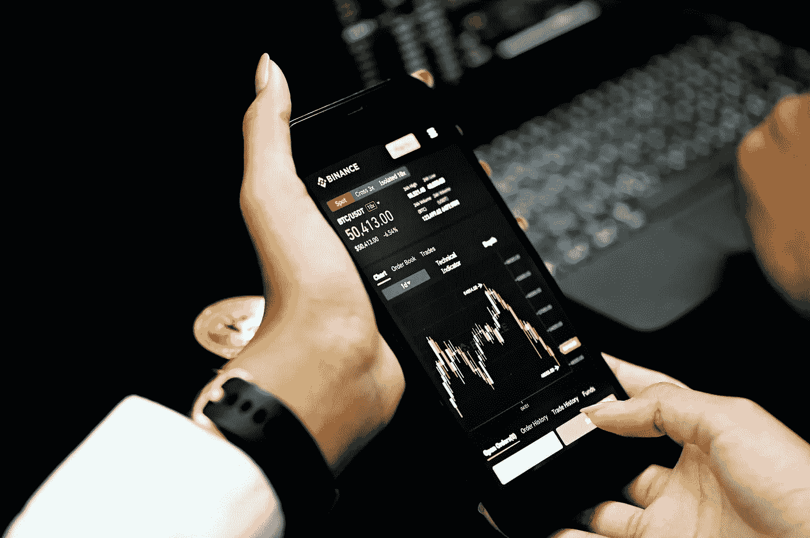

# 现在长期投资 3 个加密

> 原文：<https://medium.com/coinmonks/3-crypto-to-invest-in-for-the-long-haul-now-91fafebe58c4?source=collection_archive---------3----------------------->

Crypto Investors lost as much as $200 billion in a single day over the previous month, which indicates that they are more inclined to sell off riskier assets first. Photo by [Kanchanara](https://unsplash.com/@kanchanara?utm_source=unsplash&utm_medium=referral&utm_content=creditCopyText) on [Unsplash](https://unsplash.com/s/photos/cryptocurrency?utm_source=unsplash&utm_medium=referral&utm_content=creditCopyText)

随着最近几周不可预测的价格波动，比特币市场仍然充满焦虑。

上个月，加密投资者单日损失高达 2000 亿美元，这表明他们更倾向于首先抛售风险更高的资产。

因此，投资者更关心的是发现他们应该出售哪些加密货币，而不是发现新的加密货币。

这是一个合理的观点。对于数字货币投资者来说，目前没有令人鼓舞的宏观经济指标。

这将对市场造成严重后果。在很多方面，这个行业仍处于起步阶段。

由于这些硬币的投机性质，许多潜在的投资者选择不参与市场，而宁愿从外面观察。

然而，如果牛市恢复，加密货币市场最有潜力复苏(它会的)。

当个体感受到他人的恐惧时，他们更倾向于放松姿势，更努力地咬下去。

即使对于那些有着最大长期前景的人来说，最关键的选择是购买哪些代币。

> 另外，请参见:[立即购买 3 只加密 ETF](https://www.sammaiyaki.com/3-crypto-etfs-to-buy-now-f12126e1e204?source=user_profile---------20----------------------------)

# 投资 1 号的长期密码:Solana SOL

Solana SOL 是一种潜在的新加密货币，在与以太坊的对抗中，它很快成为最著名的区块链之一。

索拉纳是一个智能合同启用的区块链，像以太坊。虽然这是一个证据的股份链，这个特定的区块链是从地面上建立了这种方式。

它有许多扩展选项，其竞争对手会觉得很棒。

索拉纳的土生土长的硬币索尔在这个网络的大多数交易中使用。如果你想投资索拉纳网络，你还需要加密货币 SOL。

看好索拉纳未来增长的 SOL 投资者会发现，这与该股的潜在价值增长之间存在直接关联。

像其他著名的加密货币一样，索拉纳的价值在几个月内大幅下跌。

自 SOL 的历史高点以来，其价值的 80%以上已被抹去。几次网络中断破坏了索拉纳的投资理论，也玷污了索拉纳的信心。

然而，索拉纳团队完全有能力解决这些问题。凭借其高速和可扩展性，这是一个可以与您一起成长的网络。

如果展望未来，忽视索拉纳的长期潜力将是一个错误。

> 此外，请参见:[随着 2022 年第二季度的展开，3 个 Booster-Crypto 令牌](https://www.sammaiyaki.com/3-booster-crypto-tokens-as-second-quarter-of-2022-unfolds-aad231d06bce?source=user_profile---------21----------------------------)

# 投资以太坊 ETH 的长期加密技术

以太坊 ETH 是一种买入卖出的加密货币。尤其是最近。在 11 月创下每枚代币 4890 美元的历史新高后，其价值暴跌 61%，目前交易价为 1900 美元。

以太坊是开发人员设计去中心化货币应用的首选网络。以太坊的区块链网络允许智能合约，拥有最大的竞争对手生态系统。这个网络是最安全的网络之一，允许投资者、用户和后端开发人员做出明智的判断。

即将到来的网络合并让投资者兴奋不已，他们正在寻找用这种货币买入的理由。

以太坊向股权证明网络的转变可能会使其更有效，对环境的破坏更小，对人才更有吸引力。

这对网络效果爱好者来说很重要。

> 另外，请看: [5 种不依赖于政府的加密货币](https://www.sammaiyaki.com/5-cryptocurrencies-to-buy-right-now-that-arent-dependent-on-the-government-ab0ad96f17bf?source=user_profile---------22----------------------------)

# 要投资的长期密码№3:

十多年后，比特币 BTC 成为少数仍在使用的加密货币之一。比特币是最受长期投资者评估的加密货币。

与标准普尔 500 指数相比，比特币 13 年的贝塔系数一直相当低。这种象征在经济衰退期间从未存在过。

2008 年的全球金融危机激发了比特币的诞生。投资者可能会担心，比特币只不过是另一种即将被股市最近创纪录的高相关性击碎的风险资产。

逻辑。大型机构将资金投入比特币的事实表明，它仍然是一种多元化的投资。

一个长期价值指标，不管投资者喜不喜欢，比特币都是。

投资者，尤其是长期投资者，应该记住这一点。

> 另请参见:[每个投资者都应该拥有的 3 种元宇宙加密货币](https://www.sammaiyaki.com/3-metaverse-cryptocurrencies-every-investor-should-own-b32b19998329?source=user_profile---------23----------------------------)

# 总结一下

与传统货币不同的是，*“加密货币”既不发行也不受政府控制。*

*另一个选择是区块链，它因数字货币比特币的出现而闻名。*

*华尔街对数字货币的使用展现了新的前景。*

*总共有超过 19，000 种加密货币可供使用。*

*虽然比特币可以用来购买产品和服务，但大多数人将其视为长期投资机会。*

*最近加密货币的崩溃，特别是与美元挂钩的稳定货币，表明了投资加密货币的危险。*

*很难预测加密货币的价值变动。投资前要知道风险。*

> *另见:[响应拜登总统的行政命令](https://www.sammaiyaki.com/5-cryptocurrencies-to-buy-in-response-to-president-bidens-executive-order-7eb3a3cff60d?source=user_profile---------25----------------------------)购买 5 种加密货币*

# *财务免责声明*

*需要强调的是，这篇文章中的任何内容都不应该被解释为提供投资或金融建议。本文分享的观点仅代表作者个人观点，因此不应作为金融交易或投资的建议。*

*此信息按“原样”*提供，不提供任何准确性、可靠性或全面性保证。**

**由于其非常不稳定的特性，比特币的价格最近一直处于不稳定的波动之中。每个考虑投资加密货币的人都应该做他们的研究，并在决定是否将他们的钱投入加密货币之前了解他们所在地区的相关法规。**

> **加入 Coinmonks [电报频道](https://t.me/coincodecap)和 [Youtube 频道](https://www.youtube.com/c/coinmonks/videos)了解加密交易和投资**

# **另外，阅读**

*   **[分散交易所](https://coincodecap.com/what-are-decentralized-exchanges) | [比特 FIP](https://coincodecap.com/bitbns-fip) | [宾邦评论](https://coincodecap.com/bingbon-review)**
*   **[用信用卡购买密码的 10 个最佳地点](https://coincodecap.com/buy-crypto-with-credit-card)**
*   **[加拿大最佳加密交易机器人](https://coincodecap.com/5-best-crypto-trading-bots-in-canada) | [比特 vs 币安](https://coincodecap.com/bybit-binance-moonxbt)**
*   **[阿联酋 5 大最佳加密交易所](https://coincodecap.com/best-crypto-exchanges-in-uae) | [SimpleSwap 评论](https://coincodecap.com/simpleswap-review)**
*   **购买 Dogecoin 的 7 种最佳方式 | [ZebPay 评论](https://coincodecap.com/zebpay-review)**
*   **[最佳期货交易信号](https://coincodecap.com/futures-trading-signals) | [流动性交易回顾](https://coincodecap.com/liquid-exchange-review)**
*   **【Huobi 的加密交易信号 | [Swapzone 审查](/coinmonks/swapzone-review-crypto-exchange-data-aggregator-e0ad78e55ed7)**