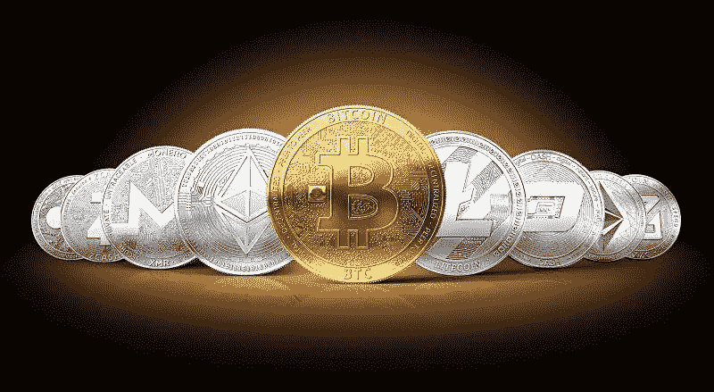

# 3 种加密货币在短暂衰落后登陆月球

> 原文：<https://medium.com/coinmonks/3-cryptocurrencies-launching-to-the-moon-after-a-short-downfall-c6e797781567?source=collection_archive---------0----------------------->

Key cryptocurrencies back above psychological and market mood barriers.

鉴于加密货币的波动性，行业专家知道不要指望一帆风顺。

然而，当本周早些时候所有 cryptos 的总市值跌至 1.81 万亿美元，为今年 4 月 12 日以来的最低水平时，几位专家感到担忧。

自然，你不希望你的大枪低于关键的技术标准。

与此同时，在 2020 年末非凡的重新觉醒之后，cryptos 似乎有了一个节奏:当你相信事情准备朝着显著负面的方向发展时，一波看涨活动出现了。

这正是 4 月 18 日夜间发生的事情，将关键的加密货币带回心理和市场情绪障碍之上。

虽然在虚拟货币中任何事情都可能发生，但在未来几周，多头可能会比空头有一点优势。

的确，对衰退的担忧正在加剧，我和我的同事们已经对此进行了广泛的讨论。

另一方面，美联储以前所未有的速度和幅度增加了货币供应量。

这种通胀压力可能会推动加密技术的发展，在某些情况下，加密技术已经成为数字安全港。

此外，美联储可能需要将基准利率提高到高于通胀率的水平，以应对物价上涨——央行似乎缺乏完成这项任务的政治意愿。

因此，这些加密货币可能会受益匪浅。

> 另请参见:[嗨:革命性的加密手机银行触手可及](https://www.sammaiyaki.com/hi-revolutionary-crypto-mobile-banking-at-your-fingertips-3214a3a05a1b?source=user_profile---------0----------------------------)

# 月亮的秘密№1: JasmyCoin (JASMY)

带着我的 cryptos 列表中要检查的最后一个选项，我将进入 JasmyCoin (JASMY-USD)的非常投机的领域。

我不确定贾斯米的最终轨迹会落在哪里，因为它现在的价值不到 2 美分。

作为一名股东，我希望从这里开始，方向会走得更高，但要注意:这枚硬币的投机性令人难以置信。

从根本上说，JasmyCoin 的底层区块链试图将物联网(IoT)的优势与区块链结合起来。

这种方法的目标是限制或消除增加连通性的负面影响。

用户放弃了他们的隐私，以换取传统物联网平台上链接解决方案的易用性和实用性。

然而，根据皮尤研究中心的研究，互联网隐私担忧增加，可能导致物联网的信任困难。

这就是贾斯米出现的时候。该网络可以提供链接应用的许多优势，同时通过使用区块链技术提供加密的安全措施。

包括我自己在内的许多投机者都对贾斯米两全其美的理念充满热情。

然而，它是 cryptos 的 ***【仙股】*** ，所以不要投资超过你能承受的损失。

> 另见:[2022 年买 3 刀密码](https://www.sammaiyaki.com/3-dao-cryptos-to-buy-in-2022-d77e81197bb3?source=user_profile---------1----------------------------)

# 飞往月球的秘密 2: XRP (XRP)

诉讼是意想不到的，所以我不想对 XRP(XRP-美元)表达太多强烈的感情，这是由 Ripple Labs 建立的数字货币，是证券交易委员会诉讼的主题。

美国证券交易委员会认为 XRP 是一种证券，因此受证券规则的约束，但 Ripple 认为它是一种合法的虚拟货币。

如果你想赌上法庭纠纷，Ripple 首席执行官布拉德·加林豪斯的声明可能会鼓励你。Garlinghouse 在巴黎区块链周峰会上对诉讼进行了评论，

> 大约 15 个月前，这场诉讼进行得异常顺利，远远超出了我的想象

他的一些乐观源自 cryptos 的事实及其与公开交易资产的比较。

> 这位首席执行官说:“如果你认为 XRP 是 Ripple 的一个安全隐患，我们必须找出每一个感染 XRP 病毒的人。”。

这是证券交易委员会的授权。你必须熟悉你所有的股东。这是不可行的。

这是主审此案的法官不能忽视的一个关键因素。

> 另外，请参见:[你应该保持警惕的 5 个 DeFi 加密项目](https://www.sammaiyaki.com/5-defi-crypto-projects-that-you-should-keep-on-your-radar-d9554c84f09a?source=user_profile---------2----------------------------)

# 月亮的秘密№3:卡尔达诺(阿达)

Cardano (ADA-USD)，很容易成为最令人困惑的加密名称之一，再次处于一个不明确的情况。

由于一波抛售压力袭击了市场，ADA 在遭受其他数字资产的打击后，最近上涨了 6%以上。

另一方面，卡尔达诺再次跌破 1 美元大关。

诚然，这离写作的临界门槛只差几分钱。

因此，当你读到这里的时候，ADA 可能已经远离了这个关键的临界点。

尽管如此，如果你看重像技术动量这样的变量，你更希望看到货币保持至少 1 美元的基本支撑。

然而，这是阿达的末日吗？

有趣的一点是，在最近的波动中，卡尔达诺跌至约 88 美分。

在引起利益相关者焦虑的同时，2 月 24 日，卢布跌至 76 美分，恰逢俄罗斯冒险选择攻击乌克兰。

上升的支持可以使 ADA 受益，但必须立即提供结果。

> 另请参见:[立即购买 3 只加密 ETF](https://www.sammaiyaki.com/3-crypto-etfs-to-buy-now-f12126e1e204?source=user_profile---------3----------------------------)

# 总结

本周早些时候，所有密码的总市值跌至 1.81 万亿美元。

密码似乎有一个节奏:当你认为事情正朝着一个显著负面的方向发展时，一波看涨活动就会出现。

虽然在虚拟货币中任何事情都可能发生，但在未来几周，多头可能会比空头有一点优势。

因此，这些加密货币可能会受益匪浅。

# **财务免责声明**

本文内容仅供参考；您不应将任何此类信息或其他材料理解为法律、税务、投资、财务或其他建议。

此处的任何内容都不构成购买或出售证券或其他金融工具的请求、推荐、认可或要约。

投资加密货币构成相当大的风险，在投资加密货币之前做好你的研究。

> 加入 Coinmonks [电报频道](https://t.me/coincodecap)和 [Youtube 频道](https://www.youtube.com/c/coinmonks/videos)了解加密交易和投资

# 另外，阅读

*   [SmithBot 评论](https://coincodecap.com/smithbot-review) | [4 款最佳免费开源交易机器人](https://coincodecap.com/free-open-source-trading-bots)
*   [杠杆代币](/coinmonks/leveraged-token-3f5257808b22) | [最佳密码交易所](/coinmonks/crypto-exchange-dd2f9d6f3769) | [Paxful 点评](/coinmonks/paxful-review-4daf2354ab70)
*   [加密套利](/coinmonks/crypto-arbitrage-guide-how-to-make-money-as-a-beginner-62bfe5c868f6)指南| [如何做空比特币](/coinmonks/how-to-short-bitcoin-568a2d0b4ae5)
*   [币安期货交易](https://coincodecap.com/binance-futures-trading)|[3 commas vs Mudrex vs eToro](https://coincodecap.com/mudrex-3commas-etoro)
*   [如何购买 Monero](https://coincodecap.com/buy-monero) | [IDEX 评论](https://coincodecap.com/idex-review) | [BitKan 交易机器人](https://coincodecap.com/bitkan-trading-bot)
*   [YouHodler vs CoinLoan vs Hodlnaut](/coinmonks/youhodler-vs-coinloan-vs-hodlnaut-b1050acde55a) |[Cryptohopper vs HaasBot](https://coincodecap.com/cryptohopper-vs-haasbot)