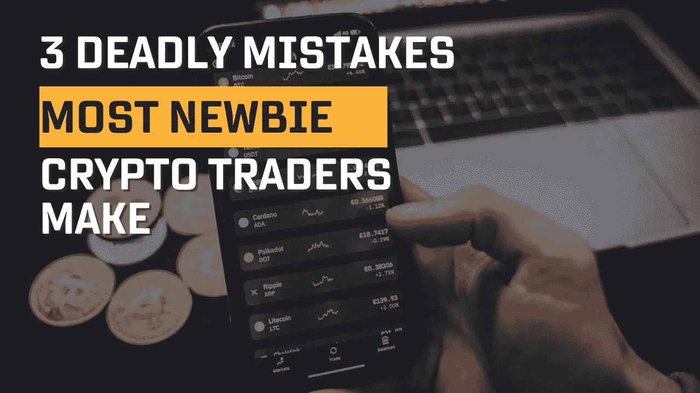
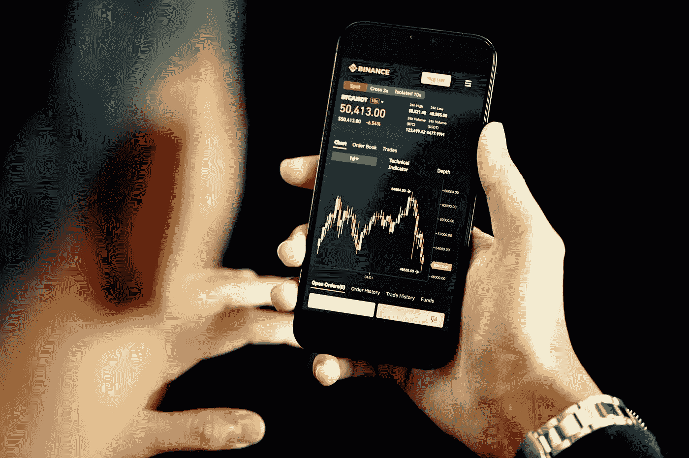
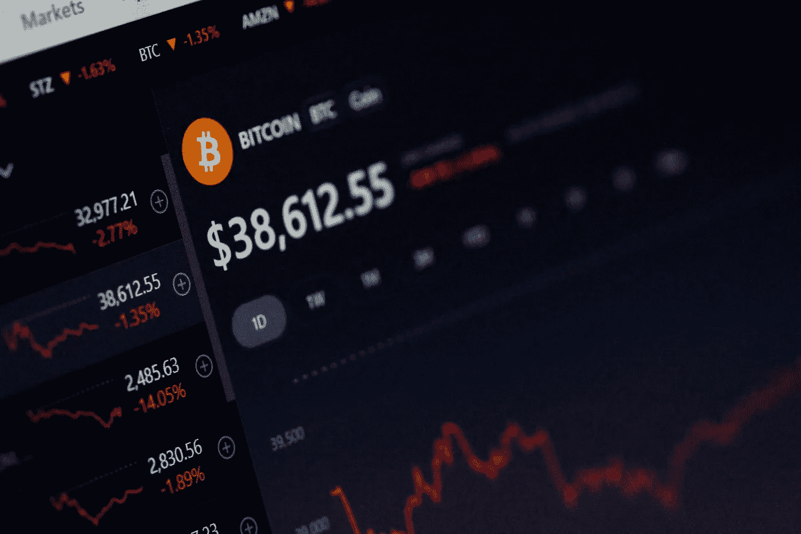
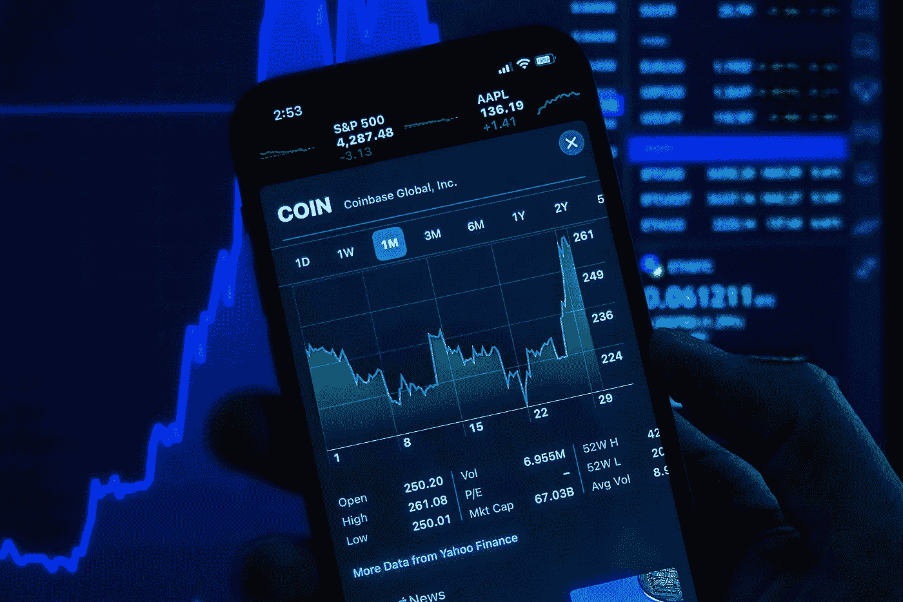

# 大多数新手密码交易者犯的 3 个致命错误

> 原文：<https://medium.com/coinmonks/3-deadly-mistakes-most-newbie-crypto-traders-make-51055ac23bba?source=collection_archive---------22----------------------->

大多数初学者不断地犯这些错误，因为他们没有花时间去学习密码市场是如何运作的。

要成为密码市场的成功交易者。你需要避免这些错误。

**1。没有设定目标:**

就像没有人想在没有目标的情况下开始实体业务一样，加密交易也应该如此

没有设定目标是现有交易者和新手都应该避免的最大错误之一。

如果你交易加密货币是因为你认为这是一种赚快钱或炒作的方式，那么你很可能会一败涂地。

在你决定投资之前，你必须设定一个明确的目标。

**2。短期思考:**

作为一个密码交易的初学者，没有深入的令牌技术分析知识，不是一个有益的交易策略。

考虑到加密货币的波动性，短期交易是快速退出市场的另一种方式。

对初学者来说，最好的策略是(为了亲爱的生命坚持下去)经过仔细分析的令牌，具有巨大的长期潜力。

即使你在错误的时间购买了代币，价格开始暂时下跌，你也有足够的时间等待它恢复。

**3。没有交易计划/策略:**

这是新的密码交易员经常犯的错误。

一些新手可能幸运地在市场早期交易中获利，但不幸的是，他们最终输回了市场。

你想投资的代币的进出场价格是很重要的。

基于信念交易加密货币最终会让你追逐最高价格。

结论:

对于想要建立一个可行的交易组合的密码交易者来说，避免犯上述错误是很重要的。

如果你有足够的纪律性和耐心来避免犯上述错误，你将增加成为成功的密码交易者的机会。

*关注我，分享它，评论它，为我鼓掌👏。*

*敬请期待，*

*我会在这里分享对新手和现有加密交易者有帮助的加密内容。*

> 加入 Coinmonks [电报频道](https://t.me/coincodecap)和 [Youtube 频道](https://www.youtube.com/c/coinmonks/videos)了解加密交易和投资

# 另外，阅读

*   [3 商业评论](/coinmonks/3commas-review-an-excellent-crypto-trading-bot-2020-1313a58bec92) | [Pionex 评论](https://coincodecap.com/pionex-review-exchange-with-crypto-trading-bot) | [Coinrule 评论](/coinmonks/coinrule-review-2021-a-beginner-friendly-crypto-trading-bot-daf0504848ba)
*   [莱杰 vs n rave](/coinmonks/ledger-vs-ngrave-zero-7e40f0c1d694)|[莱杰 nano s vs x](/coinmonks/ledger-nano-s-vs-x-battery-hardware-price-storage-59a6663fe3b0) | [币安评论](/coinmonks/binance-review-ee10d3bf3b6e)
*   [Bybit Exchange 审查](/coinmonks/bybit-exchange-review-dbd570019b71) | [Bityard 审查](https://coincodecap.com/bityard-reivew) | [Jet-Bot 审查](https://coincodecap.com/jet-bot-review)
*   [3 commas vs crypto hopper](/coinmonks/3commas-vs-pionex-vs-cryptohopper-best-crypto-bot-6a98d2baa203)|[赚取加密利息](/coinmonks/earn-crypto-interest-b10b810fdda3)
*   最好的比特币[硬件钱包](/coinmonks/hardware-wallets-dfa1211730c6) | [BitBox02 回顾](/coinmonks/bitbox02-review-your-swiss-bitcoin-hardware-wallet-c36c88fff29)