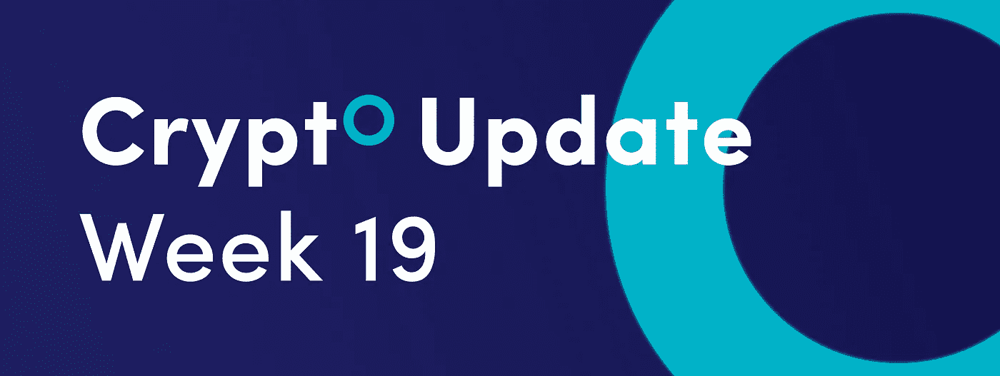
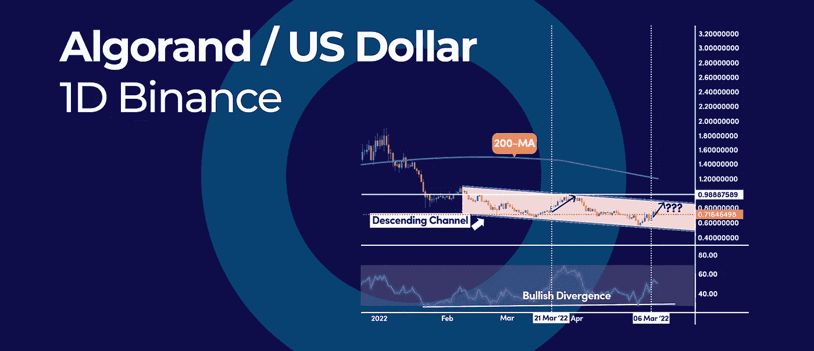
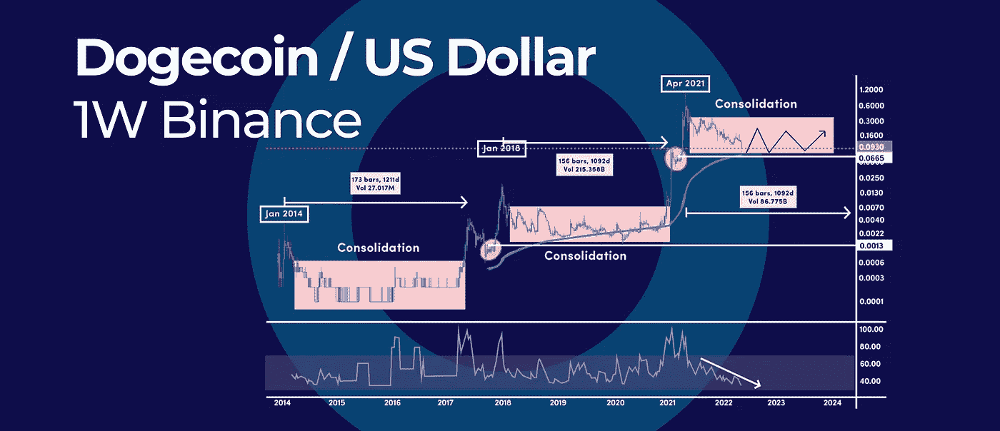
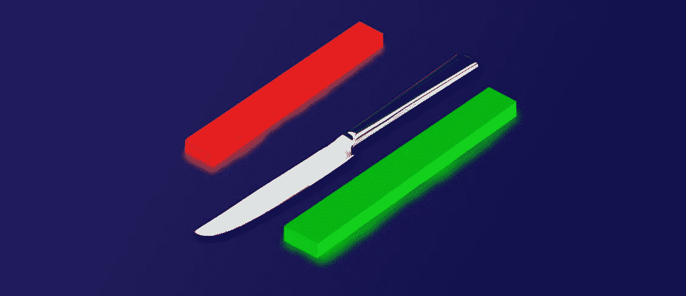

# 3 个有效的方法来抓住一把落下的刀，在本周的加密更新中。

> 原文：<https://medium.com/coinmonks/3-effective-ways-to-catch-a-falling-knife-in-crypto-and-more-in-this-weeks-crypto-update-6ec33216e4d5?source=collection_archive---------20----------------------->

*   该图表要求目标为 1.0 美元
*   Dogecoin 的牛市周期告诉我们何时会看到一个新的历史高点
*   3 种有效的方法在密码中接住落下的刀

# 该图表要求目标为 1.0 美元

技术图表显示，阿尔格兰德(ALGO)有可能再次突破 1.00 美元大关。自 2 月 8 日以来的下跌可以被限制在一个下降通道内，振幅越来越小，动量越来越少。

# 阿尔格兰德下降通道

在到达较低的支撑趋势线后，ALGO 价格反弹，我们现在正在寻找对较高的阻力趋势线的可能的重新测试，该趋势线位于 1.00 美元的心理水平附近。

目前的反弹还受到 RSI 震荡指标的支撑，突破 50 中位上方。上一次 RSI 在 3 月 21 日突破 50 中间水平时，ALGO 价格再次测试了上方阻力趋势线。

这种模式如果得到证实，可能会在未来几个月引发更大规模的反弹。然而，一个有意义的反转，我们需要一个日线突破，并在下降通道上方收盘，但更重要的是，在 1.00 美元上方。

价格和 RSI 振荡指标之间也有巨大的看涨背离，这凸显了抛售压力的耗尽。这是一个重要的价格发展，因为它有可能引发潜在的牛市反转。

**展望未来:**我们必须记住，整体趋势是看跌的，因为我们仍在 200 天简单移动平均线下方交易，就价格结构而言，我们仍在走看跌的道路。然而，如果上面强调的模式被触发，我们可能会处于反转的过程中。

# Dogecoin 的牛市周期告诉我们何时会看到一个新的历史高点

基于 Dogecoin (DOGE)的长期轨迹，DOGE 价格有每 3 到 4 年产生一个新的历史高点的趋势。因此，这种模式可以帮助我们预测 DOGE 的价格走势。

# 牛市周期

基于这种周期性模型，我们可以预计 Dogecoin 将在 2024 年至 2025 年之间的任何时间达到新的历史高点。从 2014 年 1 月到 2018 年 1 月，我们经历了持续 4 年的第一个牛市周期。从 2018 年 1 月到 2021 年 4 月，我们经历了持续 3 年的第二个牛市周期。

在每个历史高点之间，DOGE 的价格往往会在永无止境的范围内巩固，这些范围内的价格会突然爆发，并迅速反转。

在 DOGE 突破之前的历史高点之前，这些盘整至少持续了 156 周。

考虑到所有的事情，我们不知道与之前的周期相比 DOGE 的价格会如何表现，但我们对未来的预期有一个粗略的估计。

**展望:**本次盘整的底部可以确立在 0.05 美元这个可观的轮数。这一水平非常重要，因为当价格在 2021 年 4 月突破该水平时，它导致 Dogecoin 创下了历史新高。

# 3 种有效的方法在密码中接住落下的刀

用专业术语来说，接住掉下来的刀指的是买入正在快速抛售的加密货币。价格的急剧下跌使这种交易策略风险很大，但同时，如果操作正确，它可以产生巨大的回报。

# 什么是 Crypto 中的落刀？

在金融行业，下跌的刀是股票/密码或任何其他资产，一直处于强劲的下跌趋势，交易处于新低。

这个类比来自于这样一个事实，即很难抓住一把掉下来的刀而不受伤。同样的概念也适用于加密货币。

如果你想在底部购买加密货币，下面是 3 条需要遵守的规则。

# 规则 1:暂时的逆风或结构性问题

第一条规则是看整体市场趋势，分析抛售是因为暂时的逆风，还是有结构性问题。例如，2021 年 5 月因[中国的加密开采](https://www.reuters.com/world/china/china-central-bank-vows-crackdown-cryptocurrency-trading-2021-09-24/)禁令而导致的比特币抛售是暂时的逆风。

比特币的快速抛售是短暂的，加密货币在那一天正好触底。因此，在这种情况下购买一把下落的刀是明智之举。

# 规则 2:人群往往反应过度

短期内，当市场出现过度反应时，我们往往会反弹。诺贝尔经济学奖得主理查德·塞勒指出，从长远来看，如果我们承担更高的风险，就会获得更高的回报。

# 规则 3:缩短时间框架

最后，确保你把时间框架降低到日内图表，以便更好地了解价格何时会反转。

确定反转时间的一个简单方法是等待最后一波下跌，通常是一根大蜡烛和一根大蜡烛，然后是反转最近抛售压力的确认蜡烛。

# 掉刀能有多大风险？

抓住下跌的刀是非常冒险的，因为如果你在错误的时间买入，你会陷入恶性循环。

随着价格不断下降，你不断购买更多，因为你认为价格不能再低了。但最终，你只剩下一大包密码，而且价格越来越低。

如果你不能处理掉刀的精神压力，那么你最好不要接住它。

# 落刀和长钉的区别

峰值是一个急剧上升的趋势，通常是由一个强有力的催化剂引起的。峰值也可能是由于意外事件导致的下跌。

上涨和下跌之间的区别在于，上涨是由于市场事件引起的突然变动，而下跌是由于基本面不佳引起的长期下跌。例如，[比特币从 20k 美元到 3k 美元的走势](https://cointelegraph.com/news/crypto-traders-explain-what-caused-the-bitcoin-price-plunge-to-3-000)就是一把落下的刀。

# 摘要

底线是，当你看到大幅下跌时，通常是折价购买加密货币的机会。但一定要遵循上述规则，避免过早买掉刀。最重要的是，如果你不能承受精神压力，就不要买坠落的刀。

订阅我们的媒体每周博客和更新。
在推特[上关注我们](https://twitter.com/cryptohopper) | [脸书](https://www.facebook.com/cryptohopper)|[Reddit](https://www.reddit.com/r/CryptoHopper/)|[insta gram](https://www.instagram.com/cryptohopper/?hl=nl)

在 [Cryptohopper](https://www.cryptohopper.com/) 开始交易！

> 加入 Coinmonks [电报频道](https://t.me/coincodecap)和 [Youtube 频道](https://www.youtube.com/c/coinmonks/videos)了解加密交易和投资

# 另外，阅读

*   [用信用卡购买密码的 10 个最佳地点](https://coincodecap.com/buy-crypto-with-credit-card)
*   [最好的卡达诺钱包](https://coincodecap.com/best-cardano-wallets) | [Bingbon 副本交易](https://coincodecap.com/bingbon-copy-trading)
*   [印度最佳 P2P 加密交易所](https://coincodecap.com/p2p-crypto-exchanges-in-india) | [柴犬钱包](https://coincodecap.com/baby-shiba-inu-wallets)
*   [八大加密附属计划](https://coincodecap.com/crypto-affiliate-programs) | [eToro vs 比特币基地](https://coincodecap.com/etoro-vs-coinbase)
*   [最佳以太坊钱包](https://coincodecap.com/best-ethereum-wallets) | [电报上的加密货币机器人](https://coincodecap.com/telegram-crypto-bots)