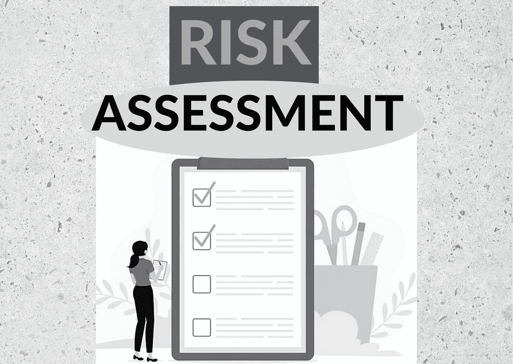

# 您必须在加密 HYIP 平台上执行的 3 项基本风险评估检查

> 原文：<https://medium.com/coinmonks/3-essential-risk-assessment-checks-you-must-carry-out-on-crypto-hyip-platforms-901be9d674b7?source=collection_archive---------25----------------------->

在你投资之前。

Edited in Canva by [Author](/@tatis5771); Survey form vector created by freepik — [www.freepik.com](http://www.freepik.com)

本文中的信息仅用于教育和信息目的。请做好自己的尽职调查和个人研究，并寻求专业建议。

你可能会问自己 HYIP 到底是什么？