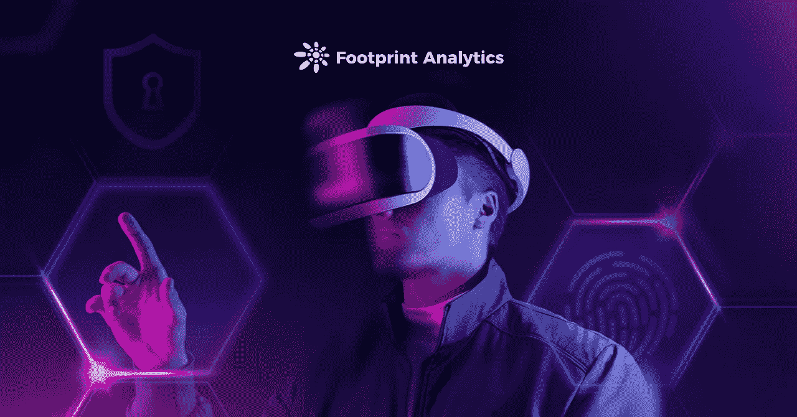

# 3 不可避免的元宇宙法律问题

> 原文：<https://medium.com/coinmonks/3-inevitable-metaverse-legal-problems-1a37dd3dc5e0?source=collection_archive---------31----------------------->

以下是 Web3 如何解决权利、隐私和知识产权问题

数据来源:[足迹分析](https://www.footprint.network/)

之前，我们讨论了关于元宇宙的不同意见。虽然许多人很高兴看到一个更加分散和匿名的互联网版本，但其他人注意到法律难题将不可避免地随之而来。

例如，一些项目，如 Arweave，旨在使区块链数据审查具有抵抗力，如果这种技术在元宇宙应用，可能会很难执行删除内容的决定。

其他人，如 Secret Network，可能会产生一些应用程序，使犯罪分子能够不可追踪地进行通信和金融交易，迫使当局审查技术，否则这些技术会被关心自己隐私的守法个人使用。

世界上大多数现行法律都不能直接适用于元宇宙，而且在这一点上，解决办法是高度推测性的。在本文中，我们将探讨元宇宙的主要法律问题:谁将保护用户的权利、隐私和知识产权，以及如何保护？

*   **个人权利**

目前，元宇宙是由玩家创建虚拟化身的游戏和环境定义的。

由于区块链的匿名性，用户可以创建数十个甚至数百个无法追踪的数字头像。例如，在分散的土地，每个元掩码地址可以创建一个新的头像。

显然，这些角色本身没有个人权利，但控制他们的人有。

元宇宙游戏最好的先例是像《魔兽世界》和《江湖》这样的 MMORPGs，或许还有像《机器人洛克斯》和《《我的世界》》这样的宇宙建造者。

现行法律在游戏中的个人权利问题上并不明确，而是将虚拟化身视为游戏账号控制者的虚拟财产。

显然，当全息图和传感技术在元宇宙中得到完美应用时，虚拟化身之间的接触行为将会到达现实世界中的人本身。例如，在元宇宙的性骚扰案件中，现实世界中的人们会感到同样的性羞耻。

2021 年 11 月，Meta 推出了《地平线世界》的测试版。其中一名女选手声称受到了性骚扰。没有办法追究肇事者的责任。

这可能最终会让 Meta 让[安全区]变得非常容易找到，但女性玩家无法受到法律的保护。

*The platform that appeared the first case of Metaverse sexual harassment: Horizon Worlds*

因此，如果元宇宙继续发展，人们如何在元宇宙生存必须得到解决，以澄清权利和义务之间的关系。

*   **隐私**

元宇宙中的一切都以数据的形式存在于区块链或其他云存储中。持有数据的科技公司对隐私和保护有着严格的法律要求。

在现实生活中，当我们使用一项服务时，我们授权技术公司收集我们的个人信息和私人数据，包括身份信息、手机号码等。

然而，元宇宙可能会收集更全面的数据来完善虚拟化身，增强沉浸式体验。

这可能包括指纹、声纹、生理反应，甚至脑电波数据。

如今，科技公司没有像他们应该的那样保护用户的私人数据，泄露是经常发生的事情，尽管法律框架特别试图解决这一问题。例如:

*   2018 年，Meta(脸书)因向剑桥分析公司(Cambridge Analytica)泄露用户隐私，被美国美国联邦贸易委员会(FTC)罚款 50 亿美元。
*   2021 年，B2B 营销公司 OneMoreLead 将用户数据存储在一个开放的数据库中，导致大约 6300 万用户的数据被泄露。
*   2021 年，德国电信(Deutsche Telekom)旗下的 T-Mobile 遭遇网络攻击，泄露了超过 4780 万用户的个人数据。
*   **知识产权**

在塑造元宇宙的过程中，科技公司必然会从现实世界中引入一些东西，比如标志性建筑、名画或真人肖像。如果没有授权使用这些东西怎么办？

由于元宇宙将包含大量用户生成的内容，这将使知识产权法变得非常复杂。

如果用户生产的内容是未经授权的，那么内容的所有权应该如何确定？详细分析请见“知识产权”。

如果用户在元宇宙使用窃取的想法制作内容，所有权应该如何确定？现行法律规定虚拟财产应受到保护，但根据现行法律，在元宇宙创建的内容是否属于虚拟财产还有待商榷。换句话说，有关的法律尚未制定。

# 摘要

元宇宙的发展是一项庞大的社会工程，需要跨多个行业和法律框架的长期合作。如果合理利用元空间，它可能会带来一个更好、更互联的互联网版本。否则，用户和创作者在未来几年都将受到法律模糊性的阻碍。

**什么是足迹分析**

足迹分析是一个一体化的分析平台，用于可视化区块链数据和发现见解。它清理和整合链上数据，因此任何经验水平的用户都可以快速开始研究令牌，项目和协议。凭借一千多个仪表板模板和一个拖放界面，任何人都可以在几分钟内构建自己的定制图表。发掘区块链数据，利用足迹进行更明智的投资。

*足迹网址:*[*https://www . Footprint . network*](https://www.footprint.network/)

*不和:*

**推特:*[*https://twitter.com/Footprint_DeFi*](https://twitter.com/Footprint_DeFi)*

**电报:*[*https://t.me/joinchat/4-ocuURAr2thODFh*](https://t.me/joinchat/4-ocuURAr2thODFh)*

**Youtube:*[【https://www.youtube.com/channel/UCKwZbKyuhWveetGhZcNtSTg】T21](https://www.youtube.com/channel/UCKwZbKyuhWveetGhZcNtSTg)*

> *加入 Coinmonks [电报频道](https://t.me/coincodecap)和 [Youtube 频道](https://www.youtube.com/c/coinmonks/videos)了解加密交易和投资*

# *另外，阅读*

*   *[印度加密交易所](/coinmonks/bitcoin-exchange-in-india-7f1fe79715c9) | [比特币储蓄账户](/coinmonks/bitcoin-savings-account-e65b13f92451)*
*   *[OKEx vs KuCoin](https://coincodecap.com/okex-kucoin) | [摄氏替代品](https://coincodecap.com/celsius-alternatives) | [如何购买 VeChain](https://coincodecap.com/buy-vechain)*
*   *[币安期货交易](https://coincodecap.com/binance-futures-trading)|[3 commas vs Mudrex vs eToro](https://coincodecap.com/mudrex-3commas-etoro)*
*   *[如何购买 Monero](https://coincodecap.com/buy-monero) | [IDEX 评论](https://coincodecap.com/idex-review) | [BitKan 交易机器人](https://coincodecap.com/bitkan-trading-bot)*
*   *[CoinDCX 评论](/coinmonks/coindcx-review-8444db3621a2) | [加密保证金交易交易所](https://coincodecap.com/crypto-margin-trading-exchanges)*
*   *[红狗赌场评论](https://coincodecap.com/red-dog-casino-review) | [Swyftx 评论](https://coincodecap.com/swyftx-review) | [造币厂评论](https://coincodecap.com/coingate-review)*
*   *[Bookmap 评论](https://coincodecap.com/bookmap-review-2021-best-trading-software) | [美国 5 大最佳加密交易所](https://coincodecap.com/crypto-exchange-usa)*
*   *[如何在 FTX 交易所交易期货](https://coincodecap.com/ftx-futures-trading) | [OKEx vs 币安](https://coincodecap.com/okex-vs-binance)*