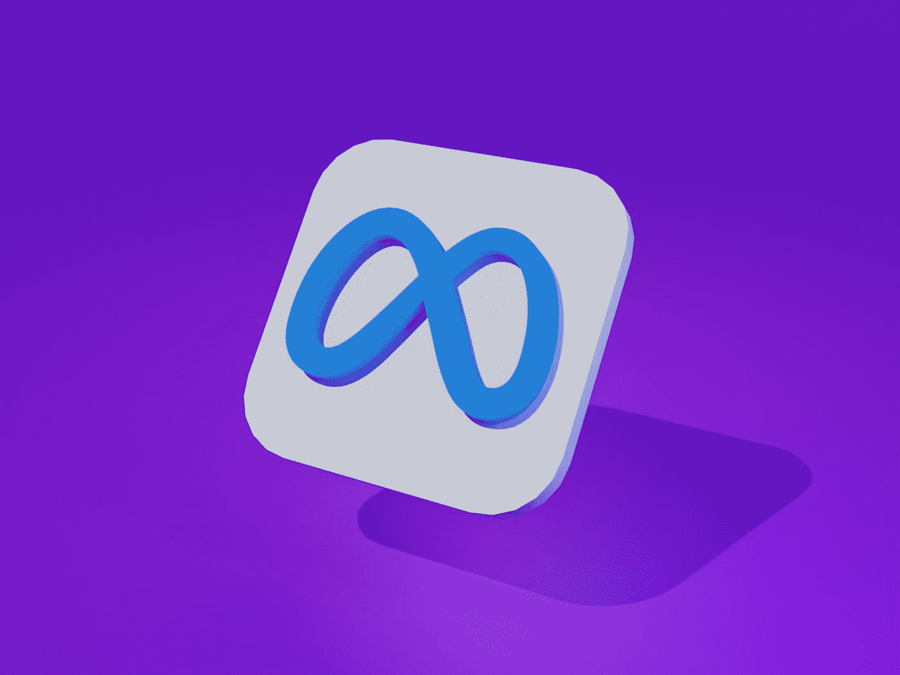

# 每个投资者都应该拥有的 3 种元宇宙加密货币

> 原文：<https://medium.com/coinmonks/3-metaverse-cryptocurrencies-every-investor-should-own-b32b19998329?source=collection_archive---------1----------------------->

Photo by [Muhammad Asyfaul](https://unsplash.com/@asyfaul?utm_source=medium&utm_medium=referral) on [Unsplash](https://unsplash.com?utm_source=medium&utm_medium=referral)

O 在过去的一年里，元宇宙加密技术是表现最好的数字资产之一。

由于有趣的元宇宙故事情节，许多投资者一直渴望将资金投入这些平台。

然而，在 2022 年，由于较大市场的波动，几种加密货币的价值下降。

尽管加密货币的价格已经下跌，但元宇宙的举措继续制造新闻。

根据 Global Market Estimates 的一项新分析，在 2022 年至 2027 年之间，全球元宇宙市场的复合年增长率可能会超过 45%。

此外，游戏行业预计将是元宇宙市场中最大的行业。

比特币基金会主席布洛克·皮尔斯(Brock Pierce)预测，2022 年，加密原生元经文和大型科技公司开发的元经文之间将发生一场斗争。

皮尔斯还是比特币基金会的主席。

> 另请参见:[2022 年最有前途的 3 种公用事业代币](/@sammaiyaki/3-most-promising-utility-tokens-in-2022-214df6619f90?source=user_profile---------0-------------------------------)

# 元宇宙密码 1:金恩硬币(ENJ)

[**【金恩】**](https://coinmarketcap.com/currencies/enjin-coin/) ，一个社交游戏平台，是我们未来的名字。

因此，用户可以选择建立俱乐部、游戏网站、聊天室，甚至虚拟商店。

自从区块链平台首次推出以来，它已经有了很大的发展。

超过 250，000 个游戏社区和 1，870 万注册游戏玩家现在是该平台不断增长的社区的一部分。

为了促进跨多个平台的游戏内资产的创造和交换，金恩建立了一个 NFT 生态系统。

以太坊(ETH-USD)区块链为玩家提供了一种跨多个平台管理数字资产的机制。

此外，用户可以随时将 NFT 转换回 ENJ。

当金恩在 2021 年末建立其元宇宙基金时，这是第一个此类基金。

元宇宙计划预计将从投资者那里筹集 1 亿美元。

令牌化产品不再是不断增长的区块链游戏网络的主要重点。

有很多人预测虚拟房地产将在未来几年内大幅增长。

ENJ 兑美元汇率目前为 1.80 美元，较去年 11 月的高点下跌了 63%。去年也下降了 32%。

金恩是排名前 75 位的加密货币之一，市场估值为 15.5 亿美元。

> 另请参见:[2022 年 NFT 三大市场](/@sammaiyaki/3-top-nft-marketplaces-in-2022-ef90dbadbb81?source=user_profile---------3-------------------------------)

# 元宇宙密码№2:布洛克托皮亚(BLOK)

比特币的(BTC-美元)2100 万供应量参考了[**BLOK topia(BLOK-美元)**](https://coinmarketcap.com/currencies/bloktopia/) 元宇宙项目的虚拟现实摩天大楼。

大楼的每一层都有独特的体验。不可替换的代币也可以用于获得虚拟不动产(NFT)。

它于 2021 年 10 月在多边形(MATIC-USD)区块链上发布。Bloktopia BLOK-USD 充当网络的主要实用令牌。

通过在这个平台上转售或出租虚拟房地产，被动收入是可能的。

除了 KuCoin、CoinMarketCap 和 Coingecko 之外，Bloktopia 还是其他几家知名加密货币企业和组织的所在地。

借助网络强大的虚拟现实(VR)体验，用户可以在单一的沉浸式世界中进行交互。

该网络的目标是让 Epic Games 的虚幻引擎 5 用于构建 Bloktopia 的下一代元宇宙。

自 10 月份的峰值以来，美元对美元的交易已经超过 2 美分 88%。

然而，加密货币的价格在前一个月上涨了 24%。

Bloktopia 的市场估值为 1.88 亿美元，是市场上最大的 300 个代币之一。

> 另外，请看:[为什么 ETH 还不到 7500 美元？](/@sammaiyaki/why-isnt-eth-at-7-500-yet-f6c58a0b6a89?source=user_profile---------2-------------------------------)

# 元宇宙密码№3:元英雄(英雄)

如果你想进入元宇宙，那么[**【Meta Hero】**](https://coinmarketcap.com/currencies/metahero/)是你最好的选择。

元宇宙的开发在很大程度上依赖于现实世界事物的逼真化身和复制品的创建。

Meta Hero 正在使用 NFT 智能合同和超高清摄影测量扫描技术来生成这些超现实的头像和设置。

世界领先的 3D 扫描公司之一 Wolf Studio 已经加入了该网络。

该组织的长期目标是建立最大的扫描物品和人的数据库。

平台自己的钱，英雄，可能是用户创造的，也可能是用户扫描的，也可能是用户交换的。

目前徘徊在 5 美分，比去年 12 月的高点下跌了 77%。自今年年初以来，加密货币已经损失了近 58%的价值。

Meta Hero 市值 2.6 亿美元，是排名前 250 的加密货币之一。

> 另请参见:[响应拜登总统的行政命令，购买 5 种加密货币](/@sammaiyaki/5-cryptocurrencies-to-buy-in-response-to-president-bidens-executive-order-7eb3a3cff60d?source=user_profile---------1-------------------------------)

# 简单地

据铁杆加密爱好者称，有了元宇宙加密系统，用户可以安全地拥有资产，并在不同平台之间转移资产，而无需中央机构的批准。

> 加入 Coinmonks [电报频道](https://t.me/coincodecap)和 [Youtube 频道](https://www.youtube.com/c/coinmonks/videos)了解加密交易和投资

# 另外，阅读

*   [用于 Huobi 的加密交易信号](https://coincodecap.com/huobi-crypto-trading-signals) | [Swapzone 审查](/coinmonks/swapzone-review-crypto-exchange-data-aggregator-e0ad78e55ed7)
*   最佳[密码交易机器人](https://coincodecap.com/best-crypto-trading-bots) | [购买索拉纳](https://coincodecap.com/buy-solana) | [矩阵导出评论](https://coincodecap.com/matrixport-review)
*   [Coldcard 评论](https://coincodecap.com/coldcard-review) | [BOXtradEX 评论](https://coincodecap.com/boxtradex-review)|[uni swap 指南](https://coincodecap.com/uniswap)
*   [比特币基地评论](/coinmonks/coinbase-review-6ef4e0f56064) | [德里比特评论](/coinmonks/deribit-review-options-fees-apis-and-testnet-2ca16c4bbdb2) | [FTX 评论](/coinmonks/ftx-crypto-exchange-review-53664ac1198f)
*   [联合国硬币评论](https://coincodecap.com/unocoin-review) | [最佳加密赌注硬币](https://coincodecap.com/best-crypto-staking-coins)