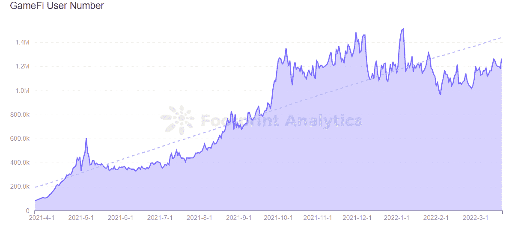

# 分析 GameFi 项目的 3 个指标

> 原文：<https://medium.com/coinmonks/3-metrics-to-analyze-gamefi-projects-b6676f708bc6?source=collection_archive---------32----------------------->

使用数据来确定新游戏项目的健康状况和潜力。

2022 年 3 月

数据来源:足迹分析— [GameFi 链数据](https://www.footprint.network/guest/dashboard/game-fi-data-by-chain-fp-96efc3c4-72ff-4f5e-a98b-66b5542681f0?day=past3months~&channel=ENG-224#secret=D3E9DDABD1C9731AE4BF2602E26BF1AF)

虽然《T2》GameFi 的人气持续增长，但在总共 1322 款游戏中，真正有趣的游戏仍然相对较少。

很多情况下，仅仅看截图或者走查是不足以评估一个项目的潜力的，因为游戏的可玩性是一个主观点。

相反，投资者和分析师应该超越表面，考虑游戏背后的数据。在评估 GameFi 项目的健康状况和潜力时，有三个关键指标需要考虑。

# GameFi 项目的关键指标

*   **协议上的用户数量**

用户数量是 GameFi 计划中玩家的数量，是 GameFi 生态系统健康运行的关键。也体现了游戏项目在用户中的受欢迎程度。

根据 Footprint Analytics 的数据，GameFi 的用户数量自 2021 年 4 月以来一直呈上升趋势，并已达到平衡。这与许多项目的快速增长和 GameFi 市场的持续发展高度相关。

*Footprint Analytics — GameFi User Number*

链上用户数显示，最近 3 个月用户较多的公链主要是 [WAX](https://cryptodaily.co.uk/2022/01/can-wax-remain-at-the-forefront-of-gamefi-in-2022) ，Hive，Polygon 和 [BSC](https://www.footprint.network/guest/dashboard/bsc-game-fi-overview-fp-ece95985-e16c-4a6c-bf95-9d3b523ccfe3?selected_game=bomb-crypto&date__=past180days&chain=Binance&channel=ENG-224#secret=21C1E2D554ABDB6B2ECF3E9D1B6FB5DF) 。

*Footprint Analytics — Number of Users Per Chains*

其中[splitter lands](https://www.footprint.network/guest/dashboard/splinterlands-dashboard-fp-63a55b31-7b13-4f79-bf39-b520b271e35c?date_filter=past90days&channel=ENG-224#secret=8CC84406F413195F19D76FD51AF8A5F0)和蜂巢链一样，日活用户约 30 万，占蜂巢链上用户的 98%以上。Splinterlands 是最近比较受欢迎的游戏项目之一，其原生令牌 SPS 售价低于 0.1 美元，通过其低廉的发行价格降低了玩家参与游戏的门槛。

还有 the WAX，一直能够维持很高的用户量，说明了 WAX 生态中的游戏相比其他区块链粘性更大。玩家可以在它的链上免费玩外星世界，玩几个小时可以赚 10 到 15 美元。

与 Ronin chain 上的 Axie Infinity 相比，在过去 6 个月中，Axie Infinity 的平均日用户数从 120，000 下降到约 20，000。这个数字的区别在于，游戏用户的大部分活动都是在链外进行的，只有涉及游戏道具的交易才在链上结算。因此，高昂的线上燃气费和低效的线上交易是其用户群减少的原因。

在不同的成功项目中，有三点非常突出:

*   除了拥有吸引用户的游戏类型之外，需要适用于所有加密用户并且具有低门槛。
*   玩赚模式也是用户人气高的重要指标。
*   拥有低油费和高效率的能力。

如果项目不注重用户数量的增长，即使游戏项目的内容丰富度在逐渐增加，没有用户它也会变得一文不值。

*   **人均交易量**

与传统游戏相比，GameFi 对网络的能力要求更高，支持这些项目的协议需要更便宜的汽油费和更快的交易。因此，许多区块链正在部署专门用于游戏应用的专用链，并提高功能以促进更多的项目使用和用户交易。

根据 Footprint Analytics 的数据，自 2021 年 4 月以来，蜡链上的人均交易数量一直相对稳定，每天约 35 至 50 笔交易，蜡依赖于农民世界和[外星人世界](https://www.footprint.network/guest/dashboard/game-fi-alien-worlds-fp-837a9106-4298-4a81-ae2d-b1e85802dd59?day=past3months~&game_name=Alien%20Worlds&channel=ENG-224)等项目，这些项目占蜡上交易的一半以上。

在能力上，WAX 不仅支持高频交易，每秒还可以处理高达 8000 笔交易，速度很快。

值得注意的是，自 1 月份以来，Avalanche 上的平均交易数量一直在增加，3 月 16 日高达 50 笔交易。原本在 DeFi 领域占据主要地位，随着 GameFi 的普及，Avalanche 逐渐转移到 GameFi。例如克拉巴达，玩家可以探索克拉巴达王国，同时通过采矿、抢劫、繁殖、战斗、探险和手工艺获得收入。It 占交易的大多数。

Avalanche 是 EVM 兼容的 L1 链，专注于速度和低交易成本，实现了超过 4500 TPS 的交易吞吐量和不到 2 秒的交易终止时间。旨在解决以太坊面临的可扩展性问题。

*Footprint Analytics — Transaction Per User Trended by Chain*

从数据中可以看出，其他区块链如 Near 和 Moonriver 基本都在人均 30 笔以下。

*   **人均交易量**

人均交易量是指每个用户平均转移的资金量。这是分析 GameFi 项目的一个关键指标，因为它反映了用户参与的水平以及产品和令牌组学设计的合理性。作为一名投资者，你应该关注程序的人均交易量趋势的持续稳定性，特别是用户数据的可持续增长和基于游戏的程序的约定收入的增加。

跌幅较大的一个是 OKExChain，从 2021 年 5 月人均 20487 美元的高位，到 10 月后几乎没有成交量。

OKExChain 连锁游戏发展相对较慢，规划中的项目知名度相对较低。

*Footprint Analytics — Volume Per User Trended by Chain*

截至 2 月份，和声、浪人、以太坊区块链是目前 GameFi 人均交易额的主要战场，这些链条上的大部分爆款连锁游人均 800 美元至 4000 美元不等。

评估一个 GameFi 项目是否有潜力，要看它使用的是哪种协议模型。如果它使用类似于 OKExChain 上的协议模型，它就不太可能成功，因为它的链生态系统发展缓慢，并且没有进一步的计划；如果它在 Hive 或 WAX 上使用协议模型，则更有潜力，因为它注重用户体验，并保持良好的用户增长率。

# 摘要

GameFi 行业正处于一个早期的、高度不稳定的阶段——如果你押错了赌注，很容易输掉你所有的钱。因此，在分析项目时查看基础数据是至关重要的。

本文由[足迹分析](https://www.footprint.network/)社区提供。

Footprint 社区是一个世界各地的数据和加密爱好者相互帮助了解和获得关于 Web3、元宇宙、DeFi、GameFi 或区块链新兴世界任何其他领域的见解的地方。在这里，你会发现活跃的、不同的声音相互支持，推动着社区向前发展。