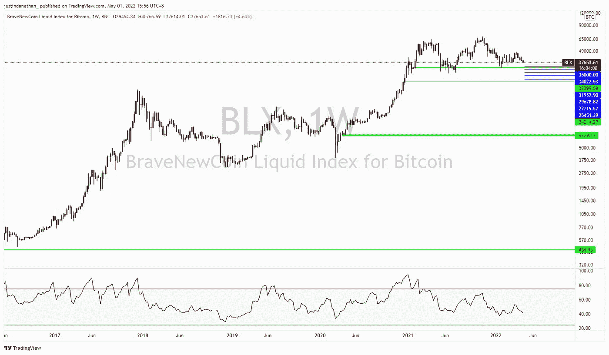

# 三分钟。每周市场情绪总结—5 月 1 日

> 原文：<https://medium.com/coinmonks/3-min-weekly-market-sentiment-wrap-up-april-1st-c1a6da1452ce?source=collection_archive---------41----------------------->

在上周的 [*帖子*](https://justindanethan.medium.com/weekly-market-update-april-23th-7dec83312bc) 中，我分享了我的中期看跌倾向，这种倾向已经、正在并将可能继续上演。

景色没有变。糟糕的俄乌局势、对大宗商品价格以及欧洲生产能源成本的影响、混乱的供应链、中国与 covid 相关但影响不小的封锁、猖獗的通胀等等。

我们看到美元在不断升值，各国央行在明显处于或即将进入衰退的情况下仍在加息。当然，债券价格下跌，股票下跌，信不信由你，黄金下跌，房地产下跌，密码下跌。

今天的重点是从另一个角度来看投资:一个更长期的角度，以及，如果大多数资产正在遭受损失，现在的动力是分配到持有真实价值的贴现资产，可能仍然会进一步下跌，但从长远来看，将提供最佳的风险回报比。

许多人想低买高卖，然而，悲惨地失败了。基本事实是这样的:当环境恶劣/险恶时，事情会变得更糟；当环境积极/乐观时，事情就会变好。

当市场下跌，投资者被恐惧所困扰时，就是低买时候。

一气呵成？不。但是我们可以在更深入的研究中对分配或平均有新的看法。

我在看**黄金**、**科技**股票和**密码**。

工作和大量投资于加密，人们经常认为我会优先考虑比特币或以太坊，而不是黄金。我部分相信，但我承认黄金有更长的历史，也有更具流动性的市场。那些不应该被忽视。我认为，随着人们寻找分散的、点对点的价值储存，黄金将继续上涨。尤其是那些寻求久经考验非美元和非欧元交易手段的政府。

科技也是一个受青睐的投资篮子。现在它的名声越来越差——但这就是它变得如此有吸引力的原因。归根结底，这取决于你认为下一个十年、二十年、三十年将由数字/技术进步还是由人工/模拟发明引领。我相信电灯泡、电视、飞机的时代，虽然它们本身会改变社会，但不会是在 21 世纪产生最大价值的创新。我宁愿押注于金融科技、人工智能、3D 打印、区块链、机器人和自动化、基因组学、自动驾驶等。

好东西:密码。

我一直是并将继续是优质区块链项目和加密货币的快乐买家的原因如下:在我短暂的 15 年投资生涯中，市场悲观情绪拖累特定资产的情况很少见，尽管它们实际上表现良好。

我相信这正在密码领域发生。

我意识到自己的潜力(可能是非常真实的偏见)，但除了流动性明显减少和央行利率上升对更多投机性资产造成压力之外，我看不到出售加密的根源。

这是一个不小的影响，因此，在一定程度上，我理解交易者逃向安全地带。

然而，对于长期投资者来说，我看着下面的内容，不禁会想:

*   比特币的哈希值创下历史新高
*   新地址数量不断增长
*   一些政府希望将加密支付作为法定货币
*   风险投资基金筹集多余的资金投入加密项目
*   银行向实验性加密货币团队增加资源
*   银行增加交易加密资产的真正能力
*   大量与加密相关的投资产品，以及一长串 ETF 和其它工具的应用。
*   资产负债表上持有密码的公司
*   越来越多的平台希望支持加密货币的用户转账
*   为用户提供真正价值的 Web3/DeFi 协议(gamefi、socialfi、访问 yields 等)势不可挡。)

与我在上一节中对技术的观点类似，现在的问题是我们是否认为加密是一个失败的实验，并且正在缓慢走向零，或者，在接下来的一、二、三十年里，是否会继续受到加密的影响。如果是后者，采用的数量将会增加，流向该领域的资本数量也会增加。

自然，以上要求一定的资本水平、收入稳定性、时间跨度和情绪弹性。

但这是机会所在，是一些“富人变得更富”的来源，如果你能成为这一过程的一部分，你就能为未来建立一个强大的财富基础。它不会很快到来…或者会吗？

再次重申之前的文章和本页前面的部分，未来 3-6 个月的前景仍然看跌，但是，我们不能完美地预测底部，我们需要在非最佳时间开始积累，以确保也不会错过体面的进场价格(从现在起三年后，这可能看起来绝对便宜)。

> *加入 Coinmonks* [*电报频道*](https://t.me/coincodecap) *和* [*Youtube 频道*](https://www.youtube.com/c/coinmonks/videos) *了解加密交易和投资*

# 另外，阅读

*   [3 商业评论](/coinmonks/3commas-review-an-excellent-crypto-trading-bot-2020-1313a58bec92) | [Pionex 评论](https://coincodecap.com/pionex-review-exchange-with-crypto-trading-bot) | [Coinrule 评论](/coinmonks/coinrule-review-2021-a-beginner-friendly-crypto-trading-bot-daf0504848ba)
*   [莱杰 vs n rave](/coinmonks/ledger-vs-ngrave-zero-7e40f0c1d694)|[莱杰 nano s vs x](/coinmonks/ledger-nano-s-vs-x-battery-hardware-price-storage-59a6663fe3b0) | [币安评论](/coinmonks/binance-review-ee10d3bf3b6e)
*   [Bybit Exchange 审查](/coinmonks/bybit-exchange-review-dbd570019b71) | [Bityard 审查](https://coincodecap.com/bityard-reivew) | [Jet-Bot 审查](https://coincodecap.com/jet-bot-review)
*   [3 commas vs crypto hopper](/coinmonks/3commas-vs-pionex-vs-cryptohopper-best-crypto-bot-6a98d2baa203)|[赚取加密利息](/coinmonks/earn-crypto-interest-b10b810fdda3)
*   最好的比特币[硬件钱包](/coinmonks/hardware-wallets-dfa1211730c6) | [BitBox02 回顾](/coinmonks/bitbox02-review-your-swiss-bitcoin-hardware-wallet-c36c88fff29)
*   [BlockFi vs 摄氏度](/coinmonks/blockfi-vs-celsius-vs-hodlnaut-8a1cc8c26630) | [Hodlnaut 审核](/coinmonks/hodlnaut-review-best-way-to-hodl-is-to-earn-interest-on-your-bitcoin-6658a8c19edf) | [KuCoin 审核](https://coincodecap.com/kucoin-review)