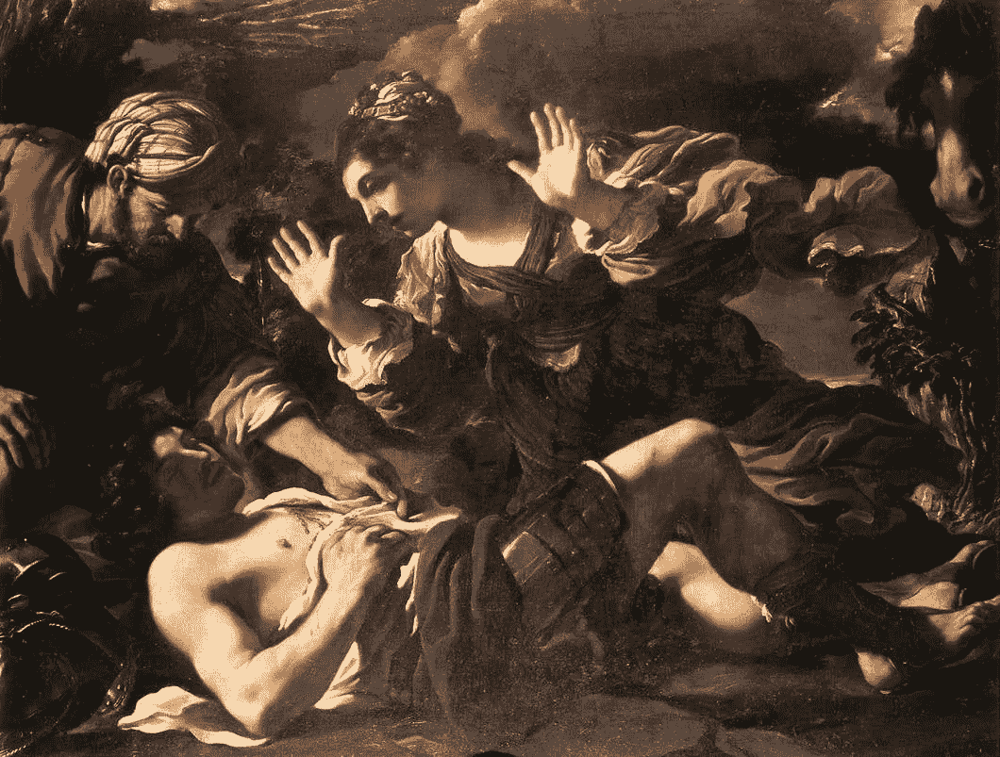
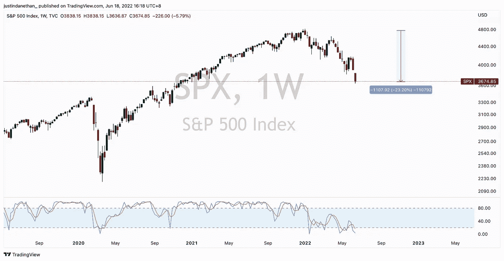
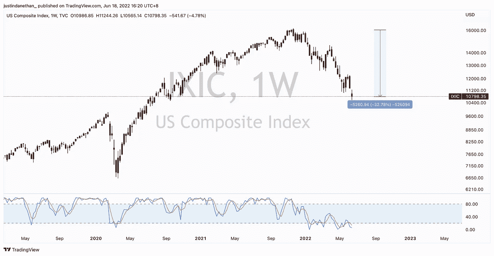
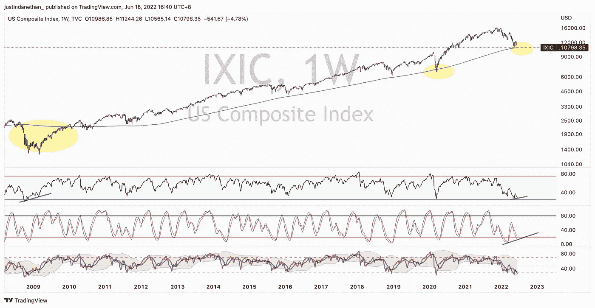
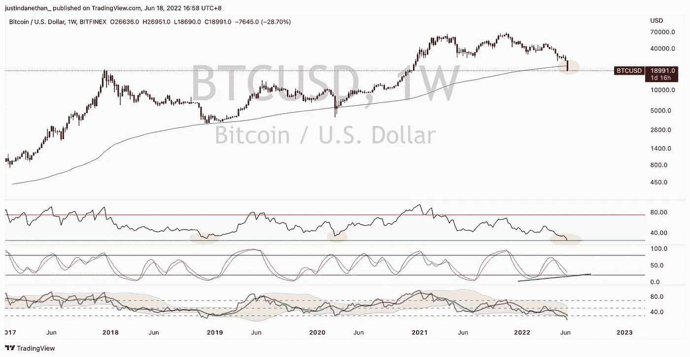

# 三分钟。每周市场情绪总结—6 月 18 日

> 原文：<https://medium.com/coinmonks/3-min-weekly-market-sentiment-wrap-up-june-18th-b92d55210be3?source=collection_archive---------34----------------------->

虽然可能很痛苦，但当前的环境看起来很迷人。我在 2008 年 2 月买了我的第一只股票，刚过 18 岁。自那以后，我几乎只在超级宽松的货币环境和“只涨不跌”的环境中发展(尽管，可以肯定的是，在这一过程中有剧烈的回调，这是载入的好时机)。

今天，我感到与 2020 年 3 月或 2015 年 8 月 2018 年调整时同样的喜悦。以前觉得贵的东西现在觉得打折了。

区别可能在于:轻松赚钱的时代可能已经一去不复返了。可能不会，也不是真的会，但是通货膨胀正迫使中央银行提高利率，推进量化紧缩。

在这种背景下，风险资产尤其是成长型股票正在被扼杀。有趣的是，许多世界新闻几乎是不相关的。我听交易者(专业人士)说，他们似乎只谈论:债券、收益率、长期、曲线前端、提示等，都是关于固定收益资产的预期。然后只有它转化为股票的价格。

显然，这种解读是，东西仍然不够便宜。S&P 和纳斯达克分别从历史高点下跌了 25%和 30%。

我个人认为，我们可能会找到一个局部的底部，也就是说，不是一个长期的底部，而是一个中期的底部。这是因为，从广义上讲，没有任何动力以任何显著的方式回到过去；我们还没有看到地缘政治紧张局势、中国封锁、供应链解决方案、对食品的乐观看法的解决方案，也没有看到美联储的解决方案。

简单地说:阻力最小的路径是向下的，而不是向上的。

然而，在转向加密之前，传统金融整体动态的一线希望是，一系列指标处于极度超卖水平。这可能暗示着一个真正的范式转变，事情需要以一种戏剧性的方式重新评估，图表不再有意义，或者，这意味着我们接近完成，最终我们会看到一些改善和改变，事情可以反弹回来。这是关于你是否认为“这是不同的时代”。

crypto 呢？该死，真是疯狂的旅程。考验我的决心。

澄清一下，我不是一个交易者，只是一个投资者，一个积累者，一个买入并持有的人，一个霍德勒，无论是加密还是传统资产。我对任何事物的看法都和我对房地产的看法一样:我购买并持有 10-20-30 年，实际上可能是为了后代。

这意味着我拒绝通过卖出和以更低的价格回购来进行优化。我只是将我讨厌的现金流入我喜欢的资产(美国股票、欧盟股票、新兴市场股票、实物房地产、房地产投资信托基金、贵金属、TIPS、长期债券、收藏品、威士忌酒桶，是的，还有密码)。

现在，价值 100 英镑的加密投资组合现在只值 30 英镑，跌了 70%。这是没有办法的，如果你持有的是大量下降的 alt(更不用说 LUNA-现在的 LUNC-已经降为零)。

这无助于我们遭受的主要戏剧性事件，不知何故都与卢娜和 UST 的崩溃有关。与 Celsius，Alameda，Galaxy Digital，三箭资本，Genesis。Celsius 冲向门口，领先于同行，但不久后却发现自己面临压力，这是你能得到的最接近“银行挤兑”的情况，用户纷纷撤资，大部分资产被锁定在 stETH (staked ETH)中，无法足够迅速地脱手，或退出杠杆头寸，或收回它本应发放的抵押贷款。然后，3AC 遭遇了杠杆头寸，似乎正面临破产，并拖欠许多合作伙伴的贷款。传染病似乎蔓延到巴别塔金融，银河，BlockFi，也许在一定程度上创世纪。

然而，尽管发生了这一切，我还是情不自禁地成为了一名买家。本周早些时候，我以 21K 的价格买入了 BTC，以 1200 美元的价格买入了 ETH。没有 alt 在这种环境下，我可能不是一个足够冒险的人。

我很有信心在这里添加，虽然，即使我们正在下降到 20K 以下(当我写这篇文章的时候！).关键是永远不要抓住绝对的底部，而是要平均。我已经买了 30 多万，20 多万，20 多万，可能还有 10 多万。

我的观点是这样的:你认为 BTC 有价值，并会在未来 5-10-20 年保持增长，还是你认为这一切都将归零？可以向 ETH 提出类似的问题。

如果你认为它在上涨，如果你恨自己“没有早点买入”，如果你说你应该在低位买入……这是你的时候了。但当然，现在让我们回到那个价格的原因让你怀疑是否真的扣动了扳机。

公平地说，从技术角度来看，没有什么能阻止 BTC 继续下跌。一切都是关于供给和需求；没有人能真正证明 BTC 值多少钱。再一次，正如开始所说，BTC 和我一样，没有在超级宽松的环境下交易过。

然而，还是有一线希望:从历史上看，指标处于极端水平。我们刚刚跌破 200-W 移动平均线，每周的 RSI 处于历史最低水平，放缓的随机指标似乎想画一个看涨背离。

我怀疑我们正在形成一个长期的底部。但这将是一个底部，不会像我们所熟悉和喜爱的普通 V 形。这将是一个痛苦的、范围有限的过程，并将考验投资者的耐心。

请注意，底部可能只会在 15 岁左右到达，访问量会进一步下降。

你真正要做的是什么…还在积累。

底部形成的时间越长，无论是在 20 多岁还是 10 多岁，都意味着我们有更多的时间将自由现金配置到我们喜欢并愿意持有的资产上，比如房地产。

ETH 也值得一提。合并即将到来，将极大地改变供应动态，从而改变每枚硬币的定价。我认为它几乎与对美元的量化紧缩平行(在这种环境下，美元无法停止增值)；不会有太多的乙醚存在，但却是最安全和最广阔的 DeFi 生态系统。

当情况好转时，我预计我们现在讨厌的波动会对我们有利。

还有另一个“这次有所不同”的角度，即现在以更真实的方式涉及的生态系统:银行、大型券商、高频基金和做市商、大型支付提供商、投资工具、结构性产品、资产管理公司和养老基金、国家，然后是一系列家族理财室、HNWI 等。

下周见。

*免责声明:此处包含的任何信息都不构成购买或出售任何货币、产品或金融工具、进行任何投资或参与任何特定交易策略的要约(或要约邀请)。*

> 加入 Coinmonks [电报频道](https://t.me/coincodecap)和 [Youtube 频道](https://www.youtube.com/c/coinmonks/videos)了解加密交易和投资

# 另外，阅读

*   [在美国如何使用 BitMEX？](https://coincodecap.com/use-bitmex-in-usa) | [BitMEX 评论](https://coincodecap.com/bitmex-review)
*   [最佳期货交易信号](https://coincodecap.com/futures-trading-signals) | [流动性交易所评论](https://coincodecap.com/liquid-exchange-review)
*   [南非的加密交易所](https://coincodecap.com/crypto-exchanges-in-south-africa) | [BitMEX 加密信号](https://coincodecap.com/bitmex-crypto-signals)
*   [MoonXBT 副本交易](https://coincodecap.com/moonxbt-copy-trading) | [阿联酋](https://coincodecap.com/crypto-wallets-in-uae)的加密钱包
*   [雷米塔诺评论](https://coincodecap.com/remitano-review)|[1 inch 协议指南](https://coincodecap.com/1inch) | [购买 Floki](https://coincodecap.com/buy-floki-inu-token)
*   [MoonXBT vs Bybit vs 币安](https://coincodecap.com/bybit-binance-moonxbt) | [Arbitrum:第二层解决方案](https://coincodecap.com/arbitrum)