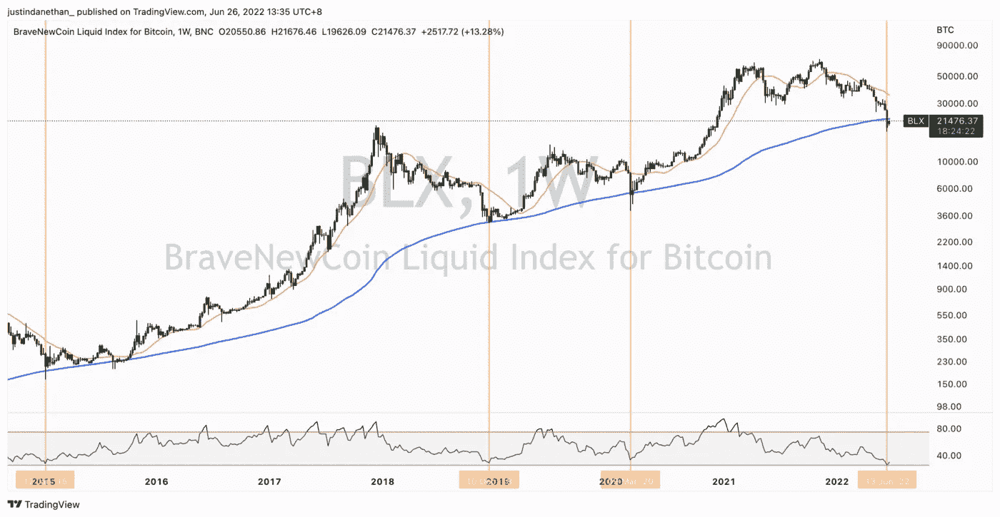
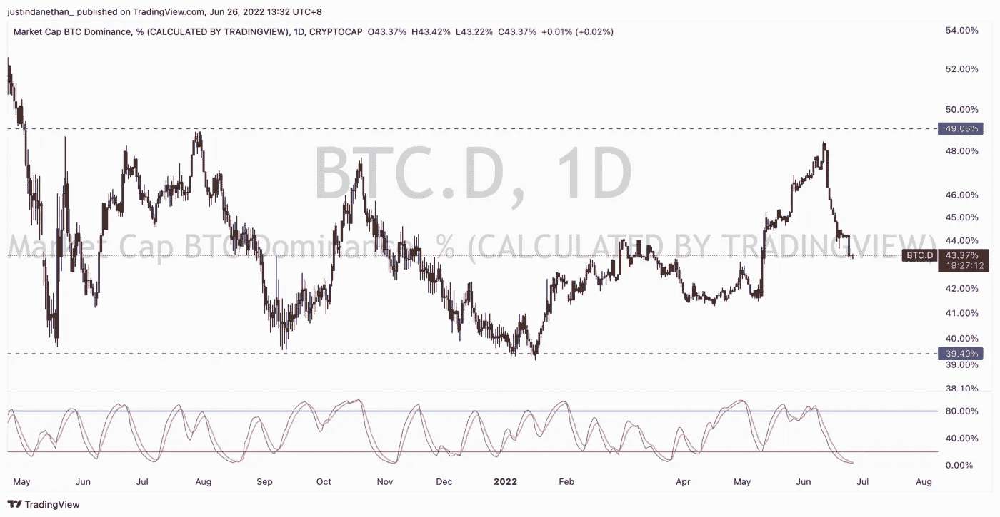
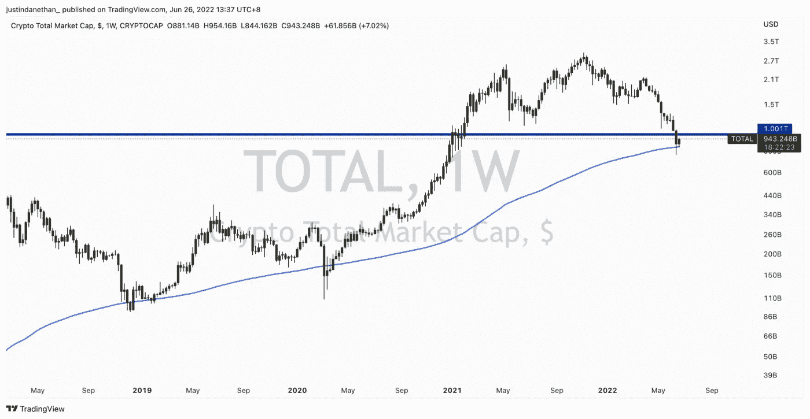
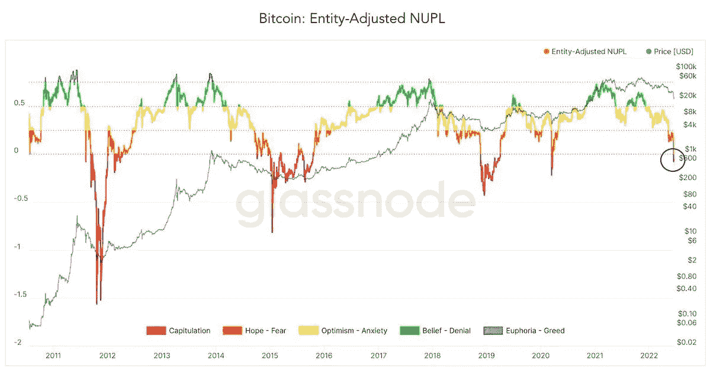
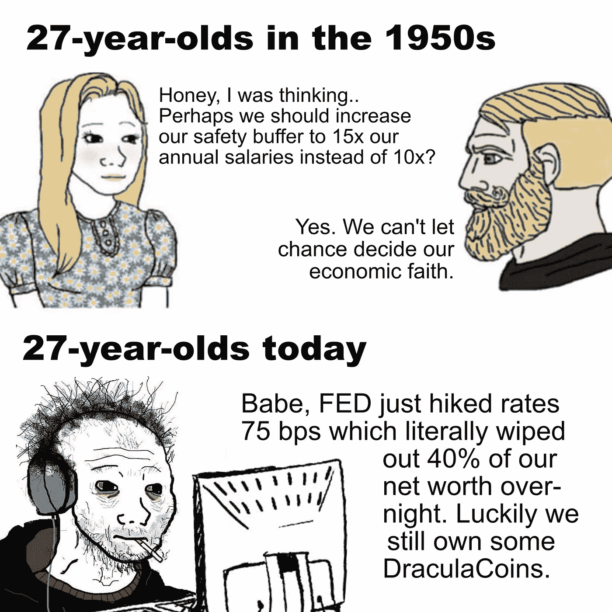
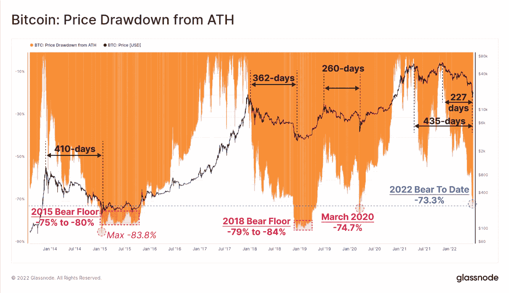
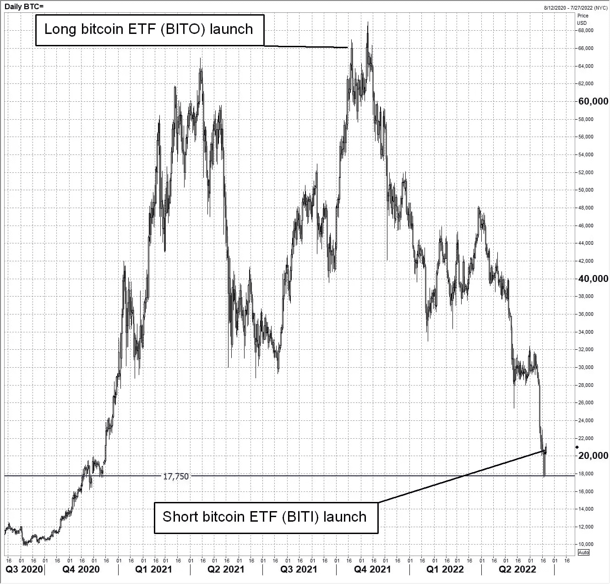
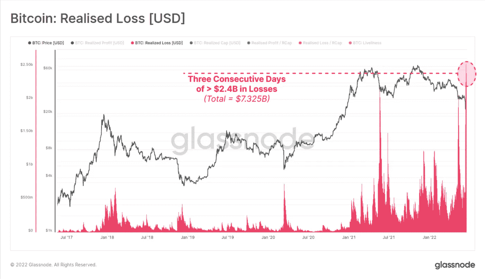
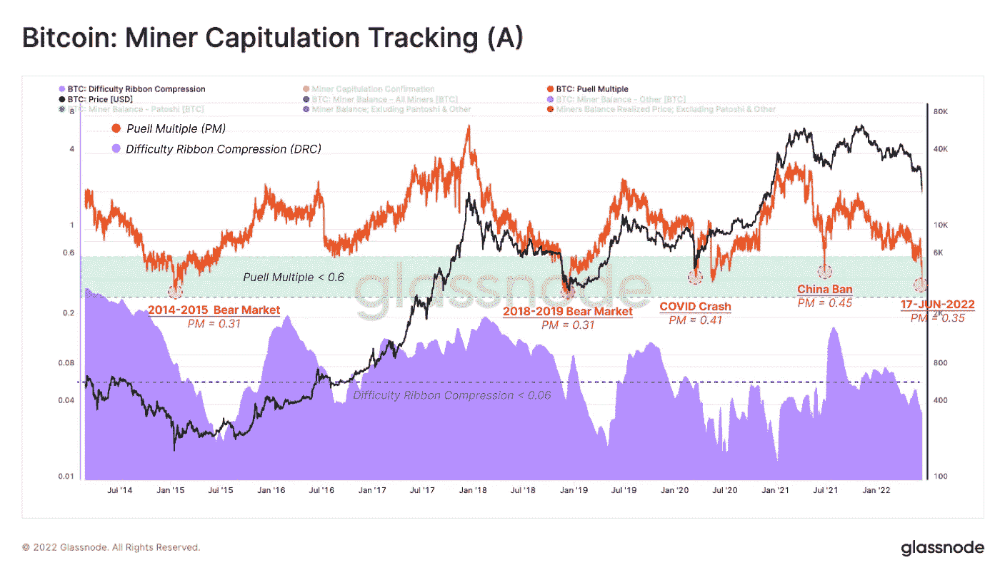

# 三分钟。每周市场情绪总结—6 月 26 日

> 原文：<https://medium.com/coinmonks/3-min-weekly-market-sentiment-wrap-up-june-26th-627f90e7c561?source=collection_archive---------24----------------------->

这周表现不错。我想没什么好激动的，但还是值得一看。如前所述，从技术角度来看，所有东西都超卖了——包括加密和传统资产。

如果你在 LinkedIn 上关注我，你会看到我每天都在发帖，通常会提醒我，随着货币环境的变化，现金越来越少，所以我不认为会出现大幅反弹。我们已经习惯了宽松货币世界中的 V 型底部，我们从派对中醒来，宿醉可能只会随着时间变得更糟。

也就是说，从价格角度来看，我们可能处于或接近底部。我只是觉得需要很长时间才能形成，会考验耐心，纪律性，情感强度等。

还有一个有趣的想法是，一些风险较高的资产已经大幅下跌，在一个基于不同收益率和央行政策的重新定价时期，它们理应如此。这些资产可能比大型公司或指数更早触底。

这个理论很简单，可能过于简单化，而且非常错误，但是:当股价下跌 70%、80%或 90%时，很难再跌了——除非它们完全破产/跌到零。因此，尽管所有的东西都在出售，我们仍然处于熊市趋势中，但没有太多东西可以出售。

一个例子可能是 AVAX (Avalanche ),这大概是一个高质量的加密项目，有一个好的领导团队，大量的活动，非常便宜和快速的交易。较历史高点下跌了 87%。关键是:那些该卖的已经卖了，被平仓的杠杆多头已经“赚”了。这并不意味着剩余的持有者不能进一步出售，但你会认为他们会更快屈服，宁愿现在拿着他们微薄的袋子观望，而不是出售所剩无几的美元价值。

不过，加密看起来不太好。BTC 仍然低于 200 W 移动平均线，而且从来没有这么长时间低于它。RSI 处于最低读数，并开始向上追溯。但我们可能会看到价格继续下跌，指标只是恢复向下，而我们保持较低。那会很痛苦。

不过，还是有一些希望的，大多数高质量的替代硬币显示出看涨的周吞没模式，这是一个强劲的价格上涨周，回撤接近或超过前一根蜡烛线。

你可以看到 BTC 优势指数下降，因为人们用替代硬币进行更高风险的押注，似乎表明大量投资者愿意在这里做多。

从另一个角度来看，从技术形态来看，总市值目前比 BTC 表现得更好。并不是说大多数狗屎硬币都没用。但是，还有其他用例、链、项目、dApps 等。

我不好意思说，我自己也有很多硬币。我的核心投资组合是 55%的 BTC 和 25%的 ETH，然后是 DOT 和 VET。但在整个熊市趋势之前，我也允许自己在一系列替代币上投入少量资金，认为自己有点像风投。这显然不是最好的举措，尽管我仍然认为在下一轮牛市中会出现大量替代硬币。

我所做的，不过，是循环一些替代硬币为其他替代硬币。这是超级相对的，但本质上我观察了从历史高点到现在的表现，并观察了几批硬币:哪些硬币在 80%和 85%之间下跌？什么从 75%下降到 80%？等等。然后，在这些批次中，我看着我宁愿继续持有的硬币和我宁愿扔掉的硬币。后者与前者互换了位置。

基本上，如果两个硬币几乎化为乌有，但你仍然对其中一个有信心，而对另一个没有信心，你还不如重新专注于你喜欢的那个。

实际上，这个星期就这些了。

我从所有 whatsapp/telegram 聊天、slack 频道、电子邮件和客户电话中获得的共识是:在熊市趋势没有改变的情况下，我们正在迎来一次轻松的反弹，这种趋势应该会继续下去，给投资者带来更多痛苦。

当所有人都极度看跌时，我认为这就是暂时逆向投资的价值所在。

和往常一样，我从不提倡一次性投资决策，但我总是希望平均投资(或退出)我打算持有 10-20 年的资产。我买的每样东西都被视为和我买公寓一样，不是被翻转，而是被持有——可能是永远持有。

分享一些很酷的图表，因为我有它们，并且认为它们是相关的。

> 加入 Coinmonks [电报频道](https://t.me/coincodecap)和 [Youtube 频道](https://www.youtube.com/c/coinmonks/videos)了解加密交易和投资

# 另外，阅读

*   [密码交易机器人](/coinmonks/crypto-trading-bot-c2ffce8acb2a) | [概率评估](https://coincodecap.com/probit-review)
*   [CryptoHopper 替代品](/coinmonks/cryptohopper-alternatives-d67287b16d27) | [HitBTC 审查](/coinmonks/hitbtc-review-c5143c5d53c2)
*   [CBET 评论](https://coincodecap.com/cbet-casino-review) | [库科恩 vs 比特币基地](https://coincodecap.com/kucoin-vs-coinbase)
*   [折叠 App 回顾](https://coincodecap.com/fold-app-review) | [Kucoin 交易机器人](/coinmonks/kucoin-trading-bot-automate-your-trades-8cf0ca2138e0)
*   [如何匿名购买比特币](https://coincodecap.com/buy-bitcoin-anonymously) | [比特币现金钱包](https://coincodecap.com/bitcoin-cash-wallets)
*   [币安 vs FTX](https://coincodecap.com/binance-vs-ftx) | [最佳(SOL)索拉纳钱包](https://coincodecap.com/solana-wallets)