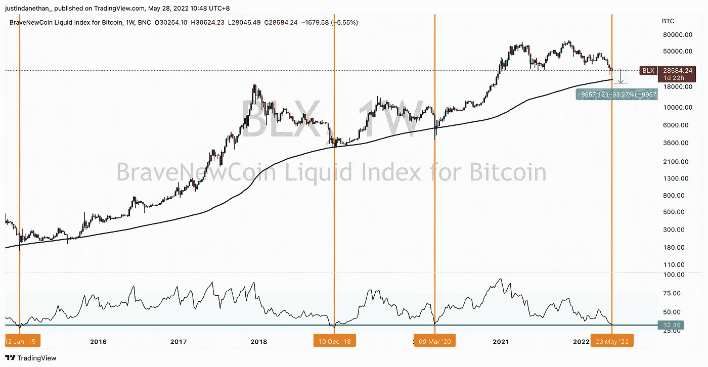
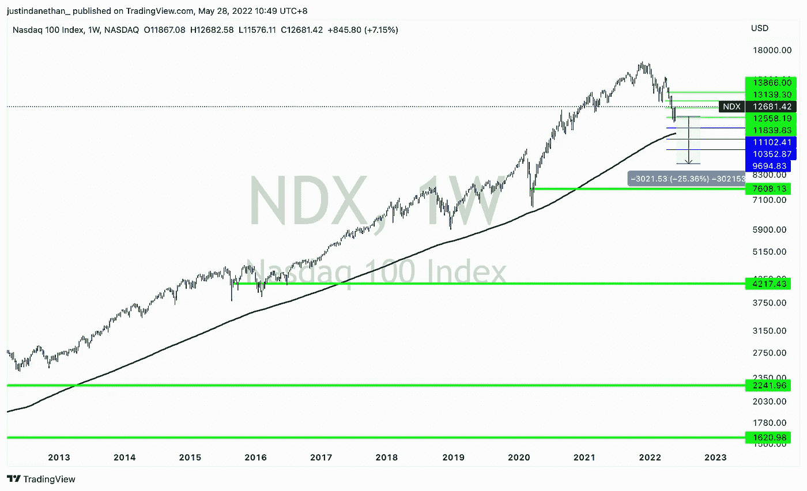
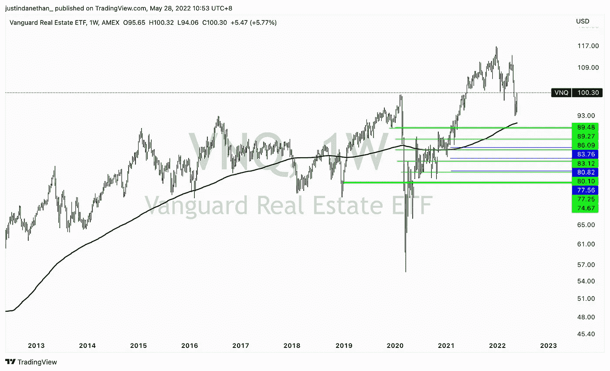
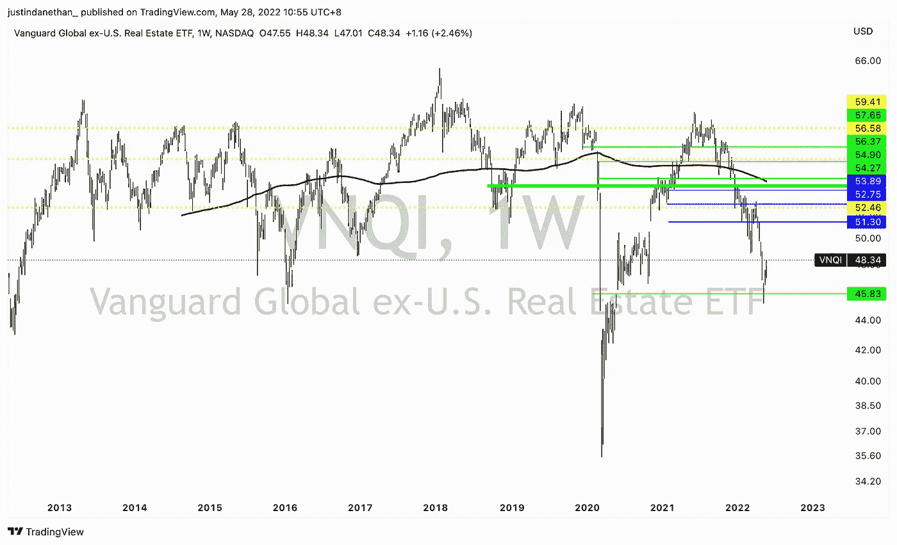

# 三分钟。每周市场情绪总结—5 月 28 日

> 原文：<https://medium.com/coinmonks/3-min-weekly-market-sentiment-wrap-up-may-28th-357bfd283a3b?source=collection_archive---------28----------------------->

指导我投资风格的一个核心原则来自一位导师，他说:“只要你对交易感到兴奋，你就不会赚钱”

上面的感觉可能有点令人沮丧，但这个想法听起来很真实。投资是关于一个清晰的战略，一个明智的计划，你要严格执行。当你兴奋的时候，你也是反应性的，情绪化的，好战的，有偏见的，等等。

作为一名买入并持有的投资者，我真的不再做太多交易了，但仍然用同样冷静、客观、自律的心态来观察市场。

在过去的两三个月里，我一直在分享我的看跌倾向。有太多关于回撤的叙述，而没有足够的关于上行的叙述:通胀是真实的事情，各国央行加息伴随着量化紧缩，地缘政治紧张局势对投资者、商业、国际贸易和供应链产生了真正的影响，以及 covid 仍然困扰着中国。

慢慢地，投资者似乎已经戴上了玫瑰色的眼镜，接受了自己的命运。大多数人现在都变得悲观了。

反向投资者会意识到这一点，然后想:好吧，等一下，如果现在每个人都在下跌，我难道不应该进行反向交易吗？答案是响亮的“是！”…但还不是时候，或者说还没有完全结束。

你可以开始看到复苏的迹象，一轮遥远的朝阳。

关于通货膨胀的话题，虽然我一直强烈反对大多数政府不断印钞，这注定会导致某种购买力下降(通货膨胀是其中的一个症状)，但它似乎可能已经见顶。通货膨胀是按年来计算的，所以这意味着虽然物价可能会上涨一段时间，但当你进入下一年时，计算价格相对涨幅的基准会更高，因此通货膨胀的涨幅相对较低。我们可能正处于通胀初现见顶迹象的时刻。这并不意味着它已经恢复，但这是一个开始；有希望。

在这种情况下，央行将有更多的回旋空间来暂停加息，并避免投资者和养老基金遭受太多痛苦，这些基金基本上完全暴露在金融市场中。

我想重申:我们还没有到那一步，但这些动态正在开始形成，并暗示你可以从大型基金发布的头条新闻和数据中收集信息。

类似地，在其他地缘政治紧张局势和供应链问题上，我认为尾部风险(可能改变当前现状的不太可能的事件)是乐观的一面，而不是悲观的一面——战争的意外解决、独裁者的死亡、贸易处理方式的快速政策转变、covid 规则的应用、意外地区的新赢家可以提供令人信服的替代方案……我们——根据定义——无法预测或定义但可以左右市场的事情。

再说一次，我们还没有到那一步，也没有任何改变。但是能意识到这些就好了。

这一切都很好，但是……我们该怎么做？

如前所述，我是投资者/累积者，而不是交易者。我本质上只是一个回调时的买家，而不是一个把握市场时机并试图抓住绝对底部或顶部的人。

考虑到这一点，我认为一个人唯一能做的就是最大化和收集他拥有的任何流动性，并逐步配置到他愿意在未来 4-5 年持有的资产中。

这可能会被一句“当然，当然，我是一个长期投资者”漫不经心地置之不理。但你是吗？一两年后，你会接受投资组合停滞不前，甚至从盈亏平衡点再跌 10-20-30%吗？答案应该是肯定的——如果有什么的话，这应该是一个继续分配的好机会。但是你仍然情绪化吗，你仍然对交易感到兴奋吗，或者你将能够遵守你的策略和计划吗？

如果以上问题的答案是肯定的，我的预测是:

我认为我们应该再降 10-20%。

这对我不好，我已经开始购买风险资产了。这也不是最糟糕的，我仍然有资本可以分配，所以我急切地等待一个机会来购买贴现资产。

除非出现意外的变化，否则目前的说法仍然成立，而且，信不信由你，投资者仍然需要消化和定价。同样值得注意的是，底部可能不再是 V 形，因为宽松的货币制度似乎已经过时了。换句话说，预计底部将需要更多的时间来形成，上涨将比过去 12 年更加艰难。

对于 crypto 来说，这意味着 BTC 还没有完成回溯。我们目前在 20 公里以上(在月球/UST 崩溃期间，在 20 公里左右的早期访问之后)。我们可能需要重新测试较低的 20Ks 如果不是更低的话。这比目前的价格下降了 30%以上。疯狂的权利，考虑到我们已经从历史高点下跌超过 55%？

对于股票，我认为纳斯达克指数还会下跌 15-25 %,可能会更温和，只是假设波动性更小，从基本面来看，投资更容易合理化(即无论你认为 BTC 有多大价值，它仍是由需求和供给驱动的，而一家盈利且资本充足、拥有基础设施和用户网络的企业，拥有可量化的估值指标。

房地产是我的另一个首选投资工具——虽然不是我投资组合中的一大块，可能只有 15 %- 20%。随着利率上升，它也受到了影响，这是买入和“hodl”(请原谅这种加密的本土俚语)的机会。VNQ 和 VNQI(先锋美国和国际房地产交易所交易基金)提供健康的 5-10%年度股息，按月支付。这是一个分散投资的好方法，可以通过一个流动性的工具获得固定的、真正被动的收入，同时也可以从房地产价格的上涨中获益。

所有这些都是为了说:如果你有可用的资本，不要绝望或思考如何更好地投资当前的投资组合或应该做什么，只是冷静地继续配置(在下跌时下单)。当其他兴奋的参与者犯错误时，你耐心地盯着奖品，享受波动，这是降低你在许多资产中的总进入价格的机会，从而降低你整个投资组合的盈亏平衡水平。

街上有血的时候买，就算是自己的。

*免责声明:此处包含的任何信息都不构成购买或出售任何货币、产品或金融工具、进行任何投资或参与任何特定交易策略的要约(或要约邀请)。*

> 加入 Coinmonks [电报频道](https://t.me/coincodecap)和 [Youtube 频道](https://www.youtube.com/c/coinmonks/videos)了解加密交易和投资

# 另外，阅读

*   [如何在 Uniswap 上交换加密？](https://coincodecap.com/swap-crypto-on-uniswap) | [A-Ads 评论](https://coincodecap.com/a-ads-review)
*   [WazirX vs coin dcx vs bit bns](/coinmonks/wazirx-vs-coindcx-vs-bitbns-149f4f19a2f1)|[block fi vs coin loan vs Nexo](/coinmonks/blockfi-vs-coinloan-vs-nexo-cb624635230d)
*   [本地比特币审核](/coinmonks/localbitcoins-review-6cc001c6ed56) | [加密货币储蓄账户](https://coincodecap.com/cryptocurrency-savings-accounts)
*   [什么是保证金交易](https://coincodecap.com/margin-trading) | [美元成本平均法](https://coincodecap.com/dca)
*   [支持卡审核](https://coincodecap.com/uphold-card-review) | [信任钱包 vs 元掩码](https://coincodecap.com/trust-wallet-vs-metamask)
*   [Exness 回顾](https://coincodecap.com/exness-review)|[moon xbt Vs bit get Vs Bingbon](https://coincodecap.com/bingbon-vs-bitget-vs-moonxbt)