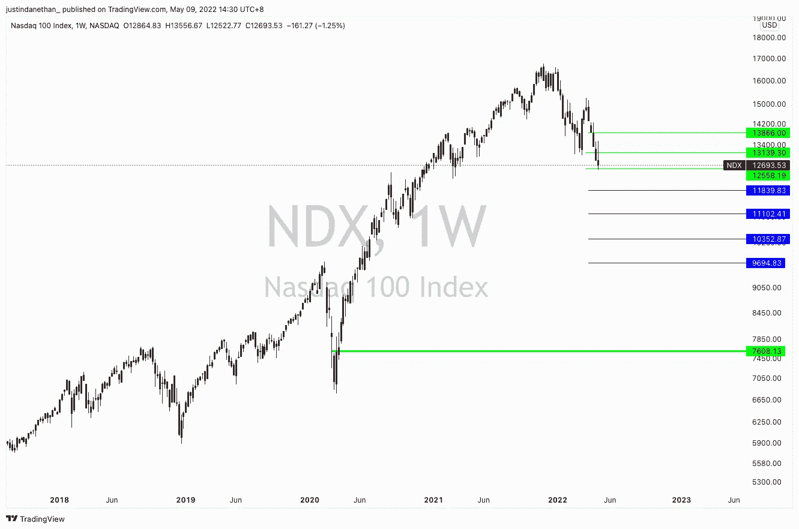

# 三分钟。每周市场情绪总结—5 月 9 日

> 原文：<https://medium.com/coinmonks/3-min-weekly-market-sentiment-wrap-up-may-9th-f60818a555d4?source=collection_archive---------53----------------------->

在过去一个月左右的时间里，我一直在阐述我对市场的悲观看法。这种情绪似乎已经渗透到了其他投资者的头脑中。有很多悲观、绝望和投降的开始。

我倾向于逆向投资，但就目前而言，我将坚持我最初的观点和市场的其他观点。可能还有更远的路要走。

当然，这取决于你的时间范围，但对于长期投资者来说，没有必要急于或试图在反弹时赚快钱。随着风险资产贬值，我已经并将继续平仓。

稍后我将分享一些看涨因素，但当前的焦点仍然是加息对估值、需求和成长型资产相对于可能更安全的资产的吸引力造成的压力。债券正接近或正处于实际利率。所以问题是，在市场消化所有这些的时候，你是想呆在安全的现金和债券中，还是想赌一把。就美元而言，目前投资者似乎仍坚持前者。

令人担忧的是，痛苦将持续下去，直到美联储改变方针，暂停加息，甚至逆转加息。

这似乎不会很快发生。我们可能需要等待三到六个月来消化这一切，让价格反映真实的影响。

值得注意的是，美国和其他国家的国内生产总值不像预期的那样引人注目，因此很难找到投资的理由。

乐观的一面和我开始平均的原因是:

*   我仍然相信在未来的三年、五年、十年、十五年里，股票，尤其是科技股的长期上涨空间。这可能看起来像一个疯狂的长期前景，但错过了一个买入机会，因为“我在等待时机/抓住绝对底部”是一个未被优化的投资组合的秘诀。就这么简单:在过去的 50 年或 100 年里，投资总比不投资好，尤其是作为一个多元化的持有者。
*   尽管新的利率环境以及俄乌战争或上海 Covid 局势的宏观影响改变了估值模型，但风险资产大幅下降。足够让你认为有机会分配至少一部分投资预算——也许留一些以备进一步下跌
*   我喜欢听沃伦·巴菲特和伯克希尔·哈撒韦团队提到，他们在过去一个季度购买的股票比 2008-2009 年的任何一个季度都多。价值投资者似乎认为合适的股票估值有折扣，并愿意投入大量资金。
*   潘迪拉资本时事通讯更加关注加密——当然是为他们的区块链基金做宣传——指出他们筹集的资金比最初预期的多，并且他们看到了该领域其他基金的这种动态。这可能需要一两年的时间来投资，但最终代表着一大笔钱，将推动加密市场的市值上升。
*   最后但并非最不重要的一点是，这个周期非常不同，我记得在 2017 年至 2018 年，人们说比特币将会消亡，最终将为零……你再也听不到这种说法了。这凸显了观念上微妙但根本性的转变。人们知道 crypto，了解其基本价值，如果折扣足够的话，他们会愿意购买(而不是匆匆离去)。

我的结论与前几周相似。我相信还会有进一步的下跌，但我认为这是一个很好的机会来配置你有信心并看到上涨的资产。

2020 年 3 月可能是我投资生涯中最美好的时光，我一直期待着一场残酷的波动事件，并在下跌过程中等待买单。当它到来的时候，当其他人都很痛苦的时候，我觉得圣诞节提前到来了。

我们正处于类似的回调时期，尽管持续时间更长。如果你有资本和足够长远的眼光，享受它吧。

> 加入 Coinmonks [电报频道](https://t.me/coincodecap)和 [Youtube 频道](https://www.youtube.com/c/coinmonks/videos)了解加密交易和投资

# 另外，阅读

*   [MXC 交易所评论](/coinmonks/mxc-exchange-review-3af0ec1cba8c) | [Pionex vs 币安](https://coincodecap.com/pionex-vs-binance) | [Pionex 套利机器人](https://coincodecap.com/pionex-arbitrage-bot)
*   [如何在印度购买比特币？](/coinmonks/buy-bitcoin-in-india-feb50ddfef94) | [WazirX 审查](/coinmonks/wazirx-review-5c811b074f5b)
*   [联合国硬币评论](https://coincodecap.com/unocoin-review) | [最佳加密赌注硬币](https://coincodecap.com/best-crypto-staking-coins)
*   [如何使用 MetaMask Wallet 获取 KCC 地址？](https://coincodecap.com/kcc-address-metamask)
*   [如何获得自己的。XYZ 领域？](https://coincodecap.com/xyz-domain)
*   [最佳加密交换平台](https://coincodecap.com/best-crypto-swap-platforms) | [最佳加密交易所](https://coincodecap.com/crypto-exchange)