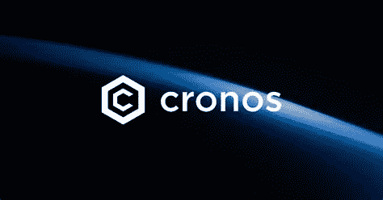
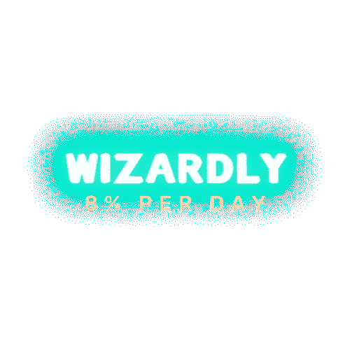
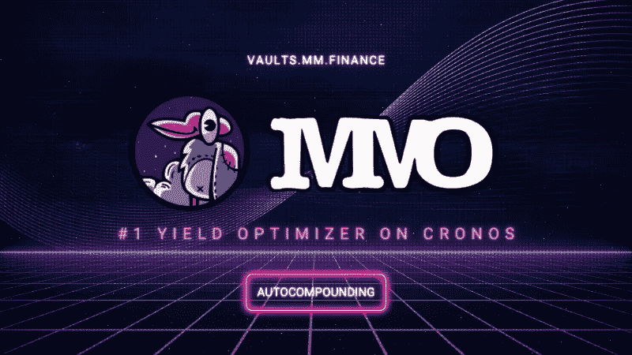

# Cronos chain 生态系统中你不想错过的三个创新项目

> 原文：<https://medium.com/coinmonks/3-most-innovative-projects-in-the-cronos-chain-ecosystem-5bd1b74e7809?source=collection_archive---------24----------------------->

cronos.com

Cronos 是第一个支持 Defi、NFTs 和元宇宙的区块链网络，它可以与以太坊和宇宙生态系统一起工作。它试图通过允许开发者以低成本、高吞吐量和快速终结的方式从其他链中快速转移应用程序和加密资产，来大幅扩展 Web3 用户群。

Cronos 是*[*【Crypto.com】*](http://crypto.com)的产品，代表了一个新的前沿，拥有超过 100 万用户的快速增长的用户群，它是一个易于使用的平台，可以快速移植来自以太坊和 EVM 兼容链的应用程序，每分钟处理的交易量比以太坊更多，使智能合同执行更快，更便宜，更环保。*

*这是一个可扩展的区块链，允许快速、低成本和环境友好的交易。它基于授权证明(POA)。不像其他区块链，这是基于股权和工作的证明，使它吸引了世界各地的用户。链上已经有很多 dapp，但是这里列出了我在 [Cronos](https://medium.com/u/87e5c846c09c?source=post_page-----5bd1b74e7809--------------------------------) 链上有创造性用例的前三个 dapp..*

***毒鹿***

*毒鹿(Deer)是一个反通货紧缩和反通货膨胀的加密项目，这意味着不会紧缩或膨胀，它运行在 Cronos 链上，毒鹿从 BasisCash 以及它的前辈 Pegasus，Soup 和 Tomb Finance 中汲取灵感。*

**

*toxicdeer.finance*

*Pegasus 是一个致力于帮助客户掌控一切的平台，无论他们购买的是老爷车这样的独特产品。Pegasus Finance 由金融行为管理局授权和监管，其免费服务可确保您的休闲车获得最佳建议和独家费率，而 Soup Finance 是建立在 Fusion 区块链基础上的点对点货币市场协议，由 Soup token 持有者拥有和运营。*

*该协议将在最大限度地关注安全性和广泛的市场推广的情况下推出。协议费用被分配用于购买和烧汤代币，使其随着更高的采用而紧缩。*

*$坟墓算法令牌也是一个快速增长的生态系统的支柱，旨在为 Opera 网络带来流动性和新的用例。因此，毒鹿结合并放大了所有的特征，这就是它的伟大之处。*

*ToxicDeer 通过将 DEERit 的原生令牌与 USDC 绑定，为 USDC 提供额外的应用程序，并增强 ToxicDeer 在 Cronos 生态系统上的流动性，来支持其协议。*

*因此，向 USDC 展示这个项目也向我们展示了这个项目最近的成功。作为 USDC 的主要推动者，他们可以通过为其 USDC 有限合伙人提供毒鹿融资空间来吸引 USDC 投资者。显然是让鹿和 USDC 合二为一了。*

*它们是在有毒的鹿的生态系统中运行的三个令牌，首先是鹿，这是 USDC 挂钩的算法令牌，XDSHARE 和 XDBOND。*

*当网络扩张时，XDSHARE 的持有者可能会声称鹿通货膨胀。当网络收缩时，XDBOND 的持有者可以收购 Deer，并在网络进入通缩阶段时赎回 Deer。*

# *神奇地*

**

*wizzardly*

*这是 CRONOS 生态系统上最具创意的项目之一，主要目标是建立一个基于 Cronos 网络的分散式$CRO 矿工奖励池 dApp，允许用户通过其易用性实现财务独立。将自己资金的所有权和控制权归还给他们，使他们能够按照自己认为合适的方式使用资金。*

*它主要是为了人民和社区的利益而建造的。*

*有一个高风险、高回报的系统，包括一个令牌，它将支持和充实每日交易者的回报池，同时保持其自身的效用。Wizardly 已经开始寻求通过一个敬业的团队公开、透明和诚实的承诺来重新点燃 CRONOS 网络。*

*Wizzardly 声称，其目标是该项目接管 CRONOS，并成为所有相关方的稳定被动收入来源。*

*只要合同中包含 TVL，魔法就会持续，而且奖品是可以得到的。那些过于频繁地想要启发(要求)的人将会受到收益递减的惩罚。然而，如果你继续将(复合)注入仪式中，你将收获显著的优势。获得你的 CRO，把咒语和你的内在魔法连接起来，以扩展它的范围。你的 CRO 将会被仪式消耗掉，你将能够进入咒语。*

*有几个简单的步骤可以开始使用 wizardly。*

*首先，获得你的$CRO 并加入咒语，通过运用你的内在力量来扩展它的范围。*

*你的$CRO 会被仪式消耗掉，你会被这个咒语吸引。关于这个魔法*

*它将免除你的$CRO 代币(存款),然后在接下来的 6 天里每天注射..(称为复利)*

*允许魔法在第七天启发你(声称)，并召集你的施法者同伴用他们的克罗诺斯令牌协助我们，以便仪式可以到达每个人。我们是叉子上的烤豆子。*

# *MMM 优化器*

**

*mm optimizer*

*MM Optimizer 建立在 MM Finance 的基础上，旨在为人们提供最简单的方法来赶上 DeFi 潮流。它们通过支持底层的 DeFi 技术和生态系统(CC)来帮助 Cronos 链增加用户产量。自从使用 MakerDAO、Aave、Compound 等既定协议在各种区块链网络上开发 Yield Aggregator 项目以来，我们都看到了 2020 年 DeFi 活动的大幅增长。因此，他们主动利用各种 DeFi 协议和策略来优化他们的用户收入，作为一个产量聚合者，在产量农业经济中占据重要地位。*

*MMO 硬币是本土治理的象征。MMO 所有者完全控制环境，并主要从农场绩效费中获利。持有或投资 MMO 有利于整个 MMO 生态系统，也有利于个人收入。*

*总共有 5，000，000 MMO 代币。每 1 $CRO 的演出费，铸造 0.25 MMO(这个铸造的数字可能会改变)。铸币量会随着 MMO 价格的上涨而减少)。*

*受益于 MM Optimizer 的一个主要方式是产量农业，加入 Cronos 产量农业的主要动机是廉价的天然气费用，这降低了进入诱人的 DeFi 地区的障碍，并允许用户以最少的现金收获作物，从而产生可观的回报。智能合同是自动化流程的一种方式。*

*因为它们计算适当的复合频率并自动复合用户的令牌，所以 MM Optimizer 使个人能够毫无困难地获得复合的好处。*

*由于他们是领先的创新平台之一，MM Optimizer 与 MM Finance 一起执行产量农业，这是他们的生态系统产品之一，也是该领域的顶级 AMM/指数之一。*

*MM Optimizer 致力于发现和实施新的和改进的产量优化策略。我们将从优化 MM Finance 的产量农场开始，并有可能扩展到其他 Dex 农场。*

*在不久的将来，Cronos 将支持多链互操作性，并将 IBC 桥扩展到更多的 Cosmos 区块链，并通过引入 Cronos 实现更多基于 Cosmos 的资产。*

*它还将加速比特币的接受和新定义、游戏和元宇宙应用的加入。*

> *加入 Coinmonks [电报频道](https://t.me/coincodecap)和 [Youtube 频道](https://www.youtube.com/c/coinmonks/videos)了解加密交易和投资*

# *另外，阅读*

*   *[用信用卡购买密码的 10 个最佳地点](https://coincodecap.com/buy-crypto-with-credit-card)*
*   *[加拿大最佳加密交易机器人](https://coincodecap.com/5-best-crypto-trading-bots-in-canada) | [Bybit vs 币安](https://coincodecap.com/bybit-binance-moonxbt)*
*   *[阿联酋 5 大最佳加密交易所](https://coincodecap.com/best-crypto-exchanges-in-uae) | [SimpleSwap 点评](https://coincodecap.com/simpleswap-review)*
*   *购买 Dogecoin 的 7 种最佳方式*
*   *[最佳期货交易信号](https://coincodecap.com/futures-trading-signals) | [流动性交易所评论](https://coincodecap.com/liquid-exchange-review)*
*   *[火币加密交易信号](https://coincodecap.com/huobi-crypto-trading-signals) | [Swapzone 审查](/coinmonks/swapzone-review-crypto-exchange-data-aggregator-e0ad78e55ed7)*