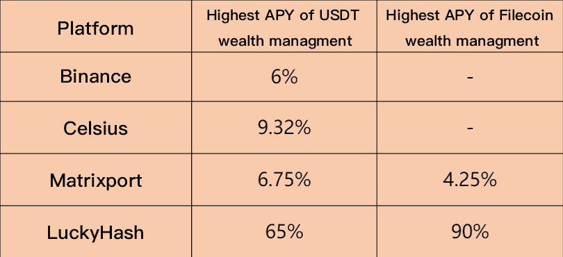

# 2022 年被动增长加密资产的 3 种最流行方式

> 原文：<https://medium.com/coinmonks/3-most-popular-ways-to-grow-crypto-assets-passively-in-2022-14d6c67ef968?source=collection_archive---------31----------------------->

从你闲置的加密资产中获取利息，为你的薪水增加额外收入。

比特币的价格就像过山车一样，一路飙升至 42，000 美元，两天后又跌至 39，000 美元。此外，由于美联储可能随时加息，大多数加密货币投资者都进入了观望状态。买还是甩？不妨去 HODL。

无论你是长期投资者还是短期投资者，你肯定希望你的闲置资金被动增长，就像你在银行存款时发生的情况一样。问题是，如何使用加密货币而不是法定货币获得被动收入？为了回答这个问题，我做了以下**的加密货币提示，这是 2022 年用你的加密货币获得被动收入**的三种最流行的方式。

Source: PSY-HELP-ENERGY

# **01。加密货币财富管理**

加密货币理财是目前各种区块链投资中最稳定的投资方式。把它当作傻瓜的加密货币投资吧，因为投资者不需要为他们闲置的数字资产赚取固定利息。你可以把这个想象成把钱放在有息银行账户里，唯一的区别就是这个服务只支持加密货币存款。

你可以将加密货币存入这些账户，并根据预定的利率获得每日、每周、每月或每年的收益，而不是将加密货币握在手中，等待它们增值。提供加密货币财富管理服务的平台有币安、coinbase、FTX、LuckyHash 等。

需要记住的一点是，不同类型的代币和服务提供商的利率不同。币安、Celsius、Matrixport 的 USDT 理财产品的年化收益率在 6%-9.32%，**之间，而 LuckyHash 的年化收益率高达 60%。**

点击[m.luckyhash.com](http://m.luckyhash.com)浏览其他 APY 最高可达 90%的理财产品。

# **02。加密贷款**

加密货币借贷已经成为 2022 年最受欢迎的加密货币服务之一。作为投资者，你可以把你的密码借给别人并从中赚取利息。有四种方式可以开始:

**P2P 借贷:**

提供这种服务的平台通常允许用户创建定制的条款，决定贷款金额和贷款利息。平台撮合出借人和借款人，类似于 P2P 交易平台撮合买卖双方。当涉及到加密货币借贷时，该借贷系统为用户提供了一定程度的控制。请注意，必须事先将您的数字资产存入借贷平台的托管钱包。

**集中放款:**

你完全依赖于第三方贷款基础设施，利率是固定的，锁定期也是固定的。与前者一样，你必须将你的加密货币转移到借贷平台，才能开始赚取利息。

**分散放款:**

它允许您直接在区块链上执行贷款服务。与之前的策略不同，DeFi 贷款中没有中介机构。相反，贷款人和借款人通过可编程和自动执行的合同(也称为智能合同)进行互动，这些合同自动定期设定利率。

**融资融券:**

最后，您可以将您的加密资产借给对用借来的资金进行交易感兴趣的交易者。这些交易员利用借入的资金扩大交易头寸，并带息偿还贷款。在这种情况下，加密货币交易所代表您完成了大部分工作。你需要做的就是让你的数字资产可用。

# **03。加密云挖掘**

我们知道，比特币挖矿本质上是竞争解决高度复杂的数学难题，以证明自己有资格成为验证者(更普遍的说法是矿工)。由于比特币共识机制的竞争性，矿工必须投资强大的采矿设备，并支付昂贵的电费。

成为一名独立的矿工是一项巨大的投资——为了产生足够的 hashrate，必须对专业的采矿设备进行适当的投资。此外，虽然有关于如何作为一个对编程一无所知的初学者开始采矿的教程，但你仍然需要花费数小时或数天时间来安装和运行你的设备。要知道，你不会在开始后很快就收回所有的钱。

那么如果想用少量闲置的 cryptos 挖矿可以怎么做呢？云挖掘可以帮你做到。

**什么是云挖掘？**

一些公司把他们的 hashrate 放在货架上，你可以购买他们的 hashrate，他们会涵盖所有其他的:技术问题，管理，槽费等。他们中的一些人要求日常维护费，一定要注意这一点。

云采矿可能听起来很容易，但你需要花一些时间 DYOR，因为相当多的骗局案件已经出现，因为云采矿变得普遍。

之前提到的平台 LuckyHash 也提供云挖掘服务。LuckyHash 对于分布式存储基础设施的建设有着周密的长期规划。在首尔、香港、曼谷、马来西亚、新加坡、哈萨克斯坦等地建立了 IDC 数据中心。LuckyHash 在矿业资源、合规性和本地化服务质量方面处于领先地位。

如果你对云挖掘感兴趣，可以在[我的推荐链接](https://m.luckyhash.com/createAcc?invitationCode=031DA6?utm_source=medium&utm_medium=cm)下注册账号，浏览 LuckyHash 产品。(我的推荐人将获得额外的 5 枚金币)

在市场的低谷期，用 cryptos 赚 cryptos 无疑是最安全有效的投资方式。

如果你喜欢我的故事，请留下免费的掌声，干杯！