# 3 P2E 纸牌游戏，如 Axie Infinity

> 原文：<https://medium.com/coinmonks/3-p2e-card-games-like-axie-infinity-38a95b39e5d6?source=collection_archive---------52----------------------->

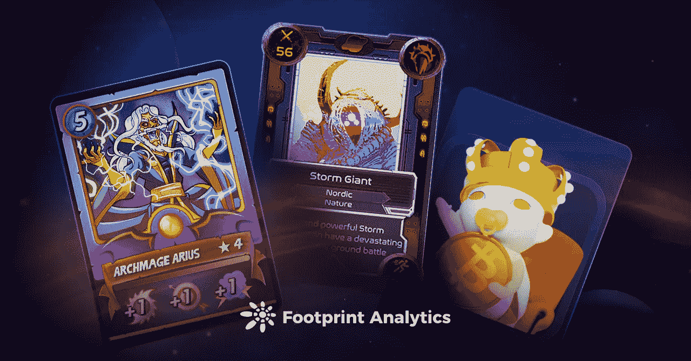

卡牌流派可以出现新的明星游戏吗？

2022 年 3 月

数据来源:足迹分析 [GameFi |卡牌游戏仪表盘](https://www.footprint.network/guest/dashboard/game-fi-card-game-dashboard-fp-633e76ad-52b4-4de3-acfc-06a435b8274f?channel=ENG-220#secret=7056951F29A760D4AD89576BD995F81B)

基于卡片的加密游戏，玩家主要收集 NFT 卡片并与之战斗，从迄今为止最大、最成功的 GameFi 项目之一 [Axie Infinity](https://www.footprint.network/guest/dashboard/axie-infinity-dashboard-fp-db8d941f-2a74-4120-abd4-ff20fc032a5e?channel=ENG-220) 获得了广泛的曝光，2021 年 11 月7 日，其最高市值为[102 亿美元](https://www.footprint.network/guest/chart/axie-infinity-market-cap-fp-7328ebaf-9e90-4120-a287-dd1fa805f483?channel=ENG-220#key=eyJwYXJhbWV0ZXJzIjpbXSwicGFyYW1ldGVyVmFsdWVzIjp7fSwicGFyYW1ldGVyX21hcHBpbmdzIjpbXSwiZGFzaGJvYXJkVXVpZCI6ImRiOGQ5NDFmLTJhNzQtNDEyMC1hYmQ0LWZmMjBmYzAzMmE1ZSJ9)。

与其他 GameFi 类型相比，如虚拟世界 metaverses(沙盒，分散的土地)和 builder 游戏( [DeFi 王国](https://www.footprint.network/guest/dashboard/game-fi-de-fi-kingdoms-dashboard-fp-24af8da6-9ac6-4c8c-a56e-418522f4bb31?day=past30days&game_name=DeFi%20Kingdoms)，我的邻居爱丽丝)，基于卡片的游戏测试玩家的实力和运气。运气好不好，直接影响抽牌的好坏。这给玩家带来了更多的刺激和惊喜。

基于关于 NFT 纸牌游戏的足迹分析数据[，我们发现了 3 种最受欢迎的纸牌游戏，由 Twitter、discord 等社交媒体的追随者来衡量。 **:** 夹板岛，外星世界，还有密码你。](https://www.footprint.network/guest/chart/card-game-ranking-by-popularity-fp-e332aaec-58df-4308-8a67-4e771fb32634?channel=u-DnmMUY#secret=D3F88CBA92D69C438EDEAEF9BE3CB40E)

# 夹板岛

## 什么是夹板岛

[splitter lands](https://splinterlands.com/)由 Matthew Rosen(Ryzing 前首席开发者)和 Jesse Reich(Badische Anilin-und-Soda-Fabrik，巴斯夫前员工)于 2018 年推出。该游戏在 Hive chain 上推出，并于 2021 年 7 月完成了一轮 360 万美元的融资。

夹板地有两种类型的代币。一个是 SPS，BSC 上的治理令牌，以及 DEC，暗能量晶体，用于购买游戏内资产的碎片领地流通货币。

## 如何玩夹板岛

玩家可以购买和收集他们的卡片(NFT ),并制作不同的组合与他人一起玩。玩法类似炉石。

首先，用户必须花费 10 美元购买一本召唤召唤师的咒语书。每本魔法书都是一个有唯一号码的 [NFT](https://www.footprint.network/guest/dashboard/nft-annual-report-dashboard-in-2021-fp-0eea200c-b571-4ebe-a005-524b121a5102?channel=ENG-220) 。

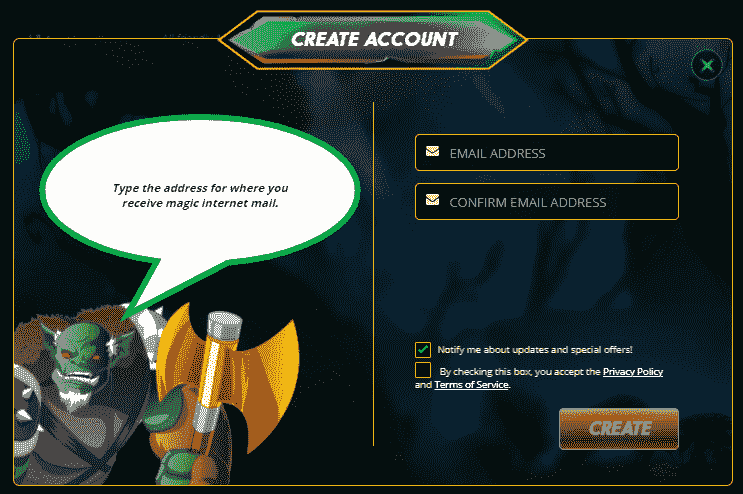

[*Sources — Splinterlands — Sign Up*](https://splinterlands.com/)

调用召唤师后，玩家可以做 4 件事:

*   完成日常任务以获得季度奖励。每个季节大约持续 14 天。
*   通过对战、试玩或参加锦标赛来赢取奖励。
*   完成基本任务，等待空投(治理令牌 sp)。
*   通过出租森林、土地和设备获得收入。

战斗每回合使用 6 张怪物卡和 1 张召唤师卡。作为奖励，如果玩家赢得游戏，他们会收到卡片和卡片。

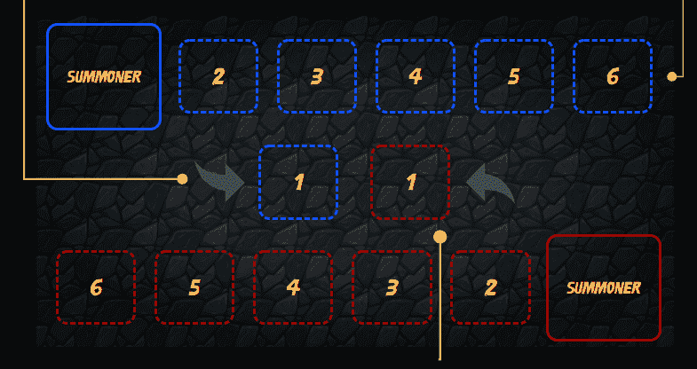

[*Sources — Splinterlands — The Battlefield*](https://splinterlands.com/?p=gameplay)

关于分裂之地的统计

**代币价格**

DEC 和 SPS 在去年的涨跌幅度大致相同。最高价格出现在 10 月 14 日左右。自那以后，它们开始下跌，后来有所回升，但随后又再度下跌。总体而言，它们受到了更大的市场趋势的影响。

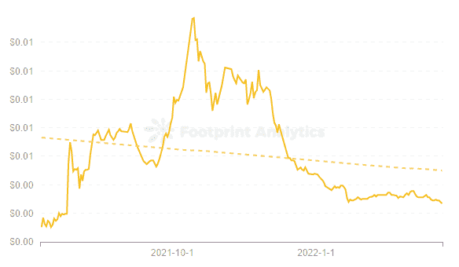

[*Footprint Analytics — Price of DEC*](https://www.footprint.network/guest/chart/price-of-dec-fp-b30b5d7f-1969-4b37-81a4-e12e3a51e71f?channel=u-b1lc4J)

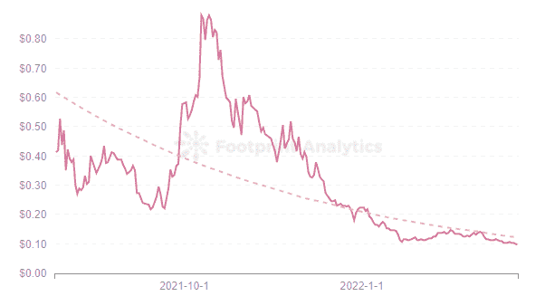

[*Footprint Analytics — Price of SPS*](https://www.footprint.network/guest/chart/price-of-sps-fp-095d2e36-09da-4193-ae82-59964db9acab?channel=u-b1lc4J)

**交易**

Splinterlands 的交易整体呈稳步上升趋势，符合稳健的项目开发路径。是蜂巢链上近一年来 [GameFi](https://www.footprint.network/guest/dashboard/game-fi-chain-comparison-fp-371a269a-32ae-46aa-a9a4-c6e5f607c516?date=past360days&channel=ENG-220) 交易次数最高的游戏，98.97%。

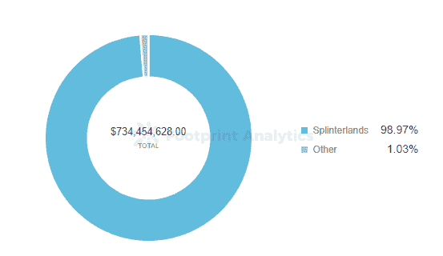

[*Footprint Analytics — Share of Tractions | Hive*](https://www.footprint.network/guest/chart/share-of-tra-hive-fp-71ab6eaf-7fb6-4b85-b9c1-95938d1c0aab?channel=u-b1lc4J)

从过去一年的交易数量来看，今年上半年总体相对平均，但在 8 月份出现了 900%的大幅增长。原因之一是对 GameFi 的爆炸性兴趣和有利的行业带来的增长。

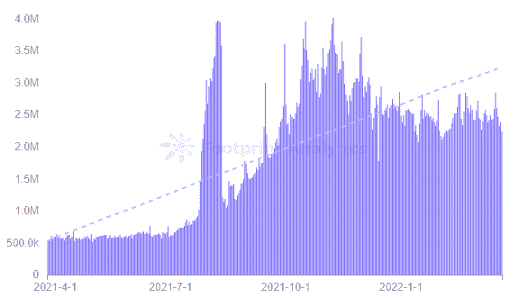

[*Footprint Analytics — Transactions of Splinterlands*](https://www.footprint.network/guest/chart/transactions-of-splinterlands-fp-deae01f9-5158-4b7f-9120-f920495c6ce0?channel=u-b1lc4J)

**用户**

截至 3 月 20 日，Splinterlands 拥有 1000 万用户，是所有纸牌游戏的最高用户，是 Axie Infinity 的 14.7 倍。这一大幅增长与交易量的变化相一致，两者都始于 8 月。它现在正以相对稳定的速度增长。

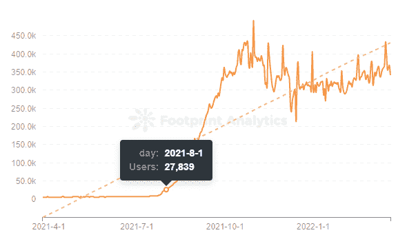

[*Footprint Analytics — Number of Users of Splinterlands*](https://www.footprint.network/guest/chart/of-users-splinterlands-fp-2507301d-4540-40e5-8329-316331797811?channel=u-b1lc4J)

外星世界

## 什么是外星世界

[外星世界](https://alienworlds.io/)是由 Dacoco GmbH 于 2020 年创作的元宇宙星际游戏。发布在 WAX 和 BSC 链上，支持跨链桥接以太坊，是第一个将流动性挖掘引入 NFT 游戏的游戏。

它的令牌是延龄草(TLM)，一个 ERC-20 令牌，可以通过采矿获得，并承诺奖励。持有 TLM 可以让你参与一个星球[道](https://www.footprint.network/guest/dashboard/badger-dao-analysis-dashboard-fp-66e996e8-0919-4c70-9e92-1fd5dbd1d1b4?date=past360days&channel=ENG-220)的治理，也是购买升级资产的流通货币。

## 怎么玩

玩家可以在外星世界探索六个星球。每个星球是一把刀，选择它的角色和星球，并执行流动性挖掘以获得 TLM 和 NFT 资产。或者参加战斗赢得奖励。

主要有三种类型的游戏。

*   **矿业中心。**玩家参与流动性挖掘以赚取 TLM 和 NFT 的资产。
*   **传教。**玩家购买船只并派遣它们执行任务以获得奖励。
*   **雷霆之战。玩家选择爪牙和武器与他人战斗。胜利者获得 TLM 和 NFT 的资产，但是失败者的爪牙的生命值和武器质量下降。**

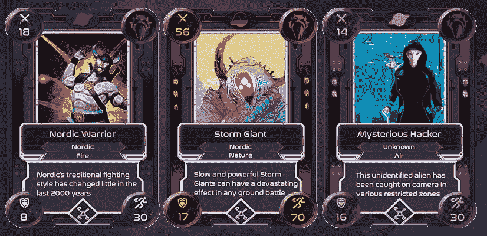

[*Sources — Alien Worlds: Minions*](https://alienworlds.io/)

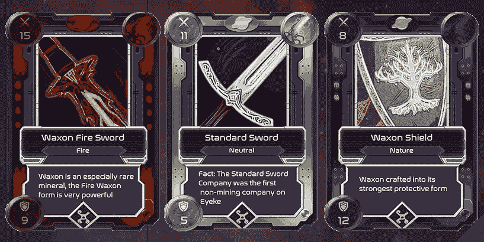

[*Sources — Alien Worlds: Weapons*](https://alienworlds.io/)

采矿中心和雷霆之战都需要玩家思考部队设计。在给定的时间框架内最大化 TLM 和 NFT 的资产，并装备爪牙和武器以赢得战斗，可以提高玩家的自信心和成就感。

## 外星世界的统计数据

**代币价格**

自 4 月份推出以来，TLM 的价格急剧上涨，在 4 月 11 日达到了 6.93 美元的 ATH。自那以后，它开始下降，目前在 0.25 美元左右。

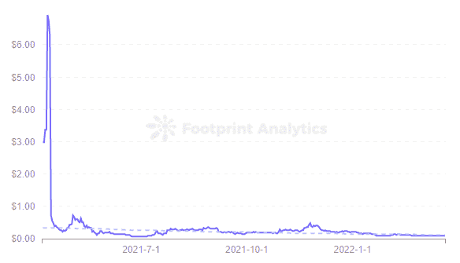

[*Footprint Analytics — Price of TLM*](https://www.footprint.network/guest/chart/price-of-tlm-fp-0e3fe7ac-c7ad-4bb0-9635-31fc6f1d58c3?channel=u-b1lc4J)

**交易**

截至 3 月 20 日，外星世界有 3000 万笔交易，占蜡像链上所有游戏交易的 80.6%，远远领先于农民世界。所有卡牌游戏中第二，比 X 世界游戏多 19X。

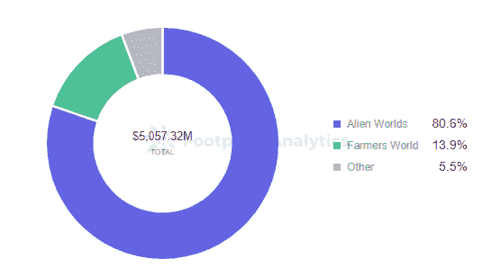

[*Footprint Analytics — Share of Tractions | WAX*](https://www.footprint.network/guest/chart/share-of-tra-wax-fp-6dbb61bc-0c47-41b3-82e9-489e0a341e33?channel=u-b1lc4J)

**用户**

《异形世界》拥有 553 万用户，整体呈上升趋势。但新增用户增长逐月波动，多为下降。

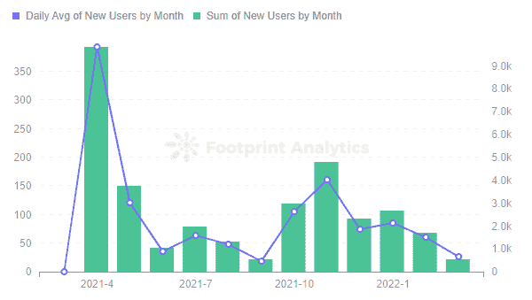

[*Footprint Analytics — New Users by Month | Alien Worlds*](https://www.footprint.network/guest/chart/new-users-by-month-alien-worlds-fp-c048e8c3-cc59-4327-8e1a-ce2d8d1e719b?channel=u-b1lc4J)

自 11 月以来，《异形世界》的新用户增长一直在放缓，3 月 20 日，只有 24 名新用户增加，增长率为 2.4%，较前一天下降 46%。对于同类游戏中最大的游戏之一来说，这是一个相对较弱的增长。

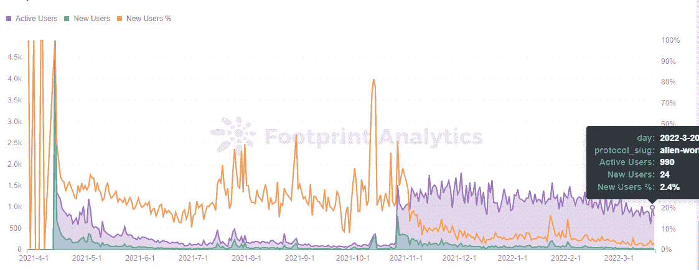

[*Footprint Analytics — Daily Gamers Trend | Alien Words BSC*](https://www.footprint.network/guest/chart/daily-gamers-trend-alien-words-bsc-fp-7c64c5d8-25eb-406e-9d32-c5c63674c081?channel=u-b1lc4J)

你的密码

## 你的密码是什么

[你的秘密](https://thecryptoyou.io/home)是一款由 BabySwap 孵化的以婴儿为主题的元宇宙游戏。2021 年 12 月在 BSC 链上线。

有两种类型的加密令牌。一个是 BABY，BabySwap token，用来在游戏中创造角色和施放稀有装备，一个是 MILK，Crypto You 的货币，用来升级角色和修理装备。

## 如何玩你的密码

Crypto You 的游戏玩法大致类似于 Spinterlands 和外星世界。两者都有采矿和战斗设定，只是细节不同。

在 Crypto You 中，玩家通常创建一个角色，以采矿、升级到高级角色、玩任务和采矿”，其中游戏的不同部分消耗婴儿和牛奶，同时获得婴儿、牛奶和其他 NFT 装备奖励。

宝宝有 5 个职业，12 个具有物理和魔法属性的角色，按稀有度分为 R，SR，SSR 三个等级。

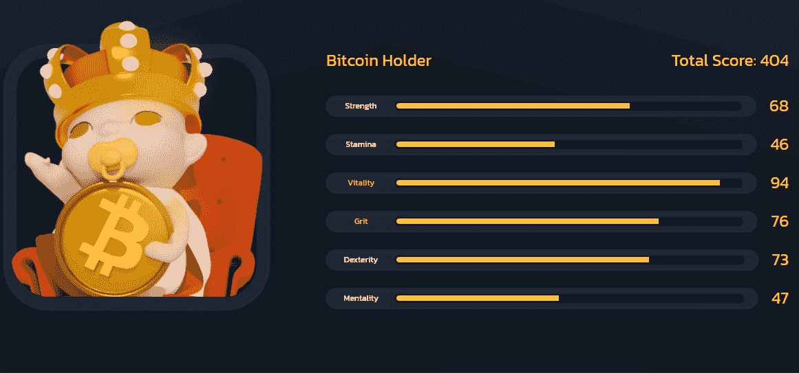

[*Sources — The Crypto You — Baby Characters: Bitcoin Holder — SSR — Physical — Fighter*](https://thecryptoyou.io/market/107554390151269582115375253246837557430778389631627267223863197038198106253090)

主要有两种玩法:

*   每日采矿:婴儿开始在黑暗城堡、仓库和其他地方工作以赚取牛奶。
*   PVE:宝贝打开战斗模式，或者 1vs1 来掠夺资源，或者组队战斗来获得奖励。

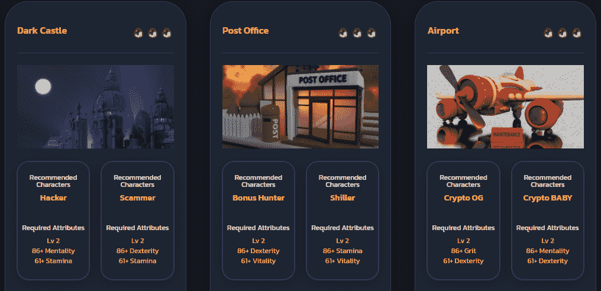

[*Sources — The Crypto You — Daily Mining*](https://thecryptoyou.io/game/daily-mining)

你的密码统计

**代币价格**

牛奶的价格趋势与 TLM 在《外星世界》的趋势非常相似。两者在发行日的几天都很高，然后直线下降。它仍然是一个相对稳定的低值。

另一个治理令牌 BABY 与 BabySwap 的令牌相同，不能很好地代表 Crypto You 的数据性能，所以不做分析。

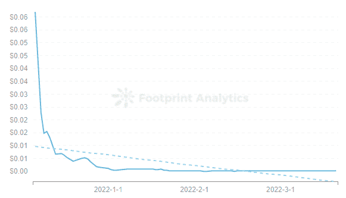

[*Footprint Analytics — Price of MILK*](https://www.footprint.network/guest/chart/price-of-milk-fp-2a9b5145-bf06-49ae-aae3-f5a8e2af751d?channel=u-b1lc4J)

**交易**

Crypto You 是 BSC 链上的第四大游戏，在推出不到四个月的时间里已经占据了 7.66%的份额。

但总体交易趋于平稳。这是符合用户变化的，可能和新用户尝试游戏后不继续玩有关系。

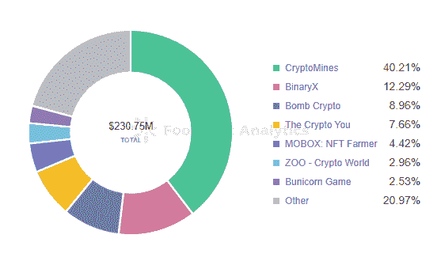

[*Footprint Analytics — Share of Tractions | BSC*](https://www.footprint.network/guest/chart/share-of-tra-bsc-fp-72d946c2-2619-4ba4-a7e1-87e78ec32d15?channel=u-b1lc4J)

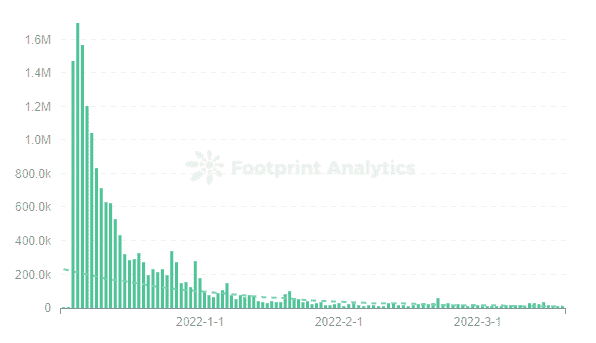

[*Footprint Analytics — Transactions of The Crypto You*](https://www.footprint.network/guest/chart/transactions-of-the-crypto-you-fp-3e7414ac-881f-44e3-b4e4-5ceb095d0897?channel=u-b1lc4J)

**用户**

Crypto You 目前拥有 48，000 名用户，但用户保持率和新用户增长率都很低。

这款游戏于 12 月推出，涌入了 22 万用户，但此后一直在下滑，截至 3 月 20 日，3 月份只有 166 名新用户。虽然有 1500+的活跃用户，但新项目更重要的是吸引新用户，让项目活起来。

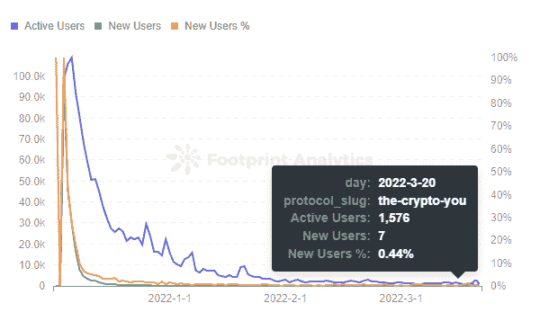

[*Footprint Analytics — Daily Gamers Trend | The Crypto You*](https://www.footprint.network/guest/chart/daily-gamers-trend-the-crypto-you-fp-473dcd16-12c8-4012-baeb-e1ce3a2885c0?channel=u-b1lc4J)

***此片由*** [***足迹分析***](https://www.footprint.network/?channel=ENG-209) ***社区供稿。***

足迹社区是一个世界各地的数据和加密爱好者互相帮助了解和获得关于 Web3、元宇宙、DeFi、GameFi 或区块链新兴世界的任何其他领域的见解的地方。在这里，你会发现活跃的、不同的声音相互支持，推动着社区向前发展。