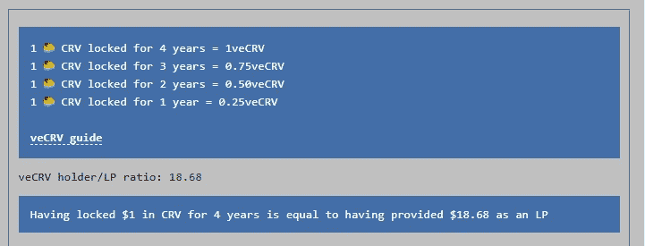
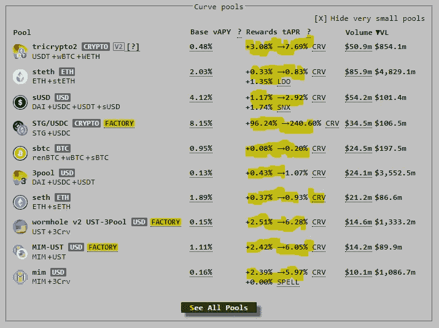
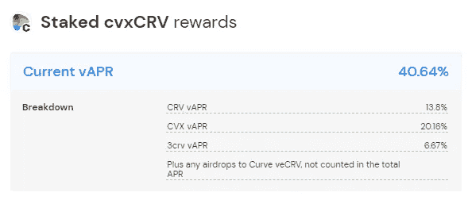
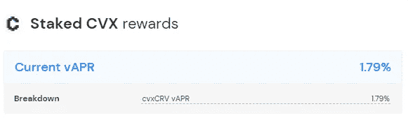
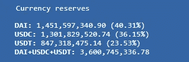
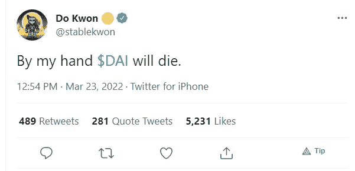

# 3 池，4 池，争取提高 APY%的流动性游泳池

> 原文：<https://medium.com/coinmonks/3-pool-4pool-the-fight-to-boosting-apy-for-the-liquidity-swimming-pool-4d79752fd555?source=collection_archive---------15----------------------->

Photo by [Arturo Rivera](https://unsplash.com/@arivera2015?utm_source=medium&utm_medium=referral) on [Unsplash](https://unsplash.com?utm_source=medium&utm_medium=referral)

时间到了。

稳定的战争开始了。

戴对(还有几个人)

# **曲线战争**

在说 4 池之前，先说一下曲线战会很有用。但是由于这个热门话题已经被讨论过很多次了，我就把它 TLDR 化吧。

曲线是一个指数，在稳定的货币交易中非常有效。(stableswap)
他们用 windows 95 的主题作为他们网站的设计也很酷。

关于战争，总的想法是吸引尽可能多的存款进入曲线上的特定池。(流动性战争)

From curve.fi — The longer you lock CRV, the more veCRV you will get

*   由于曲线上的深度流动性池，当进行巨额互换时，它可能有助于减少下滑。
*   当你在曲线上提供流动性时，你将获得 CRV 作为你报酬的一部分。
*   通过投票锁定这个 CRV(“赌注”)，您将获得 veCRV，您可以用它来增加您从池中获得的 APY。(以下黄色范围)

*   此投票锁定**动作不可逆**。(CRV → veCRV)
*   Curve 赚取的交易费的 50%将分配给 veCRV 持有人
*   veCRV 的另一个用途是投票给你想要的池曲线，以增加未来的 APY([gauge weight](https://dao.curve.fi/gaugeweight))
*   由于 CRV 的令牌组学是如何设计的，它为用户创造了一个目的，即一旦他们得到它，就锁定它，而不是卖掉它。从而减轻销售压力。(就像农民在收获 CRV 后选择卖掉它一样)

# 好，所以 CRV 是有用的。下一步是什么？

从上面的 img 中，我们可以看到来自其他协议的各种令牌(stables)在曲线上有自己的池。由于更多的流动性是他们的目标，他们有两种方法来实现这一点

*   通过将大量硬币投入池中，
*   让其他人将硬币存入池中

像往常一样，Curve 提供的高 APY 将成为吸引其他用户将其资本存入资金池的因素。

为了使协议增加池的 APY，它们需要 veCRV。很多人为他们的泳池投票。

> veCRV =更大的投票权=你的资金池有更多的流动性=非常好

成功积累大量 CRV 的协议之一是凸金融。

# 凸金融提供了什么

**凸起上的 CRV 桩**

如果你已经有了 CRV，你也可以选择把它们押在凸面上，而不是曲线上。这样做的原因之一是，你仍然可以享受收益，同时保持流动性，因为它不会被锁定 4 年。

你必须先把你的 CRV 转换成 cvxCRV，然后才能下注。从本质上讲，凸曲面会将你的 CRV 锁定在曲线上，但你会得到一个更具流动性的版本。(将其符号化)

Rewards for staking CRV on Convex Finance

**上凸的流动性提供者**

对于那些希望获得那些提高 APY 利率，但没有足够的 CRV 锁定，你可以这样做，利用凸。

一旦你从 Curve 得到 LP 标记，你就可以去 Convex 并下注这些 LP 标记。
由于 Convex 已经从用户那里积累了 CRV，他们能够选择池来应用 APY 提升。

> 简而言之，在 Convex 上下注 CRV LP 代币的用户将能够在不锁定任何 CRV 的情况下以更高的利率赢得 CRV，并且还可以获得 CVX 作为他们奖励的一部分

值得注意的是，Convex 从通过他们提供的那些增加的资金池获得的 CRV 奖励中抽取 17%。

你也可以下注你的 CVX 来赢取 cvxCRV

有了 CVX，我们可以不用下注，也可以**锁定**来赚取平台费，并获得提案的投票权重和衡量权重投票。

总之，如果曲线本身。尽可能多地积累 veCRV 将是有益的，因为这将允许你选择一个具有较高 APY 的资金池，吸引更多的流动性。

有了 Convex Finance，它就像一个构建在曲线顶部的收益聚合器，就像一个乐高积木
,因为 Convex Finance 成功吸引了用户与他们一起下注 CRV，作为回报，他们可以选择池来接收提升的 APY。
现在，用户把他们的 LP 代币——CRV 代币——存放在那里，享受更高的利率，会更有意义。

CVX 成为积累的象征，因为通过 it 治理/投票，我们可以对哪个池获得提高的收益率有发言权。

# 3、4 池简介

3 池= USDT、和戴

Liquidity in the 3 Pool on Curve

4 组= USDT、USDC、FRAX 和 UST

看看[这个](https://daocvx.com/leaderboard/)

Not the full list

我们可以看到，Terra 拥有最多的 CVX，其次是 Frax 和 Redacted，相差不远。有了这一点，他们将能够把更多的 APY 引向曲线上的 4pool，吸引更多的用户以更高的流动性进入。

Short sentence but it packs a punch, NFT it anyone? lol

当大部分流动性从 3 美元池转移到 4 美元池时，这是必然的。戴会怎么样？

死亡螺旋？不太可能。我认为死亡螺旋更适用于算法稳定或没有实际支持的令牌。然后，在极端的市场条件下，其代币的价值将被套牢，并螺旋下跌至 0。

在这种情况下，试图捍卫联系汇率制所带来的额外抛售压力将使其更快地走向死亡。

这也是 LFG 像 BTC 一样试图积累更多资产的原因之一。

由于戴是一种过度抵押的稳定货币，只要其基础仍然“健全”，戴在那里就仍然有价值。如果市场状况证明足够糟糕，脱钩似乎更有可能，而不是死亡螺旋到 0。但如果发生这种情况，它也不会无法从中恢复。

# 结论

Photo by [erfan rahmani](https://unsplash.com/@eeeerfan?utm_source=medium&utm_medium=referral) on [Unsplash](https://unsplash.com?utm_source=medium&utm_medium=referral) — Would you swim in this pool? 😆

这样一来，现有资金池中的大量流动性将转移到 4 号资金池，但问题是，戴会对此作何反应？
什么都不做，继续下去，或者想出一个新的方法来收回流动性，对抗 4 池移动？

即便如此，这个新的水池仍然有益于 Terra 的生态系统。在这里，UST 更多地融入了以太坊的生态系统，给了 UST 更多的使用案例。

无论如何，只有时间会告诉我们哪一个马厩能够经受住不同市场条件的考验。目前，让我们尽可能长时间地享受提高的收益率。

如果您喜欢您刚刚阅读的内容，请留下评论或跟帖让我知道！干杯！

 [## 每当约翰·方德伯克发表文章时，就收到一封电子邮件。

### 每当约翰·方德伯克发表文章时，就收到一封电子邮件。通过注册，您将创建一个中型帐户，如果您还没有…

medium.com](/subscribe/@thissideup35mm) 

> 加入 Coinmonks [电报频道](https://t.me/coincodecap)和 [Youtube 频道](https://www.youtube.com/c/coinmonks/videos)了解加密交易和投资

# 另外，阅读

*   [Capital.com 评论](https://coincodecap.com/capital-com-review) | [香港的加密借贷平台](https://coincodecap.com/crypto-lending-hong-kong)
*   [如何在 Uniswap 上交换加密？](https://coincodecap.com/swap-crypto-on-uniswap) | [A-Ads 审查](https://coincodecap.com/a-ads-review)
*   [WazirX vs CoinDCX vs bit bns](/coinmonks/wazirx-vs-coindcx-vs-bitbns-149f4f19a2f1)|[block fi vs coin loan vs Nexo](/coinmonks/blockfi-vs-coinloan-vs-nexo-cb624635230d)
*   [本地比特币评论](/coinmonks/localbitcoins-review-6cc001c6ed56) | [加密货币储蓄账户](https://coincodecap.com/cryptocurrency-savings-accounts)
*   什么是融资融券交易
*   [支持卡审核](https://coincodecap.com/uphold-card-review) | [信任钱包 vs 元掩码](https://coincodecap.com/trust-wallet-vs-metamask)