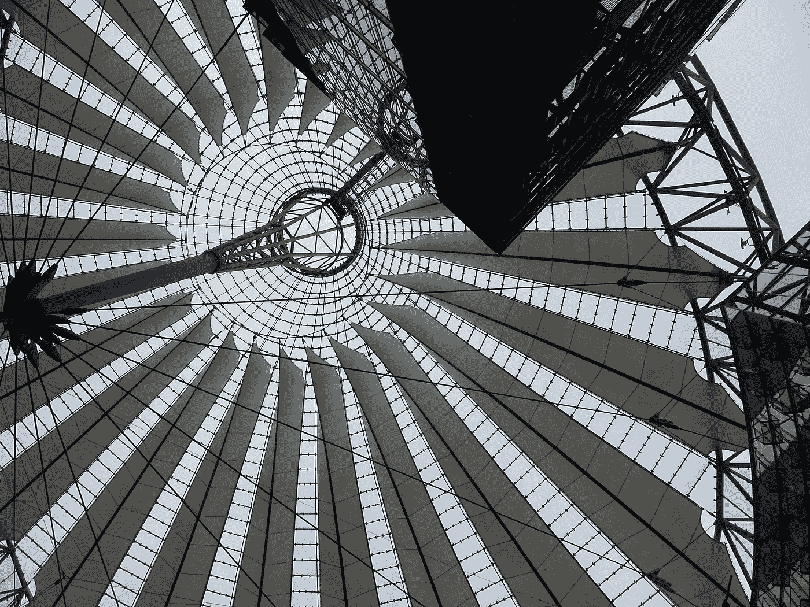

# 当你的加密资产流失时，你应该问的 3 个问题…还有一首科里·哈特的歌:)

> 原文：<https://medium.com/coinmonks/3-questions-you-should-ask-before-selling-your-crypto-bitcoin-investments-89ef17b7ea76?source=collection_archive---------66----------------------->

Sony Center Roof in Berlin, Germany ©ddeewilson

2022 年，加密货币投资感觉像被困在过山车循环中，头朝下。我们尖叫——而且——紧紧抓住杠毫无意义——不可避免地与问题、疑虑和深度相撞，速度甚至比比特币还快。

相信我，看着我在以太坊的存款逐渐减少，我和你一样感到痛苦。但是，也许在我们恐慌并卖掉我们最初投资的基金之前，我们应该先问自己这三个问题:

## 我看到了什么？—什么保持不变？—发生了什么变化？

## **1。我看到了什么？**

*   创纪录的高通货膨胀率。石油、天然气和食品价格过高
*   美联储可能会提高利率来缓解通货膨胀。
*   加息幅度可能高达 75 个基点。这样的消息可能会让比特币更加贬值。
*   Celsius 的破产导致了今天的加密崩溃。投资者仍然试图忍受 Terra (Luna)市场的崩溃。
*   失去信任。Terra 项目的创始人很可能参与了不正当的行为。韩国投资者提起诉讼。
*   币安因出售 LUNA 和 TerraUSD (UST)面临投资者的集体诉讼。
*   阿拉米达资本已经出售了 150 万 stETH 清算他们所有的控股，造成了市场恐慌。
*   鲸鱼倾倒了大约 93，000 ETH

copyright©ddeewilson

## 2.什么保持不变？

*   首先，我会说:不确定性。投资于动荡的市场时，我们感到的不确定性和兴奋。这不同于在储蓄账户中增加资金。8 个月前价值 65，000 美元的比特币可以快速增长——或者正如我们现在所经历的，崩溃的速度比超人滑入氪星石还要快。现在，从它的前面提到的荣耀下降到三分之一。然而，对于大多数散户投资者来说，积累大量美元储蓄并不容易。因此，将一些资金投入比特币、以太坊或其他加密技术以获得三倍收益的前景令人兴奋，而且非常有可能。**哦，好吧，也许我们应该学会更好地掌握时间。使用稳定的硬币。这些都是保护投资的好方法。但是现在我们来问第三个问题。**

## 3.有什么变化？Web3 是一个创新的全新生态系统，它的发展速度令人难以置信。这里只是几个用例:

*   **银行业:**世界上最大的银行，摩根大通&公司，在元宇宙的虚拟世界中担保财产。他们将建造一个休息室，顾客可以在那里使用 NFTs 进行银行存款和购物。其他银行也纷纷效仿。
*   美国银行的一项调查显示，在 1000 多名美国成年人中，90%计划在未来六个月内购买 crypto。而且，近 40%的受访者透露，他们使用加密货币作为支付手段。
*   **Defi:** 分散式金融解决方案包括“**真实世界资产**”整合。例如，以 Defi 离心机“Tinlake”平台为例，该平台允许“新银”提供“固定和翻转”贷款，这是一家在区块链连接房地产和分散金融的公司。
*   **医疗保健:** NFT 初创企业 Aimedis 革新医疗记录。你的健康记录可能分散在医生办公室的电脑里，不管是在国内还是国外，过去现在都是如此。使得医疗保健提供者无法快速访问所需的文档，如成绩单、x 光片和其他文档。你的健康记录 NFT 解决了这个问题。
*   **房地产:**在佛罗里达州的坦帕湾，一位房主通过 NFT 以 65.3 万美元的价格出售了他的房子。NFT 嵌入了“契约”,瞧，买家拥有了一个他们可以搬进去的有形的家。又快又简单。 ***富有创新精神的房地产公司正试图为区块链*** 解决支付结构问题。不是每个人都能花得起 65.3 万美元的比特币:)来认领一个家。另一方面，销售很简单。把你的 NFT 放在市场上。
*   **音乐:**音乐人把他们的艺术从经纪人和公司那里解放出来。在区块链，歌迷可以通过 NFT 购买歌曲。如果你的艺术家越来越受喜爱，或者如果这首歌进入前 20 名，你买的 NFT 也会升值。想想看，任何有价值的东西都可以被铸造成 NFT(不可替代的代币)。NFT 不仅仅是愚蠢的迷因，而是所有权的契约。
*   **公司:**谷歌、微软、脸书、耐克、Abercrombie &惠誉、沃尔玛、杜尔西&嘉巴纳、麦当劳、现代、博柏利、迪士尼、摩根大通&公司等。—正准备在 Web3 上做生意。

## 我们是不是在 2022 年再次经历 2017 年著名的比特币泡沫？

也许吧。感觉是这样的。这次熊市与我们的经济和美元的崩溃紧密相连。离开杂货店时，我们摇摇头。收入停滞不前。我们最关心的是给我们的汽车加满油，这样我们就可以去工作了。像我一样住在乡下，来回可能要走 25 英里。现在投资货币，尽管价格很低，可能是一个挑战，而且远离人们的想法。此外，公司也在遭受抛售比特币的痛苦。然而，我确定“鲸鱼”们正在等待时机……

通过问这三个问题，我们可以看到，尽管现在发生了什么，区块链行业正在起飞。眼下是暂时的，尽管暂时的还需要一段时间来度过全球金融危机。正如你从我的个人资料中看到的，我不是金融顾问。我是一个小散户，了解 web 3 和新的相关货币系统。我发现区块链技术很吸引人，我确信它会流行。

## 区块链结合人工智能和创新用例:通信-教育-娱乐-金融-健康-物业-零售贸易-交通-专业/个人服务-旅行…

我们不应该只考虑硬币的价值和回报。区块链及其所有基于它的创新用例是一种让我信服的技术。将问题 3 的答案与问题 1+2 的陷阱相比较，让我相信要坚持我的投资。未来说服了我。虽然，我不喜欢它的一切…那是另一个故事。

政府和银行很想让时光倒流——尽管，银行知道他们需要创新，找到进入新的更好的系统的方法，让客户满意，并吸引新的客户；政治规则和监管需要找到整合的方法，而不是惩罚或打一场赢不了的仗。加密是一种世界性的现象。它可以被压下来，但不能被杀死。太多的人、组织和机构已经开始支持网络 3 数字经济。不完美的一个…但谁或什么是完美的？**所以，请原谅我的乐观。”** [**晚上我戴上墨镜**](https://youtu.be/jxcZAHTyVCI) **，这样我就能看到《科里哈特的歌》。:)—我给你留下一首歌。**

我喜欢看你的评论:)

> 加入 Coinmonks [电报频道](https://t.me/coincodecap)和 [Youtube 频道](https://www.youtube.com/c/coinmonks/videos)了解加密交易和投资

# 另外，阅读

*   [如何匿名购买比特币](https://coincodecap.com/buy-bitcoin-anonymously) | [比特币现金钱包](https://coincodecap.com/bitcoin-cash-wallets)
*   [币安 vs FTX](https://coincodecap.com/binance-vs-ftx) | [最佳(索尔)索拉纳钱包](https://coincodecap.com/solana-wallets)
*   [比诺莫评论](https://coincodecap.com/binomo-review) | [斯多葛派 vs 3Commas vs TradeSanta](https://coincodecap.com/stoic-vs-3commas-vs-tradesanta)
*   【Capital.com】|[港加密借贷平台](https://coincodecap.com/crypto-lending-hong-kong)
*   [如何在 Uniswap 上交换加密？](https://coincodecap.com/swap-crypto-on-uniswap) | [A-Ads 评论](https://coincodecap.com/a-ads-review)