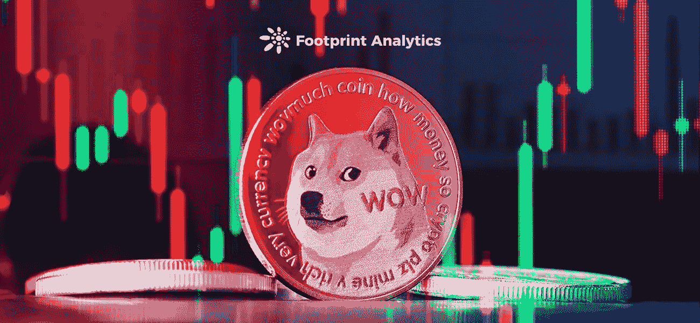
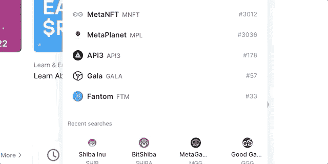
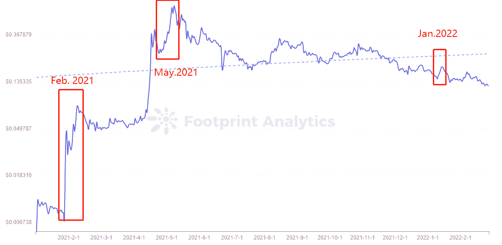

# Dogecoin 在别人失败的地方成功的 3 个原因

> 原文：<https://medium.com/coinmonks/3-reasons-dogecoin-succeeded-where-others-failed-c903b00c3f3e?source=collection_archive---------66----------------------->

在你决定全押哪个迷因币之前，看看这个

2022 年 2 月

数据来源:足迹分析 [Meme 令牌仪表板](https://www.footprint.network/guest/dashboard/meme-dashboard-fp-e5ad203e-2ff1-449f-ab08-ed8799863267?channel=u-DnmMUY#secret=7D445A57E9CF5115945146D7463AD464)

在快速发展的伊努斯、弗洛基斯和泰格金斯的世界里，回到开启这一切的奥格·梅肯是有意义的。

随着成千上万的 memecoins 希望复制最初的大众社区令牌的成功，是什么核心因素让 Dogecoin 在其他人失败的地方继续存在？

# Dogecoin 成功的 3 个原因

**1。明星代言**

Dogecoin 相对于其他 memecoins 成功的主要原因之一是埃隆·马斯克给了它知名度。在 2021 年 1 月至 2022 年 1 月期间，他发了 50 多条关于 Dogecoin 的推文..每一次，价格都经历了巨大的波动。例如:

*   【2021 年 2 月。**“在此写出完整推文”**。Dogecoin 暴涨 80%。
*   **可能。2021** 。马斯克在周六夜现场的一次采访中说 Dogecoin 是一个骗局。Dogecoin 暴跌 34%。
*   **2022 年 1 月**。**“在此写出完整推文”**。Dogecoin 上涨超过 20%。

[*Footprint Analytics — Price of Dogecoin*](https://www.footprint.network/guest/chart/price-of-doge-previous-30-d-fp-201989ad-c42b-4461-b8ff-c6fe956fcaf5?defaultEdit=true&channel=u-b1lc4J)

2021 年 8 月 18 日，Dogecoin 基金会在 2014 年联合创始人离职后重新成立，马斯克和维塔利克·布特林当选为董事会顾问。

**2。共识值**

共识价值是指人们投资于他们的信仰，例如 BTC。相反，效用价值指的是技术用例的潜在潜力。

BTC 因共识而有价值。它被认为是投资或资产保值的一种选择。它也是萨尔瓦多公认的法定货币。

Dogecoin 还不是法定货币，但它被接受为一种支付方式。据 cryptwork 统计，截至 2222 年 2 月 25 日，已经有 1069 家商户和组织接受 DogeCoin 支付。

尽管 Dogecoin 的创始人之一杰克逊·帕尔默**在 2014 年放弃了 Dogecoin，但这并没有阻止 token 的成长。**

**两个随机里程碑:**

*   **Dogecoin 社区为索契冬奥会赞助了牙买加雪橇队。**
*   **在 2014 年**，**社区通过“一天不联系”无国界医生组织狗硬币游戏筹款活动筹集资金，帮助无国界医生组织治疗埃博拉患者**

****3。模因价值****

**模因币通常被定义为没有内在效用的硬币，但其价值基于热情的追随者群体。它们的价值很低，大部分只需几分钱就能买到，而且供应量巨大或无限。**

**现在有成千上万的迷因币，但 Dogecoin 是最早的迷因币。**

**这枚硬币是由杰克逊·帕尔默和比利·马库斯在 2013 年 12 月 6 日创立的。他们俩都是软件工程师。创造这种货币是为了讽刺 BTC，但就用户数量而言，它已成为仅次于 BTC 的第二大受欢迎的加密货币。**

**从那以后，其他的迷因币也有了巨大的增长。即:柴犬、多吉龙马尔斯、弗洛基犬。**

# **关于模因令牌的思考**

**DogeCoin 取得了成功，但受名人影响的巨大波动性意味着高风险。当然，Meme tokens 很容易推出，维护成本也不高，并且拥有很大程度的社区所有权。但这并不意味着你可以在迷因代币上孤注一掷。**

**相比之下，Meme tokens 并不容易得到有类似感受的名人的认可和支持。Meme 令牌的使用场景非常少，和 chain 或者 DeFi 协议令牌有很大的区别。**

**此外，一些 Meme 令牌不支持智能合约，也没有纯 Meme 令牌的生态系统应用。**

**所以，DogeCoin 的成功只是一个概率的例子。你可以把尝试 Meme tokens 作为一种爱好，但不要用于投资。至少，全押不是一个好的选择。**

*****此片由*** [***足迹分析***](https://www.footprint.network) ***社区供稿。*****

> **加入 Coinmonks [电报频道](https://t.me/coincodecap)和 [Youtube 频道](https://www.youtube.com/c/coinmonks/videos)了解加密交易和投资**

# **另外，阅读**

*   **[新加坡十大最佳加密交易所](https://coincodecap.com/crypto-exchange-in-singapore) | [购买 AXS](https://coincodecap.com/buy-axs-token)**
*   **[投资印度的最佳加密软件](https://coincodecap.com/best-crypto-to-invest-in-india-in-2021) | [WazirX P2P](https://coincodecap.com/wazirx-p2p)**
*   **[7 个最佳零费用加密交易平台](https://coincodecap.com/zero-fee-crypto-exchanges)**
*   **[最佳网上赌场](https://coincodecap.com/best-online-casinos) | [期货交易机器人](/coinmonks/futures-trading-bots-5a282ccee3f5)**
*   **[分散交易所](https://coincodecap.com/what-are-decentralized-exchanges) | [比特恩斯 FIP](https://coincodecap.com/bitbns-fip) | [宾邦评论](https://coincodecap.com/bingbon-review)**
*   **[用信用卡购买密码的 10 个最佳地点](https://coincodecap.com/buy-crypto-with-credit-card)**
*   **[加拿大最佳加密交易机器人](https://coincodecap.com/5-best-crypto-trading-bots-in-canada) | [Bybit vs 币安](https://coincodecap.com/bybit-binance-moonxbt)**
*   **[阿联酋 5 大最佳加密交易所](https://coincodecap.com/best-crypto-exchanges-in-uae) | [SimpleSwap 评论](https://coincodecap.com/simpleswap-review)**