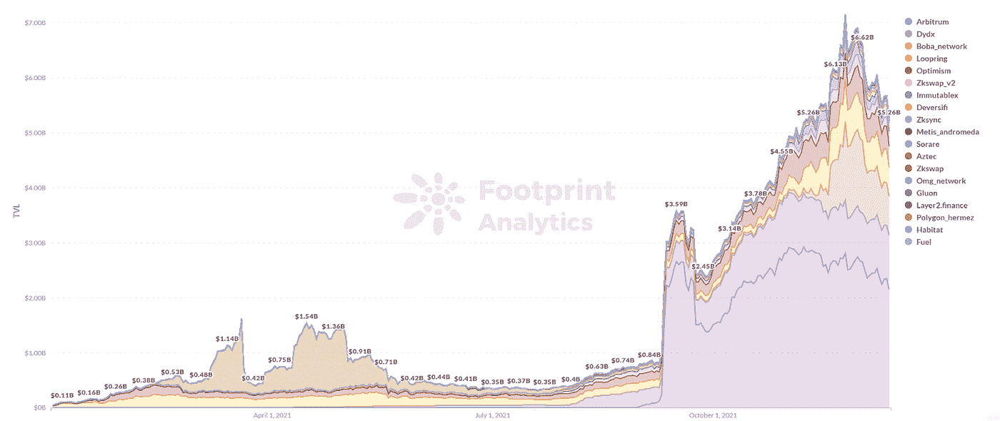
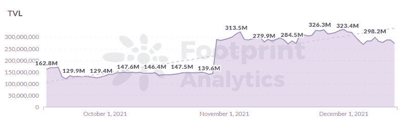
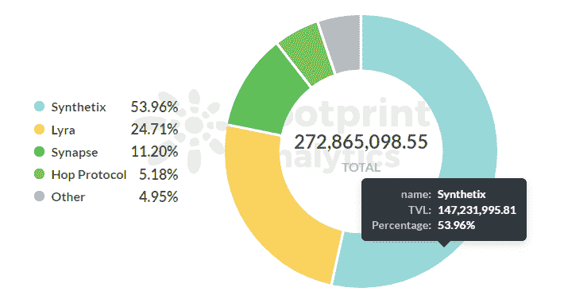
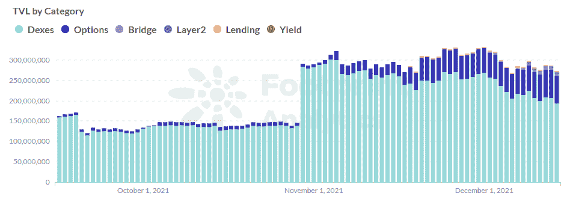

# 乐观主义发展缓慢的三个原因

> 原文：<https://medium.com/coinmonks/3-reasons-for-optimisms-slow-development-efcdd2e3d91e?source=collection_archive---------15----------------------->

以太坊现在是无可争议的连锁店之王，但它的交易拥堵和高昂的费用使它几乎无法使用。作为回应，第二层项目已成为区块链发展最快的领域之一。领先的解决方案是:

*   国家频道
*   侧链
*   血浆
*   卷曲

Rollup 是最流行的解决方案，乐观是其扩展项目之一。虽然它是 Rollup 上推出的第一批项目之一，但乐观的增长已经放缓，就 TVL 而言，它现在在所有第二层网络中排名第五。

*Data Source: Footprint Analytics —* [*Layer 2 TVL*](https://www.footprint.network/guest/dashboard/layer-2-dashboard-fp-98bbb807-7281-4167-ae3e-f1679a16e893?channel=u-DBc983)

乐观主义怎么了？

乐观是基于乐观汇总的第 2 层扩展解决方案。这种解决方案的优点是易于与 DApps 集成。因此，它一推出就立即得到了开发者的支持。

乐观主义于 2021 年 1 月首次上线，测试网络基于以太坊主网。Uniswap、Compound 和 Synthetix 一直致力于支持其生态系统的乐观主义。7 月 14 日，Uniswap V3 在乐观派的 mainnet 上上线。此后，乐观主义一直处于缓慢发展的状态。

**乐观的现状:缓慢的生态系统增长，依赖合成**

截至 12 月 14 日，乐观的 TVL 为 2.72 亿美元，仅占整个第二层生态系统总 TVL 的 7.35%。

*Data Source: Footprint Analytics — Optimism TVL*

来自[足迹分析](https://footprint.cool/qtM5)的数据显示，网络上只有 12 个 DApps。Synthetix 是最大的，TVL 为 1.47 亿美元，提供了乐观 TVL 的 53%。Synthetix 生态系统中的协议 Lyra 以 6743 万美元的 TVL 排名第二。Uniswap 以 2829 万美元的 TVL 排名第四。

*Data Source： Footprint Analytics — Optimism TVL by DApp*

乐观地看待 DeFi 项目的类型，明显缺乏多样性，几乎所有的 TVL 都被 DEX 占据。

*Data Source: Footprint Analytics — Optimism TVL by category*

**乐观主义发展缓慢的原因**

*   **原因 1:乐观主义与 EVM 不是 100%兼容**

目前市场上扩大交易规模的方法是使用图灵的全编程进行链外 EVM 兼容指令，这样每个人都可以直接链外执行 solidity 程序。

另一方面，乐观主义希望通过 OVM(乐观虚拟机)实现链上智能契约，该契约可以接受和执行链外 EVM 兼容的指令，从而确保 OVM 字节码可以一个接一个地映射到 EVM。然而，这种映射可能只有大约 20 个字节码，这使得 optimission 不是 100% EVM 兼容的，并且开发成本稍微高一些。

*   **原因二:乐观的白名单启动机制**

另一个阻碍乐观的因素是只能部署白名单中的协议，这使得许多新项目或许多希望这样做的中期协议很难部署。

乐观使用白名单的主要原因是因为它希望创建一个新的欺诈防范系统，但这不是一项容易的任务，需要大量的时间和经验。

*   **原因 3:当前加密社区的“反风险投资”文化**

乐观的增长得到了著名风投的支持，如 Paradigm 和 a16z。Arbitrum 也是一个乐观的汇总，被社区认为更草根。目前密码界的反风投倾向已经动摇了乐观情绪。

**总结**

第二层现在是区块链创新的主要领域，几十个高度竞争的项目都在争夺以太坊生态系统的规模。

虽然乐观主义是该领域的早期推动者之一，但它的增长自那以后就停滞了。它为领先协议的智能合约迁移设置了障碍，没有进入新协议的入场券，并且缺乏社区环境。它能否重获动力很大程度上取决于它能否处理好这些问题。

> *加入 Coinmonks* [*电报频道*](https://t.me/coincodecap) *和* [*Youtube 频道*](https://www.youtube.com/c/coinmonks/videos) *了解加密交易和投资*

# 另外，阅读

*   [Bookmap 评论](https://coincodecap.com/bookmap-review-2021-best-trading-software) | [美国 5 大最佳加密交易所](https://coincodecap.com/crypto-exchange-usa)
*   最佳加密[硬件钱包](/coinmonks/hardware-wallets-dfa1211730c6) | [Bitbns 评论](/coinmonks/bitbns-review-38256a07e161)
*   [新加坡十大最佳加密交易所](https://coincodecap.com/crypto-exchange-in-singapore) | [购买 AXS](https://coincodecap.com/buy-axs-token)
*   [红狗赌场评论](https://coincodecap.com/red-dog-casino-review) | [Swyftx 评论](https://coincodecap.com/swyftx-review) | [CoinGate 评论](https://coincodecap.com/coingate-review)
*   [投资印度的最佳密码](https://coincodecap.com/best-crypto-to-invest-in-india-in-2021)|[WazirX P2P](https://coincodecap.com/wazirx-p2p)|[Hi Dollar Review](https://coincodecap.com/hi-dollar-review)
*   [加拿大最佳加密交易机器人](https://coincodecap.com/5-best-crypto-trading-bots-in-canada) | [KuCoin 评论](https://coincodecap.com/kucoin-review)
*   [火币加密交易信号](https://coincodecap.com/huobi-crypto-trading-signals) | [HitBTC 审核](/coinmonks/hitbtc-review-c5143c5d53c2)
*   [如何在 FTX 交易所交易期货](https://coincodecap.com/ftx-futures-trading) | [OKEx vs 币安](https://coincodecap.com/okex-vs-binance)
*   [OKEx vs KuCoin](https://coincodecap.com/okex-kucoin) | [摄氏替代品](https://coincodecap.com/celsius-alternatives) | [如何购买 VeChain](https://coincodecap.com/buy-vechain)
*   [ProfitFarmers 回顾](https://coincodecap.com/profitfarmers-review) | [如何使用 Cornix Trading Bot](https://coincodecap.com/cornix-trading-bot)