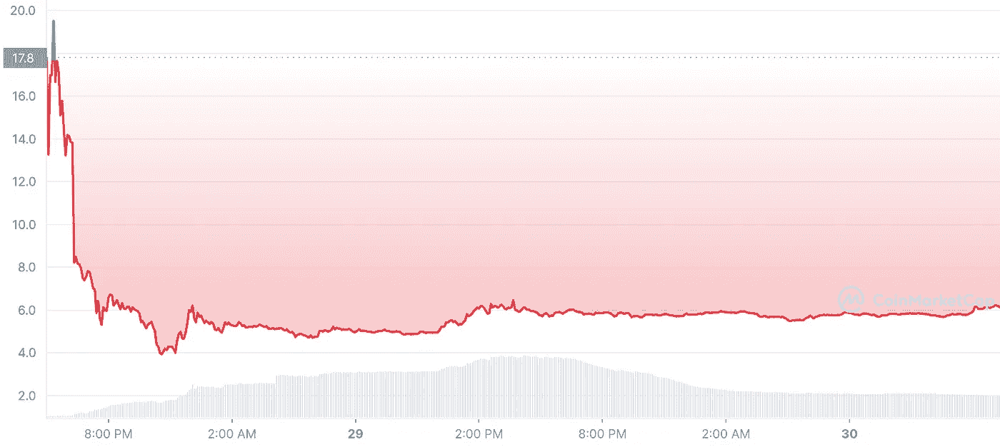

# 不投资 Terra LUNA 2.0 的 3 个理由

> 原文：<https://medium.com/coinmonks/3-reasons-not-to-invest-in-terra-luna-2-0-860817408e84?source=collection_archive---------10----------------------->

Terra LUNA 2.0 已经推出，这就是为什么你永远不要接触或投资它。

许多人似乎忘记了大约两周前的 Terra Luna 坠毁事件。对于那些因卢娜和 UST 而损失惨重的投资者，我向他们表示哀悼。

在一个怪异的事件中，Do Kwon 和他的团队决定将原始 Terra 链硬分叉到 LUNA Classic (LUNC)和 Luna 2.0 (LUNA)。如果你对是否投资 LUNA 2.0 持观望态度，你应该放弃它。继续读下去，我会告诉你为什么。

## 原因 1: LUNA 2.0 就像市场上任何其他普通的第 1 层链一样，没有什么特别之处。

如果我没记错的话，Terraform Labs 不是宣称自己拥有最分散的货币市场吗？没有货币市场，LUNA 2.0 就像市场上的其他 1 层链一样。市场上已经有大量成熟的第 1 层项目。像 Solana (SOL)、Avalance (AVAX)甚至即将合并的以太坊 2.0 这样的项目已经很好地建立起来，并被用来为社区和企业服务。

Luna 的竞争者可能反驳说 Terra 链值得保存，Terra 不仅仅是 ust。但我仍然觉得 Terra 的整个想法是一个稳定的收入和支付系统。没有它是没有价值的，除了 Perma bulls 宣传它是它不擅长的其他东西。

对于 LUNA 2.0 来说，这将是一场艰难的竞争，而对于 Terra Luna 的恶名来说，竞争将更加激烈。

## 原因 LUNA 2.0 的不确定性来自未来的销售压力。

接下来，来自 LUNA 2.0 的抛售压力会更大。投资者谁失去了钱从原来的土地月神和 UST 将收到月神 2.0 代币空投。一定比例的空投代币将有一个授予期，在此期间用户不能收回代币在市场上出售。

短期内，未授权空投的 LUNA 2.0 可以在市场上销售。事后看来，这已经发生了，因为空投的早期接收者丢弃了令牌，以恢复他们在旧月神身上的损失。

Image credit: CoinMarketCap LUNA/UST pair.

从长远来看，解除授权锁定的空投代币仍可在市场上出售。LUNA 2.0 的未来存在不确定性。无论哪种方式，这种不确定性都需要在投资 LUNA 2.0 之前重新审视和考虑。

## 原因 3:道权是一个有争议的人，他在操纵整个表演。

最后，terra 重生仍然由 Terraform 实验室运营，由 Do Kwon 掌舵。即使在 Terra 崩溃之前，道权一直是一个有争议的人。在 Terra 之前，权道参与了一个名为 Basis Cash 的失败项目，这是一种像 UST 一样由算法支持的稳定币。是的，跆拳道的支持者可能会说，项目确实会失败，人也不是完美的，这就是我们如何从中吸取教训。然而，在我看来却不是这样。权道一度批评他自己的项目，说 Basis Cash 这样的项目是在“让零售陷入零和游戏”，也就是庞氏骗局。这本身就是道权相当奇怪的举动。

除此之外，对于那些对他以前的 Terra Luna 项目说三道四的人，权有一种自信的、近乎傲慢的态度。他促使 Terra 的批评者对 Terra 的最终失败进行不必要的押注。他甚至挑战亿万富翁来攻击他的项目。他的前雇员甚至说道权是个独裁者。他对员工进行微观管理，对 Terraform Labs 做出的所有决定拥有最终决定权。

这里的重点是让你知道道权是一个我们在投资他的项目之前应该三思的人。我们应该从过去吸取教训，评估未来，以避免在一个可能不值得信赖的项目上损失一笔财富。

## 总结想法？

从本质上来说，LUNA 2.0 是一个根据许多人的说法不应该发生的分叉。一些报道称，将 Terra 分成 Terra 2.0 和 Terra Classic 的提议受到了操纵。由于 Do Kwon 和 Terraform Labs 拥有大量的投票权，这一指控并不像看起来那样有偏见。目前，LUNA 2.0 的总体前景似乎相当不确定，许多人认为最终会失败。如果 LUNA 2.0 获得成功，它很可能是加密领域最伟大的回归故事。

感谢您读到这里！作为一名独立作家，我分享我诚实的，不带偏见的想法，研究和论点。如果你喜欢我的作品，考虑给我买一台 [***ko-fi 这里***](https://ko-fi.com/unemployedbanana) ***☕️支持我。***

如果您想购买/交易 crypto，请考虑免费使用我的会员链接来支持我！

1.  [***🟡***](https://accounts.binance.me/en/register?ref=174617871)**(收费最低！)**
2.  *[***kucoin***](https://www.kucoin.com/r/rf/rPELADP)**🟢(大量低封顶代币！)***

**免责声明:我不是任何形式的财务顾问。永远 DYOR，投资安全。**

**我爱你们！❤️🍌**

**你可能会从阅读我的文章中得到乐趣。**

** [## 提供 10% APY 的新算法 Stablecoin USN 不同的成功秘诀？

### 本质上相似，但技术上不同于 UST 和露娜。

medium.com](/coinmonks/new-algorithmic-stablecoin-usn-offering-10-apy-a-different-recipe-for-success-ced380e3f119)  [## 为什么你的钱在稳定的银行里不安全的 3 个原因

### 你的钱放在马厩里真的安全吗？

medium.com](/coinmonks/3-reasons-why-your-money-isnt-really-safe-in-stablecoins-90625f125516)  [## 2022 年你应该投资 Polygon (MATIC)的 3 个理由。

### 你还在考虑投资$MATIC 吗？现在读读这个。

medium.com](/coinmonks/3-reasons-why-you-should-invest-in-polygon-matic-in-2022-c8b3f5da41aa) 

想了解更多关于加密和区块链？

 [## 通俗地说:区块链和密码中的分叉是什么？

### 分叉是软件工程中使用的一个术语，用于将一个项目分成两个或多个独立的过程。在…

medium.com](/coinmonks/in-laymans-term-what-is-forking-in-blockchain-and-crypto-1c53de221157) 

> 加入 Coinmonks [电报频道](https://t.me/coincodecap)和 [Youtube 频道](https://www.youtube.com/c/coinmonks/videos)了解加密交易和投资

# 另外，阅读

*   [3 商业评论](/coinmonks/3commas-review-an-excellent-crypto-trading-bot-2020-1313a58bec92) | [Pionex 评论](https://coincodecap.com/pionex-review-exchange-with-crypto-trading-bot) | [Coinrule 评论](/coinmonks/coinrule-review-2021-a-beginner-friendly-crypto-trading-bot-daf0504848ba)
*   [莱杰 vs n rave](/coinmonks/ledger-vs-ngrave-zero-7e40f0c1d694)|[莱杰 nano s vs x](/coinmonks/ledger-nano-s-vs-x-battery-hardware-price-storage-59a6663fe3b0) | [币安评论](/coinmonks/binance-review-ee10d3bf3b6e)
*   [Bybit Exchange 评论](/coinmonks/bybit-exchange-review-dbd570019b71) | [Bityard 评论](https://coincodecap.com/bityard-reivew) | [Jet-Bot 评论](https://coincodecap.com/jet-bot-review)
*   [3 commas vs crypto hopper](/coinmonks/3commas-vs-pionex-vs-cryptohopper-best-crypto-bot-6a98d2baa203)|[赚取秘密利息](/coinmonks/earn-crypto-interest-b10b810fdda3)
*   最好的比特币[硬件钱包](/coinmonks/hardware-wallets-dfa1211730c6) | [BitBox02 回顾](/coinmonks/bitbox02-review-your-swiss-bitcoin-hardware-wallet-c36c88fff29)**