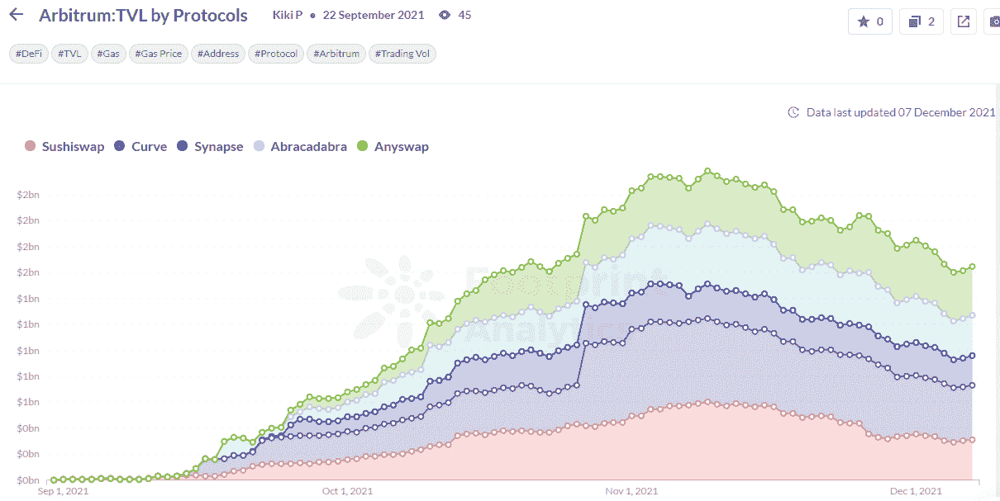

# Arbitrum TVL 公司在第 2 层领先的 3 个原因

> 原文：<https://medium.com/coinmonks/3-reasons-why-arbitrum-tvl-leads-in-layer-2-719803c625fd?source=collection_archive---------9----------------------->

以太坊的第二层网络之一 Arbitrum 自推出以来，已经获得了加密用户和开发人员的极大关注。根据 Footprint Analytics 的数据，截至 12 月 8 日，Arbitrum 贡献了 41.88%的第二层 TVL，总额为 22.5 亿美元。Arbitrum 现在是所有第二层网络的领导者。

*数据来源:足迹分析—* [*TVL 按层份额 2*](https://www.footprint.network/guest/chart/tvl-share-by-layer-2-protocols-fp-6b3b1eac-03f9-458c-b6c8-c27374655758?channel=u-DBc983)

Arbitrum 于 2021 年 9 月 1 日推出其主要网络，与其他二层网络相比，这似乎有些晚。尽管如此，Arbitrum 的 TVL 很快超过了其他项目，超出了预期。

*数据来源:足迹分析—* [*第二层 TVL 增长趋势*](https://www.footprint.network/guest/chart/layer-2-growth-trending-by-chain-fp-1f59a31a-5edd-478c-a215-25554b9b3b0e?channel=u-DBc983)

是什么让 Arbitrum 脱颖而出？

## **原因 1:技术迁移成本低**

在短期内，Arbitrum 的乐观汇总解决方案比技术上更复杂的 ZK 汇总解决方案更受开发人员欢迎。然而，从长远来看，由于其更快的速度和更强的安全性，ZK rollups 的网络可能有迎头赶上的潜力。

## **原因二:燃气费成本低**

Arbitrum 每秒处理 40，000 个交易请求，比以太坊的 15–30 个请求大得多，大大减少了网络拥塞，提高了速度，降低了交易成本。外部数据显示，相比以太坊的 64 Gwei，Arbitrum 的交易成本为 1.8 Gwei，是 Arbitrum 的近 36 倍。

## **原因 3:更加开放的生态系统**

很多人可能会问，同样使用乐观 rollups 方案的乐观网络，为什么不如 Arbitrum？在向公众开放之前，Arbitrum 的启动战略就已经启动了 400 多个 DeFi 项目，在启动之初，已经有几十个项目同时在线。这使得用户可以在其生态系统中完成各种操作。另一方面，Optimistic 使用白名单机制，因此只有白名单中的项目才能部署在其主网络上。

由于 Arbitrum 的开放部署机制，使 Arbitrum 出名的不是 head DeFi 协议，而是各种“degen”投资——那些提供不择手段的高回报的投资。

Arbitrum 最初的 TVL 增长很大程度上归功于 ArbiNYAN，它吸引投资者以超过 1000%的回报率押注其本土代币。这些项目虽然不总是合法的，但却让新的生态系统得以出现。

## **介绍 Arbitrum 生态系统**

Arbitrum 只有 44 个正在运行的项目，并不是特别大。其中 DeFi 类以 DEX、lending、asset 类为主。

其中，DEX 占 TVL 的 56%，资产占 18%，贷款占 17.8%。

*数据来源:足迹分析—*[*Arbitrum*](https://www.footprint.network/guest/chart/tvl-distribution-of-arbitrum-sector-fp-b5e47cc3-71c0-4586-8abf-2e02c0095232?channel=u-DBc983)上 TVL 类别份额

再看 DeFi 项目的 TVL 排名，德根项目已经不在前 5 名，主流项目升至首位。Curve 以 4.2 亿美元的 TVL 排名第一。

*数据来源:足迹分析—*[*Arbitrum 上的前 5 大 DeFi 协议*](https://www.footprint.network/guest/chart/arbitrum-tvl-by-protocols-fp-763f3aa5-6613-4a26-97fd-ae167e37eb00?channel=u-DBc983)

## **结论**

以太坊扩张中的关键角色 Arbitrum 已经吸引了大量资本的关注，获得了 1.24 亿美元的 A 轮和 B 轮融资，估值为 12 亿美元。Arbitrum 目前没有推出加密货币，其开发团队 Offchain Labs 的联合创始人表示，近期没有推出加密货币的计划。

Arbitrum 仍处于早期阶段，我们希望它继续丰富其生态系统，并吸引更多的开发者和投资者。

> 加入 Coinmonks [电报频道](https://t.me/coincodecap)和 [Youtube 频道](https://www.youtube.com/c/coinmonks/videos)了解加密交易和投资

## 另外，阅读

*   [如何在印度购买比特币？](/coinmonks/buy-bitcoin-in-india-feb50ddfef94) | [瓦济克斯评论](/coinmonks/wazirx-review-5c811b074f5b)
*   [隐翅虫替代品](/coinmonks/cryptohopper-alternatives-d67287b16d27) | [HitBTC 审查](/coinmonks/hitbtc-review-c5143c5d53c2)
*   [折叠 App 审核](https://blog.coincodecap.com/fold-app-review) | [Kucoin 交易机器人](/coinmonks/kucoin-trading-bot-automate-your-trades-8cf0ca2138e0) | [Probit 审核](https://blog.coincodecap.com/probit-review)
*   [如何匿名购买比特币](https://blog.coincodecap.com/buy-bitcoin-anonymously) | [比特币现金钱包](https://blog.coincodecap.com/bitcoin-cash-wallets)
*   [币安 vs FTX](https://blog.coincodecap.com/binance-vs-ftx) | [最佳(SOL)索拉纳钱包](https://blog.coincodecap.com/solana-wallets)
*   [比诺莫评论](https://blog.coincodecap.com/binomo-review) | [斯多葛派 vs 3Commas vs TradeSanta](https://blog.coincodecap.com/stoic-vs-3commas-vs-tradesanta)
*   [Capital.com 评论](https://blog.coincodecap.com/capital-com-review) | [香港的加密借贷平台](https://blog.coincodecap.com/crypto-lending-hong-kong)
*   [如何在 Uniswap 上交换加密？](https://blog.coincodecap.com/swap-crypto-on-uniswap) | [A-Ads 审查](https://blog.coincodecap.com/a-ads-review)
*   [WazirX vs coin dcx vs bit bns](/coinmonks/wazirx-vs-coindcx-vs-bitbns-149f4f19a2f1)|[block fi vs coin loan vs Nexo](/coinmonks/blockfi-vs-coinloan-vs-nexo-cb624635230d)
*   [本地比特币评论](/coinmonks/localbitcoins-review-6cc001c6ed56) | [加密货币储蓄账户](https://blog.coincodecap.com/cryptocurrency-savings-accounts)
*   什么是融资融券交易
*   [维护卡审核](https://blog.coincodecap.com/uphold-card-review) | [信任钱包 vs 元掩码](https://blog.coincodecap.com/trust-wallet-vs-metamask)
*   [Exness 评测](https://blog.coincodecap.com/exness-review)|[moon xbt Vs bit get Vs Bingbon](https://blog.coincodecap.com/bingbon-vs-bitget-vs-moonxbt)