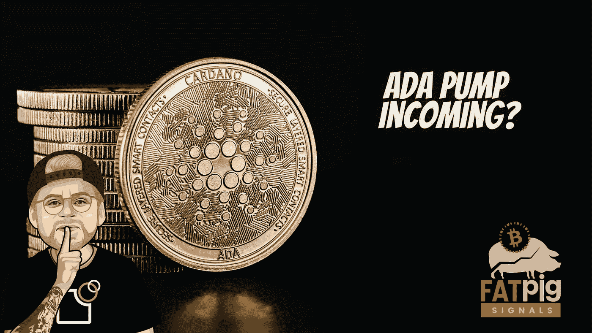

# 卡尔达诺将很快推出的 3 个原因

> 原文：<https://medium.com/coinmonks/3-reasons-why-cardano-will-be-pumping-soon-cf1e1d2b06f8?source=collection_archive---------5----------------------->

根据最近的一条推文，卡尔达诺区块链领先的分散化交易所 SundaeSwap 的交易量已超过 1 亿阿达(约 1.09 亿美元)。

因此，SundaeSwap 表明，Cardano 正在失去其幽灵链的地位。在推出全功能测试版一个月后，1 亿 ADA 是一个重要的里程碑。