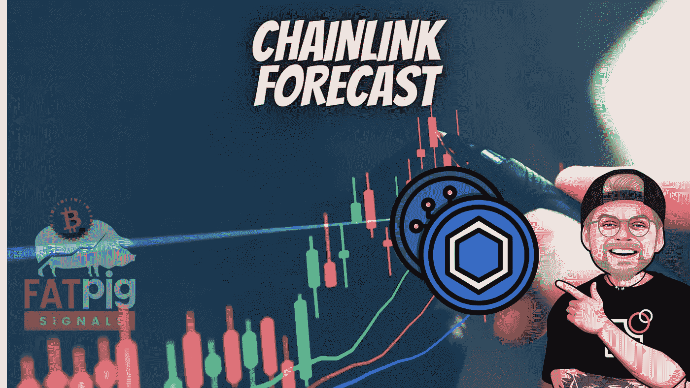

# 链式生态系统爆炸的 3 个原因

> 原文：<https://medium.com/coinmonks/3-reasons-why-chainlink-ecosystem-explodes-673a1e02a0da?source=collection_archive---------2----------------------->

随着该协议扩展对其他区块链环境的支持，Chainlink 生态系统继续过度增长。文章最后， **Fatpigsignals** 将呈现实际价格预测！

在过去的一年里，Chainlink 的数据输入越来越多地被采用，同时发布了新的基于计算机的服务。这导致了集成总数的增加。