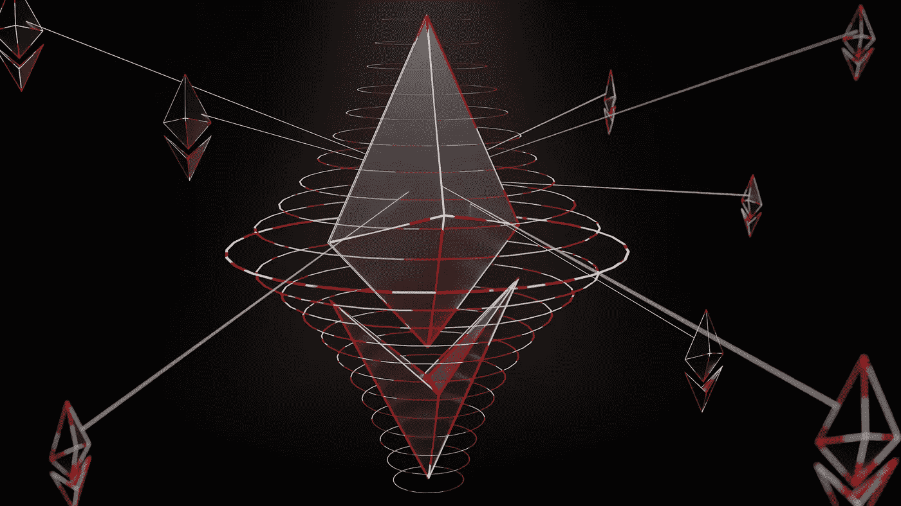

# 分散财务带给你自由的 3 个理由

> 原文：<https://medium.com/coinmonks/3-reasons-why-decentralized-finance-brings-you-freedom-19b3d0e23ef7?source=collection_archive---------16----------------------->

DeFi 专为你而生。

当你和一个人建立关系时，保持这种关系牢固的是相互理解，以及你们双方如何为你们的成长做出贡献。当你们中的一个人总是达不到一致时，这段关系结束只是时间问题。

不幸的是，这可能是你和你的银行之间的关系。原因如下

**银行对你的钱有太多的控制权**

银行就像那个有毒的合伙人，不管他们对你有多差，你都会回去。回来存钱、花钱、借钱等。如果你很富有，银行会贷款给你。如果你是中产阶级，银行会向你贷款。

分散融资(DeFi)被创造出来，作为一种自信地打破你与银行的有毒关系的手段。就像你有一天醒来，最终决定辞掉工作多年的工作，去寻找更好的工作。DeFi 正在使这些绿色牧场成为可能。这是如何

**去中心化金融使用自动化的自动执行合约来创建一个不需要中介(银行)来执行金融交易的系统。**

这些合同被称为智能合同。它之所以“聪明”,是因为它被编程为在合同的所有条件得到满足时立即执行。

那么为什么 DeFi 会给你自由呢？这里有三个原因

**1 你成为自己的银行**

在 DeFi 中，你要对你所有的流动性(钱)负责。

无论何时何地，你都可以自由地发送、接收、借出、借入和投资资金。不管是 100 万还是 1000 万。这就是原因

**DeFi 使交易民主化，因为没有一个人或组织发号施令。**

当您使用 ATM 机、POS 机，甚至通过银行进行跨境转账时，都要收取费用。

相比之下，如果你是**流动性提供者**，DeFi 允许你**从平台上的交易费用中赚取**。这就是我的意思

**你是流动性提供者，意味着你确保资金(加密)在平台上随时可用，正因为如此，你将获得部分交易费用。**

当你决定去另一个国家旅行时，你需要用他们的货币进行交易。你从哪里得到这个的？是的，在银行，因为银行向客户提供流动性。

因此，当你在分散的平台上提供流动性时，你就成了做市商，也就是银行。

就像我前面提到的，不管是 1 百万美元还是 1 千万美元，只要你提供部分流动资金，你就会自动得到你的那份费用。

**2 您可以获得更高的储蓄利率**

可悲的是，你正在损失你存进银行的钱，当你继续读下去，你就会明白为什么了。你在银行存款最多只能赚到 1%的利息。根据 Bankrate.com 的数据，截至 2022 年 1 月，储蓄账户的平均利率为 0.06%。

简单点说吧。假设你在 2021 年 1 月将 100，000 美元存入储蓄账户，使用上面 0.06%的利息，在 2022 年 1 月你的利润将是 60 美元。为什么储蓄账户的利率很低？原因如下

**每当一个国家的经济中印钞时，财富就会从存钱的人口转移到不存钱的人口(银行)，随着时间的推移，货币会继续印钞。**

供应过多会降低购买力。20 年前 100 美元能买到的东西今天买不到了。

这就是为什么**储蓄者是失败者**并且你不能通过储蓄致富。

然而，储户不一定是 DeFi 中的输家，这是因为加密是 DeFi 世界中的货币，他们都有最大供应限额。

DeFi 中的利率会根据每次的货币供求自动调整。没有任何组织或政府可以宣布或提高或降低利率，因为智能合同控制着 DeFi 中的决策。

**3 你可以 24/7 赚**

没有什么比全天候赚钱更接近财务自由了。DeFi 的收入奖励是无止境的。这仅仅是因为

**DeFi 为所有为系统成功做出贡献的人准备了奖励**

就像提供流动性一样，甚至使用平台进行交易也有助于一个成功的系统。看一下这个例子。

在名为 **dydx** 的交易所交易至少 1 美元，用户就有资格获得 11000 美元的空投。Uniswap exchange 向用户和流动性提供商空投了价值约 1600 美元的代币。

你的银行给过你多少奖励，因为你为他们的成功做出了贡献？

**总之**

DeFi 创造了一个财富分配的工作系统。一个高效、自主和透明的系统。但是每个新系统都需要改进。

DeFi 并不总是乐观的。它仍在增长势头，尚未完全成熟。使用 DeFi 平台存在风险。所以做自己的研究&尽职调查是必须的。

要了解更多关于 DeFi 流动性池的信息，请查看[此处](https://www.finextra.com/blogposting/21438/defis-liquidity-pool-party-is-getting-started-and-everyones-invited)