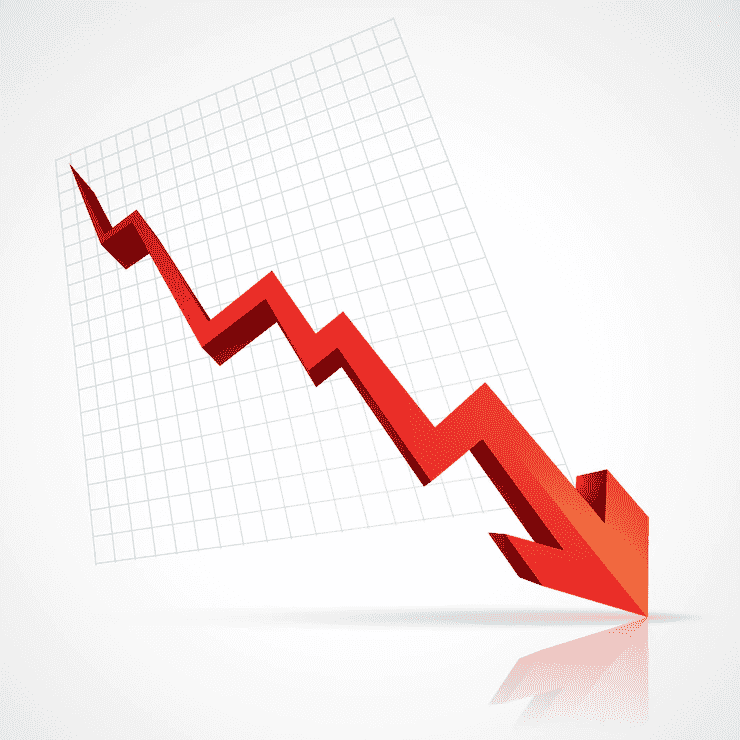

# 密码市场崩溃的 3 个原因以及如何应对。

> 原文：<https://medium.com/coinmonks/3-reasons-why-the-crypto-market-crashed-and-what-to-do-about-it-d42da61ff10a?source=collection_archive---------15----------------------->

是我们坦白的时候了。好的，我们知道你已经听说了密码市场崩溃的消息。互联网无法停止谈论加密崩溃。像 Twitter 这样的平台上充斥着自称“专家”的人，他们尖叫着，“我告诉过你！”。现在你想知道为什么会这样吗？是这个吗？在所有关于加密货币改变世界的大谈之后，我们终于结束了吗？

首先，我们来解释一下这篇文章将会讲些什么。这篇文章将分解我们认为导致加密市场崩溃的三个因素。我们将深入研究你需要做什么来帮助你导航这个加密崩溃。我们还将分享一些例子，强调加密市场是如何运作的，以及人们是如何间接导致加密市场崩溃的。

如果你知道有人可以从这些信息中受益，你可以通过点击本文底部的任何社交媒体图标与他们分享这篇文章。

# 为什么密码市场崩溃了？

想象一下，走进一个房间，看到一群人站成一圈。每个人都低头看着圆圈中间的一个破盘子。你问小组，“盘子怎么了？”突然，每个人都开始谈论他们认为发生了什么，每个人的看法都不一样。就像盘子的例子，关于 crypto 崩溃有很多观点。

密码市场很难预测。加密资产的价格每天都在上涨和下跌。有很多因素可能导致密码市场崩溃。我们所知道的事实是，这种情况以前发生过，而且是从比特币开始的。

[比特币](https://valorexchange.com/blog/post?slug=what-is-bitcoin-a-brief-introduction)是业内占主导地位的加密资产。当比特币的价格受到影响时，整个市场都会受到影响。

2017 年，比特币的价格从 2 万美元降至 1.2 万美元左右。这感觉像是加密行业的终结，但和以前一样，比特币再次崛起。

# 触发加密崩溃的三个因素

**总体经济不稳定和通货膨胀:**加密市场也不能免受经济因素的影响。如果经济不景气，加密行业也会受到影响，因为与加密行业互动的人会受到经济的影响。

自从 COVID 崛起以来，我们都看到了商品和服务的高价。随着通货膨胀、股票市场和欧洲的战争，全球经济受到了伤害。

为了帮助您更好地理解，让我们举一个简单的例子。想象一下现在的经济很糟糕，你本可以轻松买得起的东西现在变得越来越贵。你的工资没变，但你的房租在涨。所以，你突然记起你有一些加密资产，你可以卖掉这些资产换成法定货币，然后支付你的费用。这不会导致整个加密市场崩溃，但也不会就此结束。

在你的街道上，不太远的地方，有人也在出售他们的加密资产来结算费用，而且他们并不孤单。

很快，市场上将充斥着试图出售他们的加密资产的人，而没有足够多的人愿意购买他们。许多卖家会开始降低资产价格，以帮助他们快速出售。这蔓延到整个加密市场，并可能严重影响它。

虽然，这是事情如何工作的简化版本。还有许多其他因素在起作用，但它们都会导致流通中的加密资产失去价值。

**Covid 和** [**熊市:**](https://valorexchange.com/blog/post?slug=what-is-a-bear-market-a-beginners-guide) 你有没有过那种感觉一切都要崩溃的时刻？嗯，这就是密码行业熊市的感觉。加密资产价值下跌，投资者恐慌抛售，所有图表都是红色的。这本身是有问题的，但并不新鲜。熊市就像阳光和雨水一样自然。

许多投资者都有应对熊市的策略。对他们来说，这就像是为雨季做准备。

没人准备的是 Covid。Covid 来了，打乱了一切。通货膨胀飙升，世界各地的每个人都感受到了它的影响。不是雨季，感觉像是要地震了。

**一枚名为 Luna 的硬币:**于是就有了这种名为 Luna 的加密资产或货币。露娜在一个名为 Terra 的区块链中与另一枚名为 UST 的硬币一起工作。UST 是一个算法稳定的硬币。

稳定的硬币通常与美元等现实资产挂钩。这意味着一个货币单位等于一美元。稳定硬币代表的美元纸币通常存放在银行或其他地方以确保其安全。它不是用来帮助稳定硬币价格的。顾名思义，稳定币为行业提供了一定的稳定性。

UST 和卢娜等算法稳定的硬币与现实世界的资产无关。相反，他们使用一种复杂的算法来保持硬币价格稳定。如果对 UST 的需求超过了可获得的数量，算法知道该怎么做。UST 可以变成露娜，反之亦然。

当算法发现对 UST 的需求与供应不匹配时，用户就会被激励将他们的 Luna 转换为 UST。一旦市场上的 UST 过多，用户可以将其转换回 Luna。这确保了这两者刚好足够保持价格稳定。这感觉像是一个完美的系统，没有人预料到一个完全的加密崩溃。当有关加密市场崩溃的消息开始流传时，它与卢娜和 UST 失去价值的信息密切相关。UST 的价格跌至 30 美分，Luna 在本周早些时候达到 81 美元后，甚至跌至约 0.00001655 美元。几天之内损失了 400 多亿美元。

# 三件事有助于导航密码市场崩溃。

保持对未来的想法:过去的一周已经证明了负面消息的影响。毫无疑问，负面新闻加剧了加密市场的崩溃。密码行业及其资产非常不稳定。你必须通过广泛的研究学会看到更大的图景。尽你所能获得你感兴趣的任何加密资产的信息。观看视频，阅读文章，加入社区，尽自己的一份力量去了解这个行业正在发生的事情。投资加密资产时，您应该积极主动。

做所有这些并不总是保证你不会犯错误。Terra Luna 的崩溃甚至让最老练的加密投资者都感到惊讶。研究确保在你的加密之旅中有更少的不良投资。

**不要出于恐慌而抛售:**什么时候出于恐慌而做任何事情都是明智的，尤其是在抛售你的加密资产的时候？2017 年加密崩溃后，许多人失去了他们的比特币。许多人在出售他们的加密资产时损失了很多钱，但该群体中的一些人持有他们的加密资产。比特币最终复苏，市场也是如此。

**考虑投资 dip:** 不要为你不了解的项目这样做，即使他们有最令人印象深刻的网站。阅读加密项目，了解他们试图解决的行业问题。如果对你来说值得，那就投资这个想法。您可以在 [ValorExchange 上安全地购买比特币、以太(Eth)和系绳等加密货币，只需几秒钟。](https://account.valorexchange.com/)