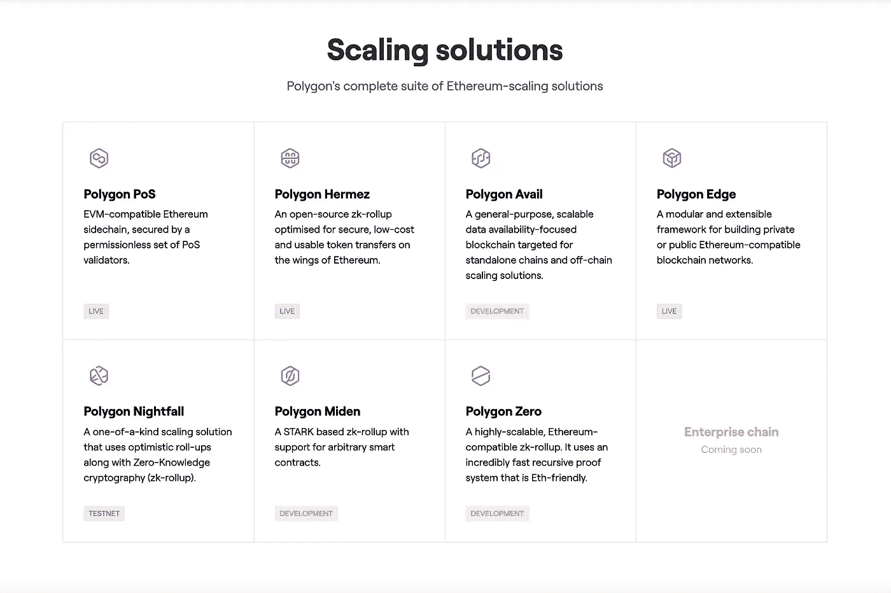
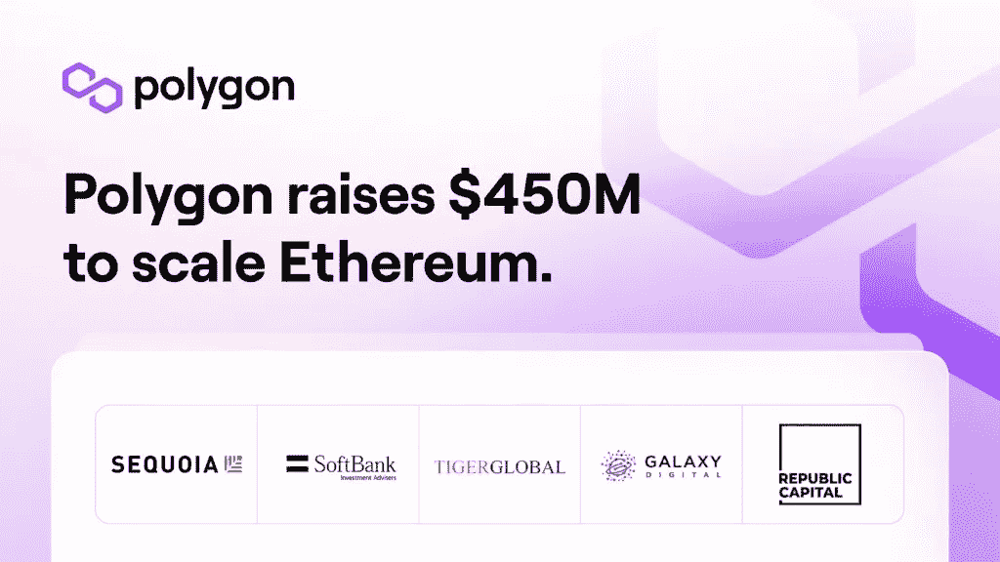
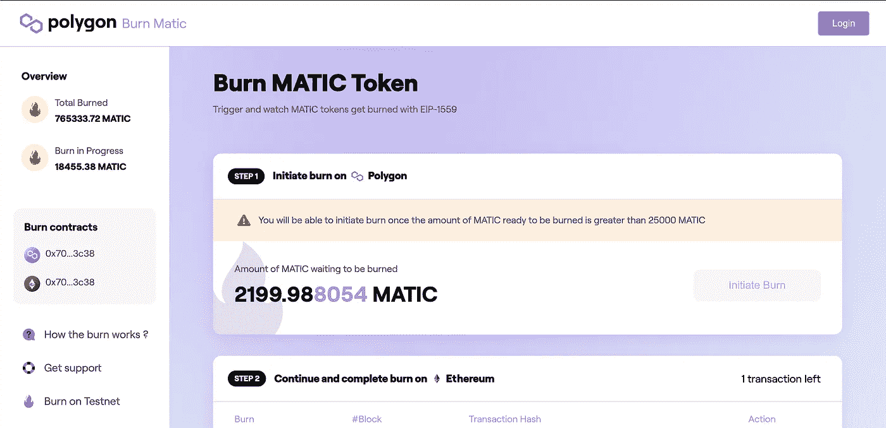
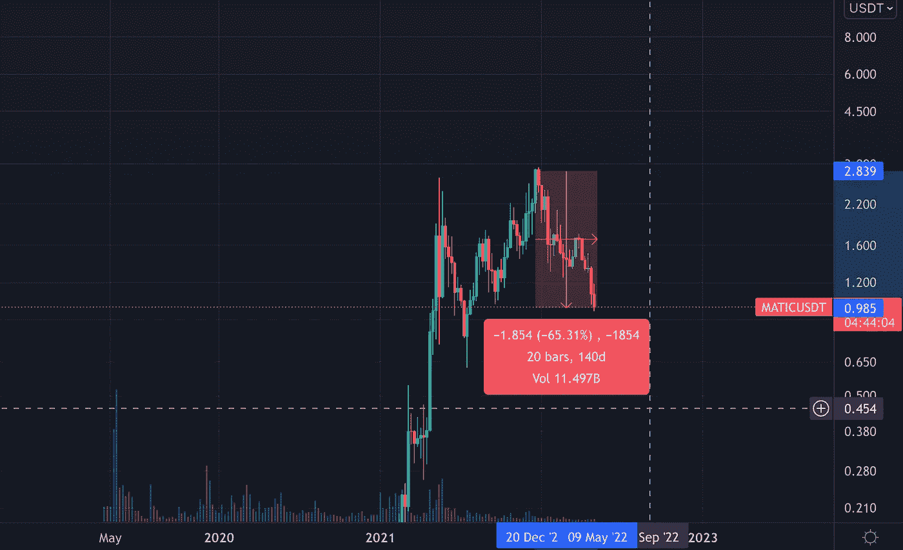

# 2022 年你应该投资 Polygon (MATIC)的 3 个理由。

> 原文：<https://medium.com/coinmonks/3-reasons-why-you-should-invest-in-polygon-matic-in-2022-c8b3f5da41aa?source=collection_archive---------7----------------------->

你还在考虑投资$MATIC 吗？现在读读这个。

Polygon MATIC to the moon?

## **TL；博士**

> 1.近年来，Polygon 的产品范围显著多样化，从利益证明(PoS)扩展解决方案到一套专注于以太坊不同扩展解决方案的生态系统。
> 
> 2.Polygon 与加密领域的主要参与者建立了战略合作伙伴关系，如风险投资公司红杉资本印度公司、软银和四大会计师事务所之一的安永会计师事务所。
> 
> 3.多边形随着以太坊改进协议 1559 (EIP-1559)而变得紧缩。Polygon 的供应量上限为 100 亿英镑，而该提议将有助于“燃烧”其供应量。根据基本的供求经济学，这将导致 MATIC 的价格在未来有上升的压力。

# 什么是多边形(MATIC)？

Polygon(或 MATIC token)对许多人来说不需要介绍，因为它是加密世界中如此突出和重要的项目。但是为了一些人的利益，让我给你介绍一下多边形的背景。

Polygon 是作为以太坊链的扩展解决方案开发的，于 2017 年作为 Matic Network 推出。Polygon 由印度的一个开发团队共同创建，旨在解决以太坊网络的两个主要限制——低吞吐量和高燃气费。MATIC 使用利益证明(PoS)共识机制来保护其与以太坊网络并行运行的网络。MATIC 是用于下注和管理的本地令牌，它在所有主要交易所(如币安和比特币基地)进行交易。

# 2022 年为什么要投资 Polygon MATIC？

不可否认，整个加密市场正在下滑，我们可能已经处于熊市。然而，在这种时候，我们应该始终保持警惕和冷漠。正如沃伦·巴菲特曾经说过的，“当别人恐惧时，你要贪婪……”

如果你还是多边形生态系统的新手，或者你还在犹豫是否要把辛苦赚来的钱投入这个项目。以下是 2022 年考虑投资 Polygon 的 3 个理由。

## **原因 1: Polygon 不再只是以太坊的一个更快的平台，因为网络已经扩展到一个包含不同扩展解决方案的多链生态系统。**

An overview of current suite of scaling solutions provided my Polygon adapted from [Polygon’s](https://polygon.technology/) website.

除了 Polygon PoS 扩展解决方案之外，该网络还提供了更多多样化的解决方案。例如 Polygon Hermez、Nightfall 和 Avail 将专注于支付、数据和企业扩展解决方案。随着以太坊 2.0 的合并，以太坊上的交易速度将从每秒 15 次交易(tps)急剧增加到最大负载时的 100，000 tps。Polygon 的扩张将提供一个多维扩展平台，这将是对以太坊缓慢交易速度的依赖的对冲。**因此，这也将推动 Polygon 在未来的进一步采用，从而推动 MATIC 令牌的使用。**

## **原因 2: Polygon 与加密领域的主要参与者建立了战略合作伙伴关系，这是 MATIC 生态系统的有利催化剂，也是其未来的保障**

News adapted from [Polygon’s official blog page](https://blog.polygon.technology/polygon-raises-450000000-from-sequoia-capital-india-softbank-galaxy-tiger-republic-capital/).

在 2022 年的 Q1，Polygon 成功从包括 Sequoia Capital India 和 SoftBank Vision Fund 2 在内的 40 家风险投资公司筹集了 4.5 亿澳元，以扩大以太坊的规模，并为 Web3 开发和 Web 3 应用提供资金。这也是近年来对一家加密货币公司的最大一笔资助，证明了投资者对该项目的信心不断增长。Polygon 还宣布与安永(EY)合作，共同开发和实施企业解决方案。**这些在很大程度上是积极的发展，因为 Polygon 和以太坊的大规模采用也需要企业的使用和采用，以使像 MATIC 这样的加密资产合法化。**

## 原因三:**随着以太坊改进提案 1559 (EIP-1559)** 的实施，多边形成为通货紧缩。

MATIC Token Live Burn count Dashboard adapted from [Polygon Burn website](https://burn.polygon.technology/).

多边形网络的这一更新消除了拍卖作为确定费用的主要方法。取而代之的是，实施基本收费，并使用优先级费用来加速处理该块。**每次成功交易后，基础费用都会被烧掉**。由于 MATIC token 的供应上限为 100 亿英镑，因此任何 token 的减少都会产生通缩效应。根据 Dune Analytics 的计算，每年大约有 0.29%的 MATIC token 会被烧掉。**根据基本的供求经济学，如果以太坊的采用继续增长，MATIC 的价格在未来将有上升的压力。**

# 总结想法？

你现在应该用你所有的积蓄去买 MATIC token 吗？不，绝对不行！在撰写本文时，MATIC token 已经从每枚 2.80 美元的历史最高价下跌了近 70%，跌至不到 1 美元。这本身可能就是一个很好的买入机会。然而，我始终相信对任何形式的资产进行美元成本平均(DCA)。

Technical analysis of MATIC/USDT pair dropping more than 65% from all time high prices.

我不会鼓励任何人“全押”去冒险接住落下的刀子。还是那句话，总是 DCA。从长远来看，Polygon 肯定有一个光明的未来。如果你打算长期投资，Polygon 的 MATIC token 可能是你可以考虑的东西。

— — — — — — — — — — — — — — — — — — — — — — — — — — — — — — —

如果你喜欢你刚刚读到的内容，考虑给我买杯咖啡 [***这里***](http://ko-fi.com/unemployedbanana?source=about_page-------------------------------------) 支持我！☕❤️

如果您想在****🟢**或** [**币安**](https://accounts.binance.me/en/register?ref=174617871) 🟡 **上购买稳定币或其他代币，您也可以考虑使用我的推荐链接来支持我。** ✨****

****— — — — — — — — — — — — — — — — — — — — — — — — — — — — — — —****

*******免责声明:我绝不是财务顾问。永远 DYOR，保持安全！*******

> ****加入 Coinmonks [电报频道](https://t.me/coincodecap)和 [Youtube 频道](https://www.youtube.com/c/coinmonks/videos)了解加密交易和投资****

# ****另外，阅读****

*   ****[3 商业评论](/coinmonks/3commas-review-an-excellent-crypto-trading-bot-2020-1313a58bec92) | [Pionex 评论](https://coincodecap.com/pionex-review-exchange-with-crypto-trading-bot) | [Coinrule 评论](/coinmonks/coinrule-review-2021-a-beginner-friendly-crypto-trading-bot-daf0504848ba)****
*   ****[莱杰 vs n rave](/coinmonks/ledger-vs-ngrave-zero-7e40f0c1d694)|[莱杰 nano s vs x](/coinmonks/ledger-nano-s-vs-x-battery-hardware-price-storage-59a6663fe3b0) | [币安评论](/coinmonks/binance-review-ee10d3bf3b6e)****
*   ****[Bybit Exchange 审查](/coinmonks/bybit-exchange-review-dbd570019b71) | [Bityard 审查](https://coincodecap.com/bityard-reivew) | [Jet-Bot 审查](https://coincodecap.com/jet-bot-review)****
*   ****[3 commas vs crypto hopper](/coinmonks/3commas-vs-pionex-vs-cryptohopper-best-crypto-bot-6a98d2baa203)|[赚取加密利息](/coinmonks/earn-crypto-interest-b10b810fdda3)****
*   ****最好的比特币[硬件钱包](/coinmonks/hardware-wallets-dfa1211730c6) | [BitBox02 回顾](/coinmonks/bitbox02-review-your-swiss-bitcoin-hardware-wallet-c36c88fff29)****
*   ****[BlockFi vs Celsius](/coinmonks/blockfi-vs-celsius-vs-hodlnaut-8a1cc8c26630)|[Hodlnaut 点评](/coinmonks/hodlnaut-review-best-way-to-hodl-is-to-earn-interest-on-your-bitcoin-6658a8c19edf) | [KuCoin 点评](https://coincodecap.com/kucoin-review)****