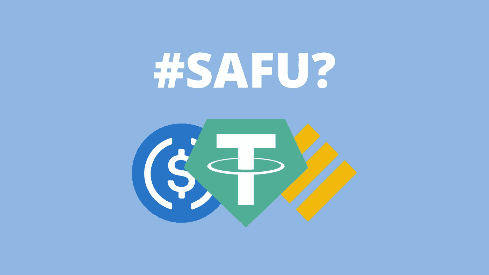
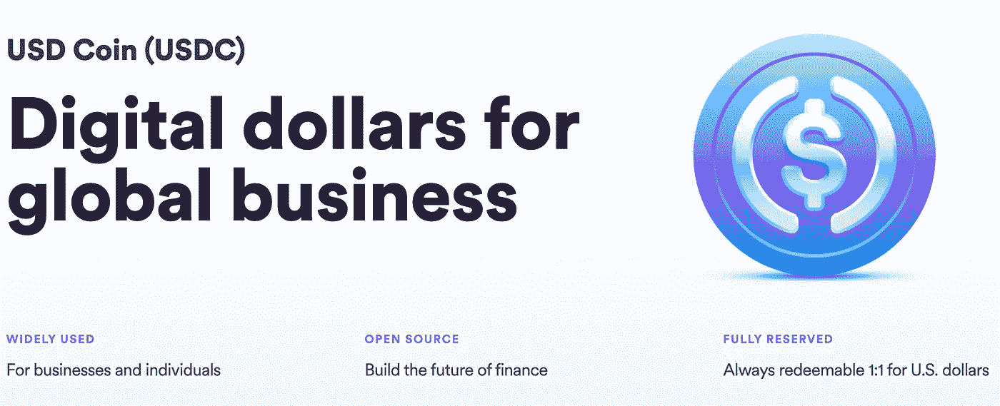
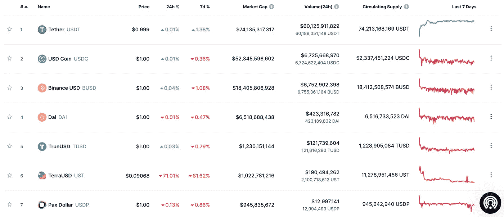
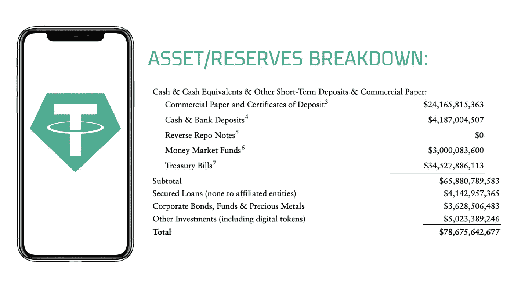
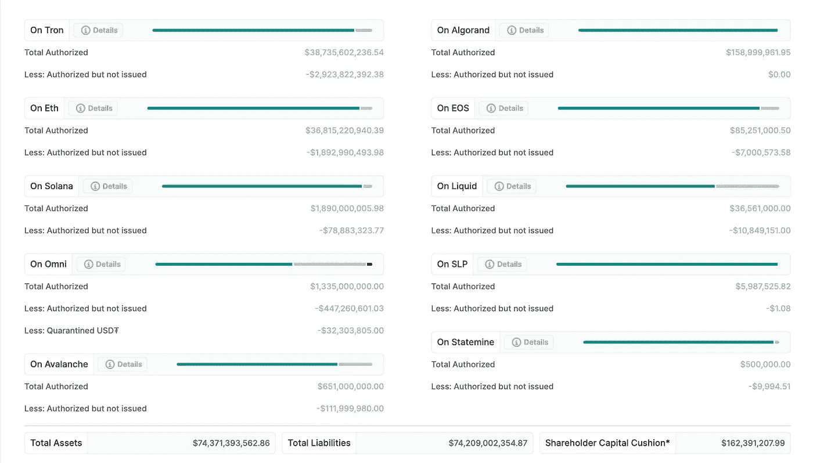
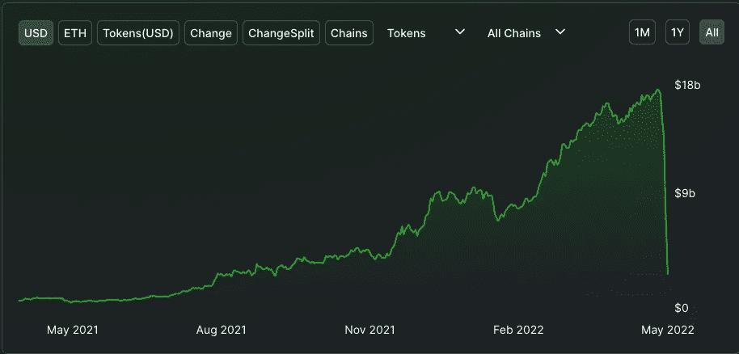
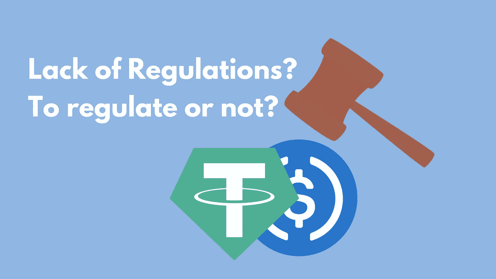
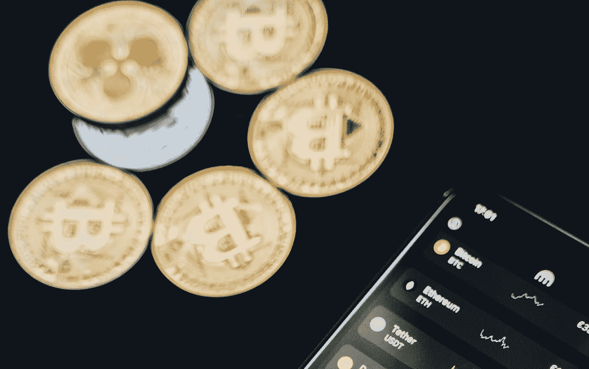

# 为什么你的钱在稳定的银行里不安全的 3 个原因

> 原文：<https://medium.com/coinmonks/3-reasons-why-your-money-isnt-really-safe-in-stablecoins-90625f125516?source=collection_archive---------35----------------------->

## 你的钱放在马厩里真的安全吗？

## TL；速度三角形定位法(dead reckoning)

> 1.硬储备风险。稳定币发行者声称的资产不能完全支持稳定币的风险。(例如泰瑟的 USDT)
> 
> 2.投资者对稳定货币或发行稳定货币的公司失去信心，银行面临风险。
> 
> 3.稳定币发行者持有的不同储备和资产产生的交易对手风险，以及缺乏保护投资者免受稳定币失去挂钩的监管。(我知道，这是一个非常有争议和敏感的论点，但请多读一些，以理解为什么我认为这是一个风险)

# **简要介绍稳定的信贷和涉及的风险**

[Circle’s USDC website](https://www.circle.com/en/usdc)

稳定币是一种加密货币，旨在模拟特定货币，通常是美元。因此，稳定的硬币的价值与真实货币的价值挂钩。例如，1 USDT = 1 美元，反之亦然。

在稳定的硬币市场上有几个著名的名字，如 USDT、USDC 和 BUSD。在过去的几年里，稳定的硬币市场有了巨大的增长。根据美联储的数据，2021 年 9 月有近 1300 亿美元与美元挂钩的稳定货币流通，比去年增加了 500%以上。以下是 2022 年 5 月流通中最稳定股票的当前市值(或价值)。

Top Stablecoins ranked by market capitalisation adapted from [CoinMarketCap](https://coinmarketcap.com/)

*   **USDT——7413 亿美元**
*   USDC——5234 万美元
*   **BUSD——18.4 亿美元**

即使在熊市中，加密市场前三名的稳定发行量也已经远远超过了 2021 年 9 月的数值。这标志着加密领域的爆炸性需求和用户增长。

随着大众开始使用稳定币，我不禁怀疑我们的钱在稳定币中是否真的安全。随着最近 TerraUSD 的 [**崩溃，让我更加质疑。我们应该始终考虑任何资产类别所包含的风险，特别是对于稳定的资产，我们认为在动荡的加密市场中它是“安全的”。因此，我找出并整理了你的钱在稳定的收入中不安全的三大原因。**](/@unemployedbanana/ust-plunged-to-0-25-and-luna-crashed-80-in-12hours-do-kwons-terra-and-ust-recovery-plan-899523db88a1)

# **原因#1:硬准备金风险和透明度问题**

稳定货币的真正风险在于，它们并不像所宣称的那样 100%受到储备货币的支持。稳定币的发行者应该有足够的储备来支持稳定币的流通供应。例如，Tether 将需要至少 74，142，986，425 美元的储备(根据 2022 年 5 月 18 日 CoinMarketCap 上的供应)。如果储备低于稳定货币的流通供应量，就会产生储备风险。当密码市场出现大幅波动时，这种风险将导致稳定的货币难以重新盯住美元。

让我们分析一下泰瑟用来支持世界上最大的稳定货币 USDT 的储备。

Asset breakdown of Tether’s asset. Data adapted from Moore Cayman independent audit report 2021.

*   现金&现金等价物&其他短期存款和商业票据——65，880，789，583 美元。该报告进一步将这部分细分为国库券、货币市场基金、**存单&商业票据**和现金&银行存款。**这里的商业票据是指企业发行的短期债务**，**存单**是金融机构发行的**短期存款。**这意味着 Tether 在银行和金融机构有存款。**然而，分配给每家金融机构的确切数字并未完全披露。**
*   担保贷款——4142957365 美元。虽然披露了担保贷款的数额，但报告中没有披露贷款的来源。担保贷款需要某种类型的借款抵押品。抵押品的类型和数量也没有披露。
*   公司债券、基金和贵金属——3，628，506，483 美元
*   其他投资(包括数字代币)——5，023，389，246 美元
*   **总资产:78675642677 美元**

因此，从表面上看，Tether 似乎很好地披露了其资产持有情况，并且碰巧有资产盈余(超过其总负债)。然而，正如上文通过一些例子分析的那样，Tether 的披露做法远非透明。还是有欠缺的。

Daily report of balances from Tether. (updated as at 18 May 2022). Adapted from [Tether’s website.](https://tether.to/en/transparency)

尽管如此，随着稳定硬币发行者每天报告其储备价值并至少每天更新一次，Tether 取得了进展。

透明度仍然是稳定币市场的一个争论点，因为人们可以开始猜测稳定币是否有实际储备支持。如果缺乏透明度成为一个持续的问题，投资者可能会对稳定的货币失去信心。当这种情况发生时，大众市场恐慌随之而来，这可能会对稳定的货币造成巨大的抛售压力，导致其与美元脱钩。稳定币的恢复与挂钩总是取决于稳定币发行者持有的储备。如果没有实际的储备支持，或者不是 100%的储备回到稳定的货币，**稳定的货币将很难从其脱钩中恢复，因为没有足够的资金回购稳定的货币以维持其与 1 美元的挂钩。**

[最近 UST 元的崩溃是这种情况的一个主要例子，没有任何储备支持的稳定货币很快与美元脱钩，并且随着大规模恐慌和抛售压力的持续，这种情况永远不会恢复。](/@unemployedbanana/ust-plunged-to-0-25-and-luna-crashed-80-in-12hours-do-kwons-terra-and-ust-recovery-plan-899523db88a1)

# 原因 2:失去投资者对稳定货币信心的风险——UST 和安克雷奇银行挤兑的例子

投资者对稳定的货币失去信心有各种各样的原因。该列表列出了 stablecoin 的一些常见问题。它并不详尽。

*   一个稳定的持续脱钉
*   稳定硬币发行者遇到了监管和法律问题
*   支持稳定货币的储备缺乏透明度

现在让我们看看最近 UST 因银行挤兑而崩溃的例子。

当大量储户因担心银行或机构破产而从银行提款时，就会发生“银行挤兑”。随着恐慌像野火一样蔓延，越来越多的投资者将开始对稳定的联系汇率失去信心。从背景来看，Anchor Protocol 在过去两周内损失了价值超过 99%的 UST 存款。这是银行挤兑的典型案例。曾经流通价值高达 185 亿美元的 UST 稳定币的消亡是怎么回事？

1.  它始于鲸鱼试图通过向市场出售大量 UST 来攻击联系汇率制。UST 一度失去了与 1 美元兑 0.80 元人民币的联系，随后又迅速恢复。
2.  然而，投资者开始对稳定的货币挂钩失去信心。这导致 UST 以惊人的速度退出锚定协议(UST 稳定币的储蓄账户)。
3.  由于 UST 是一种算法稳定的货币，因此没有实际的储备支持这种稳定的货币。作为稳定的货币脱钩，UST 得到的支持是一种计算机化的算法，根据供求关系，燃烧和铸造$UST 和$卢纳代币，以维持其挂钩。事后看来，当如此大规模的波动发生时，这个系统失败了。

Anchor Protocol TVL. Adapted from [Defi Llama](https://defillama.com/protocol/anchor) as at May 11.

**从 UST 事件中，重要的是要明白投资者的信心对于稳定的投资来说是极其重要的。**当然，UST 的崩溃不仅仅是因为储量不足和投资者对 Terra 生态系统失去信心，也是因为算法稳定性的内在问题。由于支持稳定币的储备价值不断变化，稳定币发行者保持透明度并尽可能详细地披露其储备非常重要。

# 原因 3:监管风险(或缺乏监管)和交易对手风险

The multi billion dollar question — Should we regulate stablecoins to protect investors?

这个价值数十亿美元的问题是:我们应该监管稳定的债券以保护投资者吗？

稳定币的目的是最小化价格波动，并创造一种资产来与比特币等波动性更大的资产进行交易，但它没有受到有意义的监管。当一个敌对的参与者试图攻击联系汇率制，或者发行者持有的任何硬资产失去价值时，与美元的联系汇率制就会受到严重损害。缺乏保护联系汇率的法规，使得稳定的货币市场更容易受到此类事件的影响。稳定货币的投资者将是输家。

如果像比特币这样的持有资产因黑天鹅事件而下跌 90%，那么由比特币提供实质性支持的稳定资产将会发生什么？很明显，这只是一个极端的例子，让你去描绘效果。值得庆幸的是，像 Circle 这样的稳定币发行者拥有超额抵押资产来支持他们的 USDC 稳定币。这就引出了我的下一个观点——交易对手风险。

似乎只有稳定的硬币发行者在管理这些资产。事实上，你在与多方打交道，包括持有准备金和存款的银行，持有投资资产和政府发行的国债和收益率的金融机构。这些中介机构必须通过做正确的事情来管理好资产，以确保资产价值不会下跌。

# 总结想法？

[Photo by Alesia Kozik](https://www.pexels.com/photo/coins-scattered-near-smartphone-with-financial-charts-on-screen-6771985/)

在可预见的未来，稳定的货币仍将是我们作为加密货币等波动性资产类别投资者的重要避风港。随着比特币和以太币继续暴跌并设定在更低的价格，投资者逃向稳定的货币寻求安全。

今天，像 USDT 和 USDC 这样稳定的国家也是必不可少的，因为几乎所有的加密资产都是针对 USDT 交易的。在这个时代，很难想象没有稳定货币的加密货币。稳定的货币就像是法定货币和分散货币之间的桥梁。

因此，我觉得这种重要性要求我们进行更多的审查，我们应该意识到在加密世界中被认为“安全”的资产所包含的风险。

— — — — — — — — — — — — — — — — — — — — — — — — — —

如果你喜欢你刚刚读到的内容，考虑给我买杯咖啡 [***这里***](http://ko-fi.com/unemployedbanana?source=about_page-------------------------------------) 来支持我吧！☕❤️

如果你想在[**kucoin**](https://www.kucoin.com/r/rf/rPELADP)**🟢**或** [**币安**](https://accounts.binance.me/en/register?ref=174617871) 🟡 **购买 stablecoins 或其他代币，你也可以考虑通过我的推荐链接来支持我。** ✨**

**— — — — — — — — — — — — — — — — — — — — — — — — — —**

**免责声明:我不是任何形式的财务顾问。永远 DYOR，保持安全！**

> **加入 Coinmonks [电报频道](https://t.me/coincodecap)和 [Youtube 频道](https://www.youtube.com/c/coinmonks/videos)了解加密交易和投资**

# **另外，阅读**

*   **[从 WazirX 切换到 CoinDCX 的 5 个理由](https://coincodecap.com/reasons-to-switch-from-wazirx-to-coindcx)**
*   **[联合国硬币评论](https://coincodecap.com/unocoin-review) | [最佳加密赌注硬币](https://coincodecap.com/best-crypto-staking-coins)**
*   **如何使用 MetaMask Wallet 获得 KCC 地址？**
*   **[如何获得自己的。XYZ 领域？](https://coincodecap.com/xyz-domain)**
*   **[最佳加密交换平台](https://coincodecap.com/best-crypto-swap-platforms) | [最佳加密交易所](https://coincodecap.com/crypto-exchange)**
*   **[购买比特币印度](/coinmonks/buy-bitcoin-in-india-feb50ddfef94) | [Pionex 评论](/coinmonks/pionex-review-exchange-with-crypto-trading-bot-1e459d0191ea) | [加密交易机器人](/coinmonks/crypto-trading-bot-c2ffce8acb2a)**