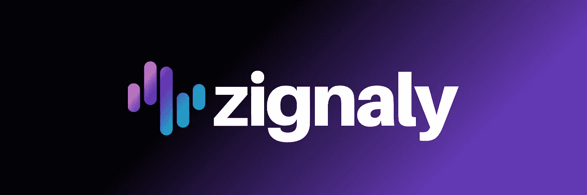

# Zignaly 走向失败的 3 个原因

> 原文：<https://medium.com/coinmonks/3-reasons-why-zignaly-is-going-defi-cf28e033e448?source=collection_archive---------27----------------------->

几天前，也就是 2022 年 6 月 21 日， [Zignaly](https://zignaly.com/) 推出了将自己转变为[道](https://zigdao.com/)的去中心化计划。这是利润分享服务的一个重大变化，该服务旨在有机地发展与领先的集中交易所的合作伙伴关系，将散户投资者与专业交易员联系起来。虽然核心产品保持不变，但为什么要改变路线呢？

答案似乎在于塑造加密行业的特定潜在趋势& Zignaly 自身的发展。让我们在下面运行它们。

# 体积转移到指数

[该图表由模块](https://www.theblock.co/data/decentralized-finance/dex-non-custodial/dex-to-cex-spot-trade-volume)显示月度总 DEX 交易量除以月度总 CEX 交易量，并以百分比表示。我们可以看到，DEX 交易量的增长在整体增长中是上升的。

这种转变对 Zignaly 产生了双重影响。由于坚持使用 CEXs，他们失去了获得不断增长的 dex 数量的机会，也无法吸引在该领域经营的众多专业交易者。因此，开放将使 Zignaly 在这一增长市场获得立足之地。

# 新资产主要在 DeFi 上提供

几乎没有任何项目会在第一天就在 CEXs 上启动。事实上，IDOs 是早期接触 ico 的途径。对于 NFT 市场来说也是如此，那里集中的铸币厂很少&交易量是由分散的市场主导的。此外，人们发现，某些 DeFi 产品在 CEX 环境中根本无法获得，或者根本没有竞争力。例子包括借款、贷款、储蓄、流动性供应和赌注。转移到一个分散的环境将有助于 Zignaly 吸引专业交易员和投资者进入加密领域的这些新分支，而不是局限于 CEX 产品。

有趣的是，Zignaly 一直在为此做准备，推出了 ZigPad (IDO launchpad)、Zig Vault(奖励和锁定赌注)和 NFT 莱佛士。这一举措为基础设施的发展提供了更大的效用。

> 对 Zignaly 感兴趣？从今天开始！：
> 
> 1.使用我的推荐代码注册:[https://zignaly.com/app/signup/?invite=ahmedzig…](https://t.co/0B7OueA4iJ)
> 
> 2.在任何利润分享服务中投资 100 美元
> 
> 3.获得$Zig 中的$20 作为即时奖金

# 监管和更高的透明度

CEXs 已经接受监管作为一种模式，采取加密主流。然而，在我看来，Zignaly 的问题在于，它们还处于成长周期的早期，没有耐心应对监管要求。例如，对于币安或 FTX 来说，由于获得了庞大的客户群，引入新的监管参数变得更加容易。对于 Zignaly 这样的初创公司来说，这简直太难了。此外，他们还可能需要对专业交易员实施额外的监管(TradFi 中的资产管理公司也受到监管)，这将导致灾难性的增长。

通过将自己转换成一个 DAO，这个项目放弃了它作为一个在线市场的地位，成为一个社区管理的可编程技术。这为项目团队提供了实施监管的借口&通过允许社会投资蓬勃发展来保护整个加密领域的监管偏见。

这将导致项目自身收入方面的更大透明度，因为当创始团队控制向硬币持有者提供的信息的性质和数量时，社区驱动的模式将消除委托代理问题。

# 结束语

在我看来，这是 Zignaly 创始团队在推进项目并加速其发展方面的一个大胆举措。该项目为自己设定了一个 100 亿美元的总价值锁定(TVL)目标，在未来 2 年内每月交易 1 亿次。作为交易所、专业交易员和散户投资者之间的渠道，这样的数字是不可能的。

> **免责声明:**本文观点为作者个人观点&不代表其雇主的观点，也不代表财务建议。在投资或使用文中提到的任何产品之前，请做好自己的研究。作者可能投资也可能不投资任何特定的产品*。*

> 加入 Coinmonks [电报频道](https://t.me/coincodecap)和 [Youtube 频道](https://www.youtube.com/c/coinmonks/videos)了解加密交易和投资

# 另外，阅读

*   [加密复制交易平台](/coinmonks/top-10-crypto-copy-trading-platforms-for-beginners-d0c37c7d698c) | [Coinmama 评论](/coinmonks/coinmama-review-ace5641bde6e)
*   [印度的加密交易所](/coinmonks/bitcoin-exchange-in-india-7f1fe79715c9) | [比特币储蓄账户](/coinmonks/bitcoin-savings-account-e65b13f92451)
*   [OKEx vs KuCoin](https://coincodecap.com/okex-kucoin) | [摄氏替代度](https://coincodecap.com/celsius-alternatives) | [如何购买 VeChain](https://coincodecap.com/buy-vechain)
*   [币安期货交易](https://coincodecap.com/binance-futures-trading)|[3 commas vs Mudrex vs eToro](https://coincodecap.com/mudrex-3commas-etoro)
*   [如何购买 Monero](https://coincodecap.com/buy-monero) | [IDEX 评论](https://coincodecap.com/idex-review) | [BitKan 交易机器人](https://coincodecap.com/bitkan-trading-bot)
*   [CoinDCX 评论](/coinmonks/coindcx-review-8444db3621a2) | [加密保证金交易交易所](https://coincodecap.com/crypto-margin-trading-exchanges)