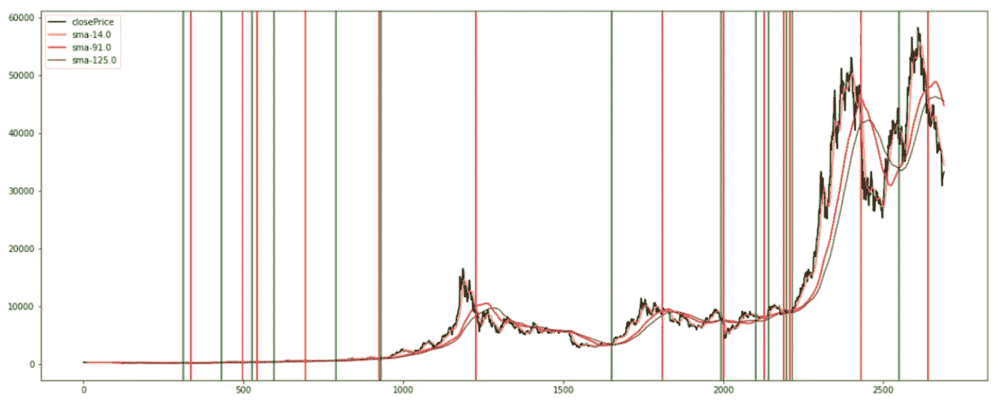
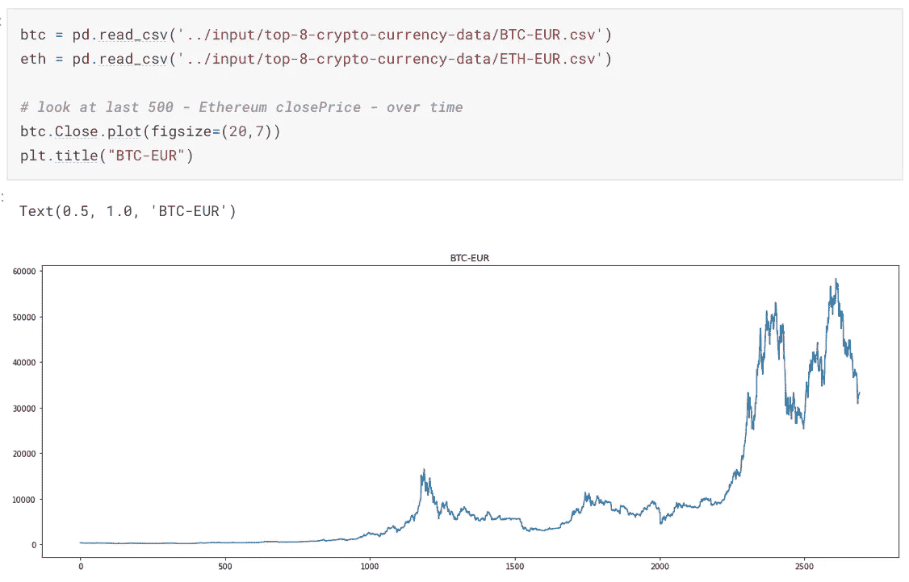
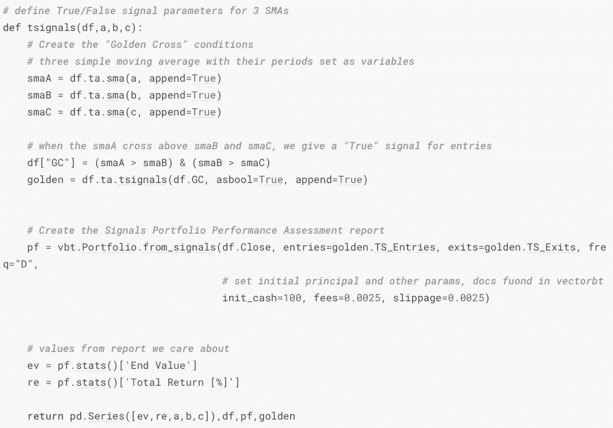
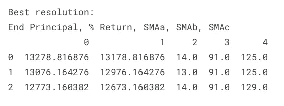
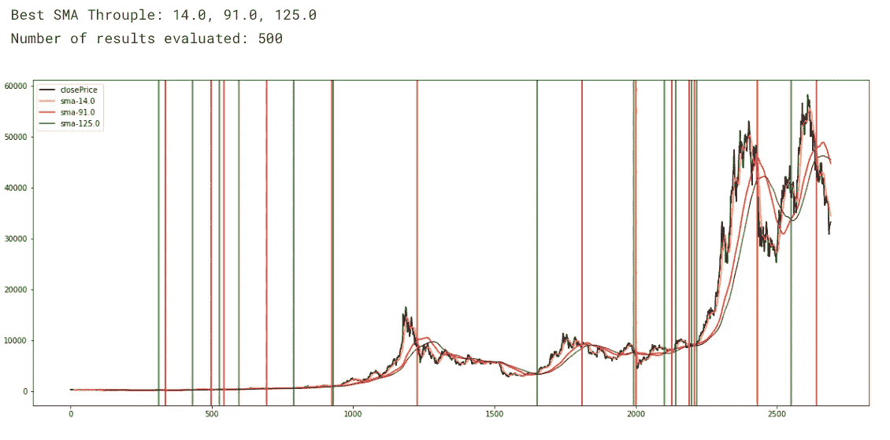

# 3 简单移动平均线交易策略:迭代性能测试

> 原文：<https://medium.com/coinmonks/3-simple-moving-averages-trade-strategy-performance-test-2194f423d36b?source=collection_archive---------9----------------------->

有很多基于 python 的交易策略，尤其是那些使用简单移动平均线(SMA)的策略，它们总是激起我的兴趣。他们中的许多人会展示应用滚动平均函数的例子，以输出一对滞后列和显示交叉点重要性的图。我也看到交易策略建议使用三条均线作为更稳健的方法。有鉴于此，我一直在思考，“哪三种 SMA 组合会产生最好的结果？”事实证明，答案是:“那得看情况。”但实际上，这并不取决于太多。



Resulting Throuple

我将开门见山，很少甚至没有客套话。这里可以看到完整代码:[[https://www . ka ggle . com/code/da scient/3-simple-moving-averages-performance-testing](https://www.kaggle.com/code/dascient/3-simple-moving-averages-performance-testing)。

首先，我们导入我们的包并上传我们选择的市场数据:

```
 from dateutil.tz import tzlocal
import matplotlib.pyplot as plt
from datetime import datetime
import numpy as np
import pandas as pd
import time *#* [*https://github.com/twopirllc/pandas-ta*](https://github.com/twopirllc/pandas-ta)!pip install pandas_ta
import pandas_ta as ta

*# performance metrics package*
*# https://vectorbt.dev*
!pip install vectorbt==0.20.1
import vectorbt as vbt
```



Bitcoin-EUR

Pandas TA 有一个 tsignals 函数，允许我们将布尔实体设置为“进入”和“退出”信号。你可能会觉得下面的算法有点奇怪，但是我的目标是尝试确定最好的三条均线 sma 组合。我认为通过三(3)条简单均线的乘法组合来重申交易是很有趣的。

关于 pandas-ta 的绩效指标包的更多信息，如下:

```
*https://github.com/twopirllc/pandas-ta#performance-metrics*
```



Defines 3-SMA signaling strategy, then uses vectorbt’s pf.stats() to calculate backtest performance.

所以为了测试三个不同的均线，我做了三个不同幅度的列表。然后使用三个嵌套的 for 循环 range(10，15)、range(90，100)和 range(125，135)——我能够遍历应用移动平均线的每个组合的不同结果。BTC 的代码和最终结果如下所示:

```
*# range of curious movAvg values & initialize results frame*

*# can also use* # range(3,33), range(34,99), range(100,166)
sma_a, sma_b, sma_c, results = list(range(10,15)),list(range(90,100)),list(range(125,135)),[]

*# for the sake of computation efficiency...*
df = btc

*# re(re(iteration))*
*# this will take a while to run,* 
*# but basically it's evaluating profit/loss outcomes*
*# by trying each sma(a,b,c) combination.*

thresh = 15 *# hoping to display only results that yield above 15% profit*
for c **in** sma_c:
    for b **in** sma_b:
        for a **in** sma_a:
            if tsignals(df,a,b,c)[0][1] > thresh:

                try:
                    print(f"**\n***Testing: sma_**{**a**}**, sma_**{**b**}**, sma_**{**c**}*****\n**")
                    *#print(tsignals(df,a,b,c)[0])*
                    results.append(tsignals(df,a,b,c)[0])
                    clear_output()
                except:
                    print(f"No results yielding over **{**thresh**}**.")

res = pd.DataFrame(results)
best_res = res.sort_values(res.columns[1],ascending=False).head(3).reset_index(drop=True)
print("Best resolution:**\n**End Principal, % Return, SMAa, SMAb, SMAc")
print(best_res)
```



换句话说，最好的 3 个 SMA 周期组合是 14，91 和 125。记住，这只适用于我们那个时代的 BTC。不同结果的可靠性在于你分析的时间范围价格行为。

```
*# highest yielding sma_value*
a = best_res[2][0]
b = best_res[3][0]
c = best_res[4][0]
print(f"**\n**Best SMA Throuple: **{**a**}**, **{**b**}**, **{**c**}**")
print(f"Number of results evaluated: **{**len(results)**}**")

*########################################################*

*# le winner*
df, pf = tsignals(df,a,b,c)[1], tsignals(df,a,b,c)[2].stats()
golden = tsignals(df,a,b,c)[3]
*# params*
fig, ax = plt.subplots(figsize=(20, 8))

*# plot*
ax.plot(df.Close, color = 'black', label = 'closePrice')
ax.plot(df.ta.sma(a), color = 'orange', label = f'sma-**{**a**}**')
ax.plot(df.ta.sma(b), color = 'red', label = f'sma-**{**b**}**')
ax.plot(df.ta.sma(c), color = 'purple', label = f'sma-**{**c**}**')

*# signals*
xcoords_buy, xcoords_sell = golden[golden.TS_Entries == True].index, golden[golden.TS_Exits == True].index

for xc **in** xcoords_sell:
    plt.axvline(x=xc,c='r')
for xc **in** xcoords_buy:
    plt.axvline(x=xc,c='g')

*# plot outputs*
ax.legend(loc = 'upper left')
plt.show()
```



无论如何，我都不认为这是一个强有力的启示。然而，它为我提供了一种计算高效的方式来解决我最初的担忧。我现在能够快速计算出哪种 3-SMA 组合可能产生任何特定股票市场运动的最佳战略指标。由于比特币的整体趋势是积极的，回报和整体利润是可观的。然而，值得注意的是，对于那些希望为任何 ML/AI 方法建立训练模型的人来说，这可以作为一个快速的信号处理器。

未来的工作包括将 3-SMA 指标应用到派尔森的 RL-比特币-交易-Bot-7[[https://youtu.be/lM37E4Z9d2s](https://youtu.be/lM37E4Z9d2s)]模型中。他最初的工作是使用 SMA-7、SMA-25、SMA-99 指示器来运行训练/测试/部署模型。对 RL 交易模型的增强可以包括动态 SMA 组合生成器，以便添加噪声变量来帮助 ML 分类器/回归器在通过观察数据的迭代中的性能。

https://linkedin.com/in/dontadaya

[](https://github.com/dascient) [## DaScient -概述

### 此时您不能执行该操作。您已使用另一个标签页或窗口登录。您已在另一个选项卡中注销，或者…

github.com](https://github.com/dascient) [](https://www.kaggle.com/dascient) [## Don D.M. Tadaya |撰稿人

### 只是一个简单的数学家在打理他的数字、方程和公式的农场...为那个甜甜工作…

www.kaggle.com](https://www.kaggle.com/dascient) [](https://dascient.com) [## DaScient 有限责任公司

### 快速服务-行业和地面水平分析，可视化和企业介绍，软件开发和人工智能…

dascient.com](https://dascient.com) [](https://DaScientCapital.us) [## DaScient 资本集团

### Don D.M. Tadaya 是公认的获奖数学家、首席数据科学家和统计研究分析师…

dascientcapital.us](https://DaScientCapital.us) 

谢谢大家！

> 加入 Coinmonks [电报频道](https://t.me/coincodecap)和 [Youtube 频道](https://www.youtube.com/c/coinmonks/videos)了解加密交易和投资

# 另外，阅读

*   [CoinDCX 评论](/coinmonks/coindcx-review-8444db3621a2) | [加密保证金交易交易所](https://coincodecap.com/crypto-margin-trading-exchanges)
*   [红狗赌场评论](https://coincodecap.com/red-dog-casino-review) | [Swyftx 评论](https://coincodecap.com/swyftx-review) | [CoinGate 评论](https://coincodecap.com/coingate-review)
*   [Bookmap 评论](https://coincodecap.com/bookmap-review-2021-best-trading-software) | [美国 5 大最佳加密交易所](https://coincodecap.com/crypto-exchange-usa)
*   [如何在 FTX 交易所交易期货](https://coincodecap.com/ftx-futures-trading) | [OKEx vs 币安](https://coincodecap.com/okex-vs-binance)
*   [CoinLoan 评论](https://coincodecap.com/coinloan-review) | [YouHodler 评论](/coinmonks/youhodler-4-easy-ways-to-make-money-98969b9689f2) | [BlockFi 评论](https://coincodecap.com/blockfi-review)
*   [XT.COM 评论](https://coincodecap.com/profittradingapp-for-binance) | [币安评论](https://coincodecap.com/xt-com-review)
*   [SmithBot 评论](https://coincodecap.com/smithbot-review) | [4 款最佳免费开源交易机器人](https://coincodecap.com/free-open-source-trading-bots)