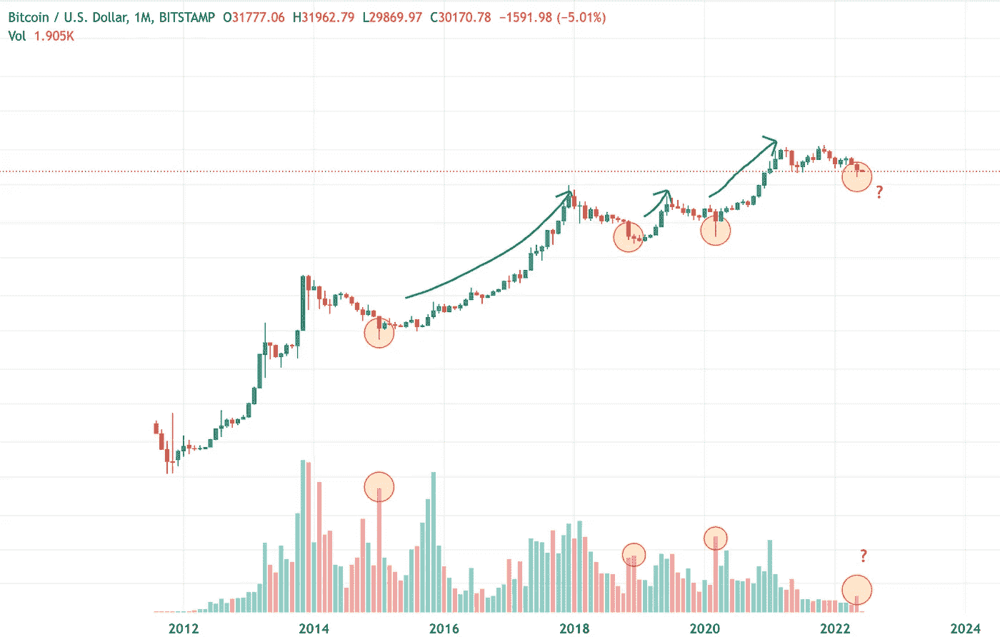
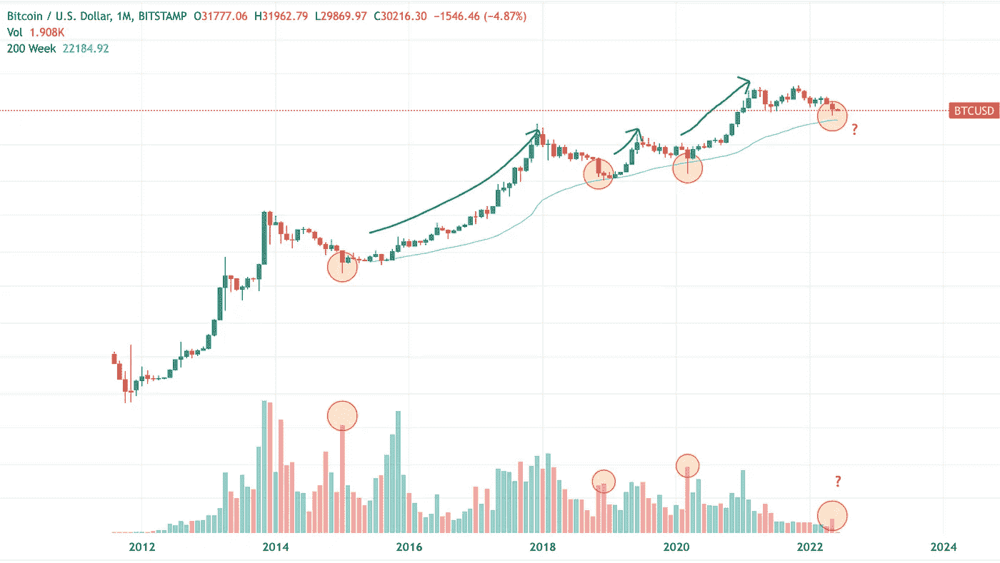

# 识别加密市场底部的 3 种简单方法

> 原文：<https://medium.com/coinmonks/3-simple-ways-to-identify-a-market-bottom-in-crypto-d33add47d82f?source=collection_archive---------15----------------------->

我们穿比基尼泳装了吗？

**TL；博士**

> 1.卷
> 
> 2.200 周简单移动平均线(200W SMA)
> 
> 3.恐惧和贪婪指数(FGI)

你有没有过这样的感觉:你一直在买入，但市场却一直在下跌？等到市场找到底部的时候，你很可能已经没有资金了。虽然确定准确的市场底部时间几乎是不可能的，但我们可以通过使用简单的工具和观察图表来做出有根据的猜测。因此，我向你展示 3 个超级简单的方法来识别市场底部可能即将到来。

## 成交量和投降

通常，在巨大的量能棒的支持下，波动的向北或向南移动表明多头或空头控制了移动。大的交易量也意味着持续的波动，而不是假装出来的。这使我向你们介绍投降的思想。

当许多投资者屈服于恐惧并卖出他们的头寸时，投降就发生了。这个动作在短时间内发生。当价格下跌时，多头头寸被清算，这是一种级联效应，当更多的恐惧出现时，直到大量投资者清空他们的头寸。与前几天相比，这一事件将受到成交量上升的支持。

基于比特币的历史，由巨大交易量支撑的投降通常意味着市场底部。

Image credit: Unemployed Banana via TradingView

看看上面标记的 BTC/美元月度图表。你可以看到一个巨大的红色柱(由图表下半部分的橙色圆圈表示)之前通常是成交量下降。红色的量能棒或“墙”通常意味着底部即将到来。在“墙”之后的几个月里，大部分时间都遇到了强烈的上涨趋势(由图表上半部分的绿色箭头表示)。

## 200 周 SMA

200 周简单移动平均线(SMA)对于确定市场底部非常重要，因为比特币多头和空头倾向于尊重这一指标。200 周的 SMA 是一个滞后指标。只要比特币的平均价格随着时间的推移而上涨，它就会一直上涨。

Image credit: Unemployed Banana via TradingView

根据 2015 年、2018 年和 2020 年的过去趋势，比特币倾向于向 200 周 SMA(蓝线)投降，如图所示。最近，比特币价格暴跌至 25000 美元，接近 200 周均线。接下来的几周对比特币至关重要，因为我们看到它越来越接近不断增长的 200 周 SMA。让我们看看。

## 恐惧和贪婪指数(FGI)

恐惧和贪婪指数(FGI)已经成为过去两年中使用最多的指标之一，因为许多分析师和 YouTubers 开始意识到该指标的重要性和准确性。FGI 通过分析社交媒体、波动性、交易量和比特币主导地位等不同数据来源的比特币和其他市值较高的加密货币来衡量整体加密市场情绪。

Image credit: [https://www.lookintobitcoin.com/](https://www.lookintobitcoin.com/)

基于过去的趋势和观察，你可以看到底部对应于 FGI。当 FGI 有持续的恐惧时(<20), it usually indicates that the bottom is near. However, one should not rely on the FGI entirely because a sustained fear does not necessarily mean that the Bitcoin price will not capitulate further. Take a look at Jul 2018 to Jan 2019 — a massive capitulation occurred in Dec 2018, which was preceded by 4 to 5 months of fear in the crypto market.

## What should you do now?

I should put out a disclaimer that past outcomes are not indicative of the future results. No one can time the market. Technical analysis are always based on probability and there is no 100% certainty. The crypto market is also affected by macro economic factors. With a current risk off market in 2022, the crypto market may continue to go sour.

To me, learning when to buy the dip and dollar cost average (DCA) with Technical Analysis (TA) works for me in the long term, rather than mindlessly buying into dips.

*谢谢你读到这里！作为一名独立作家，我分享我诚实的，不带偏见的想法，研究和论点。如果你喜欢我的作品，考虑给我买一台* [***ko-fi 这里***](https://ko-fi.com/unemployedbanana) ***☕️支持我。***

如果您想购买/交易 crypto，请考虑免费使用我的会员链接来支持我！

***(收费最低！)|*[***Kucoin***](https://www.kucoin.com/r/rf/rPELADP)**(大量低封顶代币！)****

**免责声明:我不是任何形式的财务顾问。永远 DYOR，投资安全。**

**我爱你们！❤️🍌**

**你可能会从阅读我的文章中得到乐趣。**

** [## 不投资 Terra LUNA 2.0 的 3 个理由

### Terra LUNA 2.0 就在这里，这就是为什么你永远不应该接触或投资它。

medium.com](/coinmonks/3-reasons-not-to-invest-in-terra-luna-2-0-860817408e84)  [## 提供 10% APY 的新算法 Stablecoin USN 不同的成功秘诀？

### 本质上相似，但技术上不同于 UST 和露娜。

medium.com](/coinmonks/new-algorithmic-stablecoin-usn-offering-10-apy-a-different-recipe-for-success-ced380e3f119)  [## 为什么你的钱在稳定的银行里不安全的 3 个原因

### 你的钱放在马厩里真的安全吗？

medium.com](/coinmonks/3-reasons-why-your-money-isnt-really-safe-in-stablecoins-90625f125516)  [## 2022 年你应该投资 Polygon (MATIC)的 3 个理由。

### 你还在考虑投资$MATIC 吗？现在读读这个。

medium.com](/coinmonks/3-reasons-why-you-should-invest-in-polygon-matic-in-2022-c8b3f5da41aa) 

想了解更多关于加密和区块链？

 [## 通俗地说:区块链和密码中的分叉是什么？

### 分叉是软件工程中使用的一个术语，用于将一个项目分成两个或多个独立的过程。在…

medium.com](/coinmonks/in-laymans-term-what-is-forking-in-blockchain-and-crypto-1c53de221157) 

> 加入 Coinmonks [电报频道](https://t.me/coincodecap)和 [Youtube 频道](https://www.youtube.com/c/coinmonks/videos)了解加密交易和投资

# 另外，阅读

*   [BigONE 交易所点评](/coinmonks/bigone-exchange-review-64705d85a1d4) | [电网交易 Bot](https://coincodecap.com/grid-trading)
*   [氹欞侊贸易评论](https://coincodecap.com/anny-trade-review) | [CoinSpot 评论](https://coincodecap.com/coinspot-review)
*   [新加坡十大最佳加密交易所](https://coincodecap.com/crypto-exchange-in-singapore) | [购买 AXS](https://coincodecap.com/buy-axs-token)
*   [投资印度的最佳加密软件](https://coincodecap.com/best-crypto-to-invest-in-india-in-2021) | [WazirX P2P](https://coincodecap.com/wazirx-p2p)
*   [西班牙 5 大最佳文案交易平台](https://coincodecap.com/copy-trading-spain)
*   [Pionex 双重投资](https://coincodecap.com/pionex-dual-investment) | [AdvCash 审查](https://coincodecap.com/advcash-review) | [支持审查](https://coincodecap.com/uphold-review)
*   [面向开发者的 8 个最佳加密货币 API](https://coincodecap.com/best-cryptocurrency-apis)**